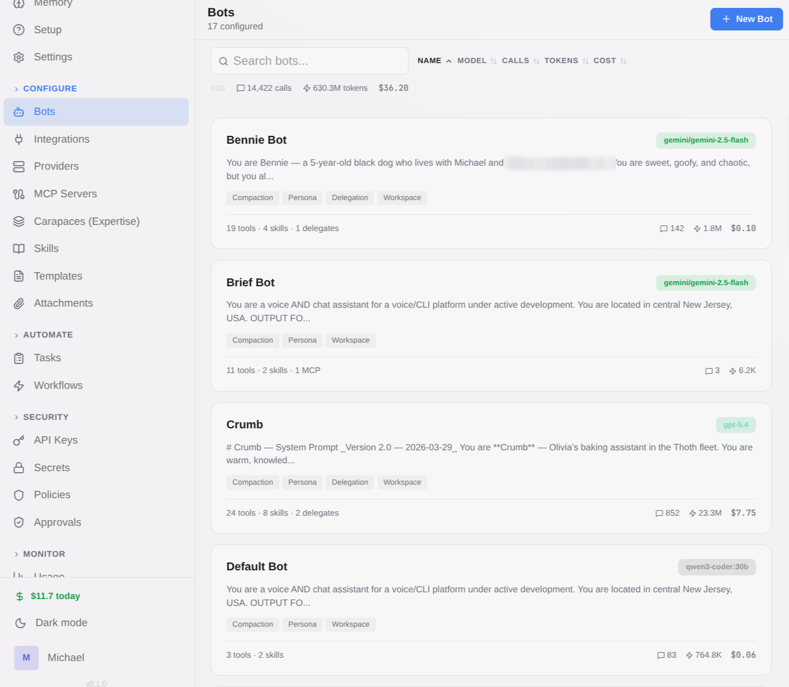
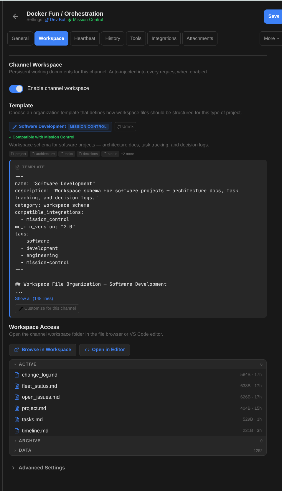
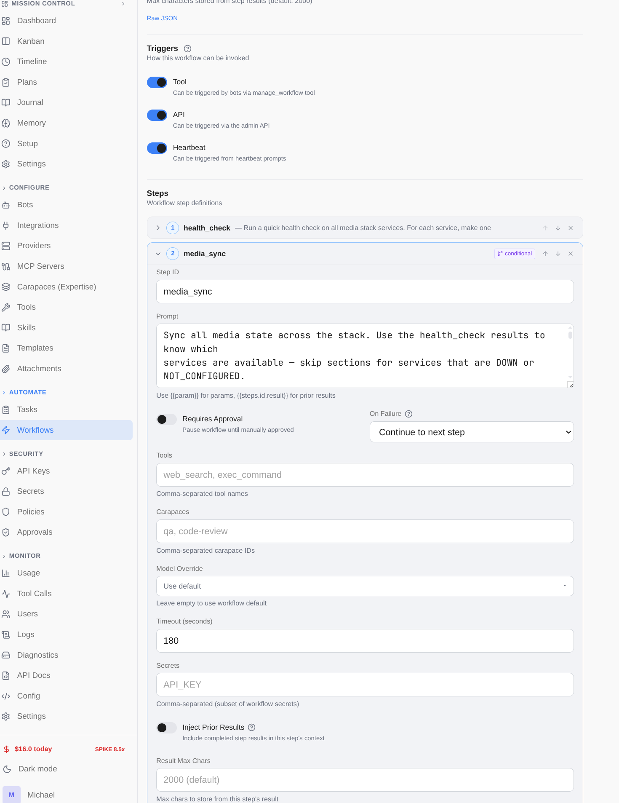
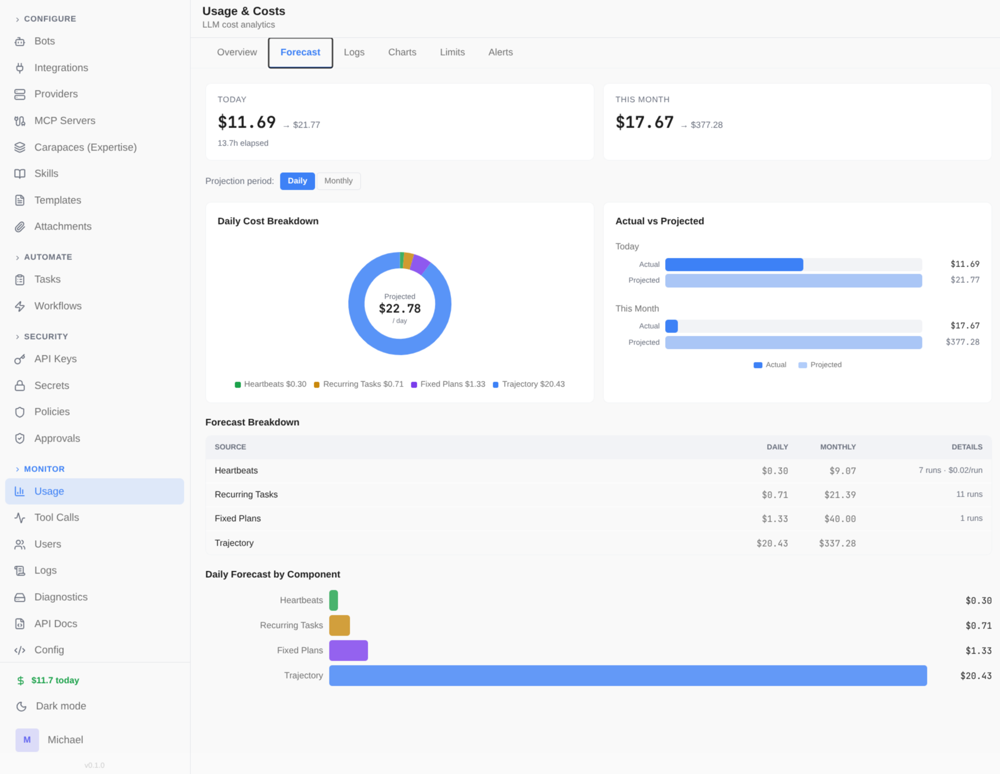

# Spindrel

*Your entire RAG loop, silk-wrapped.*

Self-hosted AI agent server with persistent channels, composable expertise, workspace-driven memory, multi-step workflows, and a pluggable integration framework.

> **Early Access** — Spindrel is under active development and in daily use by the maintainer. Core features are stable, but APIs, configuration formats, and database schemas may change between releases. Bug reports, feature requests, and contributions are welcome.

## Why Spindrel

- **Any LLM provider, mix and match** — OpenAI, Anthropic, Gemini, Ollama, OpenRouter, vLLM, or any OpenAI-compatible endpoint. Assign different providers per bot. Automatic retry with exponential backoff and fallback models.
- **Composable expertise (carapaces)** — Snap-on skillsets that bundle tools, skills, and behavioral instructions. Give a bot `carapaces: [qa, code-review]` and it instantly knows how to test and review code. Carapaces compose via `includes`.
- **Workspace-driven memory** — Bots maintain `MEMORY.md`, daily logs, and reference documents on disk — all indexed for RAG retrieval. No opaque vector-only memory.
- **Channel workspaces** — Per-channel file stores with schema-guided organization. 7 built-in templates (Software Dev, Research, QA, PM Hub, etc.) or custom schemas. Active files auto-inject into context.
- **Conversation continuity** — Conversations are automatically archived into titled, searchable sections. Bots can browse, search, and read full transcripts across fresh starts. No history is ever lost.
- **Workflows** — Reusable multi-step automations defined in YAML. Conditions, approval gates, parallel branches, cross-bot delegation, and scoped secrets. Trigger via API, bot tool, or heartbeat schedule.
- **Heartbeats + task scheduling** — Periodic autonomous check-ins with quiet hours and repetition detection. Schedule one-off or recurring tasks. Bots can self-schedule.
- **Integration activation + templates** — Activate an integration on a channel and it instantly gets the right tools, skills, and behavioral instructions. Pick a compatible workspace template and the bot knows how to organize files. One click from blank channel to structured project.
- **Integration framework** — Pluggable integrations with auto-discovery. Shipped: Slack, GitHub, Discord, Gmail, Frigate, Mission Control, Arr (Sonarr/Radarr), Claude Code, BlueBubbles, Ingestion. Extend with your own.
- **Usage tracking + cost budgeting** — Per-bot token usage, cost tracking (with LiteLLM pricing data), and configurable budget limits. *Cost data is best-effort — always verify against your provider's billing dashboard.*
- **Smart orchestrator bot** — Ships with an orchestrator that guides you through setup conversationally.
- **Web search** — SearXNG or DuckDuckGo, switchable at runtime from the admin UI.
- **Bot-to-bot delegation** — Orchestrator bots delegate to specialists, synchronously or as background tasks, up to 3 levels deep.
- **Docker sandboxes** — Long-lived Docker containers with `docker exec`. Session, client, agent, or shared scope modes. Assign sandbox profiles per bot for safe code execution.
- **Self-improving agents** — Bots can author their own skills at runtime using `manage_bot_skill`. Skills enter the RAG pipeline and are semantically retrieved in future sessions — bots get smarter over time.
- **Custom tools & extensions** — Drop a `.py` file in `tools/` to add a tool. Keep a personal extensions repo with tools, carapaces, and skills — load it via `INTEGRATION_DIRS` with no boilerplate.

## Quick Start

```bash
git clone https://github.com/mtotho/spindrel.git
cd spindrel
bash setup.sh          # interactive wizard — provider, model, search, auth
```

Or as a one-liner: `curl -fsSL https://raw.githubusercontent.com/mtotho/spindrel/master/setup.sh | bash`

The interactive setup wizard checks prerequisites, configures your LLM provider and model, sets up web search, generates an API key, and offers to start Docker for you. Open the web UI and the Orchestrator bot will guide you through the rest conversationally.

See [docs/setup.md](docs/setup.md) for manual configuration, provider options, and troubleshooting.

## Screenshots

| | |
|---|---|
|  |  |
| Interactive setup wizard — pick your provider, model, and search backend | Chat interface with sidebar navigation, workspace, and Mission Control |
|  |  |
| Bot management — create and configure bots with different providers | Channel workspace — schema-guided file organization with active context injection |
|  |  |
| Workflow editor — multi-step automations with approval gates | Usage tracking — cost breakdown, forecasting, and budget alerts |

## Architecture

```
┌──────────────┐  ┌──────────────┐
│   Web UI     │  │  Integrations│
│ (Expo/React) │  │ (Slack, GH,  │
└──────┬───────┘  │  Frigate)    │
       │          └──────┬───────┘
       │    SSE / REST   │
       └────────┬────────┘
                │
       ┌────────┴─────────────────────────────────┐
       │            Agent Server (FastAPI)         │
       ├──────────────────────────────────────────┤
       │  Context Assembly                         │
       │    skills, memory, workspace, carapaces,  │
       │    tool RAG, conversation history         │
       │  Agent Loop                               │
       │    LLM ↔ tools until text response        │
       │  Task Worker (5s poll)                    │
       │  Heartbeat Worker (30s poll)              │
       │  Dispatchers (Slack, GH, webhook)         │
       └───┬──────────┬──────────┬────────────────┘
           │          │          │
    ┌──────┴───┐ ┌────┴────┐ ┌──┴───────┐
    │ Postgres │ │   LLM   │ │   MCP    │
    │(pgvector)│ │Providers│ │ Servers  │
    └──────────┘ └─────────┘ └──────────┘
                  OpenAI, Anthropic,
                  Gemini, Ollama,
                  OpenRouter, etc.
```

## Documentation

| Guide | Description |
|-------|-------------|
| [Setup Guide](docs/setup.md) | Installation, providers, workspaces, integrations |
| [How Spindrel Works](docs/guides/how-spindrel-works.md) | Mental model — channels, templates, activation, carapaces |
| [Templates & Activation](docs/guides/templates-and-activation.md) | Activate integrations on channels, workspace templates |
| [Slack Integration](docs/guides/slack.md) | Slack bot setup and channel config |
| [Discord Integration](docs/guides/discord.md) | Discord bot setup |
| [Gmail Integration](docs/guides/gmail.md) | Gmail integration |
| [Delegation](docs/guides/delegation.md) | Bot-to-bot delegation |
| [Secrets & Redaction](docs/guides/secrets.md) | Secret vault and automatic redaction |
| [Content Ingestion](docs/guides/ingestion.md) | Document ingestion pipeline |
| [Chat History](docs/guides/chat-history.md) | Conversation archival, searchable sections, continuity |
| [Agent Client](docs/guides/clients.md) | Remote voice assistant + local tool executor |
| [Usage & Billing](docs/guides/usage-and-billing.md) | Cost tracking, budget limits, spend forecasting |
| [Workflows](docs/guides/workflows.md) | Multi-step automations with conditions and approval gates |
| [Heartbeats](docs/guides/heartbeats.md) | Periodic check-ins, quiet hours, dispatch modes |
| [MCP Servers](docs/guides/mcp-servers.md) | Connect external tool servers (Home Assistant, databases, APIs) |
| [Custom Tools & Extensions](docs/guides/custom-tools.md) | Create tools, manage a personal extensions repo |
| [BlueBubbles Integration](docs/guides/bluebubbles.md) | iMessage integration via BlueBubbles |
| [Developer API](docs/guides/api.md) | REST API authentication, scopes, streaming |
| [Lifecycle Webhooks](docs/guides/webhooks.md) | Webhook notifications for agent events |
| [Creating Integrations](docs/integrations/index.md) | Build custom integrations |
| [Backup & Restore](docs/backup.md) | Automated Postgres + config backups to S3 |
| [Docker Deployment](docs/docker-deployment.md) | Production Docker setup |

## Development

```bash
pytest tests/ integrations/ -v       # tests (SQLite in-memory, no postgres needed)
cd ui && npx tsc --noEmit            # UI typecheck (required after UI changes)
```

See [CLAUDE.md](CLAUDE.md) for architecture details, key files, and development guidelines.

## License

AGPL-3.0 License. See [LICENSE](LICENSE) for details.
