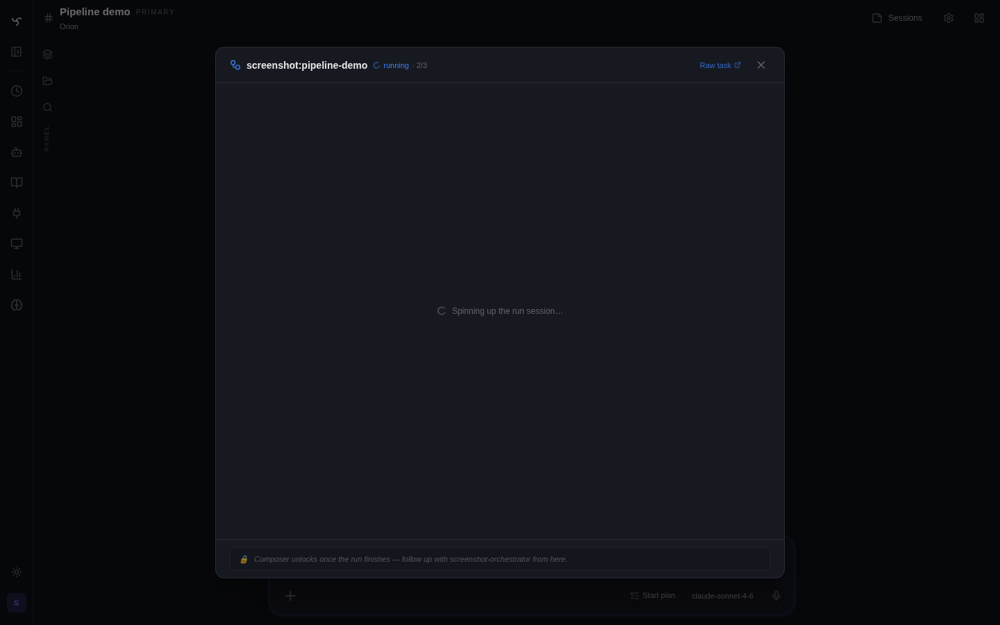

# Spindrel

*Your entire RAG loop, silk-wrapped.*

[](LICENSE)
[](docs/guides/feature-status.md)
[](https://github.com/mtotho/spindrel/actions/workflows/test.yml)
[](https://docs.spindrel.dev)
[](https://github.com/mtotho/spindrel/releases)

Self-hosted AI agent server with persistent channels, composable expertise, workspace-driven memory, task pipelines, interactive widgets, and a pluggable integration framework.

> **Early Access** — Spindrel is under active development and in daily use by the maintainer. Core features are stable, but APIs, configuration formats, and database schemas may change between releases. Bug reports, feature requests, and contributions are welcome.

📺 **[Watch the 90-second tour](docs/videos/quickstart.mp4)** — spatial canvas, scheduled work, channels, dashboards, pipelines.

## Why Spindrel

- **Bring your own agent — Claude Code now, Codex v1 newly landed** — Swap any bot for a real external coding-agent runtime and run it from the Spindrel web UI as a persistent, scheduled, channel-bound coding agent. Native planning, native tool calling, native bash and file edits stay with the harness. Spindrel owns everything around it: per-channel workspaces, persistent sessions across browser reloads, scheduled runs and recurring tasks, heartbeat hints injected as extra context, selected Spindrel skills/tools bridged back into the runtime, an in-browser terminal for login / workspace setup, and resume state so a long-running task survives a refresh. Claude Code is the proven path today; Codex v1 shipped on 2026-04-27 and is still in fresh-beta / live-validation territory. See [Agent Harnesses](docs/guides/agent-harnesses.md).
- **Any LLM provider, mix and match** — OpenAI, Anthropic, Gemini, Ollama, OpenRouter, vLLM, or any OpenAI-compatible endpoint. Assign different providers per bot. Automatic retry with exponential backoff and fallback models.
- **ChatGPT Subscription provider** — Sign in with ChatGPT OAuth device-code flow instead of an API key. Mix plan-billing providers with API-key providers across bots.
- **Skill-based expertise (auto-discovered)** — Skills are markdown documents that bots discover and pull in at runtime via RAG. Drop a `.md` into `skills/` (or a foldered skill pack with `index.md` + child docs) and any bot can ground itself in that knowledge — no manual wiring per bot. Bots can also author their own skills with `manage_bot_skill`, so they get smarter over time.
- **Workspace-driven memory** — Bots maintain `MEMORY.md`, daily logs, and reference documents on disk — all indexed for RAG retrieval. No opaque vector-only memory.
- **Channel workspaces** — Per-channel file stores on disk. Optional workspace schema templates can give the bot a starting structure, but the core model is file-backed memory, not template lock-in.
- **Conversation continuity** — Conversations are automatically archived into titled, searchable sections. Chat state rehydrates on reconnect, and task runs render as dedicated sub-sessions with their own transcripts.
- **Task pipelines** — Reusable multi-step automations with `exec`, `tool`, `agent`, `user_prompt`, and `foreach` steps, plus conditions, approval gates, parameters, and cross-bot delegation. Pipelines replace the older workflow system.
- **Heartbeats + task scheduling** — Periodic autonomous check-ins with quiet hours and repetition detection. Schedule one-off or recurring tasks. Bots can self-schedule.
- **Widget dashboards + HTML widgets** — Tool results render as live widgets. Pin them to channel dashboards or named dashboards, or have bots author interactive HTML widgets with bot-scoped auth.
- **Spatial canvas** — `Ctrl+Shift+Space` toggles a workspace-scope infinite plane on the desktop home. Channels auto-populate as draggable tiles; widgets are opt-in. Semantic zoom (dot → preview → live iframe), fisheye lens, and a `Now Well` with scheduled work in orbit.
- **Programmatic tool calling** — `run_script` lets bots orchestrate many tool calls in one turn when plain chat loops would be too noisy or expensive.
- **Integration framework** — Pluggable integrations with auto-discovery. Shipped: Slack, GitHub, Discord, Frigate, Home Assistant, Excalidraw, Browser Live, Arr, Claude Code, Codex, BlueBubbles, Google Workspace (Drive), Wyoming, Web Search, OpenWeather, Firecrawl, VS Code, and more. Extend with your own.
- **Usage tracking + cost budgeting** — Per-bot token usage, cost tracking (with LiteLLM pricing data), and configurable budget limits. *Cost data is best-effort — always verify against your provider's billing dashboard.*
- **Smart orchestrator bot** — Ships with an orchestrator that guides you through setup conversationally.
- **Web search** — SearXNG or DuckDuckGo, switchable at runtime from the admin UI.
- **Sub-agents + delegation** — Experimental bounded side work for research, planning, summarization, quality checks, and code review. Depth and rate limits keep parallel execution contained.
- **Command execution** — Host-side subprocess execution via `exec_tool`, plus optional Docker sandboxes when you want a controlled execution environment.
- **PWA + push notifications** — Install the web app and let bots send explicit push notifications to subscribed devices.
- **Custom tools & extensions** — Drop a `.py` file in `tools/` to add a tool. Keep a personal extensions repo with tools and skills — load it via `INTEGRATION_DIRS` with no boilerplate.

## Quick Start

```bash
git clone https://github.com/mtotho/spindrel.git
cd spindrel
bash setup.sh          # interactive wizard — provider, model, search, auth
```

Or as a one-liner: `curl -fsSL https://raw.githubusercontent.com/mtotho/spindrel/master/setup.sh | bash`

The interactive setup wizard checks prerequisites, configures your LLM provider and model, sets up web search, generates an API key, and offers to start Docker for you. On first web visit, create the local admin account, then the Orchestrator bot will guide you through the rest conversationally.

See [docs/setup.md](docs/setup.md) for manual configuration, provider options, first-admin login, and troubleshooting.

## Screenshots


| | |
|---|---|
|  |  |
| Chat session with widgets, sub-sessions, and the current sidebar/OmniPanel UI | Provider configuration with built-in fallback and per-bot routing |
|  |  |
| Channel widget dashboard with HA / pipeline / standing-order tiles | A pipeline run rendered as a sub-session with live step status |
|  |  |
| Workspace-scope spatial canvas — every channel as a draggable tile, Now Well below | Zoomed-in view: live widget tiles around the channel they belong to |
|  |  |
| Bot-authored interactive HTML widget with bot-scoped auth | Token usage, daily spend, and budget forecast |
|  |  |
| Run external harnesses from Spindrel — Claude Code today, Codex v1 newly landed | Bind any bot to a harness runtime — Spindrel keeps the channel, schedule, workspace; the runtime runs the loop |
|  |  |
| A real Claude Code turn inside a Spindrel channel — native thinking, native tool calls (Read, Grep), final reply | Browser PTY into the Spindrel container — used for `claude login`, `git clone`, and other harness setup |

## Architecture

```
┌──────────────┐  ┌──────────────┐
│   Web UI     │  │  Integrations│
│  (Web/Vite)  │  │ (Slack, GH,  │
└──────┬───────┘  │  Frigate)    │
       │          └──────┬───────┘
       │    SSE / REST   │
       └────────┬────────┘
                │
       ┌────────┴─────────────────────────────────┐
       │              Spindrel (FastAPI)           │
       ├──────────────────────────────────────────┤
       │  Context Assembly                         │
       │    skills, memory, workspace, capabilities, │
       │    tool RAG, conversation history         │
       │  Agent Loop                               │
       │    LLM ↔ tools until text response        │
       │  Task Worker (5s poll)                    │
       │  Heartbeat Worker (30s poll)              │
       │  Dispatchers (Slack, GH, webhook)         │
       └───┬──────────┬──────────┬────────────────┘
           │          │          │
    ┌──────┴───┐ ┌────┴────┐ ┌──┴───────┐
    │ Postgres │ │   LLM   │ │   MCP    │
    │(pgvector)│ │Providers│ │ Servers  │
    └──────────┘ └─────────┘ └──────────┘
                  OpenAI, Anthropic,
                  Gemini, Ollama,
                  OpenRouter, etc.
```

## Documentation

| Guide | Description |
|-------|-------------|
| [Setup Guide](docs/setup.md) | Installation, providers, workspaces, integrations |
| [Feature Status](docs/guides/feature-status.md) | Honest product-readiness snapshot before you deploy |
| [Integration Status](docs/guides/integration-status.md) | Current readiness by integration |
| [How Spindrel Works](docs/guides/how-spindrel-works.md) | Mental model — channels, capabilities, workspaces, and how they compose |
| [LLM Providers](docs/guides/providers.md) | Provider types, ChatGPT Subscription OAuth, Ollama, LiteLLM |
| [Agent Harnesses](docs/guides/agent-harnesses.md) | External harness runtimes in the Spindrel UI; Claude Code + fresh Codex v1 |
| [Native Planning](docs/guides/native-planning.md) | Native Spindrel plan mode, screenshots, progress tracking, and adherence review |
| [Admin Terminal](docs/guides/admin-terminal.md) | Browser terminal used for harness login, workspace setup, and admin ops |
| [Local Machine Control](docs/guides/local-machine-control.md) | Session-scoped leases for paired local-machine command execution |
| [Programmatic Tool Calling](docs/guides/programmatic-tool-calling.md) | `run_script` for batching, filtering, and multi-tool orchestration inside one turn |
| [Command Execution](docs/guides/command-execution.md) | Server subprocess execution, Docker sandboxes, and local machine control boundaries |
| [Knowledge Bases](docs/guides/knowledge-bases.md) | Channel KB vs bot KB vs markdown memory |
| [Tool Policies](docs/guides/tool-policies.md) | Approval and tool-availability controls |
| [Workspace Templates & Activation](docs/guides/templates-and-activation.md) | Optional workspace templates and per-channel integration activation |
| [Slack Integration](docs/guides/slack.md) | Slack bot setup and channel config |
| [Discord Integration](docs/guides/discord.md) | Discord bot setup |
| [Home Assistant](docs/guides/homeassistant.md) | Device control via MCP with widgets and state polling |
| [Excalidraw](docs/guides/excalidraw.md) | Hand-drawn diagrams in chat |
| [Delegation](docs/guides/delegation.md) | Bot-to-bot delegation |
| [Pipelines](docs/guides/pipelines.md) | Multi-step task automation with conditions and approval gates |
| [Task Sub-Sessions](docs/guides/task-sub-sessions.md) | Pipeline-run-as-chat transcript model |
| [Widget Dashboards](docs/guides/widget-dashboards.md) | Channel dashboards, named dashboards, OmniPanel rail |
| [Spatial Canvas](docs/guides/spatial-canvas.md) | Workspace-scope infinite plane: channel + widget tiles, fisheye lens, Now Well |
| [HTML Widgets](docs/guides/html-widgets.md) | Bot-authored interactive HTML widgets |
| [Developer Panel](docs/guides/dev-panel.md) | `/widgets/dev` tool sandbox and widget authoring workbench |
| [Secrets & Redaction](docs/guides/secrets.md) | Secret vault and automatic redaction |
| [Content Ingestion](docs/guides/ingestion.md) | Document ingestion pipeline |
| [Chat History](docs/guides/chat-history.md) | Conversation archival, searchable sections, continuity |
| [Chat State Rehydration](docs/guides/chat-state-rehydration.md) | Snapshot-based reconnect and reload recovery |
| [PWA & Push Notifications](docs/guides/pwa-push.md) | Install the PWA and send push notifications |
| [Agent Client](docs/guides/clients.md) | Older remote client / voice-assistant path with local tool execution |
| [Usage & Billing](docs/guides/usage-and-billing.md) | Cost tracking, budget limits, spend forecasting |
| [Heartbeats](docs/guides/heartbeats.md) | Periodic check-ins, quiet hours, dispatch modes |
| [MCP Servers](docs/guides/mcp-servers.md) | Connect external tool servers (Home Assistant, databases, APIs) |
| [Custom Tools & Extensions](docs/guides/custom-tools.md) | Create tools, manage a personal extensions repo |
| [BlueBubbles Integration](docs/guides/bluebubbles.md) | iMessage integration via BlueBubbles |
| [Developer API](docs/guides/api.md) | REST API authentication, scopes, streaming |
| [Lifecycle Webhooks](docs/guides/webhooks.md) | Webhook notifications for agent events |
| [Creating Integrations](docs/integrations/index.md) | Build custom integrations |
| [Backup & Restore](docs/backup.md) | Automated Postgres + config backups to S3 |
| [Docker Deployment](docs/docker-deployment.md) | Production Docker setup |
| [Security Policy](SECURITY.md) | Reporting, self-hosted security posture, and hardening notes |

## Development

```bash
pytest tests/ integrations/ -v       # tests (SQLite in-memory, no postgres needed)
cd ui && npx tsc --noEmit            # UI typecheck (required after UI changes)
```

See [CLAUDE.md](CLAUDE.md) for architecture details, key files, and development guidelines.

## Community

- **Contributing** — see [CONTRIBUTING.md](CONTRIBUTING.md)
- **Code of Conduct** — see [CODE_OF_CONDUCT.md](CODE_OF_CONDUCT.md)
- **Security** — see [SECURITY.md](SECURITY.md) for vulnerability reporting
- **Releases & changelog** — [GitHub Releases](https://github.com/mtotho/spindrel/releases) · [CHANGELOG.md](CHANGELOG.md)
- **Discussions** — usage questions, ideas, and show-and-tell go in [Discussions](https://github.com/mtotho/spindrel/discussions)

## License

AGPL-3.0 License. See [LICENSE](LICENSE) for details.
