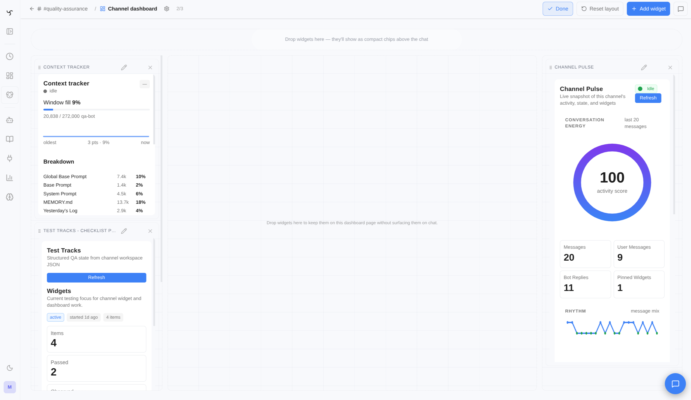
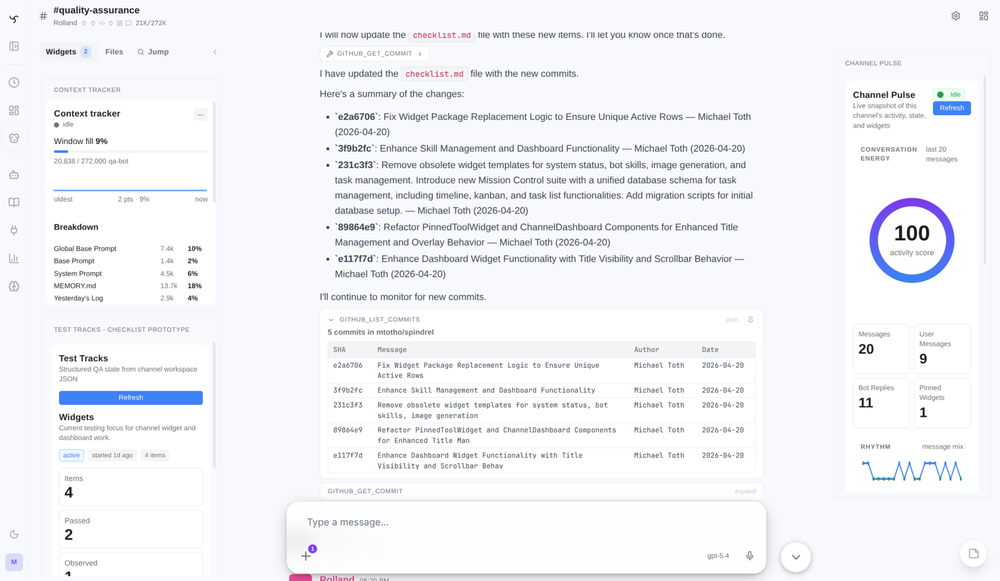
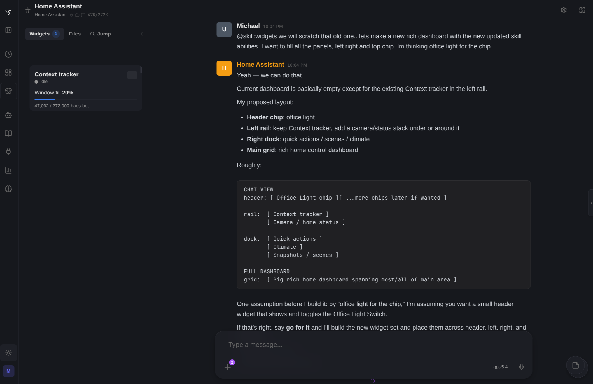

# Spindrel

*Your entire RAG loop, silk-wrapped.*

Self-hosted AI agent server with persistent channels, composable expertise, workspace-driven memory, task pipelines, interactive widgets, and a pluggable integration framework.

> **Early Access** — Spindrel is under active development and in daily use by the maintainer. Core features are stable, but APIs, configuration formats, and database schemas may change between releases. Bug reports, feature requests, and contributions are welcome.

## Why Spindrel

- **Any LLM provider, mix and match** — OpenAI, Anthropic, Gemini, Ollama, OpenRouter, vLLM, or any OpenAI-compatible endpoint. Assign different providers per bot. Automatic retry with exponential backoff and fallback models.
- **ChatGPT Subscription provider** — Sign in with ChatGPT OAuth device-code flow instead of an API key. Mix plan-billing providers with API-key providers across bots.
- **Capabilities (auto-discovered expertise)** — Composable bundles of tools, skills, and behavioral instructions. Bots discover and activate relevant capabilities at runtime — or pin specific ones to always include. Capabilities compose via `includes` for layered expertise.
- **Workspace-driven memory** — Bots maintain `MEMORY.md`, daily logs, and reference documents on disk — all indexed for RAG retrieval. No opaque vector-only memory.
- **Channel workspaces** — Per-channel file stores with schema-guided organization. 7 built-in templates (Software Dev, Research, QA, PM Hub, etc.) or custom schemas. Active files auto-inject into context.
- **Conversation continuity** — Conversations are automatically archived into titled, searchable sections. Chat state rehydrates on reconnect, and task runs render as dedicated sub-sessions with their own transcripts.
- **Task pipelines** — Reusable multi-step automations with `exec`, `tool`, `agent`, `user_prompt`, and `foreach` steps, plus conditions, approval gates, parameters, and cross-bot delegation.
- **Heartbeats + task scheduling** — Periodic autonomous check-ins with quiet hours and repetition detection. Schedule one-off or recurring tasks. Bots can self-schedule.
- **Widget dashboards + HTML widgets** — Tool results render as live widgets. Pin them to channel dashboards or named dashboards, or have bots author interactive HTML widgets with bot-scoped auth.
- **Integration activation + templates** — Activate an integration on a channel and it instantly gets the right tools, skills, and behavioral instructions. Pick a compatible workspace template and the bot knows how to organize files. One click from blank channel to structured project.
- **Integration framework** — Pluggable integrations with auto-discovery. Shipped: Slack, GitHub, Discord, Gmail, Frigate, Home Assistant, Excalidraw, Browser Live, Arr, Claude Code, BlueBubbles, Google Workspace, Wyoming, Web Search, OpenWeather, Firecrawl, VS Code, and more. Extend with your own.
- **Usage tracking + cost budgeting** — Per-bot token usage, cost tracking (with LiteLLM pricing data), and configurable budget limits. *Cost data is best-effort — always verify against your provider's billing dashboard.*
- **Smart orchestrator bot** — Ships with an orchestrator that guides you through setup conversationally.
- **Web search** — SearXNG or DuckDuckGo, switchable at runtime from the admin UI.
- **Sub-agents + delegation** — Orchestrator bots delegate to specialists, synchronously or as background tasks, with built-in presets, depth limits, and parallel execution.
- **Command execution** — Host-side subprocess execution via `exec_tool`, plus optional Docker sandboxes when you want a controlled execution environment.
- **PWA + push notifications** — Install the web app and let bots send explicit push notifications to subscribed devices.
- **Self-improving agents** — Bots can author their own skills at runtime using `manage_bot_skill`. Skills enter the RAG pipeline and are semantically retrieved in future sessions — bots get smarter over time.
- **Custom tools & extensions** — Drop a `.py` file in `tools/` to add a tool. Keep a personal extensions repo with tools, capabilities, and skills — load it via `INTEGRATION_DIRS` with no boilerplate.

## Quick Start

```bash
git clone https://github.com/mtotho/spindrel.git
cd spindrel
bash setup.sh          # interactive wizard — provider, model, search, auth
```

Or as a one-liner: `curl -fsSL https://raw.githubusercontent.com/mtotho/spindrel/master/setup.sh | bash`

The interactive setup wizard checks prerequisites, configures your LLM provider and model, sets up web search, generates an API key, and offers to start Docker for you. Open the web UI and the Orchestrator bot will guide you through the rest conversationally.

See [docs/setup.md](docs/setup.md) for manual configuration, provider options, and troubleshooting.

## Screenshots

> Screenshot placeholders are intentionally kept here while the new docs image set is being re-shot.
> Replace these with current web-native captures as they land.

| | |
|---|---|
| `TODO: replace with new chat-main screenshot` | `TODO: replace with new setup/provider screenshot` |
| Chat session with widgets, sub-sessions, and the current sidebar/OmniPanel UI | Setup flow with provider selection and current onboarding |
|  |  |
| Channel dashboard edit mode with widget layout controls | Channel chat with current side-panel / OmniPanel layout |
|  | `TODO: replace with new providers/usage screenshot` |
| Home Assistant widget rendered inline in chat | Providers, usage, or dev-panel screenshot placeholder |

## Architecture

```
┌──────────────┐  ┌──────────────┐
│   Web UI     │  │  Integrations│
│  (Web/Vite)  │  │ (Slack, GH,  │
└──────┬───────┘  │  Frigate)    │
       │          └──────┬───────┘
       │    SSE / REST   │
       └────────┬────────┘
                │
       ┌────────┴─────────────────────────────────┐
       │            Agent Server (FastAPI)         │
       ├──────────────────────────────────────────┤
       │  Context Assembly                         │
       │    skills, memory, workspace, capabilities, │
       │    tool RAG, conversation history         │
       │  Agent Loop                               │
       │    LLM ↔ tools until text response        │
       │  Task Worker (5s poll)                    │
       │  Heartbeat Worker (30s poll)              │
       │  Dispatchers (Slack, GH, webhook)         │
       └───┬──────────┬──────────┬────────────────┘
           │          │          │
    ┌──────┴───┐ ┌────┴────┐ ┌──┴───────┐
    │ Postgres │ │   LLM   │ │   MCP    │
    │(pgvector)│ │Providers│ │ Servers  │
    └──────────┘ └─────────┘ └──────────┘
                  OpenAI, Anthropic,
                  Gemini, Ollama,
                  OpenRouter, etc.
```

## Documentation

| Guide | Description |
|-------|-------------|
| [Setup Guide](docs/setup.md) | Installation, providers, workspaces, integrations |
| [How Spindrel Works](docs/guides/how-spindrel-works.md) | Mental model — channels, templates, activation, capabilities |
| [LLM Providers](docs/guides/providers.md) | Provider types, ChatGPT Subscription OAuth, Ollama, LiteLLM |
| [Templates & Activation](docs/guides/templates-and-activation.md) | Activate integrations on channels, workspace templates |
| [Slack Integration](docs/guides/slack.md) | Slack bot setup and channel config |
| [Discord Integration](docs/guides/discord.md) | Discord bot setup |
| [Gmail Integration](docs/guides/gmail.md) | Gmail integration |
| [Home Assistant](docs/guides/homeassistant.md) | Device control via MCP with widgets and state polling |
| [Excalidraw](docs/guides/excalidraw.md) | Hand-drawn diagrams in chat |
| [Delegation](docs/guides/delegation.md) | Bot-to-bot delegation |
| [Pipelines](docs/guides/pipelines.md) | Multi-step task automation with conditions and approval gates |
| [Task Sub-Sessions](docs/guides/task-sub-sessions.md) | Pipeline-run-as-chat transcript model |
| [Widget Dashboards](docs/guides/widget-dashboards.md) | Channel dashboards, named dashboards, OmniPanel rail |
| [HTML Widgets](docs/guides/html-widgets.md) | Bot-authored interactive HTML widgets |
| [Developer Panel](docs/guides/dev-panel.md) | `/widgets/dev` tool sandbox and widget authoring workbench |
| [Secrets & Redaction](docs/guides/secrets.md) | Secret vault and automatic redaction |
| [Content Ingestion](docs/guides/ingestion.md) | Document ingestion pipeline |
| [Chat History](docs/guides/chat-history.md) | Conversation archival, searchable sections, continuity |
| [Chat State Rehydration](docs/guides/chat-state-rehydration.md) | Snapshot-based reconnect and reload recovery |
| [PWA & Push Notifications](docs/guides/pwa-push.md) | Install the PWA and send push notifications |
| [Agent Client](docs/guides/clients.md) | Remote voice assistant + local tool executor |
| [Usage & Billing](docs/guides/usage-and-billing.md) | Cost tracking, budget limits, spend forecasting |
| [Heartbeats](docs/guides/heartbeats.md) | Periodic check-ins, quiet hours, dispatch modes |
| [MCP Servers](docs/guides/mcp-servers.md) | Connect external tool servers (Home Assistant, databases, APIs) |
| [Custom Tools & Extensions](docs/guides/custom-tools.md) | Create tools, manage a personal extensions repo |
| [BlueBubbles Integration](docs/guides/bluebubbles.md) | iMessage integration via BlueBubbles |
| [Developer API](docs/guides/api.md) | REST API authentication, scopes, streaming |
| [Lifecycle Webhooks](docs/guides/webhooks.md) | Webhook notifications for agent events |
| [Creating Integrations](docs/integrations/index.md) | Build custom integrations |
| [Backup & Restore](docs/backup.md) | Automated Postgres + config backups to S3 |
| [Docker Deployment](docs/docker-deployment.md) | Production Docker setup |

## Development

```bash
pytest tests/ integrations/ -v       # tests (SQLite in-memory, no postgres needed)
cd ui && npx tsc --noEmit            # UI typecheck (required after UI changes)
```

See [CLAUDE.md](CLAUDE.md) for architecture details, key files, and development guidelines.

## License

AGPL-3.0 License. See [LICENSE](LICENSE) for details.
