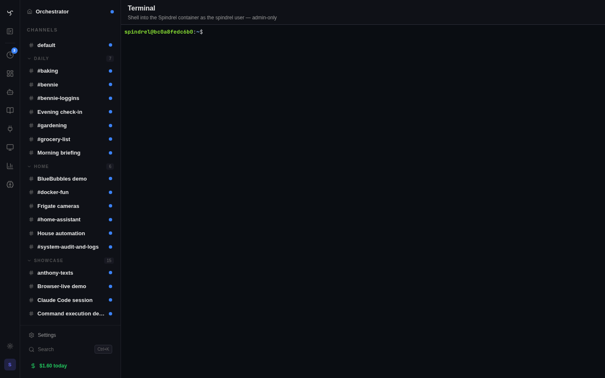

# Admin Terminal

A browser-based shell into the Spindrel container. Admin-only. Same effective access as `docker exec -it spindrel bash` — exposed through the same web session you're already authenticated to, so you don't have to context-switch to a terminal application.

It exists to kill the SSH-to-fiddle-with-things workflow that used to be the only way to set up an external-agent harness session, install a system package, peek at logs, or run a one-off `git clone`. Open it from the admin nav, or trigger a pre-seeded shell from the harnesses page or a harness-backed bot's edit page.

## Where it shows up

| Surface | What you get |
|---|---|
| `/admin/terminal` | Full-page shell. The "I just want to poke around" entry point. |
| `/admin/harnesses` → "Run `claude login`" button | Drawer opens with `claude login` already running. Complete OAuth, paste code, close drawer. The harness card auto-refreshes to ✓. |
| `/admin/harnesses` → workspace-root banner → "Open shell" | Drawer opens at the workspace root path so you can mkdir + git clone in one place. |
| `/admin/bots/<harness-backed bot>` -> "Open shell" / "Create workspace dir" / "Clone a repo" | Drawer opens scoped to the bot's workspace path. |

The drawer and the full page render the same `<TerminalPanel>` (xterm.js + WebSocket). Closing the drawer or navigating away kills the PTY — there's no session resume in v1.

## How it works

- Frontend opens a session by `POST /api/v1/admin/terminal/sessions` with optional `seed_command` and `cwd`. The server spawns `/bin/bash -l` under a fresh PTY (`pty.openpty` → `asyncio.create_subprocess_exec`) and registers the session id.
- The browser then upgrades a WebSocket to `/api/v1/admin/terminal/{session_id}?token=<jwt>`. Browsers can't set `Authorization` headers on WS upgrades, so the token rides as a query parameter and is validated through the same admin-auth path the HTTP endpoints use.
- Wire format (text frames, JSON):
  - client → server: `{"type": "data", "data": "<base64>"}` for keystrokes, `{"type": "resize", "rows": N, "cols": M}` for terminal size changes.
  - server → client: `{"type": "data", "data": "<base64>"}` for PTY output, `{"type": "exit"}` when the shell terminates.
- Closing the WS triggers `SIGTERM` to the bash process group. No orphan shells.

## Security model

This is **admin-only RCE by design**. The terminal runs as the `spindrel` user (uid 1000) inside the container. Anything the spindrel user can do — install packages, read mounted volumes, write to the database via `psql`, edit code — the admin can do through the web terminal.

Guardrails:

- `Depends(verify_admin_auth)` on the POST endpoint and a parallel admin-token check on the WebSocket upgrade. Widget tokens, scoped API keys without the `admin` scope, and non-admin users all hard-fail.
- Concurrent session cap per caller (default 3, env `ADMIN_TERMINAL_MAX_PER_USER`). A 4th `POST` returns 429.
- Idle timeout (default 300 seconds, env `ADMIN_TERMINAL_IDLE_TIMEOUT_SEC`). A background sweep task tears down stale PTYs.
- One structured log line per session open and close (`admin.terminal.session_open` / `admin.terminal.session_close`). No new database table — admin actions go to stderr / log forwarder.

If you do not want this functionality at all, set `DISABLE_ADMIN_TERMINAL=true`. Both endpoints will return 404, and the admin page renders a "Terminal disabled by server" notice instead of opening a session.

## Tunables (env)

| Variable | Default | Effect |
|---|---|---|
| `DISABLE_ADMIN_TERMINAL` | (unset) | Set to `true` / `1` / `yes` to 404 both endpoints. |
| `ADMIN_TERMINAL_MAX_PER_USER` | `3` | Concurrent open sessions per caller before 429. |
| `ADMIN_TERMINAL_IDLE_TIMEOUT_SEC` | `300` | Idle PTYs are SIGTERMed and dropped from the registry. |

## What's intentionally NOT here

- **No session resume across reconnects.** Tab closes / WS blips → PTY dies.
- **No multi-user shared sessions.** Each session is private to the opener.
- **No file upload/download UI.** Use `scp` / `curl` from inside the terminal.
- **No tmux / screen integration.** One PTY per session, plain bash. Run `tmux` yourself if you want it.
- **No DB-backed audit log.** Structured log lines only.
- **No per-bot sandboxing.** Admin gets the full container.
- **No mobile UI.** Admin tool, desktop-first.

## See also

- [Agent Harnesses](agent-harnesses.md) — the original use case; setup workflow uses this terminal end-to-end.
