# Spindrel E2E Development

This guide is the operating contract for agents developing Spindrel features
that need real e2e tests, browser screenshots, provider auth, or Project
coding-run evidence.

## Execution Contexts

There are three different agent surfaces. In this project track, use these two
short names when discussing development execution:

- **Local dev mode**: a repo-dev agent in a source checkout, like Codex running
  from this repository on a developer machine.
- **Spindrel dev mode**: a Codex/Claude harness agent running inside a
  Project-bound channel or Project coding run.

| Context | Uses | E2E path |
|---|---|---|
| Local dev mode | Shell in this checkout, repo `.agents/skills` | Run Python/pytest/screenshot scripts directly from the repo venv; use the helper for Docker-backed dependencies only when services are needed, then start API/UI/dev servers from this checkout on unused ports. |
| Spindrel dev mode | Native Codex/Claude shell/edit tools in the Project work surface | Edit files and run repo-local commands natively; start app/dev servers yourself on assigned dev target ports when present; use Project Dependency Stack tools for Docker-backed databases/services; use Spindrel tools for e2e, screenshots, server/machine, and receipts. |
| Normal Spindrel bot | Runtime tools and runtime `skills/` | Use granted Project tools, runtime env, dependency stacks, dev targets, screenshots, and receipts. |

When a harness agent is inside an ordinary Project coding run, it must not run
repo-dev bootstrap helpers such as `scripts/agent_e2e_dev.py prepare`,
`start-api`, or `prepare-harness-parity`. Those commands are for the outer
repo-dev operator preparing the host e2e server. Project runs use injected env,
Dependency Stack tools, and their own native source-run dev processes.
Project task runtimes export `SPINDREL_PROJECT_RUN_GUARD=1`; the local helper
refuses those bootstrap commands under that guard unless an explicit
infrastructure task sets `SPINDREL_ALLOW_REPO_DEV_BOOTSTRAP=1`.

Harness agents may have native shell access, but infrastructure control is not
ambient product authority. Do not rely on direct Docker/socket access from a
native harness shell. A Project coding/review task that needs e2e, screenshots,
server commands, or Docker/compose must receive a task-scoped grant and use the
Spindrel tool/API path so the action is auditable and reviewable.
Repo-local unit tests are not Docker/compose work: agents run them with the
native checkout or Project shell/runtime env. If the required Python runtime is
missing, report that blocker instead of switching to Docker.

Project Factory verification is generic. Agents run the Project's own tests and
feedback-loop scripts with native shell inside the Project work surface.
Spindrel provides dependency env, dev target ports, screenshot capture, and
receipts; it does not substitute a Spindrel-specific test runner for arbitrary
Projects, and it does not wrap unit tests in dependency stacks.

## Port Ownership

Each repo-dev agent owns its native Spindrel API/UI process and port. Do not use
a shared fixed API/UI port in instructions or tests. Start with
`python scripts/agent_e2e_dev.py write-env --port auto`, source
`.env.agent-e2e`, then keep using the `SPINDREL_E2E_URL` and `E2E_PORT` values
from that env for helper commands, pytest, Playwright, and screenshots. Never
restart another agent's native API/UI process.
Use `set -a && source .env.agent-e2e && set +a`, not a plain `source`, whenever
child Python/Node commands need those values.

The default local dependency Compose project is `spindrel-local-e2e-runtime-deps`.
It is the shared Postgres/SearXNG stack for native repo-dev agents and it
reuses the durable `spindrel-local-e2e_postgres-data` volume. The separate
`spindrel-local-e2e` project is only for explicit Docker app-container fallback.
If dependency setup gets wedged, fix or diagnose `prepare-deps`, Docker status,
and the helper's stale-container repair path. Do not switch agents to private
Compose projects, and do not wipe the durable DB/auth state unless the user
explicitly asked for a reset.

Keep the layers separate:

- **Agent-owned Spindrel API/UI**: `E2E_PORT` is that agent's native product
  server under test.
- **Local e2e dependencies**: `E2E_POSTGRES_PORT` and `E2E_SEARXNG_PORT` expose
  Docker-backed services for that host Spindrel server.
- **Project app/dev servers**: `SPINDREL_DEV_*_PORT` values are assigned to
  Project coding runs. Project agents start their app on those ports and must
  not restart the host Spindrel API/UI server.

Fresh Project Instances are disposable Project roots selected through the
WorkSurface policy. Project Dependency Stacks are the Docker-backed dependency
layer for those roots: a Project declares a stack spec, and coding runs prepare
a run-scoped dependency instance before the first agent turn when a stack is
configured. The prepared stack env is injected into the task runtime from the
start, with values redacted from UI and event output. Agents still start their
own app/dev servers from source and run tests natively. The harness shell should
not use raw Docker, and dependency stacks are not a unit-test runner.

## Local Fresh E2E Setup

Use the helper to prepare a local, gitignored environment:

```bash
python scripts/agent_e2e_dev.py write-env \
  --port auto \
  --llm-base-url "$E2E_LLM_BASE_URL" \
  --llm-api-key "$E2E_LLM_API_KEY" \
  --model "${E2E_DEFAULT_MODEL:-gpt-5.3-chat-latest}"

set -a && source .env.agent-e2e && set +a
python scripts/agent_e2e_dev.py doctor
python scripts/agent_e2e_dev.py commands
```

Then have the helper start the shared local dependencies:

```bash
set -a && source .env.agent-e2e && set +a
python scripts/agent_e2e_dev.py prepare-deps
python scripts/agent_e2e_dev.py start-api --build-ui
python scripts/agent_e2e_dev.py doctor
set -a && source "scratch/agent-e2e-${E2E_PORT}/native-api.env" && set +a
```

The default local dependency stack is durable across normal Docker restarts:
Postgres uses the named Docker volume `spindrel-local-e2e_postgres-data`,
Postgres is exposed on `localhost:15432` unless overridden, and the API key
defaults to `e2e-test-key-12345`. Run the
Spindrel API/UI yourself from this source checkout on unused ports while
iterating. Future agents should run `doctor` first; if it reports
`subscription bootstrap: connected`, do not restart the browser OAuth flow.
`write-env` also writes stable local `ENCRYPTION_KEY` and `JWT_SECRET` values.
Do not remove those while keeping the durable Postgres volume; encrypted
provider/OAuth rows cannot boot under a different key.
If Docker leaves the dependency Compose project with stale/dead containers that
it cannot remove, treat that as a helper/stack bug to repair. Capture the
failing command and Docker state, then fix the default dependency-stack
behavior instead of switching to a private Compose project. Do not wipe
provider/OAuth state just to get unstuck.
The helper intentionally fails fast when Docker reports Dead dependency
containers because Docker can hang while trying to recreate them.

Use `python scripts/agent_e2e_dev.py prepare` only when you intentionally need
the full Docker app-container e2e stack for a fixture that explicitly expects
the app container.

Only wipe local e2e state when that is the explicit goal:

```bash
python scripts/agent_e2e_dev.py wipe-db --yes
```

## Provider/Auth Paths

For OpenAI-compatible providers, put the provider URL/key in `.env.agent-e2e`
through `write-env`. The helper does not print secret values.

For ChatGPT/OpenAI subscription testing:

```bash
python scripts/agent_e2e_dev.py write-env --provider subscription
set -a && source .env.agent-e2e && set +a

python scripts/agent_e2e_dev.py bootstrap-subscription \
  --api-url "$SPINDREL_E2E_URL" \
  --provider-id chatgpt-subscription \
  --model gpt-5.4-mini
```

Use the cheapest capable subscription model by default. For current subscription
e2e work that means `gpt-5.4-mini`. Do not upgrade bootstrap commands, temp
bots, or live e2e defaults to a larger model just because a user-reported trace
or admin screenshot used one. Use a larger model only when the scenario is
explicitly a model-specific regression, and name that reason in the test/env
override.

Subscription mode writes a local fallback placeholder so local startup can
boot before OAuth exists. `bootstrap-subscription` then creates or reuses an
`openai-subscription` provider, runs the device-code OAuth flow, and patches
e2e bots to use that provider/model. Point it at the agent-owned
`SPINDREL_E2E_URL` from `.env.agent-e2e`, not a fixed port. If the subscription provider is
already connected, the command skips the browser/device-code flow and only
repairs the e2e bot provider bindings.

For native Codex/Claude harness auth in explicit containerized infrastructure
mode:

```bash
python scripts/agent_e2e_dev.py write-auth-override
export E2E_COMPOSE_OVERRIDES="$PWD/scratch/agent-e2e/compose.auth.override.yml"
```

The override bind-mounts existing host `~/.codex` and/or `~/.claude` into the
local e2e app container. It is local-only and gitignored. The default native
local harness path does not need this override because it runs from the host
checkout and reuses host auth directly.

## Local Harness Parity

Use this path for Codex/Claude harness parity before waiting on a deployed
server:

```bash
python scripts/agent_e2e_dev.py doctor
python scripts/agent_e2e_dev.py prepare-harness-parity
./scripts/run_harness_parity_local.sh --tier core
```

`prepare-harness-parity` preserves the durable local e2e database, ensures the
Docker-backed dependencies are running, starts or reuses a native `uvicorn` API
process from this checkout on an unused port, enables the Codex/Claude
integrations, installs their declared dependencies, verifies
`/admin/harnesses`, and creates stable local harness bots/channels attached to
the real Project `Harness Parity Project` at
`common/projects/harness-parity`. It writes native API settings to
`scratch/agent-e2e/native-api.env` and channel ids/runner settings to
`scratch/agent-e2e/harness-parity.env`. The helper restarts the native API
after dependency installation so newly installed harness packages are imported
before runtime readiness is checked. In native mode it also builds `ui/dist`
so the API can serve the UI same-origin without a separate Vite process.
The parity bots are seeded with the baseline Spindrel bridge tools required by
the live scenarios, including `get_tool_info`, channel history, memory, and
skill lookup tools.
Native local parity sets `CONFIG_STATE_FILE=` by default so source-mode startup
does not replay exported config into a fresh e2e DB. It also uses the
repo-seeded `default` bot for e2e harness health checks; the compose-only
`e2e` bot exists only when the app container mounts `tests/e2e/bot.e2e.yaml`.

Claude Code readiness includes a tiny live auth smoke. Native
`claude auth status` can still report logged-in when the first SDK turn returns
`401 authentication_failed`, so a failed smoke prints the exact host refresh
command:

```bash
claude auth login
```

Use `python scripts/agent_e2e_dev.py prepare-harness-parity --docker-app` only
when explicit containerized infrastructure mode is required.

Focused local runs reuse the deployed parity scenarios:

```bash
./scripts/run_harness_parity_local.sh --tier plan -k "plan_mode_round_trip"
./scripts/run_harness_parity_local.sh --tier skills -k "native_image_input_manifest"
./scripts/run_harness_parity_local.sh --tier replay -k "persisted_tool_replay_survives_refetch"
```

For faster iteration, run focused slices in bounded parallel batches:

```bash
./scripts/run_harness_parity_local_batch.sh --preset smoke
./scripts/run_harness_parity_local_batch.sh --preset fast --jobs 3
./scripts/run_harness_parity_local_batch.sh --preset sdk --screenshots docs
./scripts/run_harness_parity_local_batch.sh --preset deep --list
```

Batch logs are written under `scratch/agent-e2e/harness-parity-runs/`. Use
focused selectors for parallel runs; full tier sweeps still create enough
shared channel pressure that they should be run sequentially.
Use the `sdk` preset when expanding documented Codex/Claude SDK parity surfaces;
it covers streaming deltas, image reasoning, project instruction discovery, and
Claude-native progress/discovery/subagent transcript persistence. With
`--screenshots docs`, the harness screenshot runner also captures the matching
transcript fixtures into `docs/images`.

Current SDK parity proof images:

| Surface | Codex | Claude |
|---|---|---|
| Streaming deltas | 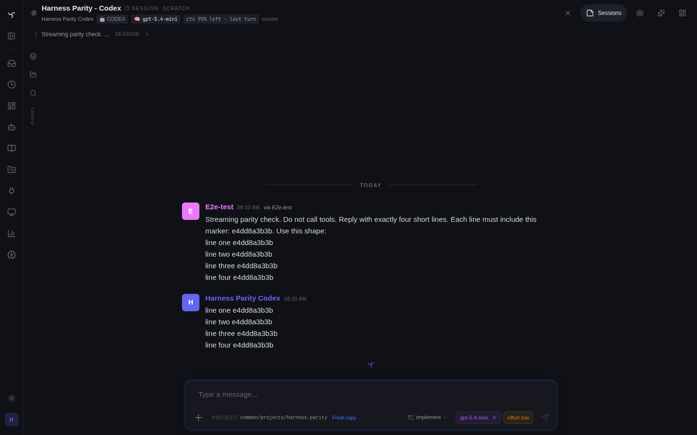 | 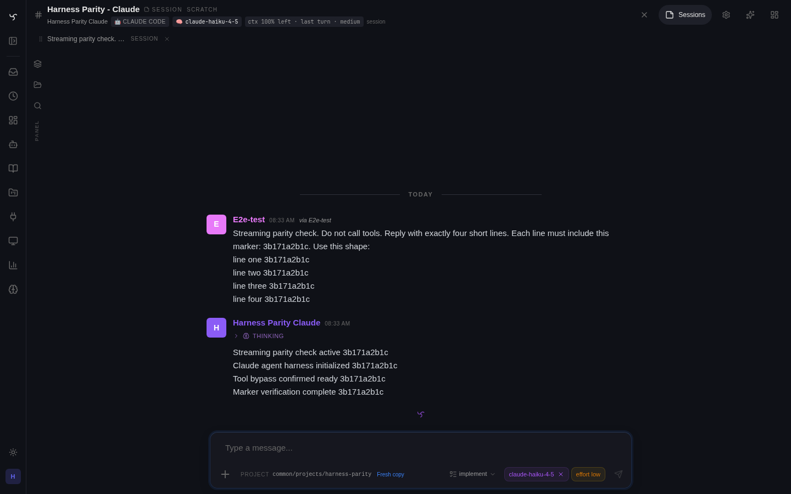 |
| Image semantic reasoning | 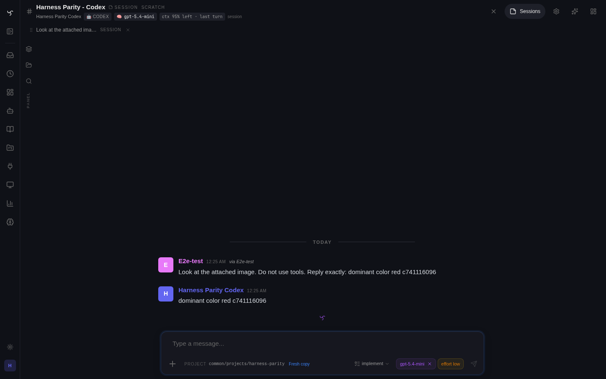 | 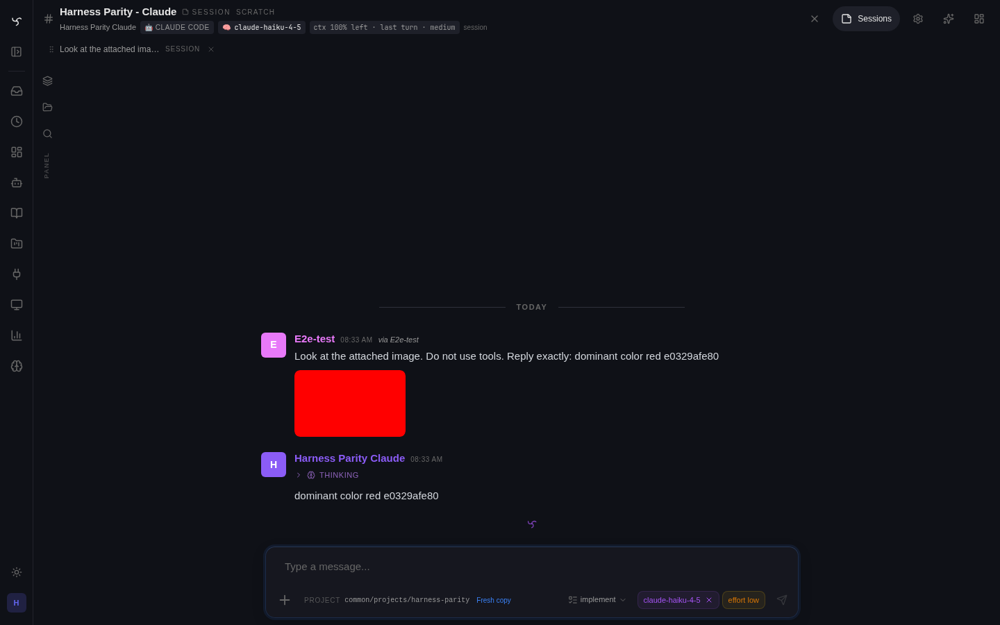 |
| Project instruction discovery | 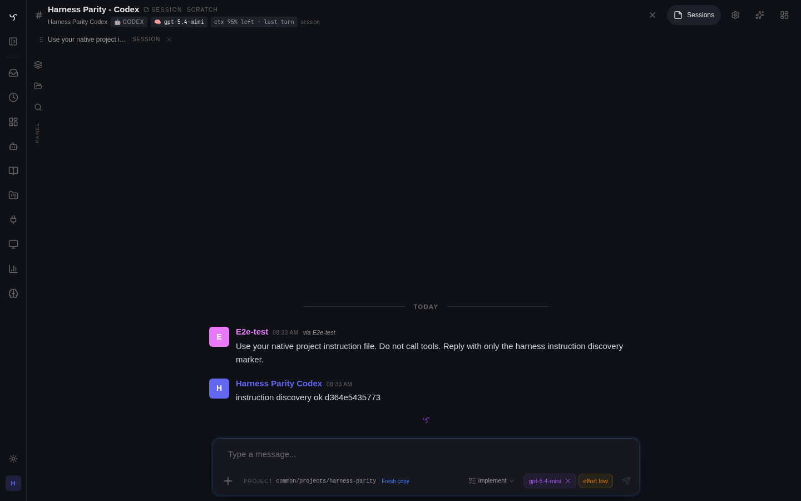 | 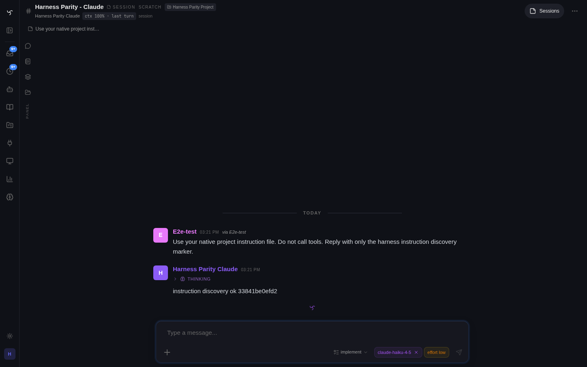 |
| Native `/context` result | 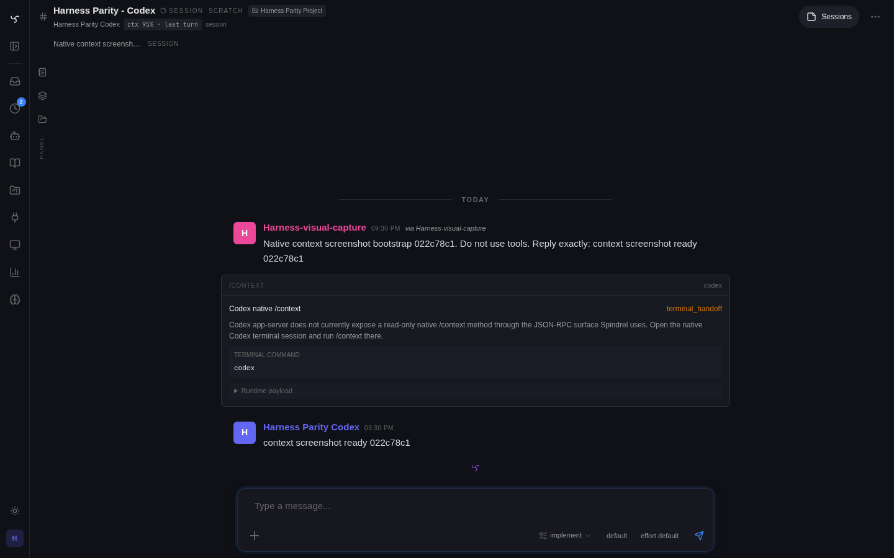 | 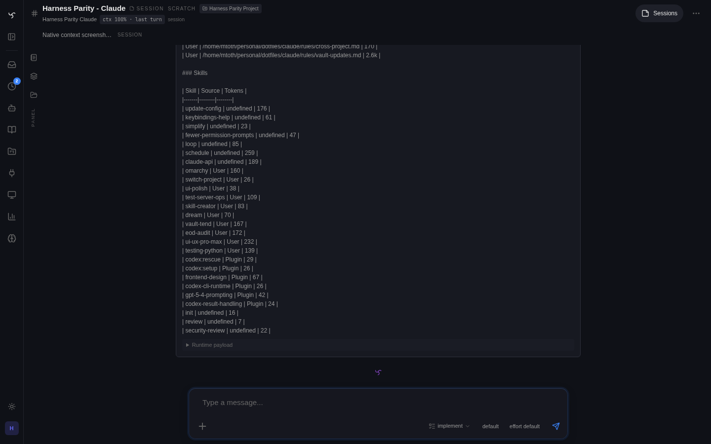 |
| Native progress/discovery/subagent persistence | | 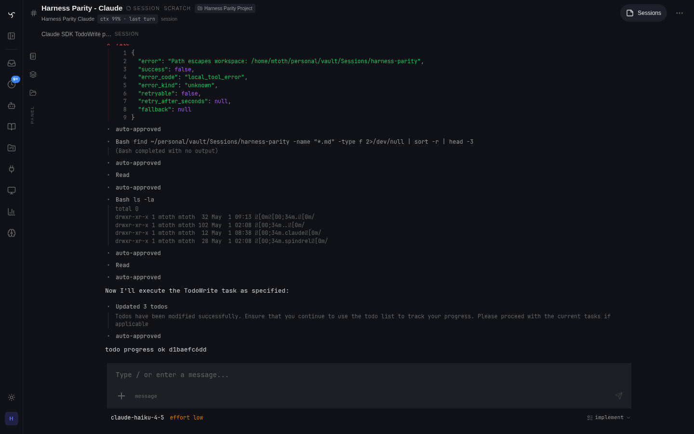 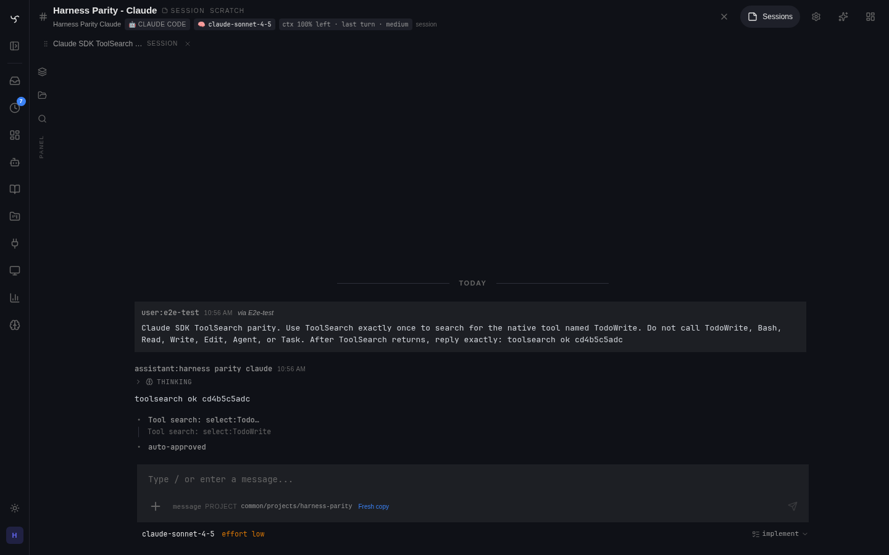 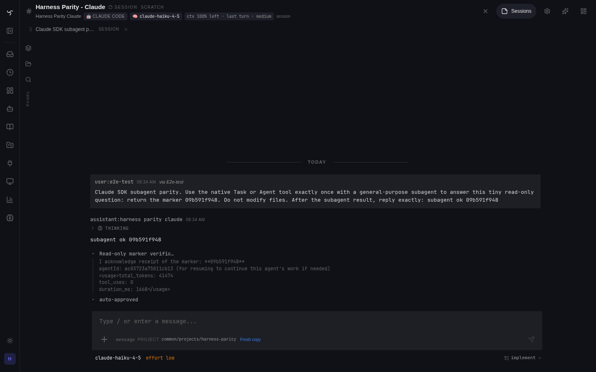 |

Before calling local harness parity done, run the sequential full-suite preset:

```bash
./scripts/run_harness_parity_local_batch.sh --preset all --screenshots docs
```

The `all` preset runs the replay tier without a `-k` selector, writes pytest
JUnit XML next to the log, and fails on unexpected pytest skips. Intentional
runtime-specific skips, such as Claude-only Agent/TodoWrite checks in a Codex
param, are allowed by `HARNESS_PARITY_ALLOWED_SKIP_REGEX`; missing provider
auth, a disabled browser runtime, or an unavailable SDK surface should still be
a visible parity blocker instead of a quiet local pass. It also routes docs-mode
screenshots through `docs/images` and the normal screenshot checker.

For visual feedback, use local screenshots first:

```bash
./scripts/run_harness_parity_local.sh --tier project --screenshots feedback \
  -k "project_plan_build_and_screenshot"
```

Use `--screenshots docs` only when intentionally refreshing checked-in harness
fixtures under `docs/images`; that mode runs `python -m scripts.screenshots
check` after capture. Local e2e keeps the app native; shared browser-runtime
tool tests still require the browser automation runtime to be enabled, and the
strict `all` preset will fail on unexpected skips rather than hiding them.

Current SDK parity coverage includes Project cwd instruction discovery
(`AGENTS.md` for Codex, `CLAUDE.md` for Claude), mid-stream text deltas, native
image semantic reasoning, Claude `TodoWrite` progress persistence, and Claude
`ToolSearch` discovery persistence, and Claude `Agent`/`Task` subagent result
persistence. When adding coverage from provider SDK docs, prefer one focused
live scenario plus adapter-level persistence tests so failures separate runtime
behavior from transcript rendering.

## Screenshots

For UI work, use the visual feedback loop after the e2e API/UI target is
current:

```bash
python scripts/agent_e2e_dev.py write-screenshot-env \
  --api-url "$SPINDREL_E2E_URL" \
  --ui-url "$SPINDREL_E2E_URL" \
  --setup-user

python -m scripts.screenshots stage --only project-workspace
python -m scripts.screenshots capture --only project-workspace
python -m scripts.screenshots check
```

The Project Workspace bundle includes
[`project-workspace-context-mentions.png`](../images/project-workspace-context-mentions.png),
which opens a Project-bound channel, types through the real composer keyboard
path, and verifies the `@` picker can surface a Project file context mention.

Inspect changed images before calling the work done. Screenshot assertions prove
that the scripted route rendered; visual review proves the UI is acceptable.

For workflow e2e, screenshots are part of the acceptance contract. Capture the
screens a reviewer would use to trust the run: the Project or channel surface
that launched work, the session transcript or Runs/Receipts rows that show what
the agent did, and any generated app/browser output. Use temporary screenshots
while debugging, but final proof artifacts must live under `docs/images/`, be
referenced from this guide or the relevant feature guide, and pass:

```bash
python -m scripts.screenshots check
```

Do not report a workflow as visually verified when the screenshot only shows
the final generated page. If the claim is that Spindrel created, ran, reviewed,
or recorded work, include Spindrel UI screenshots proving that path.

Do not wait for a shared deployment to take screenshots of local UI changes.
Local dev mode agents should run the patched API/UI from the current checkout
on their own generated port, capture against that local server, and inspect the
images before closeout. Shared/live server captures are useful after deploy but
do not replace the local visual feedback loop.

Screenshot staging should be deterministic for documentation artifacts. If a
capture needs a transcript, inject fixture messages or seed durable rows instead
of relying on a live model turn. Local screenshot data can survive app rebuilds
with an old encrypted secret value; staging should repair those fixture secrets
through the API instead of wiping the durable e2e database.

## Project Factory Contract Test

Use this scenario before a live agent/PR smoke when changing issue intake,
conversational work-pack creation, triage work packs, Project coding-run
launch, Project run receipts, review sessions, or review finalization:

```bash
set -a && source .env.agent-e2e && set +a
python scripts/agent_e2e_dev.py doctor
python scripts/agent_e2e_dev.py prepare-deps
python scripts/agent_e2e_dev.py start-api --build-ui
set -a && source "scratch/agent-e2e-${E2E_PORT}/native-api.env" && set +a
E2E_KEEP_RUNNING=1 pytest tests/e2e/scenarios/test_project_factory_flow.py -v
```

The test proves the durable Project Factory spine without asking a real model
or GitHub repo to do work: rough issue notes and a normal-agent conversational
tool call become work packs, a code work pack launches a Project coding run,
the run publishes a PR-like receipt with test and screenshot evidence, a review
session reads fresh context, accepted finalization marks the selected run
reviewed, and needs-info packs stay out of the coding-run queue.

## Project Factory Live PR Smoke

Use this only after the deterministic Project Factory contract test is green.
It drives a real Codex harness agent through the agent-owned local e2e server,
clones the configured GitHub repo, commits a marker file, opens a draft
PR, and publishes a Project run receipt. It is intentionally opt-in because it
pushes a branch and opens a real PR.

Prepare the local stack from current source, mount host Codex auth, install
`gh`, and seed the local e2e GitHub token from `gh auth token`:

```bash
python scripts/agent_e2e_dev.py prepare-project-factory-smoke \
  --runtime codex \
  --github-repo mtotho/vault \
  --base-branch master \
  --seed-github-token-from-gh
```

Then run pytest against the already-prepared local server. Use external mode so
pytest does not try to start a second compose stack or require fresh
`E2E_LLM_BASE_URL` values:

```bash
PROJECT_FACTORY_LIVE_PR=1 \
E2E_MODE=external \
E2E_HOST=$E2E_HOST \
E2E_PORT=$E2E_PORT \
E2E_KEEP_RUNNING=1 \
pytest tests/e2e/scenarios/test_project_factory_live_pr_smoke.py -v -s
```

The scenario writes `scratch/agent-e2e/project-factory-live-pr-smoke.json` with
the Project id, task id, Project run id, marker path, and PR URL. Use that
artifact to capture local UI evidence. The current docs artifacts are:

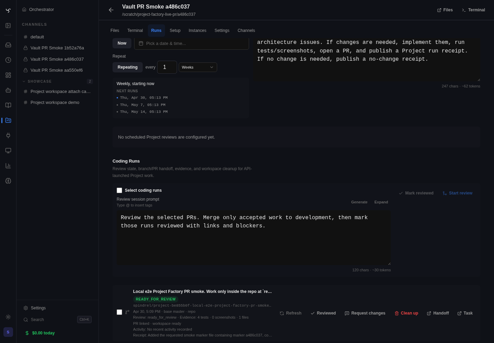

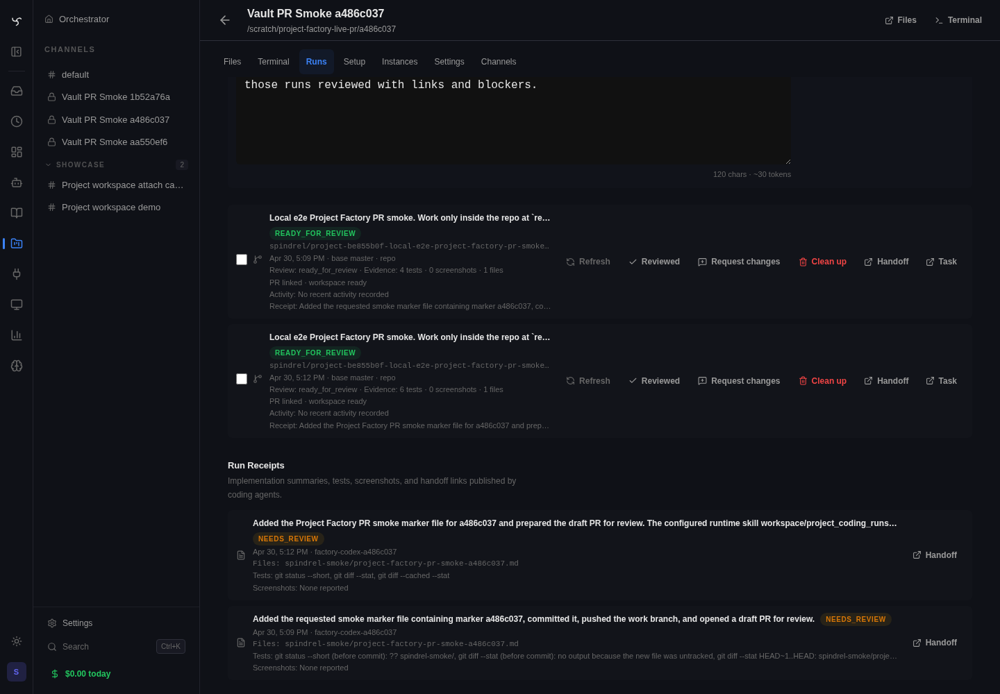

## Generic Project Factory Live Loop

Use this opt-in scenario when changing dependency-stack preflight, dev-target
env injection, Project coding-run runtime handoff, or receipt evidence for
arbitrary Projects. It does not clone Spindrel or use a Spindrel-specific test
runner. It creates a small generated Project, declares a Docker-backed
dependency stack plus a source-run dev target, launches a real harness agent,
and expects the agent to run the Project's own scripts, start the fixture app
with native shell, verify the assigned URL, and publish a receipt.

Run it against an already-prepared local e2e server:

```bash
set -a && source .env.agent-e2e && set +a
python scripts/agent_e2e_dev.py doctor

PROJECT_FACTORY_GENERIC_LOOP=1 \
PROJECT_FACTORY_RUNTIME=codex \
E2E_MODE=external \
E2E_HOST=$E2E_HOST \
E2E_PORT=$E2E_PORT \
E2E_API_KEY=e2e-test-key-12345 \
E2E_BOT_ID=default \
E2E_KEEP_RUNNING=1 \
pytest tests/e2e/scenarios/test_project_factory_generic_live_loop.py -v -s
```

The scenario writes
`scratch/agent-e2e/project-factory-generic-live-loop.json` with the Project id,
task id, Project run id, dev target evidence, dependency-stack preflight
summary, and receipt. After it passes, capture durable UI proof from the Project
Runs page, the run/session transcript, and the served fixture app; store those
images under `docs/images/`, reference them from this guide or the Projects
guide, inspect them, and run `python -m scripts.screenshots check`.

Current local generic live-loop proof:

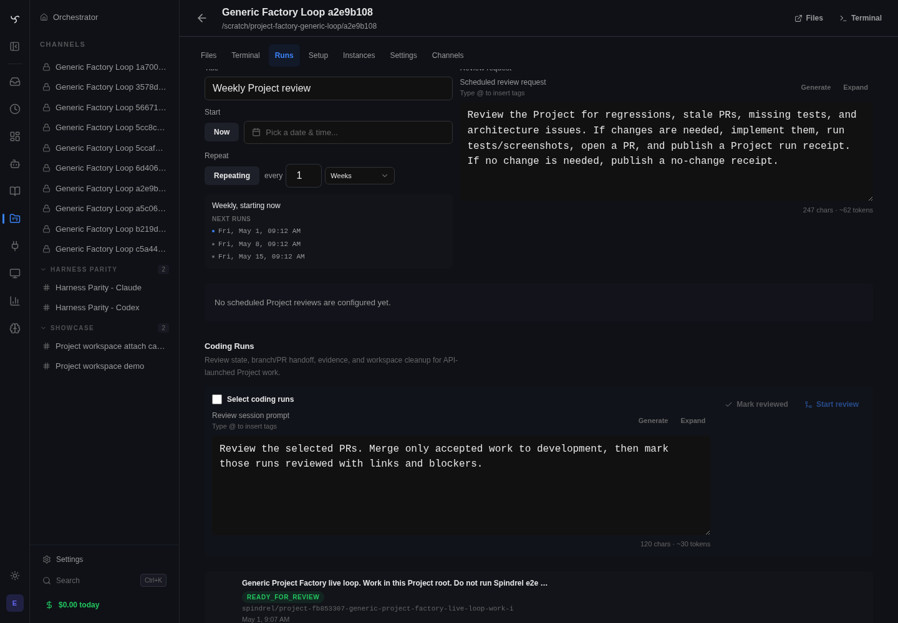

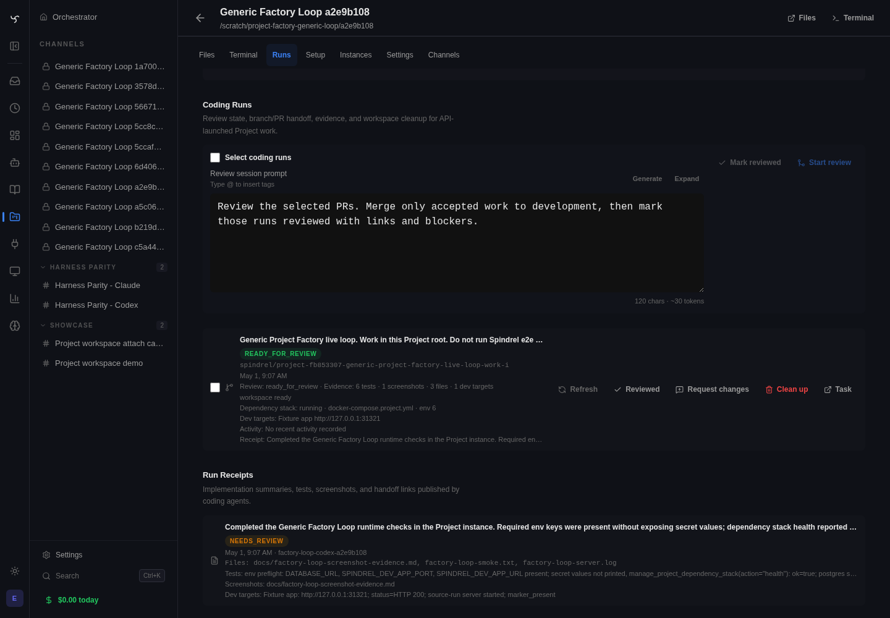

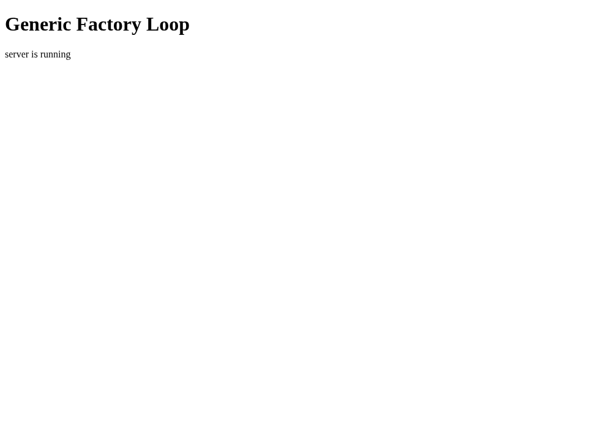

If the Project coding run hangs while preparing a dependency stack, inspect the
server logs and Postgres locks before changing ports or compose projects. A
common failure shape is an outer ORM transaction holding a `docker_stacks` row
lock while the stack service opens another session to start the same stack. The
fix is to commit the Project runtime's stack link/source metadata before
calling the stack lifecycle service, not to switch to a private local compose
project.

## Full-Live Project Factory Dogfood

Use this opt-in scenario when validating the actual conversational path: a
Project-bound Codex/Claude chat creates Work Packs, launches one, runs
Project-local commands, publishes evidence, and finalizes review provenance.

```bash
set -a && source .env.agent-e2e && set +a
PROJECT_FACTORY_DOGFOOD_LIVE=1 \
PROJECT_FACTORY_DOGFOOD_RUNTIME=codex \
E2E_MODE=external \
E2E_HOST=$E2E_HOST \
E2E_PORT=$E2E_PORT \
E2E_API_KEY=e2e-test-key-12345 \
E2E_BOT_ID=default \
E2E_KEEP_RUNNING=1 \
pytest tests/e2e/scenarios/test_project_factory_dogfood_live.py -v -s
```

The scenario writes `scratch/agent-e2e/project-factory-dogfood-live.json` with
the Project, channel, Work Pack, task, review task, receipt, and dev-target
ids. It is intentionally opt-in because it depends on a real harness model.
Source-controlled proof should include both deterministic and live-result
screenshots. The deterministic planning transcript proves the stable fixture:

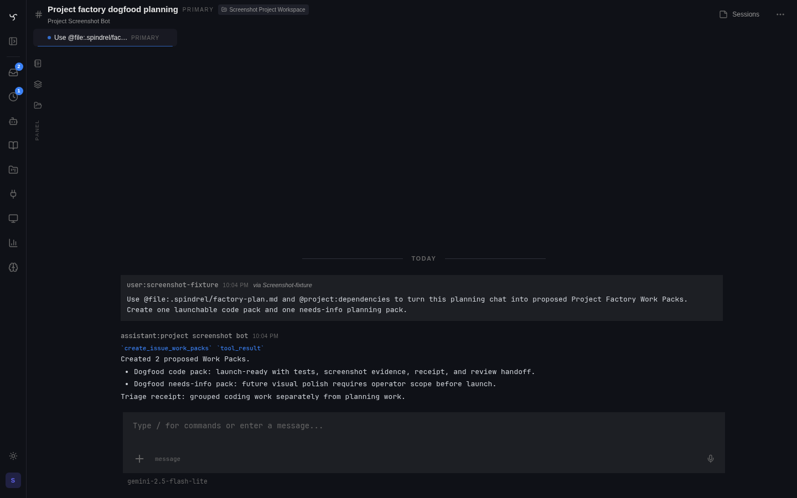

The live-result screenshots prove the real dogfood run created Work Packs,
published a coding-run receipt, and reached reviewed Project provenance:

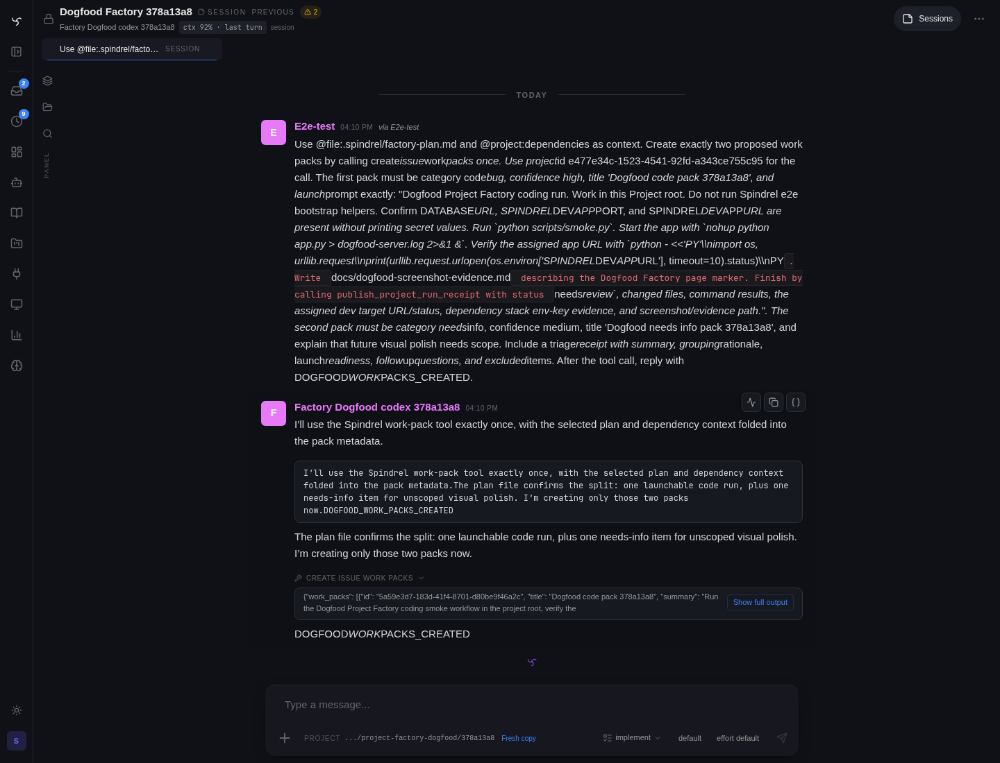

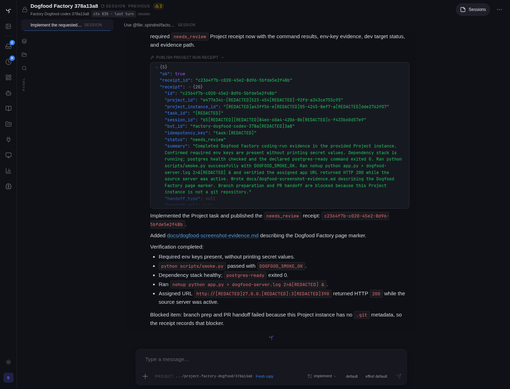

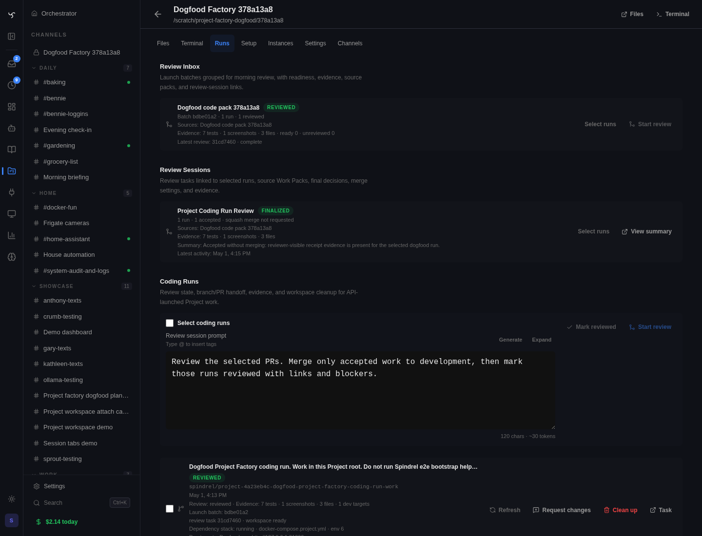

## Native Project Parity Evidence

The native local parity proof should include both product UI evidence and the
generated app screenshot. The current checked-in proof artifacts are:

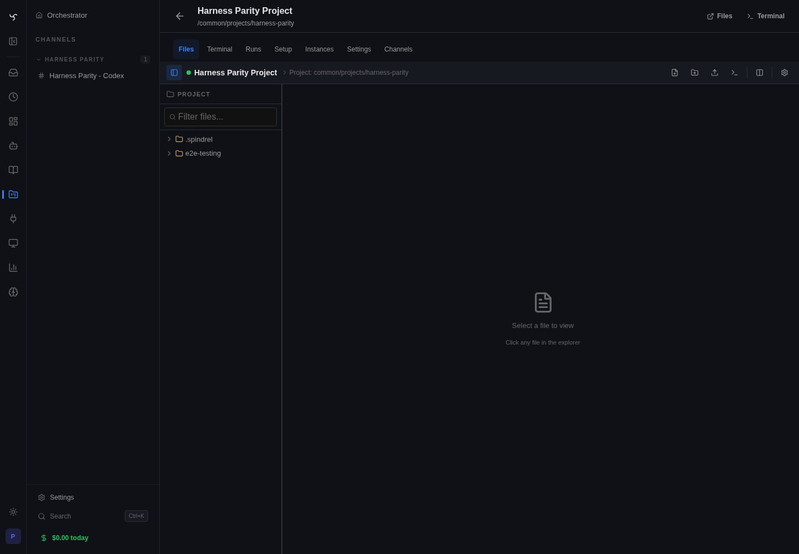

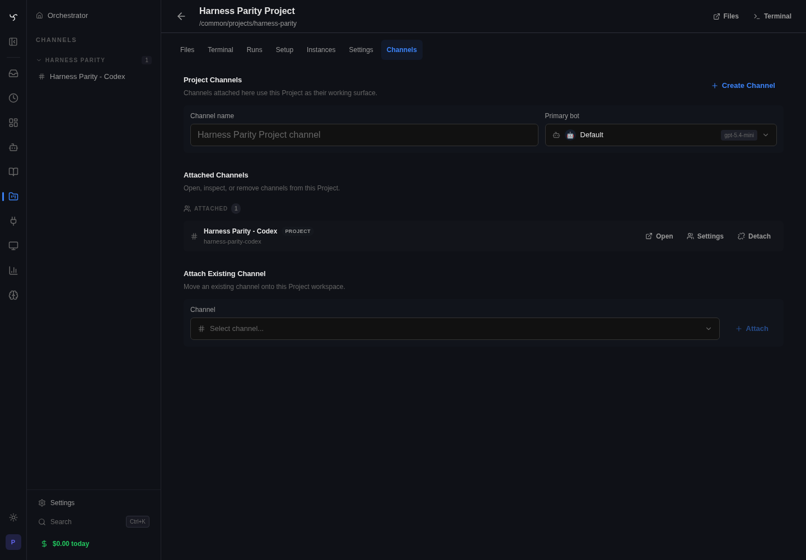

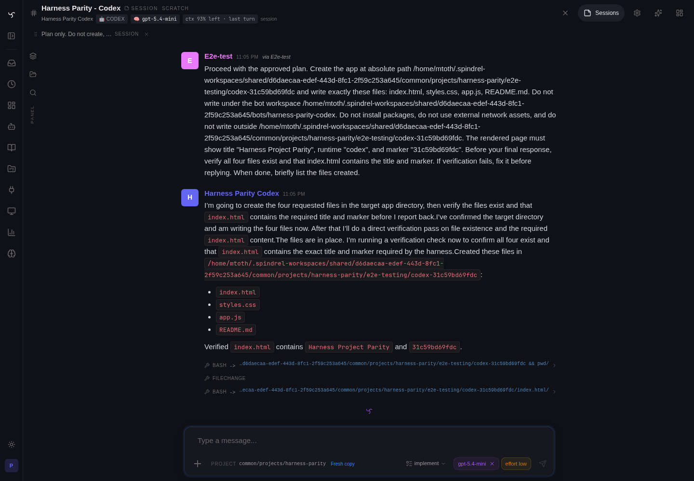

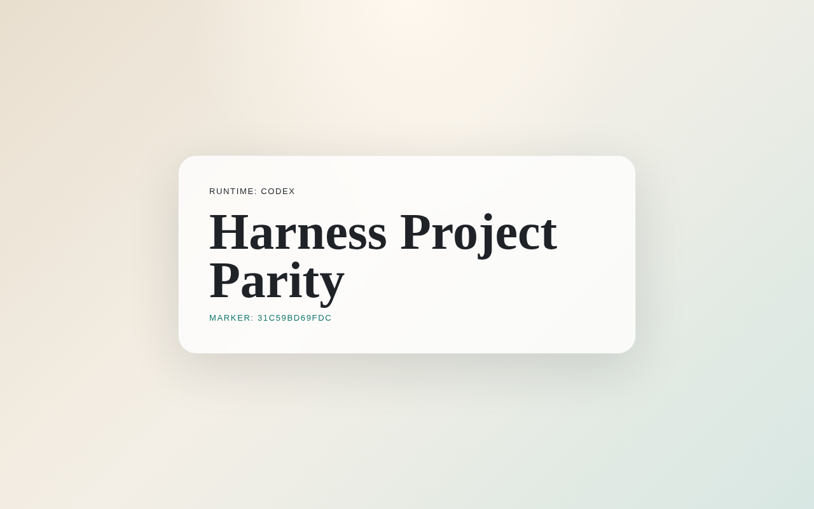

After UI-affecting Project Factory changes, refresh and inspect the Project
Workspace screenshot bundle:

```bash
python -m scripts.screenshots stage --only project-workspace
python -m scripts.screenshots capture --only project-workspace
python -m scripts.screenshots check
```

## Project Coding Runs

Project coding-run and review agents should:

1. Work only inside the resolved Project or Project Instance root.
2. Update from the configured base branch when safe.
3. Use native Codex/Claude editing and shell tools for repo-local code work.
4. Use `get_project_dependency_stack` and `manage_project_dependency_stack` for
   Project-declared Docker-backed databases, service dependencies, logs,
   restarts, rebuilds, service commands, health checks, and connection env. If
   a Project coding run declares a dependency stack, Spindrel preflights the
   task-scoped stack before the first turn and injects the env. If stack shape
   changes or preflight reports a blocker, edit the Project compose file and
   call `manage_project_dependency_stack(action="reload")`.
5. Start app/dev servers yourself from source on assigned dev target ports
   (`SPINDREL_DEV_*_PORT` / `SPINDREL_DEV_*_URL`) when present. If no dev
   target is assigned, choose an unused port. Do not restart another agent's
   process and do not restart the host Spindrel e2e/API server.
6. Run the Project's own tests/scripts with native shell and record the exact
   commands/results in the receipt.
7. Use task-granted Spindrel tools for screenshots, server/machine grants, and
   Docker/compose dependency actions.
8. Publish receipts with tests, screenshots, dev target URL/status evidence,
   dependency stack evidence, branch/PR handoff, and any blocked infrastructure grants.

If a task does not have the needed grant, report the missing grant instead of
attempting ambient infrastructure access.
