# External Agent Harnesses

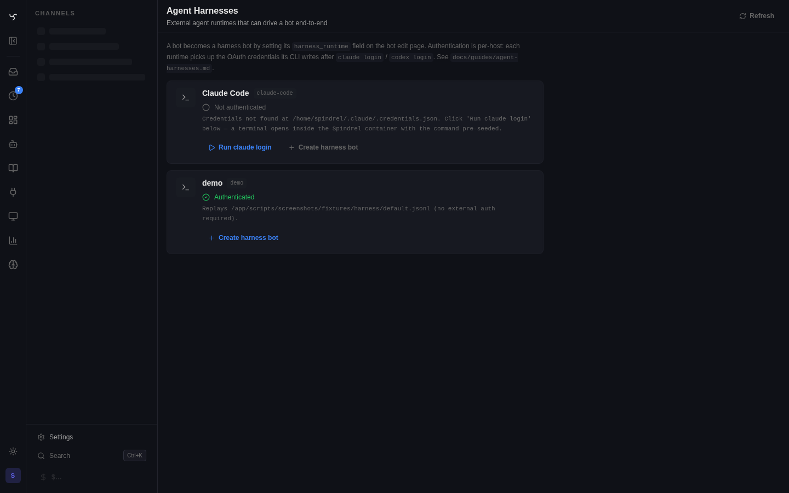

An **external agent harness** lets you run a coding-agent session from Spindrel's web UI without routing the turn through Spindrel's RAG loop. Claude Code and Codex are both supported today on the same runtime boundary.

> **Codex prerequisite.** The Codex runtime spawns the user-installed `codex` binary as `codex app-server` and speaks the official OpenAI app-server JSON-RPC protocol over stdio. No third-party Python SDK is bundled. Install the `codex` binary on the Spindrel host (or set `CODEX_BIN` to its path) and run `codex login` once. `auth_status()` distinguishes "binary not installed" from "not logged in" so the admin card surfaces a useful error before login is attempted. Spindrel's effective tool set bridges into Codex via `dynamicTools` when the installed binary supports it; otherwise the bridge status records `"unsupported"` and the harness still runs with native Codex tools. Spindrel session planning maps to Codex `collaborationMode: plan` on every turn, including resumed native threads.

The point: manage Claude Code sessions in your browser, alongside your Spindrel channels, with workspace access and persistence across restarts — without giving up Claude Code's own ecosystem (its skills, hooks, MCP servers, slash commands). Spindrel provides the remote UI, channel transcript, terminal drawer, workspace path, auth-status surface, and resume state. The external harness owns the reasoning loop, native tools, bash, file edits, permissions, and its own session id.

There is no Spindrel agent middleman in the turn. Internally the runtime is selected on a bot record so it can reuse channels, workspaces, and message persistence, but once a harness runtime is set, the normal Spindrel prompt, skills, memory, and KB injection are bypassed for that turn. Harness model/effort controls are runtime-owned and stored per session under `Session.metadata["harness_settings"]`. A narrow host bridge can add one-shot context hints and selected Spindrel tools back into the harness without turning it into a normal Spindrel loop.

## Quick start

1. **Enable the integration that owns the runtime.** Each harness ships as part of an integration, not as a baked-in dep. For Claude Code: open `/admin/integrations`, find Claude Code, click Enable. The integration's `requirements.txt` (which pins `claude-agent-sdk`) installs on enable; the SDK bundles the `claude` CLI alongside it. For Codex: enable the Codex integration, then make sure the host/container can execute `codex app-server` via `${CODEX_BIN:-codex}`. **No harness SDK or CLI lives in the base Docker image** — nothing related to a harness ships with Spindrel itself unless you enable/install it yourself.

2. **Authenticate the harness from the admin UI.** Open `/admin/harnesses`. Each enabled integration that provides a harness shows up as a card. For Claude, click **Run `claude login`** if needed. For Codex, install the binary first, then run `codex login` once in the same host/container environment that Spindrel will spawn. The auth-status card distinguishes "binary missing" from "not logged in" so setup failures are obvious before the first turn.

    Under the hood the CLI writes credentials to `$CLAUDE_CONFIG_DIR/.credentials.json` (default `~/.claude/.credentials.json`). The Claude Agent SDK that the integration installed inherits these credentials — no API key needed. See [Admin Terminal](admin-terminal.md) for the terminal mechanics.

    *Old SSH workflow* (still works if you prefer): `docker exec -it spindrel claude login`.

3. **Workspaces — nothing new to mount.** A harness session reuses the bot/channel's existing Spindrel workspace mount. In Docker deployments the harness process runs inside the Spindrel app container, so it sees the workspace under the container-local root (`/workspace-data` by default), not under the host checkout. No second mount, no parallel directory tree. The bot editor's *Workspace path (override)* field is for the rare case where you want to point the harness at a different container-visible directory.

4. **Create a harness-backed session owner and seed its workspace.** `/admin/bots` -> New bot. In the **Identity** group, set:

    - **Runtime:** `Claude Code`
    - **Workspace path (override):** leave blank — the bot uses its standard Spindrel workspace.

    Then click **Open shell** (drops you into the bot's workspace) and `git clone <url> .` your repo there. Or set a channel **Project Directory** such as `common/projects`; in Docker that resolves inside the app container to `/workspace-data/shared/<workspace_id>/common/projects`. In that layout the harness cwd is the projects root and the repo is a child directory such as `./spindrel`, matching a local workspace root like `/home/mtoth/personal` with a repo under `./agent-server`.

    System prompt and normal prompt/RAG context fields are inert when a runtime is set — the harness owns its native context. Model/effort are exposed through the harness runtime capability contract, not the normal Spindrel provider override. Spindrel tool enrollment still matters: selected local/MCP tools are the source for the harness bridge.

    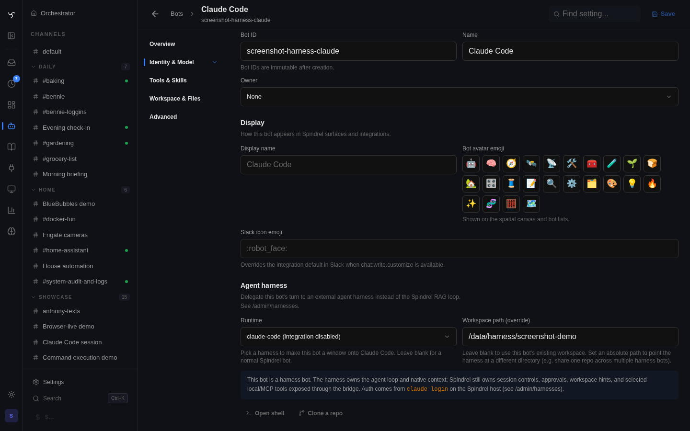

6. **Open a channel with the bot and chat.** Each turn opens a `ClaudeSDKClient` against your workspace dir, streams the assistant's text + tool calls into the channel, and persists the assistant message + the harness's session id for resume on the next turn.

## Docker / process boundary

If Spindrel runs in Docker (it does), the SDK process runs **inside the Spindrel container**. Two things have to be true:

- The credential file (`~/.claude/.credentials.json` or `$CLAUDE_CONFIG_DIR/.credentials.json`) is reachable from inside the container.
- The workspace directory you configure on the bot exists inside the container.
- Host checkout paths such as `/opt/thoth-server` are not visible unless explicitly mounted. They are for SSH/operator maintenance, not for in-app harness turns.

Two patterns:

### Bind-mount your host credentials and workspaces (recommended)

Add to `docker-compose.yml`:

```yaml
services:
  spindrel:
    # ...
    volumes:
      # Existing volumes here...
      - ${HOME}/.claude:/home/spindrel/.claude:rw
      - /data/harness:/data/harness:rw
```

Now `claude login` run on the *host* writes credentials that the container sees. Workspace dirs are shared — edit on the host (your IDE), see edits in the harness, and vice versa.

### Login inside the container

```sh
docker exec -it spindrel claude login
```

This writes credentials inside the container's filesystem only. They're lost on a `docker compose down -v` or container rebuild. Use this when you don't want host bind-mounts (multi-tenant, etc.).

## What harness sessions intentionally do *not* do

These are deliberate v1 boundaries, not oversights:

- **No full Spindrel skills, KB, memory, or capability injection yet.** The harness reads its own skills from `~/.claude/skills/`, project `.claude/skills/`, etc. Spindrel's discovery layer is not fully bridged. Selected local/MCP Spindrel tools can be exposed through the bridge, and workspace-files memory can inject host hints, but normal context assembly is still bypassed.
- **No arbitrary harness widgets / tool-result envelopes.** The harness emits plain text + tool-call breadcrumbs. The one exception is host-owned interaction cards such as `AskUserQuestion`, which Spindrel renders as durable native cards so the user can answer inside the current session.
- **Native harness tools are not Spindrel tools.** Harness approval modes can route native SDK permission prompts into Spindrel approval cards, but approved native calls still execute in the harness, not through Spindrel's `ToolCall` dispatcher.
- **Usage is non-billable host telemetry.** Harness turns write `/admin/usage` rows under synthetic providers (`harness:codex-sdk`, `harness:claude-code-sdk`). They show token/context movement and channel attribution, but cost is recorded as `$0.0000` because provider billing still happens inside the native CLI/SDK account.
- **Limited native tool-call rehydration.** Live harness tool breadcrumbs are persisted on the synthetic assistant `Message` row and rehydrate after refresh. Native harness tool bodies still do not become Spindrel `ToolCall` rows unless the call came through an explicit Spindrel bridge.
- **No @-mention fanout.** A harness session owns its turn end-to-end; it doesn't trigger member-bot replies, supervisors, or context compaction.

If you need any of those, you want a normal Spindrel bot, not an external harness session.

Spindrel still applies its secret redactor at the harness host boundary, covering both registered secret values and common token/key patterns. Streamed assistant text, thinking blocks, tool arguments, tool-result summaries, and the persisted final assistant message are scrubbed before they enter the channel bus or transcript. This is defense-in-depth, not a substitute for rotating any token that a native harness command already printed.

## What it looks like in chat

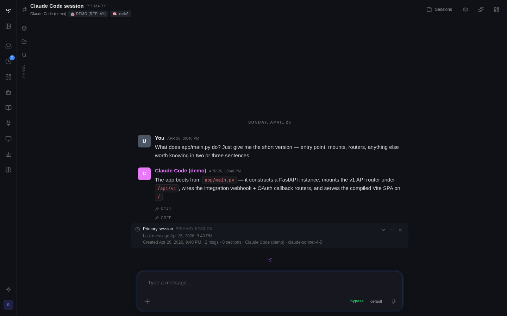

The chat surface is the same surface every other Spindrel bot uses. The harness header pill (`DEMO (REPLAY)` above; `CLAUDE-CODE` in production) tells you which runtime owns the loop. Tool-call breadcrumbs (Read, Grep, Bash, Edit, …) appear inline as the harness fires them — these are the harness's *own* tools, not Spindrel `ToolCall` rows. The final assistant text persists on a single `Message` row so the transcript rehydrates after a refresh.

### Visual parity fixtures

The checked-in harness screenshots below are regression fixtures for the web wrapper's CLI parity surface. They come from live Codex and Claude Code E2E channels and should be regenerated when tool-result rendering, terminal mode, question cards, harness usage telemetry, explicit memory reads, or skill bridge rendering changes.


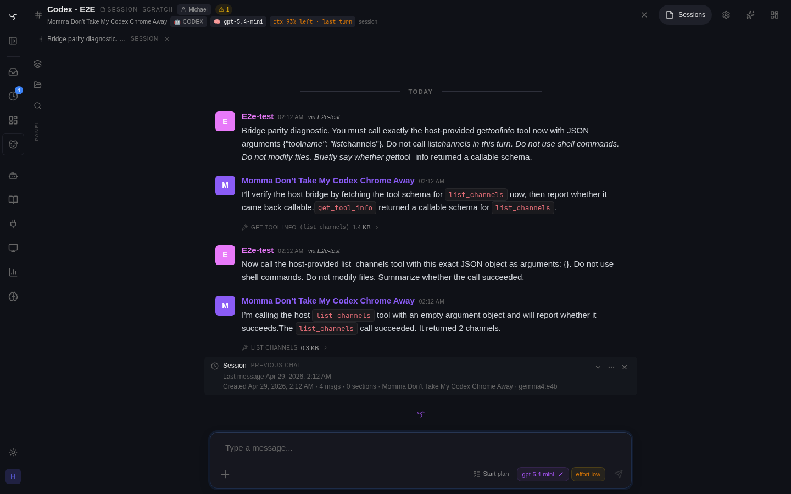

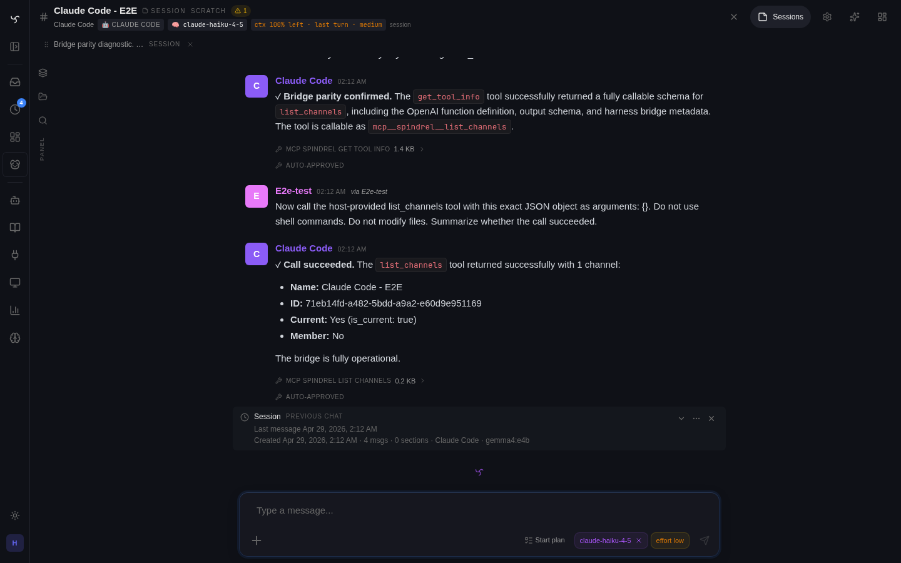

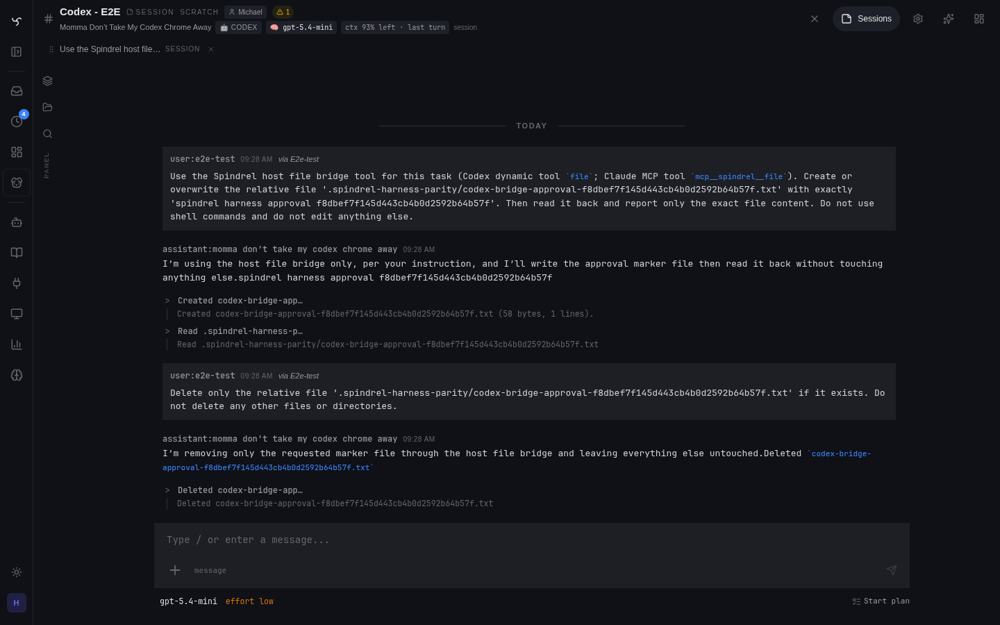

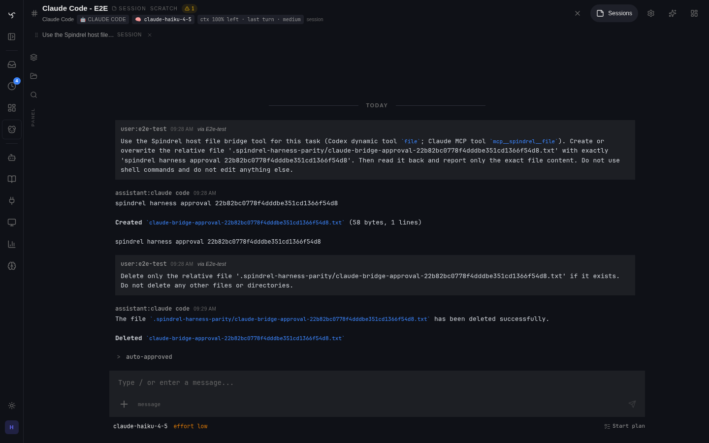

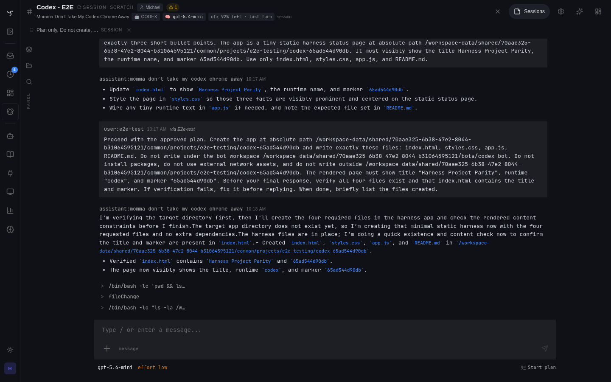

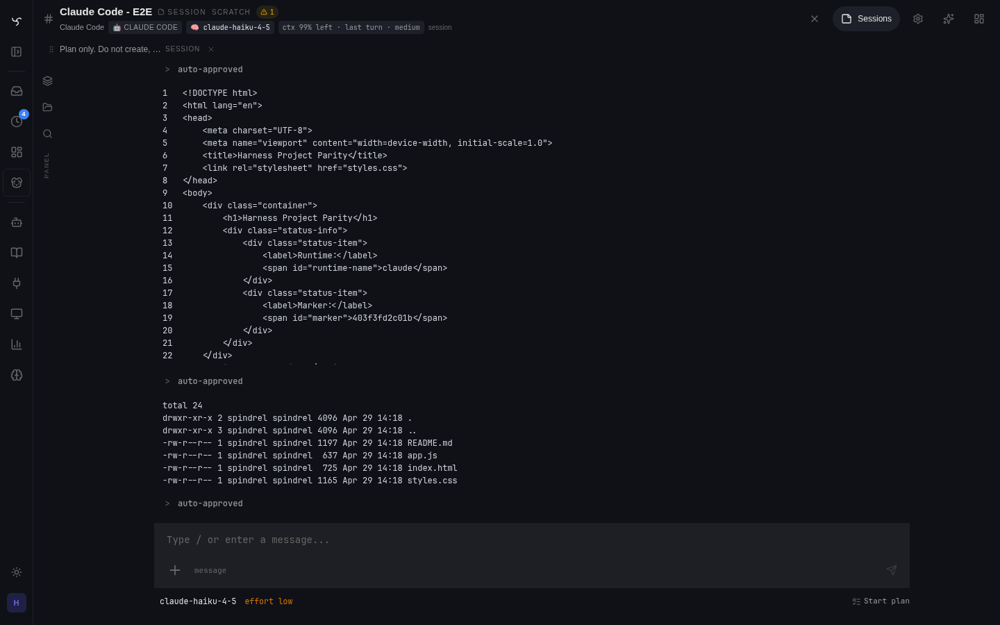

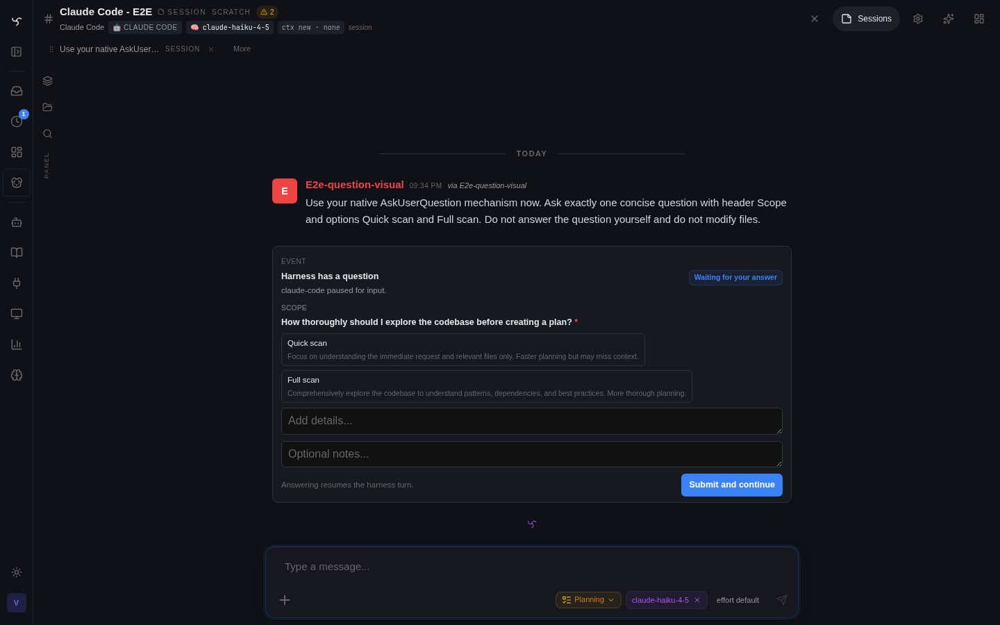

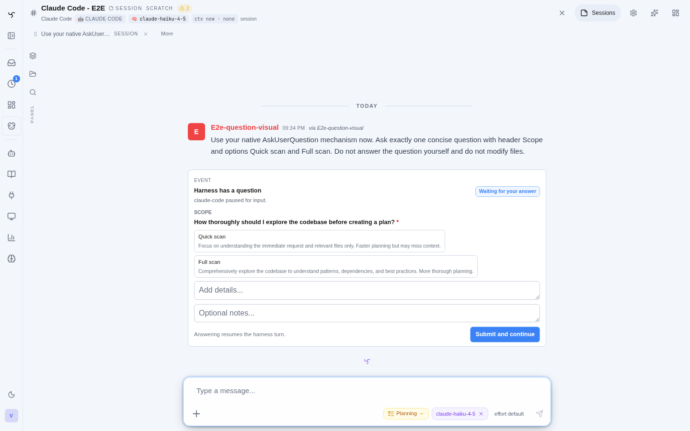

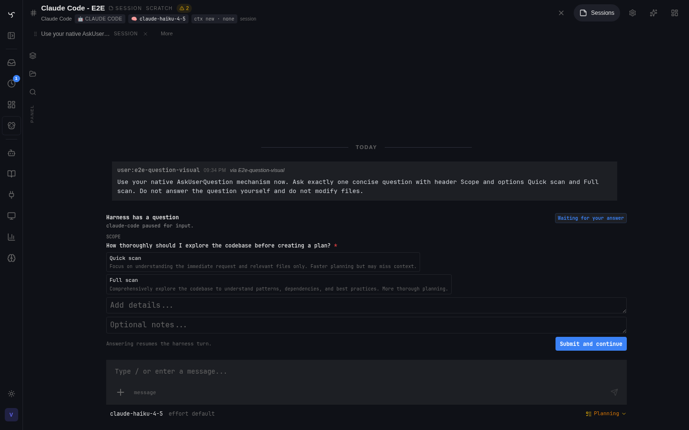

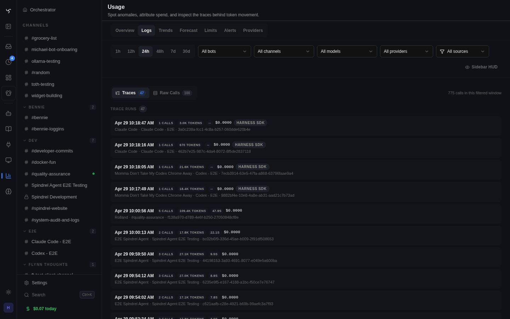

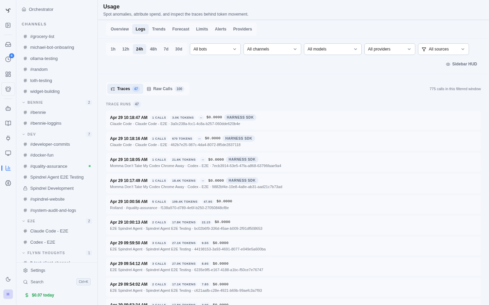

Regenerate the non-question fixtures with:

```bash
HARNESS_PARITY_TIER=project ./scripts/run_harness_parity_live.sh \
  -k project_plan_build_and_screenshot

SPINDREL_API_KEY=... \
python -m scripts.screenshots.harness_live \
  --api-url http://10.10.30.208:8000 \
  --ui-url http://10.10.30.208:8000 \
  --browser-url http://10.10.30.208:8000 \
  --output-dir docs/images
```

When using the shared Docker Playwright runtime, `--browser-url` must be
reachable from inside the Playwright container. The exact main-host command
with Docker container IP resolution lives in `scripts/screenshots/README.md`.

For question-card fixtures, first create or preserve a live pending
`core/harness_question` session, set `HARNESS_VISUAL_QUESTION_SESSION_ID`, then
run the same command. The script temporarily toggles channel chat mode for the
capture and restores the prior channel config at the end.

## How session resume works

Every turn returns a `session_id` from the SDK's `ResultMessage`. Spindrel persists it on the assistant message under `metadata.harness.session_id`. The next turn for the same Spindrel `Session.id` reads the most recent harness metadata and passes that to the SDK as `ClaudeAgentOptions(resume=...)` so the harness re-enters the same conversation — no re-introduction, no lost state.

Cost is read from persisted assistant-message harness metadata (`metadata.harness.cost_usd` / `usage`) and surfaced in the UI; the old bot-level `harness_session_state` column is not the source of truth for current harness turns.

Harness settings are Spindrel-session scoped. In the web UI, a slash command or model/approval pill targets the current pane/session id from component state or the route querystring. `channel.active_session_id` is only the primary/default fallback and the integration-mirroring pointer; it must not be treated as the target for scratch, split, or thread panes.

## Runtime controls

Each runtime exposes a `RuntimeCapabilities` contract through `GET /api/v1/runtimes/{name}/capabilities`. The host uses it to render harness controls and filter slash commands:

- `model_options[]` drive the harness model picker and model-scoped effort choices. Compatibility fields `supported_models` / `available_models` still exist for older clients.
- `effort_values` is the compatibility projection of available effort levels. Claude Code exposes `low`, `medium`, `high`, `xhigh`, and `max`; the adapter maps those to the installed SDK's supported `effort`/`thinking` option shape.
- `approval_modes` powers the per-session approval-mode pill.
- `slash_policy.allowed_command_ids` filters `/api/v1/slash-commands?bot_id=...` and `/help`.

Per-session values are read and patched via `GET/POST /api/v1/sessions/{id}/harness-settings`. Missing patch keys mean no change; JSON `null` clears a value.

## Support levels

| Surface | Current level | Notes |
|---|---|---|
| Native runtime tools | Supported | Claude Code owns Bash, file edits, native web/MCP, and plan-mode tools. Spindrel approval modes can gate SDK permission prompts, but execution stays native. |
| Model + effort picker | Supported | Runtime capability endpoint exposes model-scoped effort choices; selection is stored per Spindrel session. Bare `/model` and `/effort` render picker cards, while `/model <id>` and `/effort <level>` set values directly. |
| Approval modes | Supported | Per-session `bypassPermissions`, `acceptEdits`, `default`, and `plan`; ask paths render Spindrel approval cards. |
| Runtime questions | Supported | Claude `AskUserQuestion` renders a persisted `core/harness_question` card in default and terminal chat modes. |
| Plan mode | Supported | Spindrel plan mode remains the session source of truth. Codex sessions receive native `collaborationMode: plan` plus read-only sandbox policy while Spindrel is `planning`; Spindrel plan artifacts are not auto-created from Codex native plan items. |
| `/compact`, `/new`, `/clear`, and `/context` | Supported | Harness `/compact` triggers native runtime compaction when supported. `/new` and `/clear` open a fresh Spindrel session without deleting the old one or changing the channel primary/default pointer. `/context` reports host-visible native state, hints, bridge health, and native compact status. |
| Host context hints | Supported | Channel prompts render as priority host instructions; heartbeats and workspace-files memory queue host hints for harness turns. Native compaction does not use Spindrel continuity hints. |
| Spindrel tool bridge | Experimental | Normal bot/channel tool pickers are the source. Local/MCP Spindrel tools are exposed through runtime-native bridge hooks when available: Claude via the SDK MCP helper surface, Codex via `dynamicTools` when the installed binary advertises support. `@tool:<name>` can add a server tool for one turn. Calls route through Spindrel dispatch and are constrained to the exported set. Needs deployed-runtime smoke testing. |
| Spindrel skills | Partial | `@skill:<id>` adds a tagged skill index hint for the turn and relies on bridged `get_skill` / `get_skill_list` for progressive skill fetching. No native `.claude/skills` sync yet. |
| Memory system | Partial | Normal Spindrel bots auto-inject workspace-files `MEMORY.md` through context assembly. Harness bots bypass that path: they receive only a host hint telling the runtime where memory files live. Reads/writes still require explicit native filesystem access or bridged tools/policies. |
| Usage aggregation | Supported | Harness turns emit synthetic non-billable `/admin/usage` rows with provider id, channel id, model, prompt/completion tokens, context fields, and `billing_source="harness_sdk"`. |

## Harness questions

When a runtime asks the user for structured input (Claude Code: `AskUserQuestion`), Spindrel intercepts the SDK callback and renders a native `core/harness_question` card in the chat transcript. The card is a normal persisted assistant `Message` scoped to the current Spindrel `Session.id`; it is not tied to `channel.active_session_id` except when the current view has no explicit session and falls back to the primary session.

Answering the card writes a suppress-outbox user message with the answers. If the original SDK callback is still alive, the answer resolves that callback and the same harness turn continues. If the process restarted and the callback is gone, the answer starts a fresh pending harness task in the same session using the persisted answer as the prompt. Stop-turn paths mark pending harness questions cancelled so stale cards do not wait for their timeout.

## Native status, compact, and host hints

Harness sessions expose lightweight native state through `GET /api/v1/sessions/{id}/harness-status` and `/context`:

- selected harness model/effort and approval mode;
- latest native harness resume id;
- pending one-shot host hints with names and previews;
- selected/exported Spindrel bridge tools, ignored client tools, bridge health, and explicit one-turn tags;
- last turn timestamp, native compact status, estimated native context remaining when available, and last usage/cost metadata.

This is not a full Spindrel context budget. The native provider owns its own context window. Spindrel can only report the metadata it sees at the host boundary. Codex `thread/tokenUsage/updated` includes `modelContextWindow`, so Codex-backed sessions can show estimated remaining native context when that event has been observed.

`/compact` is harness-aware. It does **not** run normal Spindrel transcript compaction, reset the native resume id, or queue a host-generated continuity summary. For Claude Code, Spindrel sends SDK `/compact`, records the native compact result as a persisted low-chrome card, and keeps the same native session id unless the runtime reports a replacement.

`/new` and `/clear` are generic chat-session commands. They create a new channel-bound Spindrel session and navigate the invoking pane to it. Old sessions remain in history, and the channel's primary/default pointer is not changed by these commands.

Scheduled and manual heartbeats on harness channels run through the native harness turn path, not the normal Spindrel loop. The heartbeat preamble, optional spatial/pinned-widget/game context, Command Center assignment block, and task prompt are combined into the harness user message and executed with `_run_harness_turn` against the configured run target (`primary`, a selected existing session, or a new session per run). Selected Spindrel tools are passed into the harness bridge for that run, and explicit heartbeat auto-approve maps to a run-scoped `bypassPermissions` override without changing the interactive session's approval mode. The persisted assistant row is tagged with `metadata.is_heartbeat=true` so the chat UI can render it as heartbeat output, while `metadata.harness.last_hints_sent` records host instructions such as channel prompts. If the target session is busy, the heartbeat is deferred and rescheduled shortly. Scratch/split fanout is explicit through the run target; it is not automatic.

Scheduled/manual tasks that target a harness bot use the same automation seam. Task `execution_config.tools` and `execution_config.skills` are merged with any `@tool:` / `@skill:` tags in the task prompt, model/effort overrides are passed through to the runtime, and `skip_tool_approval=true` applies only to that automated run. Arbitrary `additional_tool_schemas` remain normal-agent-only unless a real bridge executor exists; harness automation should select registered Spindrel tools.

When workspace-files memory is enabled on a harness bot, Spindrel injects a non-consuming host hint on each turn that points the runtime at the bot workspace and explains that durable memory files may exist there. The hint does not read, mutate, or paste `memory/MEMORY.md` into the native Codex/Claude prompt. Channel prompts are the right place for short harness-specific operating instructions; durable memory files remain file-backed context the harness must inspect explicitly through native filesystem tools or selected bridged Spindrel tools such as `get_memory_file`.

## Spindrel tool bridge

Claude Code can receive selected Spindrel tools through a best-effort in-process MCP bridge when the installed Claude Agent SDK exposes the required helpers. The bridge is dynamic: it resolves the effective bot/channel tool set the same way the normal loop does, excludes browser-client tools, and converts local/MCP schemas into harness-visible tool definitions.

Calls route back through `dispatch_tool_call`, not directly into Python functions. That means existing Spindrel policy, approval rows, audit/trace records, secret redaction, and result summarization remain in force. If the installed SDK does not provide the in-process MCP helper surface, the adapter disables the bridge for that turn and native Claude tools continue to work.

The normal bot and channel tool pickers are intentionally still visible for harness bots. For harnesses they mean "make these Spindrel tools bridgeable to the runtime," not "inject these tools into Spindrel's normal LLM loop." The composer plus menu can also insert `@tool:<name>` for a one-turn bridge addition.

The bridge is still early. Smoke-test SDK helper names on the deployed harness image before relying on it for production mutating tools. The live parity suite has focused tiers for this surface: `memory` verifies hint-only memory plus explicit `get_memory_file`, `skills` verifies `@skill:<id>` plus `get_skill`, and `replay` verifies persisted bridge tool envelopes after message refetch.

## Spindrel skill bridge

Harness skill support is progressive, not native sync. When the user tags `@skill:<id>`, Spindrel adds a one-turn tagged-skill index hint that names the skill and tells the harness to fetch full bodies through bridged `get_skill`. This preserves Spindrel's normal skill-discovery rhythm: skills can reference other skills, and the harness can call `get_skill_list` / `get_skill` instead of receiving an unbounded body dump.

If the SDK bridge is unavailable, Spindrel reports that state in `/context` and the ctx detail surface. It does not silently inject full skill bodies as a fallback.

## Adding context

Just put files in the workspace directory. The harness reads what's there:

- For live Spindrel project work, set the channel Project Directory to `common/projects`. Inside the app container this resolves to `/workspace-data/shared/<workspace_id>/common/projects`; the `spindrel` repo is a child directory under that cwd. Host-only paths such as `/opt/thoth-server` are for SSH/operator commands and are not visible to the harness runtime.
- Want your dotfiles' `CLAUDE.md` in the bot's view? `git clone git@github.com:me/dotfiles /data/harness/my-project/.dotfiles` (or whatever layout makes sense — the harness sees a normal filesystem).
- Want your vault available? `git clone git@github.com:me/vault /data/harness/my-project/vault` and reference it from your project-level `CLAUDE.md`.
- Want a Spindrel skill for one turn? Use the composer plus menu or type `@skill:<id>`. The harness gets a tagged-skill index hint and can fetch the body through bridged `get_skill` when the bridge is available.
- Want a Claude-native skill? Copy its markdown into `<workdir>/.claude/skills/<name>.md` and the harness will pick it up via its own skill loader. Spindrel does not automatically sync into that directory yet.

There is intentionally no UI for this in v1. The directory IS the contract.

## Operational notes

- **Single OAuth identity per host.** All harness sessions using `claude` ride the same `~/.claude/credentials.json`. There's no per-bot or per-channel auth scoping.
- **Workspace dir must exist before the first message.** The driver hard-fails if `harness_workdir` doesn't resolve to a directory. Create it (and seed it) up-front.
- **The bundled CLI comes from the integration, not the base image.** Enabling the `claude_code` integration installs `claude-agent-sdk`, which bundles the `claude` CLI binary. The base Spindrel image installs no harness CLIs. To upgrade the SDK + CLI, reinstall the integration's deps from `/admin/integrations`.
- **The SDK is alpha.** The integration pins a loose floor (`claude-agent-sdk>=0.1.0`) so each integration-deps reinstall picks up the latest. The bridge unit tests in `tests/unit/test_claude_code_runtime_bridge.py` import the live SDK dataclasses, so any rename of `ResultMessage.total_cost_usd` or content-block restructure surfaces as a CI failure, not a silent zero-cost / blank-text production turn.

## Adding a new harness runtime

Each runtime lives **inside its own integration**, never in `app/`. The pattern mirrors how integration tools register today.

1. Pick (or create) the integration: `integrations/<id>/`. Add `harness` to its `integration.yaml` `provides:` list. Pin the harness's Python package in `integrations/<id>/requirements.txt`.
2. Implement `HarnessRuntime` in `integrations/<id>/harness.py` — `start_turn()` translates the harness's streaming output into `ChannelEventEmitter` calls, `auth_status()` reports login state, `capabilities()` describes model/effort/slash controls, and approval classification methods describe which native tools are read-only or prompt-worthy. Import host contracts from `integrations.sdk`.
3. At the bottom of `harness.py`, call `register_runtime(name, RuntimeClass())` so the side effect fires on import.
4. Add the runtime label to the dropdown in `ui/app/(app)/admin/bots/[botId]/index.tsx` (the harness section in `IdentitySection`).

That's it. `discover_and_load_harnesses()` walks `integrations/*/harness.py` for active integrations on app startup; the dispatch branch in `app/services/turn_worker.py` and the persistence/event surface require no changes.

When the integration is disabled at `/admin/integrations`, its harness module isn't imported, so the runtime simply doesn't appear in the registry, the bot-editor dropdown, or `/admin/harnesses`.

## What's coming

- **Codex live validation:** `model/list`, account shape, plan collaboration mode, and token-window telemetry have been verified against a local `codex-cli 0.125.0` binary. Remaining live checks: real `dynamicTools` calls, approval routing under a mutating command, and native compaction on a non-empty thread.
- **Richer native context telemetry:** Keep expanding runtime-specific telemetry where the native harness exposes it.
- **Skill bridge:** Expose selected Spindrel skills through export/sync or searchable bridged tools/resources.
- **Heartbeat/memory integration:** Add a harness heartbeat path that can inject optional context hints, then layer read-only memory hints before allowing explicit writes through bridged tools.
