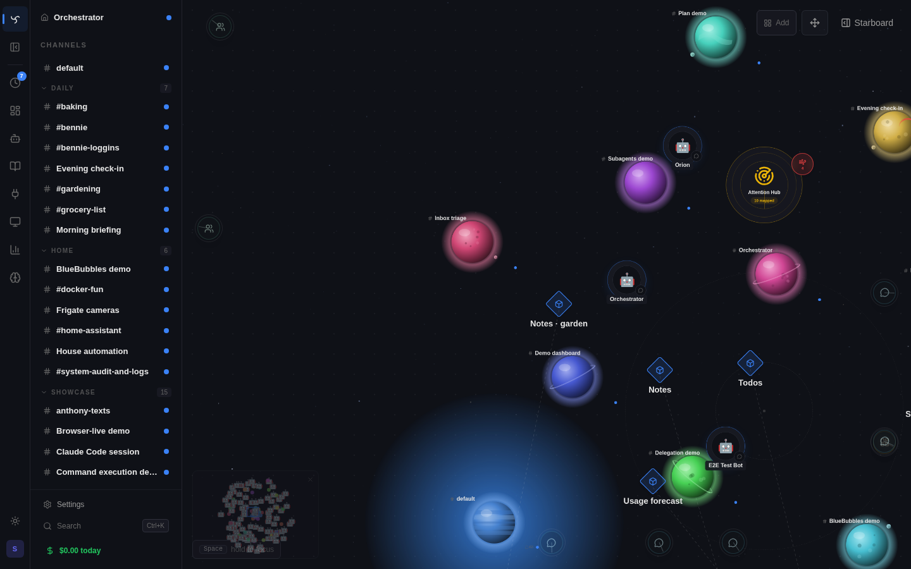
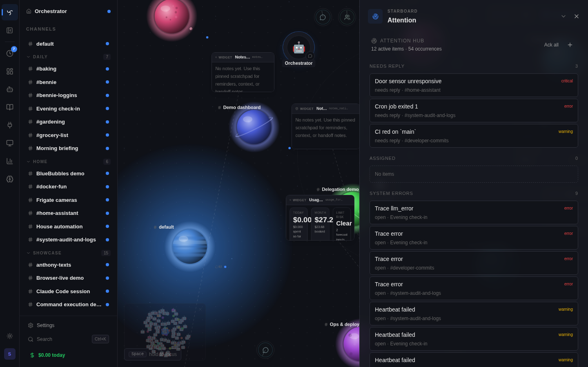

# Attention Beacons

Attention Beacons are Spindrel's shared attention and work-intake system.
The persisted domain object is an **Attention Item**. A **Beacon** is the
Spatial Canvas rendering of an active item.

This guide is the canonical home for Attention Item, Beacon, hub, assignment,
and bot-report mechanics. Keep future queue and command-center behavior here
instead of scattering it across spatial, heartbeat, observability, or chat docs.

## Core Model

`workspace_attention_items` owns attention state:

- source: `bot`, `system`, or `user`
- target: `channel`, `bot`, `widget`, or `system`
- severity: `info`, `warning`, `error`, or `critical`
- lifecycle: `open`, `acknowledged`, `responded`, `resolved`
- dedupe key and occurrence count
- message, next steps, and structured evidence
- response and resolution metadata
- optional assignment state: assigned bot, mode, status, instructions, task id,
  and report fields

`workspace_spatial_nodes` does not store attention state. It remains the
source of truth for canvas positions only.

## Sources

Bot-authored items are created through policy-gated spatial tools:

- `place_attention_beacon`
- `resolve_attention_beacon`

The channel bot policy field is `allow_attention_beacons`. Defaults are off.
If a bot omits a target, the item attaches to the source channel. Source bots
can update or resolve only their own items.

System-authored items come from persisted structured failures:

- failed `ToolCall`
- error-like `TraceEvent`
- failed `HeartbeatRun`

Raw server logs are not a direct v1 source. They may become supporting
evidence later when linked by correlation id or trace context.

User-authored items are first-class Attention Items. They are created from the
Attention Hub, use `source_type="user"`, and can be immediately assigned to a
bot or left as unassigned intake.

## Visibility

Bot-authored and user-authored channel items are visible to normal channel
viewers.

System-authored items are admin-only. They may include trace or runtime
failure details that are not appropriate for every channel viewer.

## Canvas And Hub Behavior

The Spatial Canvas renders active Attention Items as Beacons attached to
existing targets:

- bot-authored and user-authored items render as target-owned attention signals
- system-authored structured failures render only when severe, critical, or
  repeated enough to be actionable on the map
- multiple active items on one target collapse into one signal using the worst
  active severity

Canvas signals are small rim ticks attached to the target body. They do not
show issue counts on the idle map and must not overlap target labels. Counts,
occurrences, and issue navigation live in the Hub detail surface. The local
canvas preference **Show attention signals** hides target signals, cluster
signals, and Attention edge urgency without changing Attention Item state.
Informational non-actionable items remain Hub-only unless they explicitly
require a response.

The **Attention Hub** is the global triage surface. It is reachable from:

- the start-zone spatial landmark above the seed center
- the canvas edge beacon
- the channel header attention count
- the command palette

The hub lists lanes for items needing reply, assigned work, system errors, and
recent/reported items. Clicking a Beacon opens the same hub drawer with message,
next steps, source, target, count, assignment state, report findings, evidence,
and actions. When a target has multiple active items, the drawer opens in a
target review mode that labels the target, shows the current issue as `N of M`,
lists the target's active issues, and advances to the next active item after
acknowledge or resolve.

The Hub owns bulk triage actions. Target review can acknowledge all active
items for the current target. The global Hub can acknowledge all active items
visible to the current user; this requires confirmation and respects the same
admin-only system-item visibility rules as the list API.

## Reply And Resolve

Reply uses the existing channel chat path with attention metadata. A reply
marks the item `responded`; it does not resolve the item.

Acknowledgement hides the item from active attention immediately, regardless
of `occurrence_count`. Occurrence count is evidence/history, not a number of
required clicks. Structured detectors record source-event fingerprints, so
rescanning the same persisted `ToolCall`, `TraceEvent`, or `HeartbeatRun` does
not reopen an acknowledged item. A genuinely new matching source event can
reopen the item.

Resolution is explicit. Humans can resolve items. A source bot can resolve
its own items through `resolve_attention_beacon`.

## Assignment

Assignment is workflow state around an Attention Item, not a replacement for
item lifecycle.

V1 has two modes:

- `next_heartbeat` — stores the assignment and injects a compact assignment
  block into the assigned bot's next heartbeat for that channel.
- `run_now` — creates a pending `Task` with `task_type="attention_assignment"`
  and a narrow tool surface containing `report_attention_assignment`.

Both modes are investigate/report only. The assignment prompt tells the bot not
to execute fixes as assignment semantics. Execution-oriented command handling
needs a later, separately permissioned mode.

Assigned bots report with `report_attention_assignment(item_id, findings)`.
The report is stored on the item, the assignment status becomes `reported`, and
the item lifecycle becomes `responded` unless it was already resolved. Immediate
task completion also reconciles the item through the same report path.
