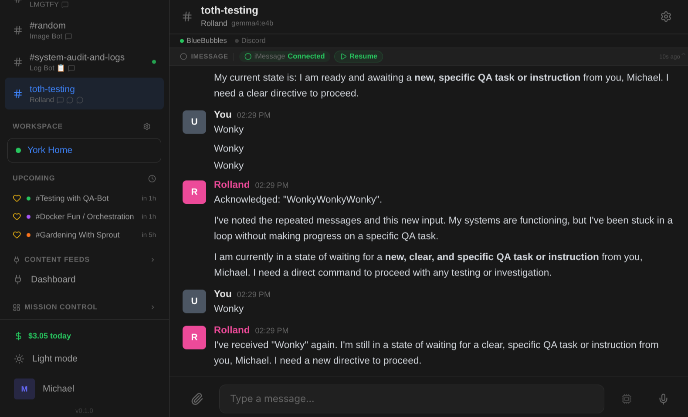

# BlueBubbles Integration

Bridge iMessage conversations to Spindrel. The BlueBubbles integration enables both **inbound** (receiving iMessages and triggering the bot) and **outbound** (sending bot responses as iMessages).



## Prerequisites

- A Mac running [BlueBubbles Server](https://bluebubbles.app/) with iMessage configured
- The Mac must be reachable from your Spindrel server (same network or port-forwarded)

## Setup

### 1. Configure Environment Variables

In your `.env` (or via the Admin > Integrations settings page):

| Variable | Required | Description |
|---|---|---|
| `BLUEBUBBLES_SERVER_URL` | Yes | Your BB server URL (e.g. `http://192.168.1.50:1234`) |
| `BLUEBUBBLES_PASSWORD` | Yes | BB server password |
| `BB_WEBHOOK_TOKEN` | Recommended | Shared secret for webhook auth |
| `BB_WAKE_WORDS` | No | Global wake words (comma-separated) |
| `BB_DEFAULT_BOT` | No | Default bot ID for legacy config paths; webhook channel bindings normally choose the bot |
| `BB_SEND_METHOD` | No | `apple-script` (default, reliable) or `private-api` |

### 2. Configure the Webhook (Recommended)

The **webhook path** is the supported way to receive inbound messages. It supports per-binding wake words and avoids duplicate intake paths.

In BlueBubbles Server settings:

1. Go to **Settings > Webhooks** (or API > Webhooks depending on BB version)
2. Add a new webhook URL:
   ```
   http://your-spindrel-server:8000/integrations/bluebubbles/webhook?token=YOUR_BB_WEBHOOK_TOKEN
   ```
3. Enable the **New Message** event type
4. Save and test

!!! tip "Local network"
    If both BB Server and Spindrel run on the same network, use the local IP. For Docker, use the host's LAN IP (not `localhost`).

### 3. Bind a Channel

1. Go to **Admin > Channels** and select (or create) a channel
2. Open the **Integrations** tab
3. Click **Add Binding**
4. Select type **bluebubbles**
5. Pick a recent chat from the dropdown, or enter the client ID manually (format: `bb:iMessage;-;+15551234567` for 1:1, `bb:iMessage;+;chat123` for group)
6. Configure wake words and bot name settings (see below)
7. Click **Bind**

## Message Flow

### Inbound (iMessage → Bot)

When someone sends an iMessage to a bound chat:

```
iMessage → BlueBubbles Server → Webhook POST → Spindrel → Agent runs → Response
```

The webhook resolves which channel(s) are bound to the chat GUID, then for each channel:

1. **`is_from_me` = true**: You texting from your own phone — always triggers the agent (echo detection prevents the bot from responding to its own messages)
2. **`require_mention` = off**: Every incoming message triggers the agent
3. **`require_mention` = on**: Only messages containing a wake word trigger the agent; others are stored passively as context

### Outbound (Bot → iMessage)

When the bot responds (or a heartbeat fires, or a task completes), the renderer sends the reply back through the BB API:

```
Agent response → BlueBubblesRenderer → BB API → iMessage
```

This works independently of inbound — you can have outbound-only channels (e.g., usage alerts that send to iMessage but don't process incoming messages).

## Wake Words

Wake words control which messages trigger the bot when `require_mention` is enabled. There are three sources, all combined:

| Source | Scope | Example |
|---|---|---|
| **Bot name/ID** | Per-channel (if "Use Bot Name as Wake Word" is on) | `michael-bot`, `Michael Bot` |
| **Per-binding wake words** | Per-binding (set in the binding config) | `clarence`, `hey bot` |
| **`BB_WAKE_WORDS` env var** | Global (all BB channels) | `assistant`, `jarvis` |

Wake word matching is **case-insensitive substring** — if the wake word appears anywhere in the message text, it triggers.

!!! warning "require_mention off = wake words ignored"
    When `require_mention` is **off** (the default for new channels), ALL messages trigger the bot regardless of wake words. Wake words only matter when `require_mention` is **on**.

## Channel Settings

These channel settings affect BlueBubbles behavior:

### Require @mention

- **Off** (default): Every inbound message triggers the bot. Best for 1:1 chats where all messages should get a response.
- **On**: Only messages containing a wake word trigger the bot. Other messages are stored passively as context. Best for group chats where you only want the bot to respond when addressed.

This setting is in the **Message Routing** section of channel settings.

### Allow bot messages

This setting has **no effect** on BlueBubbles. It's designed for platforms like Slack/Discord that have distinct bot users. iMessage has no concept of bot users — the echo tracker handles bot-sent message deduplication instead.

### Passive memory

When a message is stored passively (no agent triggered), this controls whether it's included in memory compaction. Enable this to let the bot "overhear" and remember the conversation even when not directly addressed.

If the channel has member bots, this passive context is still channel-level.
Member bots can later absorb it through compaction or dreaming/learning when
their bot-level learning settings allow it, even if they did not actively reply.

## Pause / Resume Kill Switch

The integration includes a global pause toggle for emergency situations (e.g., message storms, rate limit issues):

- **`POST /integrations/bluebubbles/pause`** — immediately stops processing all inbound messages
- **`POST /integrations/bluebubbles/resume`** — resumes normal processing
- **`POST /integrations/bluebubbles/cancel-pending-tasks`** — clears any queued tasks

When paused, the webhook endpoint rejects all incoming messages. Use this when you need to stop the bot immediately without unbinding channels.

## Diagnostics

The `/integrations/bluebubbles/diagnose` endpoint validates the entire message pipeline and returns a detailed configuration report:

```bash
curl -H "Authorization: Bearer YOUR_KEY" \
  http://your-server:8000/integrations/bluebubbles/diagnose
```

Checks performed:

- Meta registration (integration hooks, renderer)
- Renderer registration (can deliver outbound messages)
- Credentials (`BLUEBUBBLES_SERVER_URL`, `BLUEBUBBLES_PASSWORD` set)
- Channel bindings (which channels are bound to which chats)

Returns a JSON object with `status`, `checks` (pass/fail per check), and `issues` (list of human-readable problems).

### Simulate webhook

Test message routing without running the agent:

```bash
curl -X POST "http://your-server:8000/integrations/bluebubbles/simulate-webhook" \
  -H "Authorization: Bearer YOUR_KEY" \
  -H "Content-Type: application/json" \
  -d '{"chat_guid": "iMessage;-;+15551234567", "text": "test message"}'
```

This traces the routing path and reports which channels would match, without actually triggering the bot.

## GUID Deduplication

The integration maintains a persistent GUID deduplication cache to prevent processing the same message twice — even across server restarts. This protects against BlueBubbles webhook retries that can cause duplicate bot responses.

- Uses an LRU cache (max 5,000 GUIDs) backed by the `IntegrationSetting` table
- Survives server restarts (loaded from DB on startup)
- Automatically evicts oldest entries when the cache is full

## Troubleshooting

### Bot doesn't respond to inbound messages

**Most common cause**: The webhook isn't configured in BlueBubbles Server.

Check in order:

1. **Is the webhook configured?** In BB Server settings, verify a webhook points to your Spindrel server's `/integrations/bluebubbles/webhook` endpoint.

2. **Can BB reach Spindrel?** If Spindrel runs in Docker, use the host's LAN IP, not `localhost`. Test with:
   ```bash
   curl -X POST http://your-server:8000/integrations/bluebubbles/webhook \
     -H "Content-Type: application/json" \
     -d '{"type": "new-message", "data": {"text": "test", "isFromMe": false, "chats": [{"guid": "test"}]}}'
   ```
   You should get `{"status": "ignored", "reason": "unbound"}` (meaning the webhook works but no channel matches).

3. **Is the binding correct?** The client_id in your binding must exactly match what BB sends. Use the diagnose endpoint:
   ```bash
   curl -H "Authorization: Bearer YOUR_KEY" http://your-server:8000/integrations/bluebubbles/diagnose
   ```

4. **Check logs**: Look for `BB webhook:` log lines. If you don't see any, BB isn't posting to the webhook.

### Bot responds but messages don't send

The outbound path requires `BLUEBUBBLES_SERVER_URL` and `BLUEBUBBLES_PASSWORD` to be set. Use the test-send endpoint:

```bash
curl -X POST "http://your-server:8000/integrations/bluebubbles/test-send?chat_guid=YOUR_CHAT_GUID&text=hello" \
  -H "Authorization: Bearer YOUR_KEY"
```

### Wake words not working

1. Verify `require_mention` is **on** — wake words are only checked when it's enabled
2. Check your wake word configuration: per-binding "Extra Wake Words" field, "Use Bot Name as Wake Word" toggle, and `BB_WAKE_WORDS` env var
3. Wake word matching is substring-based: `bot` matches in `about` or `robot`. Use distinctive words.

### Echo detection / duplicate responses

The bot tracks its own sent messages for 30 seconds. If BB relay is slow (>30s), an echo may not be detected and the bot could respond to its own message. This is rare but can happen on congested networks.

## Socket.IO Path

The Socket.IO client (`bb_client.py`) is disabled. Message intake is webhook-only because running both the Socket.IO client and the webhook can duplicate inbound events and trigger response loops.

`bb_client.py` remains in the tree only as legacy reference code. Do not rely on it for message delivery, status, or wake-word behavior.

## Architecture

```
┌─────────────────┐     webhook POST      ┌─────────────────┐
│  BlueBubbles     │ ──────────────────→   │  Spindrel        │
│  Server (Mac)    │                       │  /webhook         │
│                  │  ←────────────────    │                   │
│  iMessage relay  │     BB API send       │  Renderer         │
└─────────────────┘                       └─────────────────┘
```

Key components:
- **`router.py`** — Webhook endpoint + config/status/diagnose APIs
- **`renderer.py`** — Thin ChannelRenderer entry point
- **`message_delivery.py`** — NEW_MESSAGE text delivery, chunking, footer, echo tracking
- **`approval_delivery.py`** — Text-only approval prompts
- **`upload_delivery.py`** — Image/file upload actions
- **`lifecycle_delivery.py`** — Typing indicators and no-op turn completion
- **`transport.py`** — BB API transport boundary for renderer delivery
- **`echo_tracker.py`** — Deduplicates bot-sent messages (30s TTL)
- **`process.py`** — Explicitly disables the legacy Socket.IO process
- **`bb_client.py`** — Legacy Socket.IO source retained for reference only
- **`bb_api.py`** — Low-level BB HTTP API helpers
- **`integration.yaml`** — Integration manifest (env vars, binding config, capabilities)
