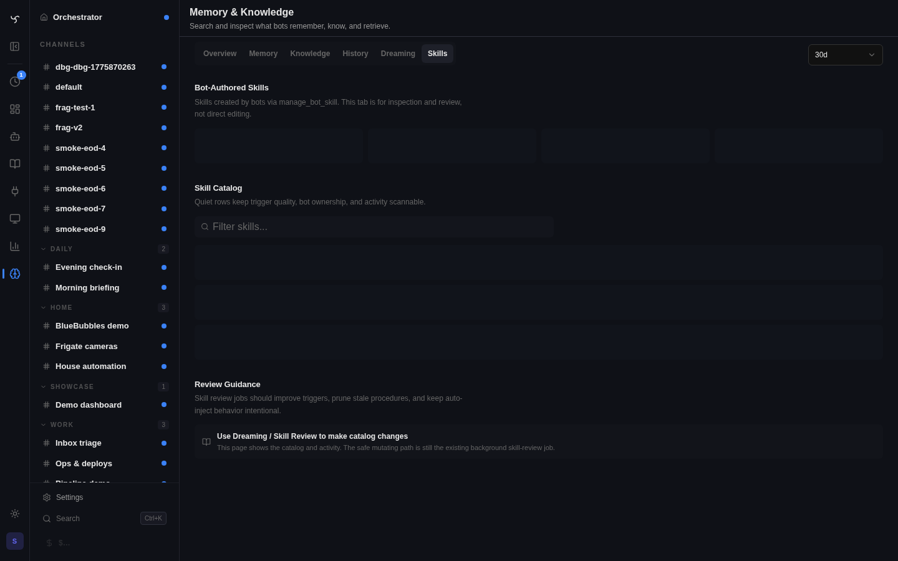
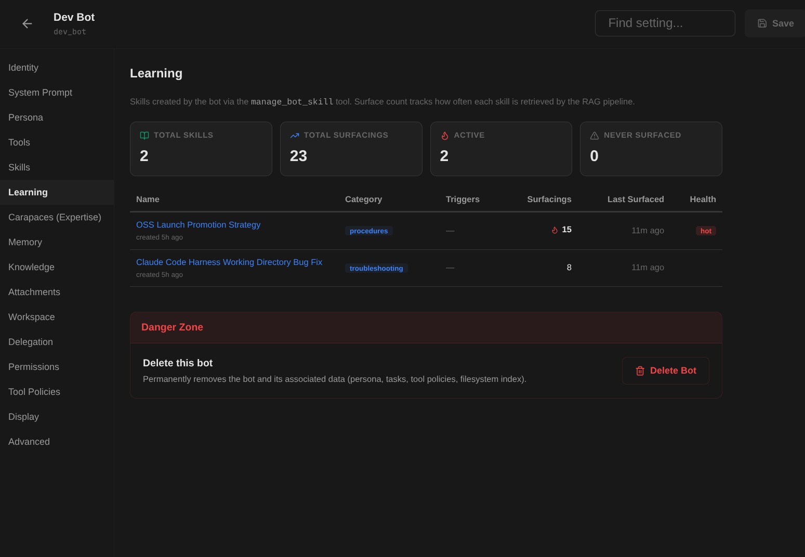

# Self-Improving Agents: Bot-Authored Skills

Bots on Spindrel can author their own skills — structured knowledge documents that enter the semantic RAG pipeline and are automatically surfaced in future sessions when relevant.

## What Are Bot-Authored Skills?

Bot-authored skills are markdown documents created by bots at runtime using the `manage_bot_skill` tool. Unlike memory files (which are bot-scoped and searched via `search_memory`), skills enter the main RAG pipeline:

- **Chunked and embedded** into vector storage for semantic retrieval
- **Surfaced automatically** when a user message is semantically similar to the skill content
- **Persisted across sessions** — available to the bot forever, not just the current conversation

### Skills vs Memory Files

| Feature | Memory files | Bot-authored skills |
|---------|-------------|-------------------|
| Storage | Filesystem (`memory/reference/`) | Database (`skills` table) |
| Retrieval | `search_memory()` keyword+vector search | Main RAG pipeline (automatic) |
| Injection | Must be explicitly fetched | Auto-injected when relevant (RAG mode) |
| Scope | Bot-scoped | Bot-scoped (via ID prefix) |
| Context cost | Only when fetched | Up to 5 chunks per request (RAG_TOP_K) |

**Use memory files** for: personal notes, user preferences, session-specific context, daily logs.

**Use skills** for: reusable solution patterns, domain procedures, troubleshooting guides — anything that should surface automatically when relevant.

## How It Works

### Creating Skills

Bots use the `manage_bot_skill` tool with `action="create"`:

```
manage_bot_skill(
  action="create",
  name="docker-networking-fixes",
  title="Docker Networking Troubleshooting",
  content="# Docker Networking Fixes\n\n## Bridge network DNS resolution...",
  triggers="docker, networking, DNS, container connectivity",
  category="troubleshooting"
)
```

The skill is stored with ID `bots/{bot_id}/docker-networking-fixes` and immediately embedded for RAG retrieval.

### Skill ID Convention

All bot-authored skills follow the pattern `bots/{bot_id}/{slug}`. This ensures:

- **Isolation**: Bots can only CRUD skills under their own prefix
- **No collisions**: Different bots can have skills with the same slug
- **Admin visibility**: Easy to filter and attribute skills by bot

### Available Actions

| Action | Description |
|--------|-------------|
| `create` | Create a new skill (requires name, title, content) |
| `update` | Replace skill content (full rewrite) |
| `patch` | Find-and-replace within content (cheaper than rewrite) |
| `get` | Retrieve a skill by name |
| `list` | List all self-authored skills |
| `delete` | Remove a skill and its embeddings |
| `merge` | Combine 2+ skills into one, deleting the sources |

### Frontmatter

Skills automatically get YAML frontmatter with `name`, `triggers`, and `category` fields. This metadata helps the RAG pipeline surface skills at the right time.

## Context Budget Impact

Bot-authored skills use RAG mode, which has hard per-request limits:

- **`RAG_TOP_K=5`**: Maximum 5 skill chunks injected per request
- **Priority P3**: RAG skills are trimmed before system prompt or history if context is tight
- **Chunk size**: Max 1500 chars each, so worst case ~7.5KB per request

A bot with 50+ skills generates ~100 chunks in the database. Vector search scans all chunks but only returns the 5 most relevant. No context bloat.

### Soft Limit Warning

When a bot exceeds 50 self-authored skills, the tool returns a warning suggesting the bot merge related skills or delete stale ones. This is advisory — there's no hard limit.

## Admin Visibility

### Skills Tab

The bot editor's **Skills** tab shows bot-authored skills in a dedicated section with surfacing stats and health indicators. Each skill displays its surface count, category, and whether it's actively being retrieved by the RAG pipeline.



### Learning Tab

The **Learning** tab provides a dedicated dashboard for monitoring skill health and performance:

- **Stats overview**: total skills, total surfacings, active vs never-surfaced counts
- **Skills table**: name, category, trigger phrases, surfacing count, last surfaced timestamp, health badge
- **Health badges**: "hot" (frequently surfaced), "active" (regularly surfaced), "cold" (rarely surfaced), "stale" (never surfaced or very old)



Use the Learning tab to identify skills that need attention:

- **Never surfaced** — trigger phrases may be too narrow or content doesn't match real queries. Rewrite triggers or check if the skill is still relevant.
- **Hot skills** — frequently surfaced and validated by usage. These are the bot's most valuable knowledge.
- **Stale skills** — haven't surfaced recently. May be outdated, superseded by newer skills, or poorly triggered.

### Filtering

The skills API supports filtering:

- `?source_type=tool` — only bot-authored skills
- `?bot_id=mybot` — only skills from a specific bot
- `?sort=recent` — order by most recently updated

## Duplicate Detection

When creating a new skill, the system checks for semantically similar existing skills. If a skill with >85% cosine similarity already exists, the bot receives a warning suggesting it update the existing skill instead:

```json
{
  "warning": "similar_skill_exists",
  "similar_skill_id": "bots/mybot/docker-networking",
  "similarity": 0.923,
  "message": "A similar skill already exists..."
}
```

To bypass the check, pass `force=true`. The check uses the same embedding model as RAG retrieval, so it catches both exact and semantic duplicates.

## Surfacing Stats

Each skill tracks how often it surfaces in bot context:

- **`surface_count`**: Total times the skill was injected (pinned, RAG, or on-demand index)
- **`last_surfaced_at`**: When it last appeared in a bot's context

Bots can see these stats via `manage_bot_skill(action="list")` to identify dead-weight skills that never surface and should be pruned or rewritten with better trigger phrases.

## How Bots Learn: Three Nudge Mechanisms

The system teaches bots when and how to create skills through three complementary nudge mechanisms. Each injects a one-shot system message at a strategic moment in the agent loop.

### 1. Correction-Driven Learning

**Trigger**: User message matches correction patterns (e.g., "No, that's wrong", "Actually, you should...", "Incorrect", "Not quite")

When a user corrects the bot, the system injects a prompt asking it to consider creating a skill that captures the correct approach. The prompt tells the bot: *"Capture what you did wrong and the correct approach so you never repeat this mistake. Keep it concrete — when X, do Y instead of Z."*

This is the highest-quality learning signal — the user has explicitly identified a gap in the bot's knowledge.

### 2. Repeated-Lookup Detection

**Trigger**: Bot searches for the same topic 3+ times across distinct agent runs within 14 days

The system monitors search tool calls (`search_memory`, `search_channel_workspace`, `search_channel_archive`) across agent runs. When a pattern is detected, it injects a nudge listing the repeated topics and suggesting the bot create skills for each. The prompt explains: *"These recurring lookups are a signal that the information should be a SKILL so it auto-surfaces without you having to search for it."*

This catches the highest-signal learning gap: information the bot needs regularly but hasn't codified. Once a skill is created, the RAG pipeline surfaces it automatically — eliminating the repeated manual searches.

Disable with `SKILL_REPEATED_LOOKUP_NUDGE_ENABLED=false`.

### 3. Mid-Conversation Reflection

**Trigger**: Bot reaches iteration 8 (configurable via `SKILL_NUDGE_AFTER_ITERATIONS`) during a single agent run

After extended tool use, the system injects a reflection checkpoint asking the bot to pause and consider: *"Did you discover a reusable pattern, fix, or procedure that should AUTO-SURFACE in future sessions?"*

This nudge shifts bots from "task execution mode" to "reflection mode" — without it, bots tend to solve problems and move on without recording what they learned.

### All nudges share these safeguards

- Fire only **once per agent run** (no repeated interruptions)
- Only for bots with `memory_scheme: "workspace-files"`
- Only when `manage_bot_skill` is in the tool set
- Never during compaction runs
- The bot decides whether to act — nudges are suggestions, not commands

## Content Validation

Skills enforce content limits to prevent empty stubs and abuse:

| Constraint | Value |
|------------|-------|
| Minimum content length | 50 characters |
| Maximum content length | 50,000 characters (~50KB) |
| Maximum name length | 100 characters |

Validation applies to create, update (when content is provided), and **patch** (the resulting content after replacement is validated).

## Skills vs Memory Files

The system prompt teaches bots the critical difference:

- **Memory files** (`memory/MEMORY.md`, `memory/reference/`, daily logs) = the bot's private notes. The bot must search for them or know they exist. Reference files are good for detailed personal context (system configs, user environment, project-specific notes).
- **Skills** (`manage_bot_skill`) = the bot's published playbook. Skills enter the RAG pipeline and **auto-surface** when a user's message is semantically similar — the bot doesn't need to remember they exist. Good for reusable patterns, procedures, troubleshooting guides, and domain knowledge.

**Rule of thumb**: If future-you should see this automatically when someone hits a similar problem, make it a skill. If future-you needs to actively look it up, put it in a reference file.

## Merging Skills

When bots accumulate many small related skills, they can merge them using `action="merge"`:

```
manage_bot_skill(
  action="merge",
  names=["docker-dns-fix", "docker-bridge-issues"],
  name="docker-networking",
  title="Docker Networking Troubleshooting",
  content="# Docker Networking\n\n## DNS Resolution...\n\n## Bridge Issues...",
  triggers="docker, networking, DNS, bridge, container",
  category="troubleshooting"
)
```

The merge action:
- Takes 2+ source skill names via `names`
- Creates a new combined skill from the provided `name`, `title`, and `content`
- Deletes all source skills and their embeddings
- Re-embeds the merged result
- The bot should write the merged content itself (the system doesn't auto-concatenate)

If the target `name` matches one of the source skills, it's treated as a rename-merge (allowed). Otherwise, the target must not already exist.

## Repeated-Lookup Detection

The system monitors search tool calls (`search_memory`, `search_channel_workspace`, `search_channel_archive`) across agent runs. When a bot repeatedly searches for the same topic (3+ distinct agent runs within 14 days), a one-shot nudge is injected at the start of the next run suggesting the bot create a skill for that topic.

This catches the highest-signal learning gap: information the bot needs but hasn't codified. Skills auto-surface via RAG, eliminating the need for repeated manual searches.

Disable with `SKILL_REPEATED_LOOKUP_NUDGE_ENABLED=false`.

## Scheduled Learning Reviews

### Skill Review Heartbeat

A built-in heartbeat prompt template (`prompts/skill-review.md`) runs periodic skill maintenance. Assign it to any bot with `manage_bot_skill` available and configure a recurring heartbeat (recommended: weekly).

On each review, the bot:

1. **Lists all self-authored skills** with surfacing stats (`surface_count`, `last_surfaced_at`)
2. **Identifies problems**:
    - Stale skills (low surface count, old `last_surfaced_at`) — may need better triggers or deletion
    - Overlapping skills covering the same topic — candidates for merging
    - Outdated content that no longer reflects current practices
3. **Takes action**:
    - Rewrites trigger phrases for skills that aren't surfacing (`action="patch"` or `action="update"`)
    - Merges related skills into consolidated guides (`action="merge"`)
    - Deletes dead-weight skills that add noise without value (`action="delete"`)
4. **Reports** a summary of what changed and why

### Setting Up Recurring Reviews

Configure a heartbeat on the bot's channel:

| Setting | Recommended Value |
|---------|-------------------|
| **Interval** | Weekly (`+7d`) |
| **Quiet hours** | 22:00 - 08:00 |
| **Dispatch mode** | Optional (bot decides whether to post) |
| **Prompt** | Use the `skill-review` template or customize |

The review runs autonomously — no human intervention needed. The bot evaluates its own skill library, prunes what isn't working, and strengthens what is. Over time, the skill library converges toward a focused, high-signal collection.

### Pre-Compaction Flush

The pre-compaction memory flush prompt also nudges bots to consider creating skills for reusable patterns discovered during the conversation. This is a last-chance opportunity before context is compacted — if the bot learned something valuable in the session, it can capture it as a skill before the conversation history is archived.

## Configuration

| Setting | Default | Description |
|---------|---------|-------------|
| `RAG_TOP_K` | 5 | Max chunks injected per request |
| `SKILL_NUDGE_AFTER_ITERATIONS` | 8 | Inject learning nudge after N tool iterations (0 = disabled) |
| `SKILL_CORRECTION_NUDGE_ENABLED` | true | Inject learning nudge when user corrects the bot |
| `SKILL_REPEATED_LOOKUP_NUDGE_ENABLED` | true | Inject nudge when bot repeatedly searches same topics |

## Prompt Guidance

When `memory_scheme: "workspace-files"` is active, the bot's system prompt includes guidance on when and how to create skills. The `manage_bot_skill` tool is automatically injected as a pinned tool.

### Mid-Conversation Learning Nudge

After `SKILL_NUDGE_AFTER_ITERATIONS` tool-call iterations (default 8), the agent loop injects a one-shot system message asking the bot to reflect on whether it learned something worth capturing as a skill. This is the key mechanism that shifts bots from "task execution mode" to "reflection mode" — without it, bots tend to solve problems and move on without recording what they learned.

The nudge only fires once per agent run, only for bots with `memory_scheme: "workspace-files"` that have the `manage_bot_skill` tool available, and not during compaction runs. Set to `0` to disable.

### Pre-Compaction Flush

The pre-compaction memory flush prompt also nudges bots to consider creating skills for reusable patterns discovered during the conversation. This is a last-chance opportunity before context is compacted.

## Embedding

Skills are embedded synchronously on create — the tool returns `"embedded": true/false` so the bot knows immediately if the skill entered the RAG pipeline. If embedding fails, the skill is still saved but won't appear in RAG results until re-embedded (e.g., on next server restart).

Updates and patches re-embed in the background (fire-and-forget) since the skill already has existing embeddings.

## Auto-Discovery Cache

Bot-authored skills are discovered via a DB query during context assembly. To avoid hitting the database on every message, results are cached per bot with a 30-second TTL. The cache is automatically invalidated when skills are created, updated, or deleted.
