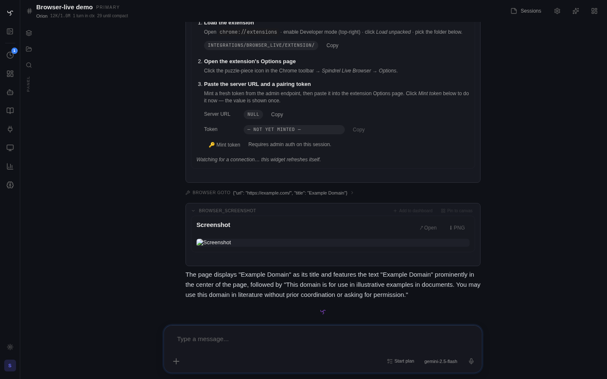

# Browser Live



The `browser_live` integration lets a bot drive **your real logged-in browser** through a paired Chrome extension. It is not a headless browser, a screenshot-only mirror, or a remote test harness. When a bot clicks a tab, evaluates JS, or takes a screenshot, it is acting on the same browser session you use day to day.

That makes it unusually powerful and unusually sensitive.

---

## What it exposes

Five tools ship today:

| Tool | What it does | Typical use |
|---|---|---|
| `browser_goto` | Navigate a tab to a URL | Open a site or move a flow forward |
| `browser_act` | Find elements and click/type/select | Drive normal UI interactions |
| `browser_eval` | Run JavaScript in the page | Read state, extract structured data, debug |
| `browser_screenshot` | Capture the visible tab | Show the current UI back in chat |
| `browser_status` | Inspect paired browser connections | Verify pairing, discover `connection_id`s |

The server sends an RPC frame over WebSocket to the paired extension, and the extension dispatches onto Chrome APIs such as `chrome.tabs`, `chrome.scripting`, and `chrome.tabs.captureVisibleTab`.

---

## Architecture

```
bot tool call
   │
   ▼
server bridge.request(op, args)
   │
   ├── in-memory connection registry
   ▼
paired MV3 extension (WebSocket)
   │
   ▼
chrome.tabs / chrome.scripting / chrome.tabs.captureVisibleTab
```

Important constraints:

- **Pairing token**: one global integration setting, `BROWSER_LIVE_PAIRING_TOKEN`
- **Multi-browser support**: multiple extensions can pair at once
- **Default routing**: the most recently connected browser wins unless you pass `connection_id`
- **Single-process bridge**: connection state is in-memory; multi-worker deployments need an external broker before this becomes production-grade

---

## Setup

### 1. Generate or rotate the pairing token

Use an admin-authenticated request:

```bash
curl -X POST \
  -H "Authorization: Bearer $ADMIN_KEY" \
  http://localhost:8000/integrations/browser_live/admin/token/rotate
```

This returns the plaintext token once. Rotating the token disconnects currently paired browsers; they must pair again.

### 2. Load the extension

In Chrome:

1. Open `chrome://extensions`
2. Enable **Developer mode**
3. Click **Load unpacked**
4. Select `integrations/browser_live/extension/`

### 3. Pair the browser

Open the extension options page, then enter:

- the Spindrel server URL
- the pairing token

Save. The service worker connects back to the server over WebSocket.

### 4. Verify

- Server logs should show a `browser_live: connected ...` message
- `GET /integrations/browser_live/admin/status` should show the active connection(s)
- `browser_status` should list them from inside chat

---

## Using it from a bot

Once a bot can see the `browser_live` tools through its tool policy/capability set, you can prompt naturally:

- "Open the billing dashboard and tell me which invoices failed this week."
- "Go to the release page, click the latest artifact, and screenshot the result."
- "Inspect this page and extract the table rows as JSON."

If more than one browser is paired, pass or prompt for a specific `connection_id` so the bot targets the right machine.

---

## Safety model

This integration is intentionally high-trust.

- The extension can act against **any tab you can act against**
- Returned data from `browser_eval` is **not secret-scrubbed**
- Screenshots and extracted data can end up in chat history, traces, memory, and downstream widgets

Tool tiers are the first line of control:

| Tier | Tools |
|---|---|
| `readonly` | `browser_screenshot`, `browser_status` |
| `mutating` | `browser_goto`, `browser_act` |
| `exec_capable` | `browser_eval` |

Treat the pairing token like a password, and expose these tools only to bots you trust.

---

## When to use it vs normal web tools

| Use case | Best fit |
|---|---|
| Public web search or page fetch | `web_search` / `fetch_url` |
| Logged-in website behind your real session | `browser_live` |
| Simple scraping with no interaction | `fetch_url` or a dedicated integration |
| Click-path automation in a real UI | `browser_live` |
| High-trust one-off admin flow | `browser_live`, carefully scoped |

---

## Limits and gotchas

- **Chrome only today**: MV3 extension, no Firefox port yet
- **Most-recently-connected default**: easy to hit the wrong machine if you pair multiple browsers and do not specify `connection_id`
- **Visible-tab screenshots**: `browser_screenshot` captures what Chrome sees, not a hidden offscreen render
- **Single-process assumption**: multi-worker server setups need extra bridge plumbing

---

## Operator notes

- Admin status endpoint: `GET /integrations/browser_live/admin/status`
- Token rotation endpoint: `POST /integrations/browser_live/admin/token/rotate`
- Canonical operator README: `integrations/browser_live/README.md`

## See also

- [Developer API](api.md) — auth model and endpoint discovery
- [Custom Tools & Extensions](custom-tools.md) — broader tool/integration authoring model
