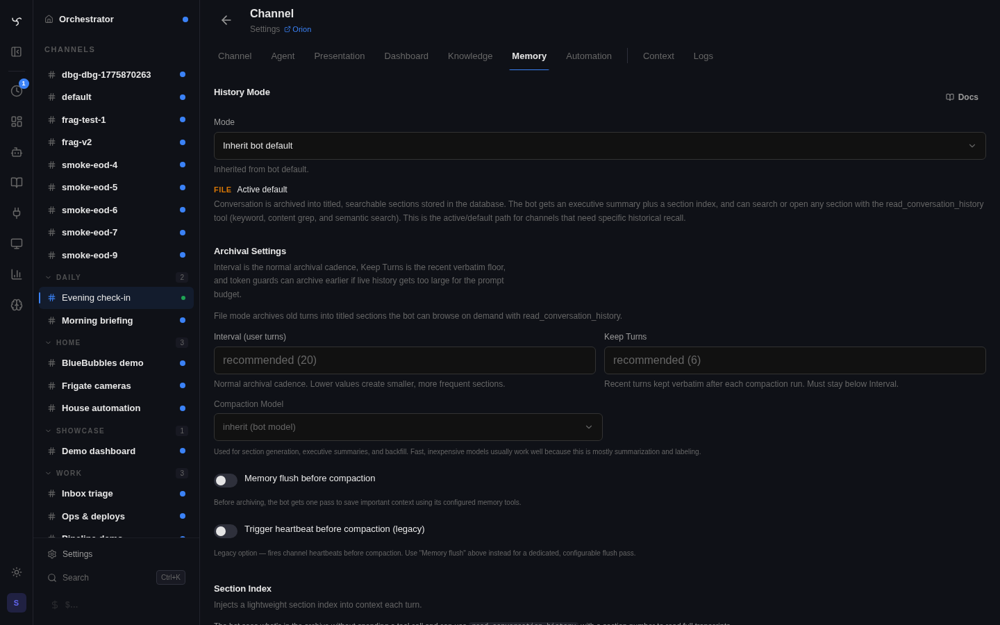
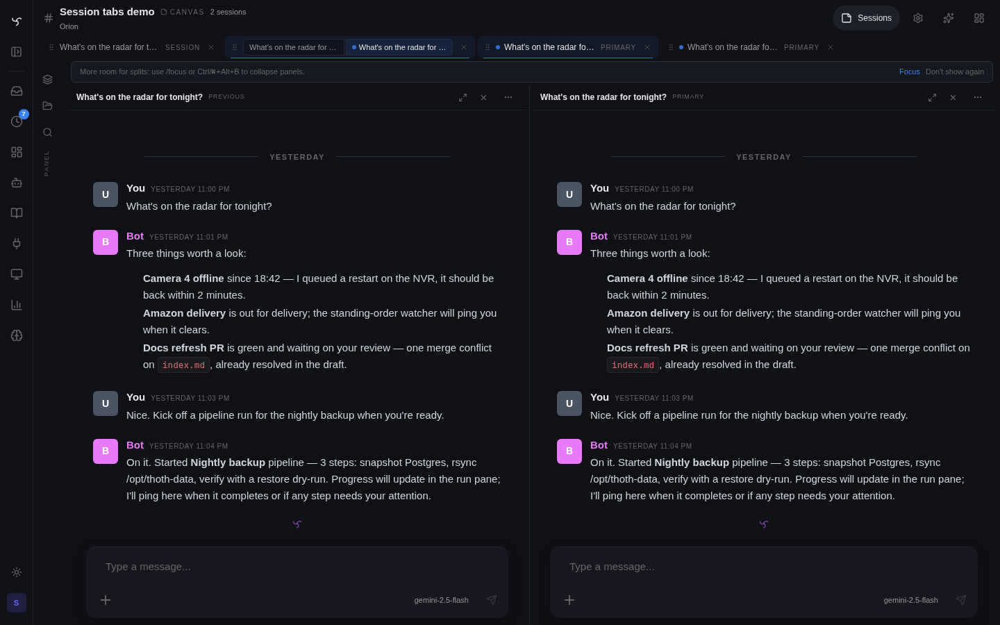
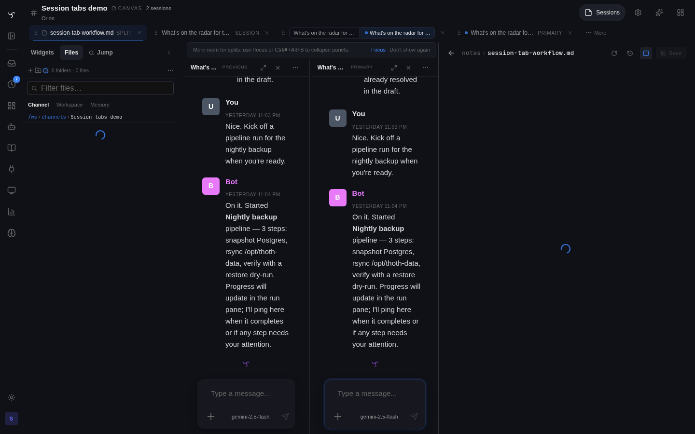
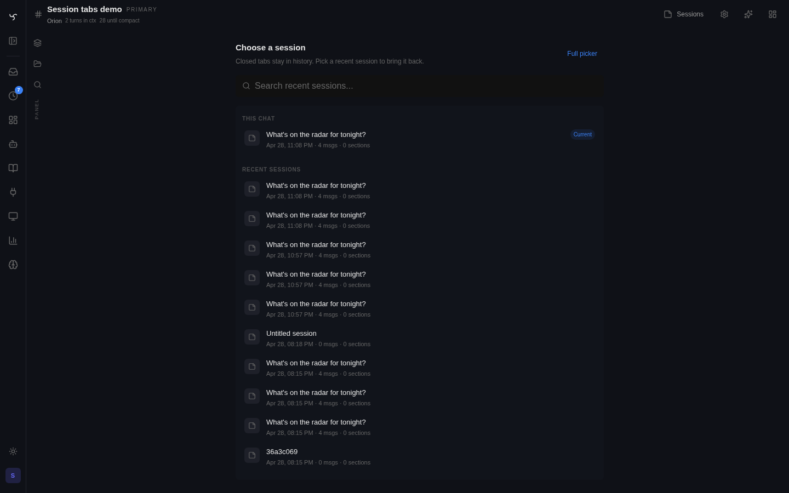

# Chat History

This page covers archival/history-mode behavior.

For the canonical document covering replay policy, compaction, live-history budgeting, plan/task/heartbeat interplay, and tuning guidance, see [Context Management](context-management.md).

Spindrel archives conversations into searchable sections that persist across fresh starts. The bot always has access to what you've discussed — it can browse an index, search by keyword, or retrieve full transcripts on demand.

## How It Works

1. **You chat** — messages accumulate in the active conversation.
2. **Compaction triggers** — after a configurable number of user messages (default 30), the server archives older turns into a titled, summarized section.
3. **Section index is injected** — every turn, the bot sees a compact index of recent sections so it knows what history is available.
4. **Bot navigates on demand** — the `read_conversation_history` tool lets the bot read full transcripts, search across all sections, or retrieve tool outputs that were summarized during compaction.
5. **Memory flush (optional)** — before archiving, the bot can update `MEMORY.md` and reference files with anything worth persisting long-term.

Starting fresh with `/clear` creates a new conversation, but the section index carries over — the bot retains continuity across fresh starts.


*Channel history settings — `file` is the active/default path; `structured` and `summary` remain supported as legacy options.*

## Channel Session Tabs

On desktop, recent channel sessions appear as low-chrome tabs under the channel
header. Newly opened sessions appear at the front of the strip, selecting an
already-open tab keeps its order stable, and drag still reorders visible tabs.
The strip stays single-line; extra tabs move into the right-side overflow menu
instead of creating a horizontal scrollbar. Closing a tab only hides it from the
recent-tab strip. It does not delete the session or remove it from history.



Split layouts are saved as conjoined tabs so a two-pane working set can be
restored without using the full session picker. Right-clicking a tab exposes the
same split actions used elsewhere in the channel UI.

Files opened from the channel workspace use the same tab strip. Opening a file
selects or adds its tab at the front; splitting the file next to chat is an
explicit tab action. Channel file links in chat open the same file tabs, and
Alt-click opens the file split beside chat.



When every recent tab is closed, the channel shows the inline session chooser
instead of an empty strip.



## History Modes

Configure via `history_mode` in bot YAML or per-channel in settings.

### File (recommended)

```yaml
history_mode: file
```

Conversation is archived into titled, searchable sections stored in the database. The bot gets a section index each turn plus the `read_conversation_history` tool for browsing, searching, and reading full transcripts.

Best for knowledge-heavy channels where the bot needs to reference specific past discussions.

### Structured

Legacy but still supported.

```yaml
history_mode: structured
```

Sections are embedded and the most relevant ones (top 3 by cosine similarity) are automatically surfaced based on the current query. The bot also gets an executive summary.

Best for channels where past context should surface without the bot having to look for it.

### Summary

Legacy but still supported.

```yaml
history_mode: summary
```

A flat rolling summary. Each compaction replaces the previous summary with a new one. The bot sees only a single summary block plus recent messages.

Best for straightforward conversations where historical detail isn't important.

## Rehydration on Reconnect

Chat state survives reconnects, page reloads, and mobile tab wakes. On channel mount, the UI calls `GET /api/v1/channels/{id}/state` — a snapshot of `{active_turns, pending_approvals}`:

- **Active turns** — any turn that started within the last 10 minutes and hasn't emitted a terminal `Message`. Rehydrated into the chat store so a refresh picks up a streaming assistant response mid-stream.
- **Pending approvals** — channel-scoped rows from `tool_approvals` still `awaiting_approval`. Rendered as inline approval cards in chat (and also in the channel-scoped Approvals view). Orphan rows (a `ToolCall` with no matching approval) are filtered out so the UI never surfaces undecidable cards.

Live SSE events always win over snapshot values, so rehydration is idempotent — a live turn that's already in the store isn't overwritten.

See the [Developer API](api.md) reference for the endpoint shape.

---

## Starting Fresh

The `/clear` command in chat starts a fresh conversation. The old conversation is preserved — its sections remain in the index and are searchable. The bot picks up where it left off because the section index is scoped to the channel, not the individual conversation.

## Archival Settings

These control when and how compaction happens.

| Setting | Default | Description |
|---------|---------|-------------|
| `context_compaction` | `true` | Enable/disable automatic archival |
| `compaction_interval` | `30` | User messages between compactions |
| `compaction_keep_turns` | `10` | Recent turns kept verbatim (never archived) |
| `compaction_model` | `_(DEFAULT_MODEL)_` | Model used for summarization |
| `memory_flush_enabled` | `false` | Run a memory-update pass before archiving |
| `memory_flush_model` | _(bot's model)_ | Model for the memory flush pass |

**How "keep turns" works:** With `compaction_interval: 30` and `compaction_keep_turns: 10`, after 30 user messages the oldest 20 are archived into a section. The 10 most recent remain in context verbatim.

**Early compaction:** Spindrel can also compact early when replayable live history grows too large. See [Context Management](context-management.md) for the current trigger policy and why turns alone are not a sufficient safety rail.

All settings resolve in priority order: **channel override → bot YAML → environment variable**.

## Section Index

In file mode, a section index is injected into context every turn. It shows the N most recent sections so the bot knows what history is available.

| Setting | Default | Description |
|---------|---------|-------------|
| `section_index_count` | `10` | Number of sections shown |
| `section_index_verbosity` | `standard` | Detail level: `compact`, `standard`, or `detailed` |

**Verbosity levels:**

- **Compact** — title, date, and tags only
- **Standard** — title, date, tags, and a one-line summary
- **Detailed** — title, message count, full date range, tags, and summary

If there are more sections than the configured count, the index includes a note telling the bot to use `search:<query>` for older sections.

## The `read_conversation_history` Tool

Available automatically in file mode. The bot uses it to navigate archived history.

**Four modes:**

| Mode | Parameter | Returns |
|------|-----------|---------|
| Index | `"index"` | Full table of contents — all sections with titles, dates, message counts, tags, and summaries |
| Read | `"3"` | Full transcript of section #3 |
| Search | `"search:deployment"` | Smart multi-strategy search: keyword match → transcript grep → semantic similarity. Returns up to 10 deduplicated results with content excerpts |
| Tool output | `"tool:uuid"` | Full output of a tool call that was summarized during compaction |

**Cross-channel access:** The bot can read history from other channels it owns by passing an optional `channel_id` parameter.

## Section Details

Each archived section includes:

- **Title** — LLM-generated, describing the main topic
- **Summary** — depth-aware (3 sentences for early sections, 1–2 for later ones)
- **Tags** — topic keywords for search
- **Transcript** — full conversation text
- **Embeddings** — for semantic search
- **Timestamps** — `period_start` and `period_end` for date-range queries
- **Message count** — number of messages in the section

Sections are generated with a three-tier fallback: normal LLM → aggressive (lower temperature, shorter output) → deterministic (no LLM, mechanical title from first message). This ensures archival never fails.

## Backfill

If you enable file-mode history on a channel with existing conversations, you can backfill sections from the History tab in channel settings.

Two modes:

- **Resume** — only processes messages not yet covered by sections
- **Re-chunk** — deletes all existing sections and starts fresh
- **Re-section last N** — deletes and rebuilds only the newest N sections, keeping older section numbers and transcripts intact

Each chunk costs approximately one LLM call. Large channels may take a few minutes and accrue provider costs.

## Section Retention

By default, sections are kept forever. For channels that accumulate many sections, configure retention:

| Setting | Default | Description |
|---------|---------|-------------|
| `SECTION_RETENTION_MODE` | `forever` | `forever`, `count`, or `days` |
| `SECTION_RETENTION_VALUE` | `100` | Sections to keep (count mode) or max age in days |

## Configuration Reference

### Bot YAML

```yaml
history_mode: file              # file | structured | summary
context_compaction: true        # enable automatic archival
compaction_interval: 20         # user turns between compactions
compaction_keep_turns: 6        # recent turns kept verbatim
compaction_model: _(DEFAULT_MODEL)_
```

### Environment Variables

| Variable | Default | Description |
|----------|---------|-------------|
| `DEFAULT_HISTORY_MODE` | `file` | Global default history mode |
| `COMPACTION_INTERVAL` | `30` | Default compaction interval |
| `COMPACTION_KEEP_TURNS` | `10` | Default keep turns |
| `COMPACTION_MODEL` | `_(DEFAULT_MODEL)_` | Default compaction model |
| `SECTION_INDEX_COUNT` | `10` | Sections in the injected index |
| `SECTION_INDEX_VERBOSITY` | `standard` | Index detail level |
| `HISTORY_WRITE_FILES` | `false` | Also write transcripts to `.history/` on disk |
| `SECTION_RETENTION_MODE` | `forever` | Retention policy |
| `SECTION_RETENTION_VALUE` | `100` | Retention threshold |
| `MEMORY_FLUSH_ENABLED` | `false` | Memory flush before compaction |
| `MEMORY_FLUSH_MODEL` | _(empty)_ | Model for flush (empty = bot's model) |

### Channel Overrides

All settings above can be overridden per-channel in the History tab of channel settings. Channel values take priority over bot YAML, which takes priority over environment variables.
