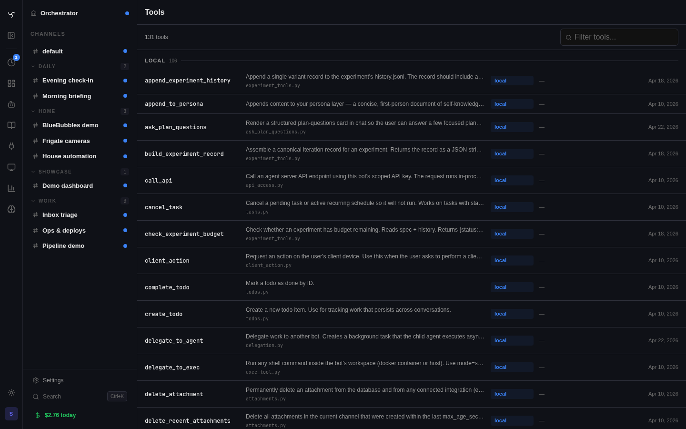

# Custom Tools & Extensions



This guide covers creating your own tools and managing a personal extensions repo of tools and skills.

There are three escalation tiers, and you should pick the lowest one that does what you need:

| Tier | Where the file lives | When to use |
|---|---|---|
| **Drop-in tool** | `tools/` at the repo root (or any directory in `TOOL_DIRS`) | One file, no settings UI, no skills bundled. The shortest path. |
| **Personal extensions repo** | `INTEGRATION_DIRS=/path/to/repo`, with each subdir an integration that ships `tools/`, `skills/`, and an `integration.yaml` | You want admin-UI settings, you're packaging multiple tools + skills together, or you want to share the bundle. |
| **Full integration** | Same layout as a personal extension, plus `router.py` / dispatcher / process / hooks | Webhooks, background processes, custom UI surfaces. See [Creating Integrations](../integrations/index.md). |

> **Note on `setup.py`:** the legacy `setup.py` / `SETUP` dict format is no longer loaded. New extensions and integrations declare everything in `integration.yaml`.

---

## Quick Start: Drop-In Tools

The simplest way to add a tool: create a `.py` file in the `tools/` directory.

```python
# tools/weather.py
"""Current weather via OpenWeatherMap. Requires OPENWEATHERMAP_API_KEY."""

import json
import logging
import os

import httpx

from app.tools.registry import register

logger = logging.getLogger(__name__)

_API_KEY = os.getenv("OPENWEATHERMAP_API_KEY", "")
_BASE_URL = "https://api.openweathermap.org/data/2.5"


@register({
    "type": "function",
    "function": {
        "name": "get_weather",
        "description": (
            "Get current weather conditions for a city. Returns temperature, "
            "conditions, humidity, wind speed, and feels-like temperature."
        ),
        "parameters": {
            "type": "object",
            "properties": {
                "city": {
                    "type": "string",
                    "description": "City name, optionally with country code (e.g. 'London' or 'Paris,FR')",
                },
                "units": {
                    "type": "string",
                    "description": "Temperature units",
                    "enum": ["imperial", "metric", "standard"],
                },
            },
            "required": ["city"],
        },
    },
})
async def get_weather(city: str, units: str = "imperial") -> str:
    if not _API_KEY:
        return json.dumps({"error": "OPENWEATHERMAP_API_KEY is not configured"})

    unit_label = {"imperial": "°F", "metric": "°C", "standard": "K"}.get(units, "°F")
    speed_label = "mph" if units == "imperial" else "m/s"

    try:
        async with httpx.AsyncClient() as client:
            resp = await client.get(
                f"{_BASE_URL}/weather",
                params={"q": city, "appid": _API_KEY, "units": units},
                timeout=10.0,
            )
            resp.raise_for_status()
            data = resp.json()
    except httpx.HTTPStatusError as e:
        if e.response.status_code == 404:
            return json.dumps({"error": f"City not found: {city}"})
        return json.dumps({"error": f"Weather API error: {e.response.status_code}"})
    except Exception:
        logger.exception("Weather fetch failed for %s", city)
        return json.dumps({"error": "Failed to fetch weather"})

    weather = data.get("weather", [{}])[0]
    main = data.get("main", {})
    wind = data.get("wind", {})

    return json.dumps({
        "city": data.get("name", city),
        "country": data.get("sys", {}).get("country"),
        "conditions": weather.get("description", "unknown"),
        "temperature": f"{main.get('temp')}{unit_label}",
        "feels_like": f"{main.get('feels_like')}{unit_label}",
        "humidity": f"{main.get('humidity')}%",
        "wind_speed": f"{wind.get('speed')} {speed_label}",
    })
```

This quick-start approach uses `os.getenv()` — simple and works if you set values in `.env`. For UI-configurable settings, see the [Personal Extensions Repo](#personal-extensions-repo) section below — that path uses an `integration.yaml` `settings:` block plus the `get_settings()` helper.

Restart the server and the tool is available to any bot.

### How It Works

At startup, Spindrel imports every `.py` file in `tools/` (except underscore-prefixed files). Any function decorated with `@register(schema)` is registered as a local tool. The schema follows the [OpenAI function calling format](https://platform.openai.com/docs/guides/function-calling).

### Key Rules

- **Return JSON strings** — tools must return `str` (JSON-serialized)
- **Async preferred** — use `async def` for I/O-bound tools (HTTP calls, file reads)
- **Sync works too** — `def my_tool()` is fine for CPU-bound or trivial tools
- **Graceful degradation** — check for missing API keys/config and return a clear error message
- **Underscore prefix = skip** — `_helpers.py` won't be imported as a tool

### Tool Discovery (RAG)

Tools aren't all sent to the LLM on every request. Spindrel uses **tool retrieval** — the user's message is embedded and compared against tool schemas via cosine similarity. Only relevant tools are included in the LLM call.

To ensure a tool is always available to a specific bot (bypassing retrieval), add it to `pinned_tools` in the bot's YAML:

```yaml
# bots/assistant.yaml
pinned_tools: [get_weather]
```

Or list it in `local_tools` to make it available (but still subject to retrieval):

```yaml
local_tools: [get_weather]
```

---

## Extra Tool Directories (`TOOL_DIRS`)

If you keep tools outside the `tools/` directory (e.g., in a separate repo), point `TOOL_DIRS` to those directories:

```bash
# .env
TOOL_DIRS=/home/you/my-tools:/home/you/work-tools
```

Colon-separated, absolute or relative paths. Tilde (`~`) is expanded to your home directory. Each directory is scanned the same way as `tools/` — every `.py` file (except underscore-prefixed) is imported.

> **Tip:** If your tools live inside an `INTEGRATION_DIRS` subdirectory, you don't need `TOOL_DIRS` — tools in integration directories are auto-discovered.

---

## Personal Extensions Repo

The recommended way to manage your own tools and skills is to create a separate repo and point `INTEGRATION_DIRS` at it. Everything below is a complete, copy-paste-ready example.

### 1. Create the directory structure

```
my-spindrel-extensions/
├── .gitignore
└── my-tools/                    ← this becomes an integration named "my-tools"
    ├── integration.yaml         ← declares id, settings, deps (shows up in Admin > Integrations)
    ├── tools/
    │   └── weather.py           ← auto-discovered tool
    └── skills/
        ├── cooking-tips.md      ← standalone skill
        └── smart-home.md        ← integration-shipped domain skill
```

`INTEGRATION_DIRS` points to the **parent** directory (`my-spindrel-extensions/`). Each subdirectory inside it becomes a discoverable integration. The integration's `id` comes from the directory name unless overridden in `integration.yaml`.

### 2. Create every file

**`.gitignore`**

```gitignore
__pycache__/
*.pyc
.env
```

**`my-tools/tools/weather.py`** — A complete, working tool. Uses `os.getenv()` to read the API key.

```python
"""Current weather via OpenWeatherMap."""

import json
import logging

import httpx

from app.tools.registry import register, get_settings

logger = logging.getLogger(__name__)

setting = get_settings()  # auto-detects integration, reads DB then .env
_BASE_URL = "https://api.openweathermap.org/data/2.5"


@register({
    "type": "function",
    "function": {
        "name": "get_weather",
        "description": (
            "Get current weather conditions for a city. Returns temperature, "
            "conditions, humidity, wind speed, and feels-like temperature. "
            "Use for questions about current weather, temperature, or conditions outside."
        ),
        "parameters": {
            "type": "object",
            "properties": {
                "city": {
                    "type": "string",
                    "description": "City name, optionally with country code (e.g. 'London' or 'Paris,FR')",
                },
                "units": {
                    "type": "string",
                    "description": "Temperature units: 'imperial' (F), 'metric' (C), or 'standard' (K)",
                    "enum": ["imperial", "metric", "standard"],
                },
            },
            "required": ["city"],
        },
    },
})
async def get_weather(city: str, units: str = "imperial") -> str:
    api_key = setting("OPENWEATHERMAP_API_KEY")
    if not api_key:
        return json.dumps({"error": "OPENWEATHERMAP_API_KEY is not configured. Add it to .env or set it in Admin > Integrations."})

    unit_label = {"imperial": "°F", "metric": "°C", "standard": "K"}.get(units, "°F")
    speed_label = "mph" if units == "imperial" else "m/s"

    try:
        async with httpx.AsyncClient() as client:
            resp = await client.get(
                f"{_BASE_URL}/weather",
                params={"q": city, "appid": api_key, "units": units},
                timeout=10.0,
            )
            resp.raise_for_status()
            data = resp.json()
    except httpx.HTTPStatusError as e:
        if e.response.status_code == 404:
            return json.dumps({"error": f"City not found: {city}"})
        return json.dumps({"error": f"Weather API error: {e.response.status_code}"})
    except Exception:
        logger.exception("Weather fetch failed for %s", city)
        return json.dumps({"error": "Failed to fetch weather"})

    weather = data.get("weather", [{}])[0]
    main = data.get("main", {})
    wind = data.get("wind", {})

    return json.dumps({
        "city": data.get("name", city),
        "country": data.get("sys", {}).get("country"),
        "conditions": weather.get("description", "unknown"),
        "temperature": f"{main.get('temp')}{unit_label}",
        "feels_like": f"{main.get('feels_like')}{unit_label}",
        "humidity": f"{main.get('humidity')}%",
        "wind_speed": f"{wind.get('speed')} {speed_label}",
    })
```

**`my-tools/skills/smart-home.md`** — A domain skill that gives any bot smart-home knowledge.

```markdown
---
name: Smart Home
description: Smart-home device control patterns, routines, and troubleshooting.
---

# Smart Home Automation

## Common Tasks

### Lights
- Turn lights on/off by room name
- Set brightness (0-100%) and color temperature
- Create scenes: "Movie Night", "Morning Routine"

### Climate
- Check current temperature by zone
- Set thermostat target temperature
- Switch between heat/cool/auto modes

### Automations
- Motion-triggered lights with timeout
- Temperature-based HVAC schedules
- Sunrise/sunset triggers for blinds

## Troubleshooting
- Device unavailable: check WiFi, power cycle, re-pair in Zigbee/Z-Wave
- Automation not firing: check conditions, time ranges, entity IDs
```

!!! tip "Shipped Home Assistant integration"
    Spindrel already ships a Home Assistant integration with tools, widgets, and a skill pack. Enable it on the channel and confirm the relevant tools or MCP servers are available before building your own version.

**`my-tools/skills/cooking-tips.md`** — A standalone skill.

```markdown
# Cooking Tips

Quick reference for common cooking questions.

## Temperature Guide
- Chicken breast: 165°F / 74°C internal
- Steak medium-rare: 130°F / 54°C internal
- Bread: 190-210°F / 88-99°C internal

## Conversions
- 1 cup = 240ml = 16 tbsp
- 1 tbsp = 15ml = 3 tsp
- 1 oz = 28g
```

### 3. Point Spindrel at it

Add one line to your `.env`:

```bash
INTEGRATION_DIRS=/home/you/my-spindrel-extensions
```

Restart the server. Your extension appears in **Admin > Integrations** as an **EXTERNAL** integration with tools and skills.

### 4. Configure API keys

Two options — use whichever you prefer.

**Option A: Spindrel's `.env` file (simplest)**

Add the key to Spindrel's main `.env` and restart:

```bash
# .env (in Spindrel's root directory)
OPENWEATHERMAP_API_KEY=your-key-here
```

Tools using `os.getenv()` pick it up automatically. No `integration.yaml` needed. This is the simplest approach if you're the only user.

**Option B: Admin UI (no file editing)**

Add an `integration.yaml` to your extension to declare what settings it needs:

```yaml
# my-tools/integration.yaml
id: my-tools
name: My Tools
icon: Wrench
version: "1.0"

settings:
  - key: OPENWEATHERMAP_API_KEY
    type: string
    label: "API key from openweathermap.org (free tier works)"
    required: false
    secret: true

provides:
  - tools
  - skills
```

Your extension gets a settings panel in **Admin > Integrations** where you can set API keys from the UI. Secrets are encrypted at rest.

To read UI-configured values from your tool, use `get_settings()` from the registry:

```python
from app.tools.registry import register, get_settings

setting = get_settings()  # auto-detects your integration — no ID needed

@register({...})
async def my_tool() -> str:
    api_key = setting("OPENWEATHERMAP_API_KEY")
    ...
```

`get_settings()` is called at module level and automatically knows which integration the tool belongs to. It checks DB (admin UI values) first, then falls back to `os.environ` (`.env` values). Both configuration methods work simultaneously — DB takes priority.

**Which should I use?** If you're the only user and comfortable editing `.env`, Option A is fine. If you want a settings UI, want secrets encrypted, or are sharing the extension with others, add the `integration.yaml` (Option B).

### 5. Use it

Pin the weather tool if you want it always available:

```yaml
pinned_tools: [get_weather]
```

Or just ask your bot "what's the weather in Chicago?" — tool RAG will find it automatically.

### Docker Deployment

Mount your extensions directory into the container:

```yaml
# docker-compose.override.yml
services:
  agent-server:
    volumes:
      - /home/you/my-spindrel-extensions:/app/ext:ro
    environment:
      - INTEGRATION_DIRS=/app/ext
```

### Multiple Extension Directories

Colon-separate paths to load from multiple locations:

```bash
INTEGRATION_DIRS=/home/you/personal-extensions:/home/you/work-extensions
```

### `integration.yaml` Reference

The YAML manifest controls what appears in the Admin UI for your extension.

**`settings:` entries** (one per UI-configurable env var):

| Field | Type | Description |
|-------|------|-------------|
| `key` | string | Environment variable name |
| `type` | string | `string`, `number`, `bool`, or `multiselect`. Default `string`. |
| `label` | string | Help text shown in the settings UI |
| `required` | bool | Whether the integration shows as "Not Configured" without it |
| `secret` | bool | If `true`, value is masked in the UI and encrypted at rest |
| `default` | any | Default value if neither DB nor env override |

**Other optional top-level fields:** `icon`, `description`, `webhook`, `binding`, `events`, `capabilities`, `provides`, `dependencies`, `tool_widgets`, `activation`, `process`. See [Creating Integrations](../integrations/index.md) for the full manifest reference.

> **Tip:** Check **Admin > Integrations** to see your extension and **Admin > Skills** to see discovered skills and folder groupings.

---

## Full Integration (Advanced)

If your extension needs more than tools, skills, and settings — webhooks, background processes, dispatchers, or custom UI pages — create a full integration. See the [Creating Integrations](../integrations/index.md) guide.

The short version: add any of these optional files to your extension directory:

| File | What it adds |
|------|-------------|
| `integration.yaml` | Manifest: id, settings, deps, capabilities, binding, events, activation |
| `router.py` | HTTP endpoints (webhooks, config API) |
| `renderer.py` | Result delivery to external services (transports / dispatchers) |
| `hooks.py` | Lifecycle event handlers |
| `process.py` | Background process (auto-started, declared in `integration.yaml: process:`) |

---

## Tool Registration Reference

### Schema Format

The `@register` decorator takes an OpenAI function calling schema:

```python
@register({
    "type": "function",
    "function": {
        "name": "tool_name",           # unique name, snake_case
        "description": "What this tool does. Be specific — this is used for tool retrieval.",
        "parameters": {
            "type": "object",
            "properties": {
                "param1": {
                    "type": "string",
                    "description": "What this parameter is for",
                },
                "param2": {
                    "type": "integer",
                    "description": "Optional numeric param",
                },
            },
            "required": ["param1"],    # which params are required
        },
    },
})
async def tool_name(param1: str, param2: int = 10) -> str:
    return json.dumps({"result": "ok"})
```

### Import for External Tools

If your tool lives outside the agent-server repo (in `TOOL_DIRS` or `INTEGRATION_DIRS`), you can still import from `app.tools.registry`:

```python
from app.tools.registry import register
```

This works because the server adds the project root to `sys.path` before importing tools. If you want your tools to be testable independently (without the server running), use the integration shim pattern:

```python
# Minimal drop-in for standalone development
try:
    from app.tools.registry import register
except ImportError:
    def register(schema, *, source_dir=None):
        def decorator(func):
            func._tool_schema = schema
            return func
        return decorator
```

### Common Patterns

**HTTP API wrapper:**

```python
@register({...})
async def my_api_tool(query: str) -> str:
    async with httpx.AsyncClient() as client:
        resp = await client.get("https://api.example.com/search", params={"q": query})
        resp.raise_for_status()
        return json.dumps(resp.json())
```

**File operation:**

```python
@register({...})
async def read_csv_stats(file_path: str) -> str:
    import csv
    from pathlib import Path
    p = Path(file_path)
    if not p.exists():
        return json.dumps({"error": f"File not found: {file_path}"})
    with open(p) as f:
        reader = csv.DictReader(f)
        rows = list(reader)
    return json.dumps({"row_count": len(rows), "columns": reader.fieldnames})
```

**Tool with env var dependency:**

```python
_TOKEN = os.getenv("MY_SERVICE_TOKEN", "")

@register({...})
async def my_service_action(action: str) -> str:
    if not _TOKEN:
        return json.dumps({"error": "MY_SERVICE_TOKEN is not configured. Set it in .env."})
    # ... use _TOKEN ...
```
