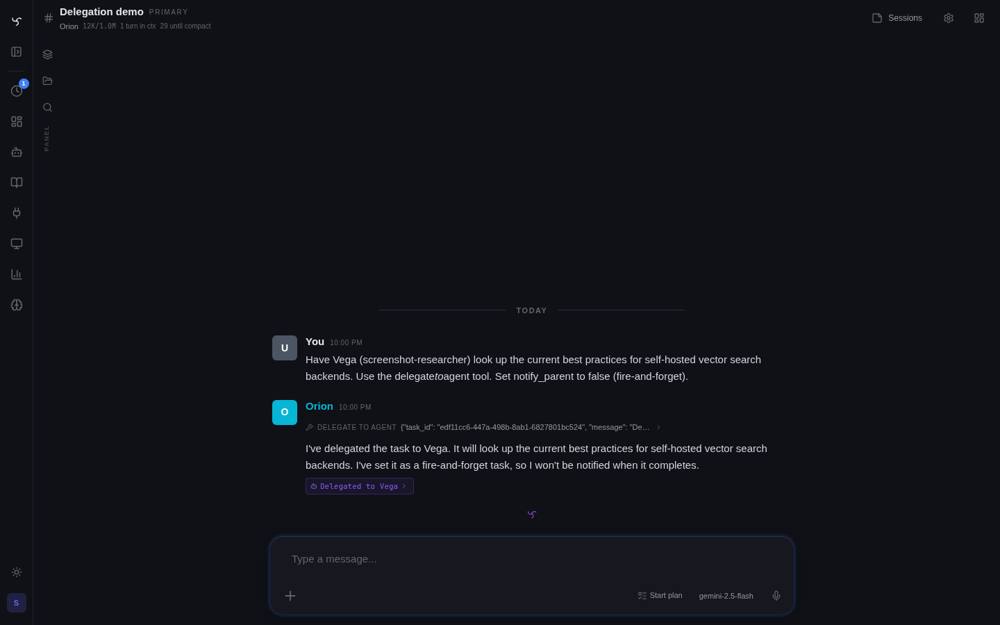

# Bot-to-Bot Delegation



Delegation lets one bot (the **orchestrator**) hand off a task to another bot (the **delegate**) and optionally get the result back synchronously. Delegates can themselves delegate further, forming a chain up to a configurable depth limit.

## Quick Start

**1. Configure the orchestrator bot** (admin UI or YAML):

```yaml
# bots/orchestrator.yaml
id: orchestrator
local_tools:
  - delegate_to_agent
delegate_bots:
  - researcher_bot
  - code_bot
```

> Having a non-empty `delegate_bots` list enables delegation for that bot.

**2. Ask it to delegate:**

```
user: Can you ask the researcher bot to summarize today's top AI news?
bot:  [calls delegate_to_agent(bot_id="researcher_bot", prompt="Summarize today's top AI news")]
      Here's what researcher_bot found: ...
```

That's it. No session setup, no manual routing.

---

## Modes: Immediate vs Deferred

### Immediate (default)

The delegate runs **now, in the same request**. The orchestrator's `delegate_to_agent` call blocks until the child bot completes, then returns the child's final response as the tool result.

```
orchestrator → delegate_to_agent(mode="immediate")
  → researcher_bot runs (may call its own tools)
  ← child's final response returned to orchestrator as tool result
orchestrator → LLM sees child result → forms its own response
```

**Use immediate when:** you need the delegate's answer before continuing, or when presenting results back to the user in the same turn.

**On Slack:** the child bot's response is also posted to the originating channel, attributed to the child bot (using its `slack_display_name` / `slack_icon_emoji`). By default the post goes to the channel level (not threaded). Pass `reply_in_thread=true` to post it as a thread reply instead.

The Socket Mode integration ignores `bot_message` events, so after a successful `chat.postMessage` the server also appends a **passive** row on the parent channel session (when that Slack channel has **Passive memory** enabled in the channel's Integrations settings). That row uses the same `metadata` shape as ambient human messages so the orchestrator sees the delegate’s text in the channel-context block on the next turn.

### Deferred

Creates a **background Task** that runs the delegate later. The orchestrator gets a task ID back immediately and continues. The delegate's result is posted to the originating channel when it completes.

```python
delegate_to_agent(
    bot_id="researcher_bot",
    prompt="Compile a weekly digest of AI papers",
    mode="deferred",
    scheduled_at="+1h"   # optional — omit to run on next poll (~5s)
)
# → "Deferred delegation task created: <task-id>"
```

**Use deferred when:** the delegate's work takes a long time, should run at a specific time, or you don't need the result in the current turn.

Deferred delegations appear in **Admin > Tasks** once the task runs and a child session is created.

---

## Enabling Delegation

Delegation can be enabled at two levels:

### Bot-level (recommended)

Set `delegate_bots` on the bot. A non-empty list is sufficient — no global flag required.

```yaml
delegate_bots:
  - researcher_bot
  - code_bot
```

The bot can only delegate to bots in this list (unless an `@bot-id` override is used — see below).


### Depth limit

```
# .env
DELEGATION_MAX_DEPTH=3   # default: 3
```

A delegation chain cannot exceed this depth. Attempting to go deeper returns a `DelegationDepthError`.

---

## Tool Reference

### `delegate_to_agent`

Delegates work to another bot agent.

| Parameter | Type | Description |
|---|---|---|
| `bot_id` | string | Bot to delegate to. Accepts fuzzy names (partial ID, display name) |
| `prompt` | string | Full instructions for the delegate |
| `mode` | `"immediate"` \| `"deferred"` | How to run. Default: `"immediate"` |
| `scheduled_at` | string | Deferred only. ISO 8601 or offset (`+30m`, `+2h`, `+1d`) |
| `reply_in_thread` | boolean | Post result as a Slack thread reply (`true`) or channel-level message (`false`, default). No effect outside Slack. |

**Bot config required:**

```yaml
local_tools:
  - delegate_to_agent
delegate_bots:
  - target_bot_id
```

**Fuzzy bot ID resolution:** The bot ID is resolved flexibly — you can pass a partial ID, display name, or alias. Resolution order: exact ID → case-insensitive ID → exact name → substring of ID → substring of name → word overlap on name tokens.

---

## Ephemeral @-Tag Override

Users can override the `delegate_bots` allowlist by **@-mentioning a bot ID** in their message:

```
user: @researcher_bot can you look into this for me?
```

If `researcher_bot` is recognized as a bot (even if not in `delegate_bots`), it becomes an **ephemeral delegate** for that single request. The permission check is bypassed and delegation proceeds.

This also works for skills and tools: `@skill-name` injects a skill, `@tool-name` adds a tool to the session.

---

## Delegation Chain Visualization

All delegation chains (both immediate and deferred cross-bot tasks) are visible in **Admin > Tasks**.

Each chain shows the full tree:

```
[root]  orchestrator  "analyze this codebase"
├─ ↓1   researcher_bot  "search for auth patterns"
│  └─ ↓2  code_bot  "review these files"
└─ ↓1   summarizer_bot  "compile findings"
```

Each node links to its Trace (tool call timeline) and Session (message history).

The **Tasks page** also shows delegation depth badges and parent/child relationships per task.

---

## Sub-Agent Context

When delegation is configured, the orchestrator's LLM context automatically receives an index of available sub-agents before each turn:

```
Available sub-agents (delegate via delegate_to_agent or @bot-id in your reply):
  • researcher_bot — ResearchBot: Searches the web and summarizes findings
  • code_bot — CodeBot: Reviews and generates code
```

This is injected as a system message and includes the first line of each delegate's system prompt. The LLM uses this to choose the right delegate for the task without hallucinating bot IDs.

---

## create_task vs delegate_to_agent

Both tools can run a different bot. Prefer `delegate_to_agent`:

| | `delegate_to_agent` | `create_task(bot_id=...)` |
|---|---|---|
| **When to use** | Sub-agent work, cross-bot orchestration | Self-scheduling, reminders, deferred own-bot work |
| **Immediate mode** | Yes — synchronous result in same turn | No |
| **Session linkage** | Creates child session with full parent/root lineage | Cross-bot tasks get proper linkage too (since v028) |
| **Delegation tree** | Always visible in **Admin > Tasks** | Visible after task executes (creates child session) |
| **Allowlist check** | Enforced via `delegate_bots` | No — use sparingly for cross-bot work |

`create_task` with `bot_id` is handled correctly (creates a proper child session with delegation linkage) but `delegate_to_agent` is the right tool for the job.

## Delegation vs Sub-Agents vs Pipeline Sub-Sessions

Three overlapping ways to hand off work — pick the right shape:

| Pattern | Best for | Lifecycle | Visibility |
|---|---|---|---|
| **`delegate_to_agent`** | Cross-bot work where you need the delegate's response (immediate) or scheduled cross-bot automation (deferred) | Creates a child `Session` with parent/root lineage | Admin → Tasks, trace tree |
| **Sub-agents** (`spawn_subagents`) | Parallel, short-lived work with a specialized preset (`research`, `quality`, `summarize`, `code`, `plan`). Depth and rate limits keep it safe. | Ephemeral subagents — no persistent session by default | Trace tree under the parent turn |
| **Pipeline sub-session** | Multi-step structured automation (conditions, approvals, foreach). Renders as a chat-native transcript users can watch live. | A `Task` row with `pipeline_mode` + its own session | Chat anchor card in the parent channel + full modal transcript |

Rule of thumb: if the work has *steps you'd want to see live*, reach for a pipeline. If the work is *one delegated task*, use `delegate_to_agent`. If you need *parallel fan-out with a preset*, use `spawn_subagents`.

See the [Sub-Agents guide](subagents.md) and the [Pipelines guide](pipelines.md) for the other two patterns.

---

## Architecture

```
User (Slack #ops)
  → orchestrator (session A, depth=0)
      → delegate_to_agent("researcher_bot", prompt)
          → researcher_bot (session B, depth=1, parent=A, root=A)
              → [calls web_search, etc.]
              ← final response posted to Slack as researcher_bot
          ← tool result: child's response
      ← orchestrator continues, forms own response
  ← orchestrator response → #ops thread
```

**Session model fields set on child:**

| Field | Value |
|---|---|
| `parent_session_id` | orchestrator's session ID |
| `root_session_id` | root of the chain (orchestrator if depth=1) |
| `depth` | parent's depth + 1 |

**Deferred cross-bot tasks** (via `create_task(bot_id=...)` or `delegate_to_agent(mode="deferred")`) also set these fields when the task worker executes — the worker detects a bot mismatch between the task and its originating session and creates a fresh child session.

---

## Configuration Reference

### Bot YAML

```yaml
local_tools:
  - delegate_to_agent      # enables orchestration

delegate_bots:             # allowlist of bot IDs this bot can delegate to
  - researcher_bot
  - code_bot
```

### .env

```
DELEGATION_MAX_DEPTH=3          # max chain depth before DelegationDepthError
```
