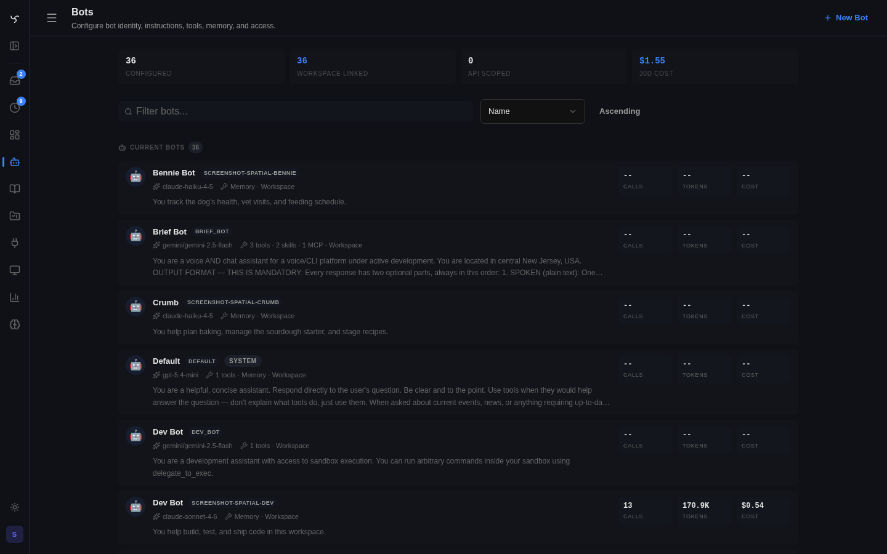

# Discovery and Enrollment

This is the canonical document for how Spindrel makes tools and skills available to a bot.

If tool discovery, skill discovery, enrollment, `get_skill`, `get_tool_info`, or residency semantics change, update this file first and then update shorter docs that point at it.

For the canonical guide covering replay policy, context profiles, compaction, and prompt-budget admission, see [Context Management](context-management.md).

---

## What This Guide Covers

This guide explains:

- how tools are discovered
- how skills are discovered
- what enrollment means
- what "loaded" and "resident in context" mean
- which older mechanisms are no longer part of the product model

It is not the place for per-profile prompt-admission policy. That belongs in [Context Management](context-management.md).
Heartbeat execution policy may further narrow the exposed tool surface after retrieval. The default `focused_escape` surface keeps retrieved tools and discovery escape hatches without treating broad pinned tools as automatically resident.

---

## Current Product Model

The active product concepts are:

- tools
- skills
- enrollment of each

The app no longer has a first-class capability/carapace model. Do not treat `activate_capability`, capability approval flows, or carapace resolution as part of the current architecture.

---

## Terms

| Term | Meaning |
|---|---|
| discoverable | The runtime can suggest or retrieve it, but it is not yet part of the bot's persistent working set |
| enrolled | Persistently available to that bot or channel as part of the working set / allowed set |
| loaded | The model fetched the full content during the conversation, usually with `get_skill()` or `get_tool_info()` |
| resident | The content is currently in the prompt window for this turn |
| auto-injected | The runtime preloaded the content without the model calling the fetch tool |

Resident is a runtime fact. Enrolled is a persistent configuration fact. Do not confuse them.

---

## Tool Discovery

Tool availability has two layers:

1. **Allowed / enrolled / pinned tools**
2. **Per-turn retrieval over the broader tool pool**

Current behavior:

- tools can be persistently available because they are enabled, enrolled, or pinned
- per-turn tool retrieval ranks tools against the current user message
- `get_tool_info(tool_name="...")` loads the full schema for an available/discovered tool
- once loaded, that schema is callable in the current loop
- `list_agent_capabilities()` summarizes the bot's current API grants, tool working set, tool profiles, skill working set, Project context, runtime context budget, assigned Mission Control work, agent status, recent agent activity, harness state, widget authoring surface, integration readiness, readiness findings, and any staged repair actions
- `preflight_agent_repair(action_id="...")` dry-runs a staged Agent Readiness action before any bot config mutation. It reports whether the action is `ready`, `blocked`, `stale`, or `noop`, which actor scopes are missing, and which bot fields would change.
- the manifest includes `tool_error_contract`, the shared shape for agent-facing failures: `error_code`, `error_kind`, `retryable`, `retry_after_seconds`, and `fallback`

Pinned tools are the strongest availability signal. They are the tools that must be available every turn.

`get_tool_info` is the fallback when the model knows or suspects the right tool but needs the full schema before calling it.

`get_agent_context_snapshot()` is the compact runtime-budget read. It returns the current channel/session budget, source, context profile, percentage full, and recommendation (`continue`, `summarize`, `handoff`, or `unknown`) without requiring the agent to fetch the full manifest.

`get_agent_work_snapshot()` is the compact assigned-work read. It returns active missions assigned to the current bot, Attention Items assigned to investigate, recent mission updates, and a recommended next action (`idle`, `advance_mission`, or `review_attention`) without requiring the agent to scrape Mission Control UI/API output.

`get_agent_status_snapshot()` is the compact liveness/status read. It derives whether the agent is `idle`, `scheduled`, `working`, `blocked`, `error`, or `unknown` from existing Tasks, HeartbeatRuns, ChannelHeartbeat config, and structured tool-call errors. Use it before waiting on autonomous work, debugging a stale run, or deciding whether heartbeat setup belongs in Channel Automation settings.

`get_agent_activity_log()` is the compact replay read. It normalizes evidence already stored by Spindrel into one ordered stream across tool calls, Attention Items, Mission updates, Project run receipts, widget agency receipts, and execution receipts. Use it when the agent needs to answer "what happened recently?", correlate a failure by `correlation_id`, or distinguish a benign setup/input warning from a retryable outage or platform bug without scraping review screens.

`publish_execution_receipt()` is the compact outcome write. It records what changed after an approval-gated or agent-important action, including actor, target, before/after summary, approval reference, result, rollback hint, and trace identifiers. It does not perform the mutation itself; the bot should call the normal API/tool first, then publish the receipt so later agents and Mission Control Review can reconstruct the outcome. Agent Readiness repair receipts also include the post-repair Doctor check (`finding_resolved`, `remaining_findings`, and before/after Doctor status), so agents can tell whether a fix actually cleared the original finding.

`run_agent_doctor()` is the compact readiness check. It is for "why can't I do this myself?" moments: missing API grants, empty working sets, Project runtime readiness gaps, harness workdir problems, and integration setup/activation/binding gaps. Doctor findings may include staged repair actions. Run `preflight_agent_repair()` before applying one of those actions; mutations still require an explicit user/tool call through the existing bot/config API; Project secrets, integration secrets, dependency installs, process starts, and runtime values stay manual.

Tool failures keep the legacy top-level `error` string for compatibility, but
new dispatch-owned and API-tool failures also carry the structured contract.
Agents should use `retryable` and `retry_after_seconds` for backoff decisions,
and use `error_kind` to tell input/config issues from platform bugs.
Review surfaces use the same fields, so tool authors should prefer explicit
contract values over prose-only error strings.

---

## Skill Discovery

Skill availability also has two layers:

1. **Enrolled working set**
2. **Unenrolled discovery layer**

Current behavior:

- every bot has a persistent enrolled working set
- new bots start from `STARTER_SKILL_IDS`
- successful `get_skill()` calls promote a skill into the working set
- semantic discovery can surface unenrolled skills as suggestions

The discovery layer is for finding skills the bot does not already carry. The working set is for skills the bot should see regularly.

---

## Enrolled Skill Ranking and Auto-Inject

Enrolled skills are ranked per turn against the current user message.

Current defaults:

- `SKILL_ENROLLED_RANKING_ENABLED = True`
- `SKILL_ENROLLED_RELEVANCE_THRESHOLD = 0.40`
- `SKILL_ENROLLED_AUTO_INJECT_THRESHOLD = 0.55`
- `SKILL_ENROLLED_AUTO_INJECT_MAX = 0`

Important consequence:

- the runtime still supports enrolled-skill auto-inject
- it is **disabled by default**
- the current strategy is prompt-first: show the index, let the model call `get_skill()` when it needs the body

So:

- relevant skills may be annotated in the index
- full enrolled-skill auto-injection is not on by default

---

## `get_skill`, Residency, and `refresh=true`

`get_skill(skill_id="...")` loads the full skill body and makes it resident in the conversation.

Current residency rules:

- the runtime tracks a canonical `skills_in_context` residency set
- resident skills are marked as already loaded in the skill index
- duplicate `get_skill()` calls do not paste the full body again by default
- use `refresh=true` only when you intentionally want to reload/reorder the skill

This means:

- enrolled does not imply resident
- resident does not require auto-inject
- `get_skill()` is still the normal path for moving from "suggested" to "actually in prompt context"

---

## Discovery vs Context Admission

Discovery answers:

- what tools/skills can the bot reach?
- which ones are suggested?
- which ones are enrolled?
- which ones are currently resident?

Context admission answers:

- which optional prompt blocks are allowed for this origin/profile?
- which ones fit in budget?

Those are different systems.

Examples:

- a skill can be enrolled but not currently resident
- a tool can be discoverable without its full schema being loaded yet
- a knowledge-base excerpt can be admitted in `chat` but suppressed in `planning`
- a workspace file can be retrievable even when it is not preloaded into context

See [Context Management](context-management.md) for the profile/budget side of that contract.

---

## What Is No Longer Canonical

These are not part of the current canonical discovery story:

- carapace/capability resolution as the main composition pipeline
- `activate_capability`
- capability approval as the main way bots gain expertise
- a default assumption that enrolled skills auto-inject full bodies into context

If older notes or prompts still mention those as the live architecture, they are stale.
