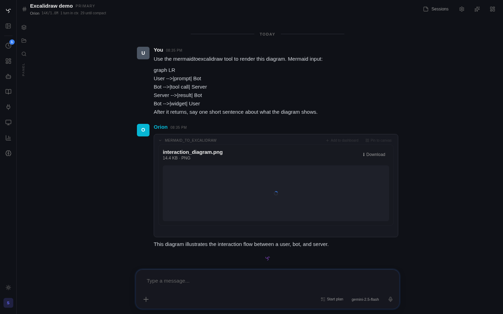

# Excalidraw



The `excalidraw` integration lets bots render **hand-drawn-style diagrams** directly in chat — system architectures, flowcharts, sequence diagrams, state machines. Two input flavors are supported: native Excalidraw JSON, or Mermaid syntax automatically converted to Excalidraw's hand-drawn aesthetic.

Output is an inline image (SVG by default, PNG on request), pinnable to a widget dashboard like any other tool result.

---

## Why it exists

Chat is a bad fit for communicating structure. "The ingest pipeline feeds the analyzer, which updates two separate stores" takes twice as many words as a four-node diagram. Excalidraw's aesthetic keeps diagrams feeling exploratory, not overspecified — the right register for in-the-flow explanation.

This integration exists so a bot can return a diagram the same way it returns any other tool result: call a tool, get a widget, pin if useful.

---

## What's in the package

| Tool | Input | Output |
|---|---|---|
| `create_excalidraw` | Raw Excalidraw JSON (`{elements: [...], appState: {...}}`) | Rendered SVG (default) or PNG attachment |
| `mermaid_to_excalidraw` | Mermaid syntax (`graph TD; A-->B;` etc.) | Rendered diagram in Excalidraw aesthetic |

Both tools return the same envelope shape — a filename, attachment_id, mime_type, and size — so the shared widget renders either.

Supporting assets:

- `integrations/excalidraw/widgets/create_excalidraw.html` — HTML widget that fetches the attachment and shows the image with a download button and a lightbox (tap to expand).
- `integrations/excalidraw/skills/` — a skill pack teaching bots when to reach for a diagram, and the Mermaid-first recommendation (bots write Mermaid much more reliably than raw Excalidraw JSON).
- `integrations/excalidraw/scripts/` — the Node renderer, bundling `puppeteer-core` + `@excalidraw/utils` + `mermaid`.

---

## Prerequisites

Diagram rendering happens **on the server** — it runs headless Chrome, not in the browser. So:

- **Chromium / Chrome binary** must be available on the server or in the container.
- **Node.js** must be installed (npm runs during first-use to pull `puppeteer-core` / `@excalidraw/utils` / `mermaid`).

### Chrome auto-detection

The integration looks for a Chromium binary in this order:

1. `EXCALIDRAW_CHROME_PATH` set via **Admin → Integrations → Excalidraw → Settings** (if blank, skipped).
2. `CHROME_PATH` or `PUPPETEER_EXECUTABLE_PATH` env vars.
3. Well-known paths: `/usr/bin/chromium`, `/usr/bin/chromium-browser`, `/usr/bin/google-chrome-stable`, `/usr/bin/google-chrome`.

If none are found, the integration surfaces an install hint ("run: `apt-get install -y chromium`") in the admin UI's system-dependency panel. Click **Install** there if the agent runs with privileges, or run the apt command manually.

### Node dependencies

`npm install` runs the first time a tool is invoked (`integrations/excalidraw/scripts/node_modules/` is gitignored). A short lock guards concurrent first-call installs. Subsequent calls reuse the installed modules — installation is a one-time cost.

---

## Asking a bot for a diagram

The recommended path is to ask the bot in natural language and let it pick the input format:

> "Sketch a diagram of how a pipeline-run event flows from the task loop to the run modal. Mermaid is fine."

The skill pack steers the bot toward `mermaid_to_excalidraw` for anything stateful or topological (DAGs, sequence diagrams, state machines). Raw `create_excalidraw` is reserved for cases where the bot already has Excalidraw JSON — typically because a previous tool emitted one or a human pasted one.

### Example: Mermaid

```text
mermaid_to_excalidraw(
  source="""
    graph LR
      User[User message] --> Bot
      Bot --> Tools[[Tool call]]
      Tools --> API[(HA REST)]
      Bot --> Widget{{Rendered widget}}
  """
)
```

Returns:

```json
{
  "message": "Created flowchart.svg (18 KB)",
  "attachment_id": "…uuid…",
  "filename": "flowchart.svg",
  "mime_type": "image/svg+xml",
  "size_bytes": 18423
}
```

The widget renders inline — a centered diagram with a filename caption and a **Download** button. Click the image to expand into a lightbox.

### Example: raw Excalidraw JSON

```text
create_excalidraw(
  source='{"elements":[{"type":"rectangle","x":100,"y":100,"width":200,"height":80}]}',
  output_format="svg"
)
```

Useful when a teammate hands you an Excalidraw scene file and you want to render a static snapshot without opening `excalidraw.com`.

---

## Pinning and dashboards

The widget template sets `display: inline` so the diagram renders in the chat transcript. Click the **★** / pin icon on the widget card to pin it to:

- The channel's own dashboard (left OmniPanel rail + the full grid at `/widgets/channel/<id>`).
- The global `/widgets/default` dashboard.
- Any named dashboard you own.

The pinned card pulls the image by `attachment_id` each time it loads — the attachment is persistent, so the diagram stays reachable across sessions and deploys.

**Edit and re-render.** Pinned diagrams don't auto-update — if the underlying story changes, ask the bot for a new version and repin. A future enhancement (tracked on the [[Track - Widgets]]) will support workspace-backed diagrams that re-render when the source file changes.

---

## Size + performance notes

- **SVG vs PNG.** SVG is the default — small file, crisp at any zoom, suitable for most diagrams. Request PNG explicitly if you need a raster (e.g. to paste into a tool that doesn't speak SVG).
- **Render budget.** A headless Chrome + mermaid render typically completes in 1–3 seconds for a modest diagram. Very large graphs (100+ nodes) can take longer; break them up.
- **Resource footprint.** The Node process + headless Chrome briefly run on the agent server while the tool executes. Not a concern for occasional use; in high-volume batch scenarios, consider offloading to a dedicated diagram service.

---

## Configuration

| Setting | Where | Purpose |
|---|---|---|
| `EXCALIDRAW_CHROME_PATH` | **Admin → Integrations → Excalidraw** | Override the Chromium binary path if auto-detection misses. |
| `CHROME_PATH` / `PUPPETEER_EXECUTABLE_PATH` | `.env` | Second-tier path hint (same idea, environment-scoped). |

System dependencies (chromium + npm packages) are manageable from the admin UI's Integration dependency panel — no SSH needed in the happy path.

---

## Troubleshooting

| Symptom | Cause | Fix |
|---|---|---|
| Tool returns "chromium not found" | No Chrome/Chromium on the server | Click **Install** in the integration's dependency panel, or `apt-get install -y chromium` |
| Tool hangs for 30s+ on first call | `npm install` running for the first time | Wait; subsequent calls reuse the installed modules |
| Mermaid renders but layout is off | Mermaid syntax version mismatch | Stick to common shapes; the bundled mermaid version is pinned in `scripts/package.json` |
| Widget shows broken image | Attachment was garbage-collected | Rarely happens — re-run the tool |
| "Excalidraw JSON invalid" | Bot emitted a malformed scene | Usually recoverable by asking the bot to use `mermaid_to_excalidraw` instead |

---

## Reference

| What | Where |
|---|---|
| Tool source | `integrations/excalidraw/tools/excalidraw.py` |
| Integration YAML | `integrations/excalidraw/integration.yaml` |
| Widget HTML | `integrations/excalidraw/widgets/create_excalidraw.html` |
| Node renderer | `integrations/excalidraw/scripts/` |
| Skills | `integrations/excalidraw/skills/` |

## See also

- [HTML Widgets](html-widgets.md) — the widget's rendering model (bot-scoped iframe auth, `window.spindrel.apiFetch` for binary payloads like images).
- [Widget Dashboards](widget-dashboards.md) — pin and organize diagrams alongside other widgets.
- [Custom Tools & Extensions](custom-tools.md) — pattern for tools that shell out to Node / Chrome.
