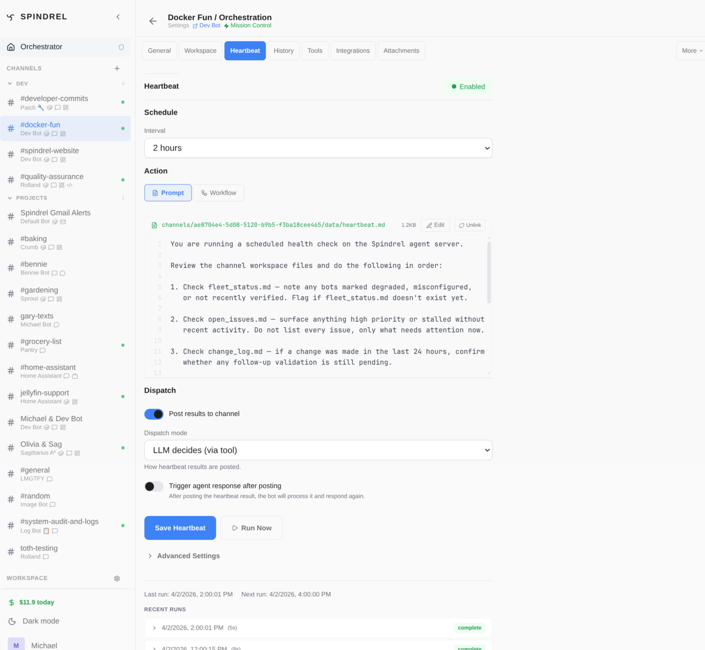

# Heartbeats

Heartbeats are periodic autonomous check-ins. Configure a heartbeat on a channel and the bot runs a prompt on a schedule — monitoring, summarizing, alerting, or launching pipelines without human intervention.


*Channel heartbeat settings — configure the interval, prompt, posting, and quiet hours.*

---

## Quick Start

1. Open a channel → **Settings** → **Automation** → **Heartbeat**
2. Toggle **Enabled**
3. Set an **interval** (e.g., 60 minutes)
4. Enter a **prompt** (e.g., "Check system health and report any anomalies")
5. Use **Advanced Settings → Limits** when a heartbeat needs a different execution depth or tool surface
6. Save

The bot now runs that prompt every 60 minutes and posts the result to the channel.

---

## How It Works

The heartbeat worker polls every 30 seconds for due heartbeats. When one fires:

1. A concrete run is queued through the same Task runner used by scheduled prompts and pipelines.
2. The **run target** is resolved: primary channel session, one selected existing session, or a fresh visible session for that run.
3. The **prompt is resolved** (workspace file → template → inline → global fallback).
4. **Heartbeat metadata and surfaces are injected** — current time, channel activity since last run, previous results, spatial context, pinned widget context, and heartbeat-specific tool policy.
5. The bot **runs the prompt** with the heartbeat context profile and the configured tool/skill selections.
6. The result is posted when `dispatch_results` is enabled; otherwise it is saved to heartbeat history only.
7. The **next run is scheduled** using clock-aligned intervals.

### Clock-Aligned Scheduling

Heartbeats snap to even multiples of the interval from midnight UTC. A 30-minute heartbeat fires at `:00` and `:30` of every hour — not based on when it was created. This makes timing predictable across restarts.

---

## Prompt Resolution

Heartbeat prompts are resolved in priority order — first match wins:

| Priority | Source | When to use |
|----------|--------|-------------|
| 1 | **Workspace file** (`workspace_file_path`) | Complex prompts that evolve with the project |
| 2 | **Template** (`prompt_template_id`) | Reusable prompts shared across channels |
| 3 | **Inline prompt** (`prompt` field) | Simple, one-off prompts |
| 4 | **Global fallback** (`HEARTBEAT_DEFAULT_PROMPT` env var) | Fleet-wide default |

### Workspace file prompts

Point the heartbeat at a `.md` file in the channel's workspace:

```
workspace_file_path: heartbeat.md
```

The file is read fresh on every run, so the bot can update its own heartbeat instructions as the project evolves. This is the recommended approach for complex monitoring setups.

### Template prompts

Select a prompt template in the Heartbeat settings tab. Templates are managed in **Admin > Templates** and can be reused across multiple channel heartbeats.

---

## Posting

### Post On (default)

The heartbeat result is automatically posted to the channel every time.

```
dispatch_results: true
```

Good for: status updates, monitoring dashboards, regular reports.

### Post Off

Set `dispatch_results: false` to save results to heartbeat history without posting to integrations. The web UI shows a collapsed heartbeat row that can be expanded to inspect the output.

`dispatch_mode` is a legacy compatibility field and is ignored by current runtime behavior.

### Trigger Response

Set `trigger_response: true` to create a follow-up task after a posted heartbeat completes. The bot can then react asynchronously — useful for chained automations where the heartbeat detects something and a second agent action handles it.

---

## Run Target

Heartbeats use the same session-target policy as scheduled prompts:

| UI option | Stored policy | Behavior |
|---|---|---|
| **Primary session** | `{"mode": "primary"}` | Use the channel's current main session. This is the default. |
| **Existing session** | `{"mode": "existing", "session_id": "..."}` | Run against one visible session from the channel's session list. |
| **New session each run** | `{"mode": "new_each_run"}` | Create a fresh visible channel session for every heartbeat run. |

The policy is stored in `execution_config.session_target`. It is separate from
pipeline `run_isolation` / `run_session_id`, which only controls pipeline run
transcripts and anchor cards.

---

## Quiet Hours

Suppress or slow heartbeats during off-hours.

### Global quiet hours

```bash
# .env
HEARTBEAT_QUIET_HOURS=23:00-07:00          # Wraps midnight
HEARTBEAT_QUIET_INTERVAL_MINUTES=0          # 0 = disabled during quiet
TIMEZONE=America/New_York                   # Timezone for the window
```

Setting `HEARTBEAT_QUIET_INTERVAL_MINUTES=0` disables heartbeats entirely during quiet hours. A positive value (e.g., `240`) slows them to that cadence instead.

### Per-heartbeat quiet hours

Override the global window on individual heartbeats:

```
quiet_start: 22:00
quiet_end: 08:00
timezone: America/Chicago
```

Per-heartbeat settings take precedence over the global configuration.

---

## Repetition Detection

If a heartbeat produces nearly identical output 3+ times in a row, the system detects it and intervenes.

### How it works

The worker compares the last several results using text similarity (SequenceMatcher). If 3 consecutive runs exceed the similarity threshold, the next run gets a forceful preamble:

> REPETITION ALERT — Your last several heartbeat outputs are nearly identical. You MUST produce something substantially different, or say "No updates."

The previous results are included so the LLM understands what it's been repeating.

### Configuration

```bash
# .env
HEARTBEAT_REPETITION_DETECTION=true    # Global on/off (default: true)
HEARTBEAT_REPETITION_THRESHOLD=0.8     # Similarity ratio 0–1 (default: 0.8)
```

Per-heartbeat override:
```
repetition_detection: true|false
```

---

## Launching Pipelines from Heartbeats

To run a pipeline on schedule, keep the heartbeat in prompt mode and have the bot call `run_pipeline` from its prompt:

```
prompt: |
  Run the `daily-report` pipeline for this channel.
  Use run_pipeline(pipeline_id="daily-report", channel_id=<this channel>).
```

Why heartbeat-prompts-launch-pipelines is the model:

- Pipeline runs render as a **sub-session** transcript in the channel with a compact anchor card — every step's LLM thinking and tool widget is visible.
- The heartbeat prompt can decide conditionally whether to launch the pipeline (e.g., only if a condition is met).
- Multiple pipelines can be chained, since the bot is in control.

See the [Pipelines guide](pipelines.md) for pipeline configuration and the `run_pipeline` tool.

## Attention Beacons From Heartbeats

Spatially enabled heartbeat bots can raise [Attention Beacons](attention-beacons.md)
when their channel bot policy allows it.

The relevant policy flag is `allow_attention_beacons`. When enabled, the bot
can use `place_attention_beacon` to create or refresh a deduped Attention
Item, and `resolve_attention_beacon` to resolve one of its own items.

Heartbeats can also opt into the higher-level `report_issue` tool with
`execution_config.allow_issue_reporting`. This is off by default and is meant
for durable blockers, missing permissions, recurring tool/system failures,
setup problems, or user decisions discovered during the run. Reported issues
enter Attention as a high-priority bot report and may absorb matching automatic
structured-failure signals as evidence.

Heartbeat context includes nearby and self-authored bot beacons so bots can
avoid duplicating warnings and can resolve stale ones. System-authored
structured-failure beacons remain admin-only and are not injected into bot
context in v1.

Daily health is no longer the only way to inspect persisted server errors.
Agents and operators can call
`GET /api/v1/system-health/recent-errors?include_attention=true` for the latest
deduped findings, then `POST /api/v1/system-health/recent-errors/promote` to
turn selected current errors into Attention Items. Clear benign, duplicate,
external, stale, or recovered findings can be resolved through
`POST /api/v1/workspace/attention/{id}/resolve` with a `resolution`, `note`,
and optional `duplicate_of`; likely code bugs should stay open for repo work.
Resolved duplicate findings still appear in recent-errors when the raw log line
is inside the requested window, but `review_state=resolved_duplicate` marks
them as already-triaged rather than fresh work. Use
`exclude_review_state=resolved_duplicate` for a current work queue and
`review_state=stale_resolved_reappeared` to find resolutions that may have
regressed.

If an Attention Item is assigned with `mode="next_heartbeat"`, the heartbeat
preamble also receives an `attention assignments` block for that bot and
channel. The block includes item ids, severity, target, message, next steps,
and assignment instructions. The run gets the `report_attention_assignment`
tool injected so the bot can store concise findings on the item. Assignment
semantics are investigate/report only; they do not authorize the bot to execute
fixes.

## Pinned Widget Context From Heartbeats

`ChannelHeartbeat.include_pinned_widgets` is an opt-in heartbeat setting. When
enabled, the heartbeat service snapshots export-enabled widgets pinned to the
channel dashboard and appends the resulting block to the heartbeat
`system_preamble`; it is not appended to the heartbeat user prompt.

The block starts with:

```text
The user has these widgets pinned in this channel — treat their state as current reference data:
```

Each exported widget contributes one line, capped at 250 characters and with a
2,000-character total block budget. Native widgets export compact summaries:

- Notes: first body snippet, or an empty-note marker with update time.
- Todo: `{open} open, {done} done; next: first two open titles`.
- Pinned Files: pinned-file count and active filename when present.
- Standing Order: goal, status, iteration count, and latest log/terminal reason.

Widgets without `widget_contract.context_export.enabled=true`, without a
summary, beyond the first 12 exports, or beyond the block budget are skipped.
The snapshot includes skip reasons for debugging, but skipped rows are not
shown to the bot.

---

## Metadata Injection

Every heartbeat run automatically injects context metadata into the system preamble:

- **Current time** and timezone
- **Channel name** and heartbeat interval
- **Run number** (how many times this heartbeat has fired)
- **Time since last run** and last run timestamp
- **Channel activity** — message counts since last heartbeat, time of last user message
- **Previous result** — truncated conclusion from the last run (configurable via `previous_result_max_chars`)
- **Recent run digest** — summary of last 3 runs with tool call info

This gives the bot situational awareness without consuming prompt space. The metadata is injected as a system preamble, not part of the user message — it doesn't affect RAG retrieval.

---

## Configuration Reference

### Heartbeat Settings (per-channel, via UI or API)

| Field | Type | Default | Description |
|-------|------|---------|-------------|
| `enabled` | bool | false | Master on/off switch |
| `interval_minutes` | int | 60 | How often to fire (minimum 1) |
| `prompt` | string | — | Inline prompt text |
| `workspace_file_path` | string | — | Workspace file to read as prompt |
| `prompt_template_id` | uuid | — | Template reference |
| `dispatch_mode` | string | "always" | Legacy compatibility field; ignored |
| `dispatch_results` | bool | true | Post result to channel |
| `trigger_response` | bool | false | Create follow-up task after completion |
| `model` | string | — | Override LLM model |
| `model_provider_id` | string | — | Override LLM provider |
| `quiet_start` | string | — | Quiet window start (HH:MM) |
| `quiet_end` | string | — | Quiet window end (HH:MM) |
| `timezone` | string | — | Timezone for quiet hours |
| `max_run_seconds` | int | — | Execution timeout (overrides global) |
| `execution_policy` | object | Medium depth | Tool-surface and LLM-loop budget controls for autonomous heartbeat runs |
| `previous_result_max_chars` | int | 500 | How much of last result to inject |
| `repetition_detection` | bool | — | Override global repetition detection |

### Environment Variables (global)

```bash
# Quiet hours window (wraps midnight)
HEARTBEAT_QUIET_HOURS=23:00-07:00

# Behavior during quiet hours: 0 = disabled, >0 = slower cadence (minutes)
HEARTBEAT_QUIET_INTERVAL_MINUTES=0

# Fallback prompt when nothing else is configured
HEARTBEAT_DEFAULT_PROMPT=

# Max chars of previous result injected as context
HEARTBEAT_PREVIOUS_CONCLUSION_CHARS=500

# Repetition detection
HEARTBEAT_REPETITION_DETECTION=true
HEARTBEAT_REPETITION_THRESHOLD=0.8

# Global task timeout
TASK_MAX_RUN_SECONDS=300

# Timezone for global quiet hours
TIMEZONE=UTC
```

### Execution Policy

Heartbeat runs normalize an optional `execution_policy` object before entering the agent loop. The channel **Settings → Automation → Heartbeat → Advanced Settings → Limits** UI exposes execution depth presets and tool-surface controls:

| Preset | Soft LLM calls | Hard LLM calls | Soft current tokens | Target seconds |
|--------|----------------|----------------|---------------------|----------------|
| Low | 6 | 12 | 50,000 | 90 |
| Medium (default) | 12 | 30 | 150,000 | 180 |
| High | 20 | 50 | 300,000 | 300 |

Choosing Custom, or editing a numeric limit, stores the policy as `custom`. Numeric fields are hidden for preset-backed policies and shown for Custom policies.

```json
{
  "preset": "medium",
  "tool_surface": "focused_escape",
  "continuation_mode": "stateless",
  "soft_max_llm_calls": 12,
  "hard_max_llm_calls": 30,
  "soft_current_prompt_tokens": 150000,
  "target_seconds": 180
}
```

`max_run_seconds` remains the outer hard timeout. The heartbeat hard LLM-call cap replaces the generic global turn default for heartbeat runs, but explicit channel or bot iteration caps still apply if they are lower. `target_seconds` is an enforced soft elapsed-time budget: crossing it triggers the same soft-pressure path as the LLM-call and current-token budgets.

Tool-surface modes are runtime-enforced:

- `focused_escape` (default): expose retrieved tools, explicitly tagged tools, heartbeat-injected tools such as optional posting, and the limited discovery escape hatches `get_tool_info` / `search_tools` / `list_tool_signatures` / `run_script` when discovery is enabled. Broad pinned tools and widget-handler tools are not surfaced just because they are generally available.
- `strict`: expose retrieved tools, explicitly tagged tools, and heartbeat-injected tools only; no discovery escape hatches.
- `full`: preserve the broad chat-like surface, including pinned tools and normal discovery helper pins.

When a soft budget trips, the loop emits `heartbeat_budget_pressure` with a reason (`soft_max_llm_calls`, `soft_current_prompt_tokens`, or `target_seconds`), prunes older in-loop tool results even if the model context window still has headroom, and asks the model to finish unless one more tool call is clearly high-value. `provider_state` continuation is reserved until loop state retention is implemented end to end; submitted policies normalize it back to `stateless`.

Heartbeat prompts should prefer compact aggregate tools when the integration provides them. For example, the ARR integration exposes `arr_heartbeat_snapshot()` so a media heartbeat can get one bounded read-only snapshot across configured services, then call detailed tools only for anomalies or mutations.

---

## API Reference

All endpoints require `Authorization: Bearer $API_KEY`.

| Method | Path | Description |
|--------|------|-------------|
| GET | `/api/v1/admin/channels/{id}/heartbeat` | Get config + recent run history |
| PUT | `/api/v1/admin/channels/{id}/heartbeat` | Update heartbeat settings |
| POST | `/api/v1/admin/channels/{id}/heartbeat/toggle` | Toggle enabled on/off |
| POST | `/api/v1/admin/channels/{id}/heartbeat/fire` | Fire immediately (non-blocking) |
| POST | `/api/v1/admin/channels/{id}/heartbeat/infer` | AI-generate a prompt from channel context |

### Prompt inference

The **infer** endpoint uses AI to generate a tailored heartbeat prompt based on the channel's bot, workspace schema, and active integrations. Useful for bootstrapping a heartbeat on a new channel.

---

## Examples

### Monitoring Channel

Post system health updates every hour, quiet at night:

```
enabled: true
interval_minutes: 60
dispatch_results: true
quiet_start: 23:00
quiet_end: 06:00
timezone: America/New_York
prompt: |
  Check system health:
  1. Disk usage (flag >80%)
  2. Memory usage
  3. Service status (docker ps)
  Report anomalies clearly. If everything is normal, say "All systems nominal."
```

### Quiet Analysis

Run analysis every 2 hours and keep the result in heartbeat history:

```
enabled: true
interval_minutes: 120
dispatch_results: false
prompt: |
  Review recent channel activity and workspace files.
  If there are stale tasks, unresolved questions, or items that need attention,
  summarize them clearly for later review.
  If everything looks fine, say so briefly.
```

### Daily Pipeline Launch

Trigger a multi-step pipeline once per day — launched from the prompt, not via a dedicated field:

```
enabled: true
interval_minutes: 1440
dispatch_results: true
prompt: |
  Launch the daily-report pipeline for this channel.
  Call run_pipeline(pipeline_id="daily-report").
```

The pipeline's output renders as a sub-session transcript on the channel.

### Business Hours Only

Run during work hours with a per-heartbeat quiet window:

```
enabled: true
interval_minutes: 30
quiet_start: 18:00
quiet_end: 09:00
timezone: America/Chicago
prompt: Monitor the support queue and flag urgent items.
```

---

## Auto-Approve Tool Calls

Heartbeats run autonomously — nobody is watching the chat. If a heartbeat triggers a tool that requires approval via a tool policy, the run blocks for up to 5 minutes waiting for manual approval, then fails silently.

To prevent this, enable **Auto-approve tool calls** in the heartbeat's Advanced settings:

1. Open a channel → **Settings** → **Heartbeat** tab
2. Expand **Advanced**
3. Toggle **Auto-approve tool calls** on
4. Save

When enabled, the heartbeat run skips all tool policy checks. Tools execute immediately without waiting for manual approval.

**For scheduled tasks**, set `"skip_tool_approval": true` in the task's `execution_config` JSONB to achieve the same behavior.

### Visibility

Even with auto-approve disabled, pending approvals are now visible across the app:

- **Sidebar badge** — the Approvals nav item shows a red count badge when pending approvals exist
- **Toast notification** — a toast appears in the bottom-right when new approvals arrive, linking to the approvals page
