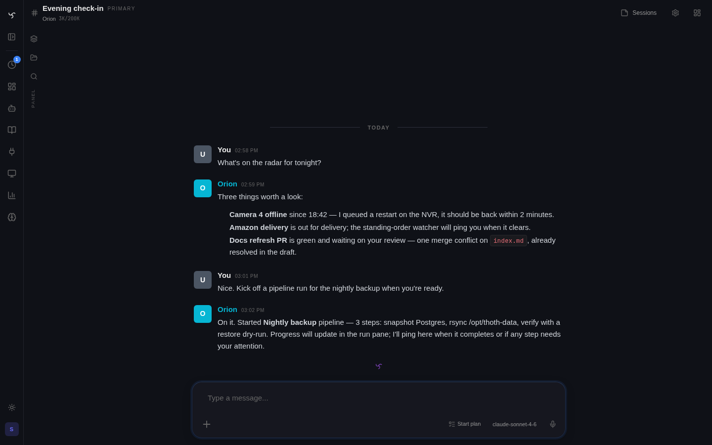

# How Spindrel Works



This guide explains the mental model — how the pieces fit together, not API details.

For the canonical document covering replay policy, compaction, history modes, context profiles, and prompt-budget reporting, see [Context Management](context-management.md).

---

## The Core Idea

A **channel** is a conversation with a bot. What makes that bot useful depends on what's plugged into it: tools, skills, behavioral instructions, and workspace files. Spindrel's job is composing those pieces so the right tools and skills show up at the right time without manual configuration for every channel.

The composition chain:

```
Channel → Workspace + Integrations + Enrollment → Skills + Tools + Behavior
```

---

## Channels

A channel is where a user talks to a bot. Each channel has:

- A **bot** assignment (which LLM, which personality)
- A **workspace** (a directory of `.md` files the bot reads and writes)
- Zero or more **integration bindings** (Slack, GitHub, Home Assistant, etc.)
- Optional **overrides** (extra tools, enrolled skills, custom prompt)

Channels are lightweight. Create one per project, topic, or workflow. The bot's base configuration comes from its YAML definition, but the channel can layer on top.

---

## Templates

A template defines **how the workspace should be organized** — which files to create, what each file is for, and how they relate.

For example, the **Software Development** template says:

> Create `project.md` for goals and scope, `architecture.md` for design, `tasks.md` for tracking, `decisions.md` for ADRs.

The **Media Management** template says:

> Create `requests.md` for pending media requests, `library.md` for collection overview, `issues.md` for download problems.

Templates are suggestions, not constraints. The bot follows the structure when creating files but adapts if the conversation goes in a different direction.

**Picking a template** happens in the channel's Workspace tab. Templates are optional scaffolding, not something every channel needs.

---

## Integration Activation

Integrations connect Spindrel to external services (Slack, GitHub, Home Assistant, your media stack). **Binding** an integration to a channel means messages can flow in and out. Some integrations also support **activation**, which contributes tools and optional prompt metadata for that channel.

When you activate an integration on a channel:

1. The integration's declared **tools** become available on that channel
2. Any shipped skills remain normal skills in the catalog or enrolled working set
3. There is no separate capability bundle or activation session state

**Example:** Activate the Arr integration on a channel, and the bot instantly knows how to search Sonarr for TV shows, add movies to Radarr, check download status in qBittorrent, and browse your Jellyfin library. Pair it with the **Media Management** template if you want a ready-made file structure for requests and issues.

### Current Integrations with Activation

| Integration | What it provides | Compatible template |
|-------------|-----------------|-------------------|
| **Arr (Media Stack)** | Sonarr, Radarr, qBittorrent, Jellyfin, Jellyseerr, Bazarr | Media Management |
| **Home Assistant** | Device control, live entity state, automation helpers | Home Automation |

Other integrations (Slack, GitHub, Discord, Frigate) provide channel binding and tools but don't yet have activation manifests. Their tools are available when configured on the bot directly.

### Semantic Tool Fallback

When the initial tool-retrieval pipeline misses the right tool, the bot can call `search_tools` — a semantic tool search across the full pool — and pin the match for the rest of the turn. The tool-index header points at `search_tools` as the explicit next step when the right tool isn't in the index.

### How the Bot Finds Skills

Skills use the same semantic search as tools. On each message, the system retrieves the most relevant skills from the bot's enrolled set and presents a compact index. The bot calls `get_skill()` to load the full content of any skill it needs, or `get_skill_list()` to browse all available skills when the index doesn't show what it's looking for.

Skills aren't all loaded at once (that would blow the context window). Only the most relevant skills appear in the index each turn, and the bot fetches full content on demand. This means a bot can have access to thousands of pages of domain knowledge without any of it consuming context until it's actually needed.

---

## The Full Picture

Here's how it all comes together when you set up a channel:

### 1. Create a channel, assign a bot

The bot brings its base personality, model, tools, and enrolled skills.

### 2. Optionally activate integrations

If an integration supports activation, the bot gains its declared tools on that channel. Related skills still flow through the normal skill catalog and enrollment system.

### 3. Optionally pick a template

The template tells the bot how to organize workspace files if you want a predefined starting structure.

### 4. Start chatting

On every message, Spindrel's context assembly pipeline runs:

1. **Template injection** — The workspace schema is injected so the bot knows the file structure
2. **Workspace files** — Active `.md` files in the workspace root are injected into context (the bot "sees" project state)
3. **Tool retrieval** — Relevant tools are selected via semantic search (vector + BM25 hybrid, not all tools are sent every time)
4. **Skill retrieval** — Relevant on-demand skills are selected via semantic search and presented as a compact index; the bot loads full content via `get_skill()`

The result: the bot has exactly the right tools, knowledge, and context for this channel's purpose — assembled fresh on every request.

---

## Pipelines and Sub-Sessions

Pipelines are reusable multi-step automations stored as `Task` rows. A pipeline has `steps:` — `exec` (subprocess), `tool` (call a tool), `agent` (run the LLM), `user_prompt` (pause for input), and `foreach` (loop) — with conditions, parameters, approval gates, and cross-bot delegation.

When a pipeline runs inside a channel, it renders as a **chat-native sub-session**: a modal or docked transcript showing every step's LLM thinking, tool widgets, Markdown, and JSON as real messages on a dedicated session. The parent channel gets a compact anchor card pointing at the run. Pipelines can be scheduled per-channel via `channel_pipeline_subscriptions` or triggered from a heartbeat via `pipeline_id`.

Pipelines replace the older workflows system, which is deprecated. See the [Pipelines guide](pipelines.md).

---

## Workspace

Every Spindrel instance has one workspace directory, rooted at `WORKSPACE_HOST_DIR` (mounted into the container as `WORKSPACE_LOCAL_DIR`). Inside that root, files are organized by bot and channel — `{root}/bot/{bot_id}/` for bot-scoped state, `{root}/bot/{bot_id}/channels/{channel_id}/` for channel-scoped state. The `file` tool accepts both relative paths (rooted at the bot directory) and `/workspace/...` absolute paths.

A single-workspace model replaces the earlier per-bot container runtime. Every bot is a permanent member of the workspace via a bootstrap loop (`app/services/workspace_bootstrap.py`); there is no "add/remove bot to workspace" operation — the workspace is the container environment, not a property of the bot.

---

## Chat State Rehydration

Streaming turns and pending approvals survive reconnects. The `GET /api/v1/channels/{id}/state` snapshot returns `{active_turns, pending_approvals}` — used by `useChannelState` + `rehydrateTurn` on mount so a mobile tab-wake or a page reload picks up exactly where the live SSE stream left off. Live events always win over snapshot values, so the rehydration is idempotent.

See [Context Management](context-management.md) for the canonical guide to replay policy, compaction, history modes, context profiles, and live-history budgeting.

---

## Key Concepts Summary

| Concept | What it is | Where it lives |
|---------|-----------|---------------|
| **Channel** | A conversation with a bot | UI sidebar, database |
| **Template** | Workspace file organization guide | `prompts/*.md` or Admin > Templates |
| **Integration** | Connection to an external service | `integrations/*/` directory |
| **Activation** | Enabling an integration's declared tools on a channel | Channel > Integrations tab |
| **Skill** | Markdown knowledge document | `skills/*.md` or skill subdirectory |
| **Workspace** | Single rooted file store, organized by bot and channel | `WORKSPACE_HOST_DIR` on disk |
| **Pipeline** | Multi-step automation stored as a Task row | Admin > Tasks |
| **Sub-session** | Chat-native transcript for a running pipeline | Channel modal / dock |

---

## Common Patterns

### "I want a media request channel"
1. Create channel → Activate Arr → Pick "Media Management" template
2. Bot can search and add media, monitor downloads, track requests

### "I want a home automation channel"
1. Create channel → bind/activate Home Assistant → optionally pick "Home Automation" template
2. Bot can inspect devices, operate entities, and keep workspace notes about automations or events

### "I want a code review channel"
1. Create channel → enroll the relevant review skills on the bot or channel
2. Make sure the needed review tools are available on that bot/channel

### "I want to add my own tools and skills"
1. Drop a `.py` file in `tools/` with a `@register` decorator → tool is available on next restart
2. Or keep a personal extensions repo and load it via `INTEGRATION_DIRS` — see the [Custom Tools & Extensions guide](custom-tools.md)
