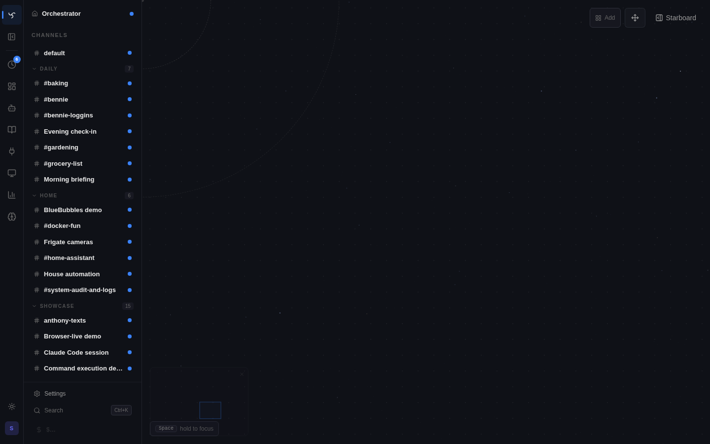

# Guides

These guides are canonical. When they disagree with other docs, UI copy, or track notes, they win. Every session working on these areas should read the relevant one first.

## Canonical Guides

Read the matching guide before touching these areas.

| Guide | Authority scope | Owning area |
|---|---|---|
| [Development Process](development-process.md) | Review finding triage, Agent Briefs, contract/red-line review, out-of-scope decisions | repo maintenance |
| [Context Management](context-management.md) | Context admission, history profiles, temporal context, compaction | `app/agent/context_assembly.py` |
| [Discovery and Enrollment](discovery-and-enrollment.md) | Tool / skill / MCP residency, per-channel enrollment, activation | `app/agent/channel_overrides.py`, `app/services/skill_store.py` |
| [Widget System](widget-system.md) | Widget contracts, origins, presentation, host policy | `app/services/widget_*.py` |
| [UI Design](ui-design.md) | UI archetypes, design tokens, active-row pill, anti-patterns | `ui/` |
| [UI Components](ui-components.md) | Shared dropdowns, prompt editors, settings rows/actions, component usage catalog | `ui/src/components/shared/` |
| [Integrations](integrations.md) | Integration contract + responsibility boundary + surface map | `integrations/`, `app/services/integration_*.py` |
| [Ubiquitous Language](ubiquitous-language.md) | Canonical glossary + flagged ambiguities across the domain | all of the above |

## Topic Guides

Per-feature writeups, alphabetical. Not north-star; a canonical guide wins when they disagree.

| Guide | About |
|---|---|
| [Admin Terminal](admin-terminal.md) | Browser-based shell into the Spindrel container — admin-only |
| [Agent Harnesses](agent-harnesses.md) | Remote Claude Code sessions in the Spindrel UI; Codex-compatible runtime boundary |
| [Attention Beacons](attention-beacons.md) | Shared attention/work-intake items rendered as Spatial Canvas beacons |
| [API](api.md) | Public REST API for external callers |
| [BlueBubbles](bluebubbles.md) | iMessage integration specifics |
| [Bot Skills](bot-skills.md) | Self-improving agents + skill authoring |
| [Browser Live](browser-live.md) | Chrome-extension bridge for logged-in sessions |
| [Chat History](chat-history.md) | Chat history model + session continuity |
| [Chat State Rehydration](chat-state-rehydration.md) | `GET /channels/{id}/state` + `useChannelState` |
| [Clients](clients.md) | Agent clients + SDK usage |
| [Command Execution](command-execution.md) | Shell / script execution tools |
| [Custom Tools](custom-tools.md) | Registering tools with `@register({...})` |
| [Delegation](delegation.md) | Bot → bot delegation patterns |
| [Developer Panel](dev-panel.md) | The widget dev workbench at `/widgets/dev` |
| [Discord](discord.md) | Discord integration specifics |
| [E2E Testing](e2e-testing.md) | End-to-end test conventions |
| [Excalidraw](excalidraw.md) | Hand-drawn diagram tools |
| [Feature Status](feature-status.md) | Working feature inventory |
| [Heartbeats](heartbeats.md) | Heartbeat / liveness model |
| [Home Assistant](homeassistant.md) | HA integration + machine control |
| [How Spindrel Works](how-spindrel-works.md) | High-level architectural overview |
| [HTML Widgets](html-widgets.md) | Authoring HTML widgets (child of Widget System) |
| [Ingestion](ingestion.md) | Content ingestion + quarantine |
| [Integration Status](integration-status.md) | Admin view of installed integrations |
| [Knowledge Bases](knowledge-bases.md) | Per-channel + per-bot knowledge folders |
| [Local Machine Control](local-machine-control.md) | Machine-control subsystem + providers |
| [MCP Servers](mcp-servers.md) | ModelContext Protocol server setup |
| [Notifications](notifications.md) | Reusable notification targets, bot grants, delivery audit, Usage Alert integration |
| [Pipelines](pipelines.md) | Task pipelines (cron, scheduled, per-channel) |
| [Plan Mode](plan-mode.md) | Agent plan-mode behavior |
| [Programmatic Tool Calling](programmatic-tool-calling.md) | `run_script` + returns schema |
| [Providers](providers.md) | LLM providers + provider-dialect templating |
| [PWA & Push](pwa-push.md) | PWA installation + Web Push |
| [Secrets & Redaction](secrets.md) | Secret stores + redaction rules |
| [Slack](slack.md) | Slack integration specifics |
| [Spatial Canvas](spatial-canvas.md) | Workspace-scope infinite plane — channel + widget tiles, bot nodes, Now Well, Memory Observatory |
| [Sub-Agents](subagents.md) | Readonly sidecar sub-agents |
| [Task Sub-Sessions](task-sub-sessions.md) | Pipeline-as-chat + threads + scratch chat |
| [Templates and Activation](templates-and-activation.md) | Workspace templates + activation manifests |
| [Tool Policies](tool-policies.md) | Per-tool policy enforcement |
| [Usage and Billing](usage-and-billing.md) | Token / cost attribution |
| [Webhooks](webhooks.md) | Lifecycle webhook forwarding |
| [Widget Dashboards](widget-dashboards.md) | Channel dashboards + OmniPanel |

## Where else to look

- **Integration authoring walkthrough** — [`../integrations/index.md`](../integrations/index.md)
- **Integration architectural rationale** — [`../integrations/design.md`](../integrations/design.md)
- **Platform-depth recipe (Slack → Discord → BlueBubbles)** — [`../../project-notes/Integration Depth Playbook.md`](../../project-notes/Integration%20Depth%20Playbook.md)
- **Architecture decisions log** — [`../../project-notes/Architecture Decisions.md`](../../project-notes/Architecture%20Decisions.md)
