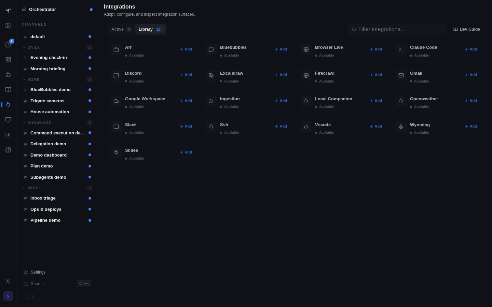

# Integrations



This is the canonical reference for how integrations work in Spindrel.

If other docs, UI copy, or track notes disagree with this page, this page wins.

## The shortest correct model

An **integration** is a folder under `integrations/<id>/` with one required file: `integration.yaml`. Everything else it exposes — tools, a renderer, a target, a router, hooks, widgets, a sidebar section, a background process — is a declarative hook that the app reads at startup. The app is the host. Integrations are tendrils into that host.

Two boundaries matter:

| Boundary | Rule |
|---|---|
| `app/` owns the host | Context assembly, turn loop, dispatcher, delivery contract, auth, session/channel model, policy enforcement, bus. None of this knows about Slack or Discord or BlueBubbles. |
| `integrations/<id>/` owns the tendril | Platform API calls, platform-specific event shapes, per-integration config, platform-specific tools, renderer logic for that platform. |

If a piece of code in `app/` branches on `integration_id == "slack"` it is a boundary violation. If a piece of code under `integrations/<id>/` imports from `app/` directly (instead of `integrations/sdk.py`) it is a boundary violation.

## What an integration can expose

Every extension point is declared in `integration.yaml` or auto-discovered from known filenames. The set is fixed and small:

| Kind | Declared as | Who authors it |
|---|---|---|
| Agent tools | `integrations/<id>/tools/*.py` with `@register({...})` | integration authors |
| Skills | `integrations/<id>/skills/*.md` (synced into the skill store) | integration authors |
| MCP servers | `mcp_servers:` in YAML | integration authors |
| Webhook intake | `router.py` + `webhook:` in YAML | integration authors |
| Delivery renderer | `renderer.py` registering a `ChannelRenderer` | integration authors |
| Dispatch target | `target:` in YAML (or `target.py` for custom logic) | integration authors |
| Lifecycle hooks | `hooks.py` registering integration metadata + event callbacks | integration authors |
| Config + settings | `settings:` in YAML + `config.py` accessors | integration authors |
| Activation manifest | `activation:` in YAML — per-channel tool/skill/MCP injection | integration authors |
| Channel binding picker | `binding:` in YAML + `suggestions_endpoint` on the router | integration authors |
| Sidebar navigation | `sidebar_section:` in YAML | integration authors |
| Dashboard modules | `dashboard_modules:` in YAML | integration authors |
| Tool widgets | `tool_widgets:` in YAML | integration authors |
| Machine-control provider | `machine_control:` in YAML | integration authors |
| Background process | `process:` in YAML or `process.py` | integration authors |
| Sidecar docker stack | `docker_compose:` in YAML | integration authors |
| Capabilities | `capabilities:` in YAML (overrides renderer ClassVar) | integration authors |
| OAuth flow | `oauth:` in YAML | integration authors |
| Web UI bundle | `web_ui:` in YAML | integration authors |

For "how to author" walkthroughs see [`docs/integrations/index.md`](../integrations/index.md). For "why we designed it this way" see [`docs/integrations/design.md`](../integrations/design.md). This page is the contract: what exists, who owns what, and which surfaces we are standardizing on versus retiring.

## Responsibility boundary

### What `app/` owns

- **Context assembly** (`app/agent/context_assembly.py`) — pulls tools, skills, memory, activation from DB + registries and assembles the LLM request.
- **Turn loop** (`app/agent/tasks.py`) — runs the agent; invokes tools; records costs; fires lifecycle hooks.
- **Dispatcher + delivery** (`app/services/integration_dispatcher.py`, `app/services/outbox*.py`) — reads `ChannelEvent`s, looks up the right renderer by `integration_id`, delegates.
- **Bus** (`app/services/turn_bus.py`, `app/domain/channel_events.py`) — typed event primitives + capability gating.
- **Session / channel / user** model — canonical DB tables and REST API.
- **Policy + auth** — tool policy, API keys, capability approvals.

None of this should know what "slack" or "discord" is by name.

### What `integrations/<id>/` owns

- Platform API clients (`integrations/slack/client.py`, `integrations/bluebubbles/client.py`, etc.).
- Event shape → `submit_chat` / `inject_message` translation.
- Renderer logic — turning `ChannelEvent`s into outbound API calls.
- Platform-specific tools + skills.
- Per-integration config (`integrations/<id>/config.py`).
- Per-integration validators, cleaners, and dispatch helpers (registered via `integrations/<id>/hooks.py`).

### What lives in a shared middle layer

- `integrations/sdk.py` — the only Python import surface integrations should use (`async_session`, `register`, `BaseTarget`, `SimpleRenderer`, `Capability`, etc.). Integrations should never `from app.* import ...`.
- `integrations/utils.py` — helpers that depend on core services (`ingest_document`, `inject_message`, `get_or_create_session`).

## Renderer module shape

Renderers should be thin routers over deep delivery modules. Do not put every platform concern into `renderer.py`.

Recommended files for a delivery-capable integration:

| File | Owns |
|---|---|
| `target.py` | The typed `DispatchTarget`, registered through `integrations.sdk.target_registry`. |
| `transport.py` | Receipt-shaped platform API calls for renderer delivery. This is the external boundary to mock in tests. |
| `renderer.py` | Target validation, event-kind routing, capability declarations, self-registration. |
| `message_delivery.py` | Durable `NEW_MESSAGE` delivery policy: echo prevention, internal-role skips, thread targeting, final external id. |
| `streaming.py` | Optional streaming placeholder/edit lifecycle for integrations with `STREAMING_EDIT`. |
| `approval_delivery.py` | Optional approval request delivery for integrations with `APPROVAL_BUTTONS`. |
| `attachment_delivery.py` | Optional platform file deletion for integrations with `FILE_DELETE` and direct `delete_attachment(...)`. |

The scaffold generated by `manage_integration(action="scaffold", features=["renderer"])` creates the baseline version of this shape: `target.py`, `transport.py`, `message_delivery.py`, and a thin `renderer.py`.

Testing rules:

- Behavior tests belong at the delivery-module boundary, not inside renderer routing tests.
- Renderer tests should be small: wrong-target failure, event-kind delegation, unsupported-event skip, and public protocol defaults.
- Use `tests.helpers.integration_renderer_contracts` for reusable renderer contract assertions when adding first-party integrations.
- Mock true external dependencies at `transport.py` or the injected platform-call boundary. Do not mock internal helper methods just to keep old shallow tests alive.

## Surface map

One row per top-level key in `app/services/integration_manifests.py::_KNOWN_KEYS`. If you add a key to `_KNOWN_KEYS`, add a row here — the drift test in `tests/unit/test_canonical_docs_drift.py` enforces it.

| Key | Contract | Backend | Status |
|---|---|---|---|
| `id` | Unique integration identifier. Required. | `integration_manifests.py:parse_integration_yaml` | active |
| `name` | Display name. Defaults to `id.title()` if omitted. | same | active |
| `icon` | Lucide-react icon name. Defaults to `Plug`. | same | active |
| `description` | One-line description shown in admin UI. | same | active |
| `version` | Semver string. Required. | same | active |
| `enabled` | Default enabled state; users can toggle. | `integration_manifests.py` | active |
| `includes` | Inherit tools/config from another integration. | `integrations/__init__.py::_get_setup` | active |
| `settings` | Env-var-shaped settings. Rendered as a form in the admin UI. DB-backed via `config.py::make_settings()`. | `app/services/integration_settings.py` | active |
| `oauth` | OAuth device/code flow config. | `integrations/<id>/router.py` + OAuth utils | active |
| `webhook` | Inbound webhook path + description. Displayed in admin UI so users configure the external service. | `router.py` owns the route | active |
| `binding` | Per-channel channel/entity picker — `client_id_prefix`, `suggestions_endpoint`, `config_fields`. See [Channel binding model](#channel-binding-model). | `integrations/<id>/router.py` serves suggestions | active |
| `target` | Typed dispatch target (auto-generates a frozen dataclass) or points to `target.py` for custom logic. | `integrations.discovery` | active |
| `capabilities` | Renderer capability flags (text, rich_text, rich_tool_results, threading, reactions, attachments, streaming_edit, approval_buttons, ephemeral, modals, …). Overrides renderer ClassVar. See [Integration Depth Playbook](#capability-model). | `app/services/capability_gate.py` | active |
| `tool_result_rendering` | Detailed support matrix for read-only rich tool-result envelopes: supported display modes, content types, view keys, fallback behavior, placement, and platform limits. YAML wins over renderer ClassVar. | `integrations.tool_output` + renderer adapter | active |
| `activation` | Per-channel tool/skill/MCP injection manifest. When a channel activates an integration, these surface. | `app/agent/channel_overrides.py` | active |
| `events` | Event types the integration can emit (used by task-trigger UI). | `app.services.integration_catalog` | active |
| `mcp_servers` | MCP servers this integration contributes. URL or container image. | `app/services/mcp_servers.py::seed_from_integrations` | active |
| `dependencies` | Python / npm / system dependencies. Admin UI surfaces install commands. NPM dependencies may declare `minimum_version` and `version_command` so persisted CLIs are upgraded when their binary exists but is too old. | `app/routers/api_v1_admin/integrations.py` | active |
| `docker_compose` | Sidecar stack file + project name template + allowed bind mounts. | `app/services/docker_stacks.py` | active |
| `runtime_services` | Shared sidecar capability contract. Providers declare endpoints they own; consumers declare required capabilities and optional external override settings. | `app/services/runtime_services.py` | active |
| `web_ui` | Static build directory + dev port for an integration-owned web UI. | `app.services.integration_catalog` | active |
| `sidebar_section` | Navigation section added to the main sidebar. | `/api/v1/admin/integrations/sidebar` | active |
| `dashboard_modules` | Pluggable panels for integration dashboards. Legacy naming may still appear around older dashboard modules. | `app.services.integration_catalog` | active |
| `debug_actions` | Admin-only debug/test actions. | `app.services.integration_catalog` | active |
| `api_permissions` | API scopes required for the integration's router. | `app/services/api_keys.py` | active |
| `tool_widgets` | Per-tool widget templates. **Owned by the widget system** — see [`widget-system.md`](widget-system.md). | `app/services/widget_templates.py` | active |
| `widget_presets` | Reserved. Widget presets live inside `tool_widgets` now — see [`widget-system.md`](widget-system.md). | (reserved) | reserved |
| `tool_families` | Reserved — tool grouping. | (reserved) | reserved |
| `machine_control` | Machine-control provider declaration (HA-style device control). | `app/services/machine_control/*` | active |
| `process` | Long-running subprocess (`cmd`, `required_env`, `watch_paths`). | `app/services/integration_processes.py` + `integrations.manifest_setup` | active |
| `provides` | Module inventory — `[tools, skills, renderer, target, router, hooks, …]`. Validation only; auto-detected. | `integrations.discovery` | active |

### Webhook security contract

Every integration that declares `webhook:` must also declare `webhook.security` so the admin security audit can inspect inbound callback risk without importing integration code.

```yaml
webhook:
  path: /integrations/example/webhook
  description: Example callback receiver
  security:
    triggers_agent: true
    auth:
      type: bearer_token        # or hmac_sha256
      setting: EXAMPLE_WEBHOOK_TOKEN
      required: true
    replay:
      strategy: durable_dedupe
      key: header:X-Example-Delivery
```

Callback routes that can inject messages or trigger agents must validate auth before parsing trusted work, require a stable replay key for agent-triggering events, and call `record_inbound_webhook_delivery` before fan-out. If the upstream platform cannot sign requests, document that as a sender-protocol limit and use bearer-token auth plus durable delivery-key dedupe as the minimum local-network contract.

## Channel binding model

The `binding:` section is one of the richest extension points. Declaring it gives the integration a first-class per-channel setup experience: the admin UI renders a picker, the user chooses a Slack channel / iMessage conversation / voice satellite / whatever, and the resulting `client_id` token drives routing, scoping, and renderer lookup.

### YAML shape

```yaml
binding:
  client_id_prefix: "slack:"
  client_id_placeholder: "slack:C01ABC123"
  client_id_description: "Slack channel ID"
  display_name_placeholder: "#general"
  suggestions_endpoint: "/integrations/slack/binding-suggestions"
  config_fields:
    - key: event_filter
      type: multiselect
      label: Event Filter
      description: "Which events to process (empty = all)"
```

### The `suggestions_endpoint` contract

Every integration that declares `binding.suggestions_endpoint` must return `list[BindingSuggestion]` from the canonical schema (see `app/schemas/binding_suggestions.py`):

```python
class BindingSuggestion(BaseModel):
    model_config = ConfigDict(extra="forbid")

    client_id: str                      # the token written to ChannelIntegration.client_id
                                        # (e.g., "slack:C01ABC123", "bb:iMessage;+;chat001")
    display_name: str                   # human-readable label the picker renders
    description: str = ""               # optional secondary line (channel topic, last message,
                                        # satellite URI, …)
    config_values: dict | None = None   # pre-fills binding.config_fields when selected (Wyoming
                                        # uses this for discovered satellite_uri)
```

The response is a bare list, not an envelope. Endpoints declare `response_model=list[BindingSuggestion]`; FastAPI enforces shape at the wire boundary. The admin UI consumes the same fields directly — `ui/src/api/hooks/useChannels.ts` defines a matching `BindingSuggestion` interface.

A parametrized test in `tests/integration/test_binding_suggestions_shape.py` loads every integration YAML, finds the ones with `binding.suggestions_endpoint`, and validates an example payload parses under the schema with `extra="forbid"`. Adding a new integration with a `suggestions_endpoint` that drifts from the schema fails CI.

### Who uses it today

`integrations/slack/router.py`, `integrations/bluebubbles/router.py`, `integrations/wyoming/router.py`. Any integration that has a concept of "which thing on the platform does this channel correspond to" should declare a binding.

### Where the picker appears in the UI

- **New-channel wizard** — primary setup flow. Picker is the first input when the user chooses a bound integration.
- **Channel settings → Integrations tab** — per-channel rebinding.
- **Admin → Integrations → [name]** — global test/debug.

## Integration Doctor

Agent readiness consumes integration state through the shared capability
manifest. `/api/v1/agent-capabilities` includes an `integrations` section with
two read-only views:

- workspace/admin health from the existing integration catalog: lifecycle
  status, required setting gaps, dependency gaps, process state, webhook/OAuth/
  API-key declarations, capabilities, and rich-result support;
- current-channel readiness from existing activation and binding rows:
  activated integrations, bound destinations, placeholder activation bindings,
  injected tools/includes, and missing required activation config.

This is diagnose-and-route only. Doctor proposed actions for integrations open
the existing Integration detail page or Channel settings tab. They do not
enable integrations, install dependencies, start processes, write secrets, or
invent a second integration setup path.

## What an integration exposes to other surfaces

Some surfaces are owned by their own canonical docs. This guide points at them — it does not duplicate them.

| If you need to extend… | Read |
|---|---|
| The widget / dashboard system (including `tool_widgets`, `html_widgets`, `native_widgets`) | [`widget-system.md`](widget-system.md) |
| Tool discovery, skill enrollment, MCP residency | [`discovery-and-enrollment.md`](discovery-and-enrollment.md) |
| Context admission + history profiles | [`context-management.md`](context-management.md) |
| UI archetypes, design tokens, surface conventions | [`ui-design.md`](ui-design.md) |
| Capability gating, platform depth (Slack → Discord → BlueBubbles recipe) | [`../../project-notes/Integration Depth Playbook.md`](../../project-notes/Integration%20Depth%20Playbook.md) |
| Webhook signing + lifecycle events | [`webhooks.md`](webhooks.md) |
| Custom tools (registration, schema, injection) | [`custom-tools.md`](custom-tools.md) |
| How a channel activates an integration (tools/skills/MCP injection) | [`templates-and-activation.md`](../integrations/activation-and-templates.md) |

## Capability model

Capabilities declare what a renderer can do. The dispatcher reads declared capabilities to decide which events to deliver: e.g., `Capability.EPHEMERAL` means the renderer handles `EPHEMERAL_MESSAGE` events; without it, the publisher falls back to a broadcast `NEW_MESSAGE` with a visibility marker.

- **Declare** in `integration.yaml:capabilities`.
- **Assert** in a renderer unit test: `assert Capability.X in MyRenderer.capabilities`.
- **Over-declaration is a silent bug.** Declared capability with no handler branch = events silently dropped.
- **Under-declaration is a missed affordance.** Platform supports modals but you didn't declare `MODALS`? The `open_modal` tool short-circuits with `unsupported=True`.

For the full list of capabilities and the Slack pilot's 5-phase depth recipe, see [`../../project-notes/Integration Depth Playbook.md`](../../project-notes/Integration%20Depth%20Playbook.md).

### Rich tool results

Rich tool results are advisory presentation layered onto durable `NEW_MESSAGE` delivery. The message text is always the baseline. A renderer that declares `rich_tool_results` and a `tool_result_rendering` block may render `Message.metadata.tool_results` as native read-only cards; renderers without that support ignore the metadata and deliver text normally.

The shared SDK boundary is `integrations.tool_output`, re-exported from `integrations.sdk`. Renderers call `build_tool_result_presentation(...)` to get badges, portable cards, and unsupported-envelope fallbacks. Platform adapters then translate portable cards to Block Kit, embeds, or another native representation.

V1 rules:

- `tool_result_rendering` is manifest-first; optional renderer ClassVar declarations exist for tests and plugin renderers.
- Slack and Discord render rich results today. BlueBubbles and GitHub continue plain-text fallback until their adapters are deliberately added.
- Rich results are read-only. Widget/component actions are not exported as Slack buttons; approvals stay on `approval_buttons`.
- `tool_output_display` remains the channel-level policy for `compact | full | none`.
- HTML and native widget envelopes degrade to compact badges outside the web host.

Producer-side rules:

- Return a normal textual result first. That text is the durable baseline for every renderer.
- Add `_envelope` only when the tool has a better structured presentation than its raw text.
- Prefer renderer-neutral `view_key` + `data` when the shape is common enough for core to own, such as `core.search_results`.
- Use transcript-safe content types for chat integrations: `text/plain`, `text/markdown`, `application/json`, `application/vnd.spindrel.components+json`, `application/vnd.spindrel.diff+text`, or `application/vnd.spindrel.file-listing+json`.
- Use `application/vnd.spindrel.html+interactive` only for web-hosted widgets. Slack and Discord intentionally fall it back to a badge.

Example tool result with a semantic view key:

```json
{
  "summary": "Found 2 results for python asyncio timeout.",
  "_envelope": {
    "content_type": "application/vnd.spindrel.components+json",
    "plain_body": "Found 2 results for python asyncio timeout.",
    "display": "inline",
    "display_label": "Search results",
    "view_key": "core.search_results",
    "data": {
      "query": "python asyncio timeout",
      "count": 2,
      "results": [
        {
          "title": "asyncio.wait_for",
          "url": "https://docs.python.org/3/library/asyncio-task.html",
          "content": "Run an awaitable with a timeout."
        }
      ]
    }
  }
}
```

Example transcript-safe JSON result:

```json
{
  "summary": "Command exited with status 0.",
  "_envelope": {
    "content_type": "application/json",
    "plain_body": "Command exited with status 0.",
    "display": "inline",
    "display_label": "Command result",
    "view_key": "core.command_result",
    "data": {
      "status": "0",
      "duration_ms": "142",
      "target": "local"
    }
  }
}
```

## Lifecycle hooks

`integrations/<id>/hooks.py` is where an integration registers two kinds of callback:

### Integration metadata

```python
from app.agent.hooks import IntegrationMeta, register_integration

register_integration(IntegrationMeta(
    integration_type="slack",
    client_id_prefix="slack:",
    user_attribution=_user_attribution,  # optional
))
```

This is how the host learns about an integration's `client_id_prefix` without hard-coding it. The `is_integration_client_id()` lookup, user mirroring, and admin display-name resolution all route through these registrations.

### Lifecycle event callbacks

| Event | Mode | Fired when |
|---|---|---|
| `before_context_assembly` | fire-and-forget | Before context is built for an LLM call |
| `before_llm_call` | fire-and-forget | Before each LLM API call |
| `after_llm_call` | fire-and-forget | After LLM API call completes |
| `before_tool_execution` | fire-and-forget | After auth/policy checks, before tool runs |
| `after_tool_call` | fire-and-forget | After each tool execution |
| `after_response` | fire-and-forget | After agent returns final response |
| `before_transcription` | **override-capable** | Before audio is transcribed (STT) |

Fire-and-forget hooks are broadcast; errors are logged but never propagate. Override-capable hooks short-circuit on the first non-`None` return — an integration can replace default STT, for example.

### Integration-owned predicates and cleaners

In addition to the lifecycle events above, three callback kinds are owned by `integrations/<id>/hooks.py` via the `app/services/integration_validators.py` registry (see [Anti-patterns](#anti-patterns) for why this registry exists):

| Hook | Purpose | Registry key |
|---|---|---|
| `recipient_user_id_valid(recipient_id) -> bool` | Predicate for whether `EPHEMERAL_MESSAGE.recipient_user_id` is a valid identifier for this integration. | `register("<id>", "recipient_user_id_valid", fn)` |
| `integration_id_from_sender_id(sender_id) -> bool` | Does this integration own the given `sender_id` prefix/shape? | `register("<id>", "claims_sender_id", fn)` |
| `cleanup_attachment(meta) -> bool` | Given message attachment metadata, delete the remote file if this integration owns it. | `register("<id>", "cleanup_attachment", fn)` |

Each integration registers its own implementation at import time. The app iterates registered callbacks rather than branching on `integration_id`.

## Anti-patterns

These are the things that have bitten us in the past. New code must not reintroduce them.

### 1. Integration-specific branches in `app/`

```python
# ❌ WRONG — in app/services/ephemeral_dispatch.py
if integration_id == "slack":
    return bool(SLACK_USER_ID_RE.match(recipient_user_id))
elif integration_id == "discord":
    return recipient_user_id.isdigit()
```

```python
# ✅ RIGHT — in app/services/ephemeral_dispatch.py
validator = integration_validators.lookup(integration_id, "recipient_user_id_valid")
return validator(recipient_user_id) if validator else False
```

Known violation sites (to be migrated to the registry pattern above):

| File:line | Branch | Replacement hook |
|---|---|---|
| `app/services/ephemeral_dispatch.py:168-172` | per-integration recipient-id validators | `recipient_user_id_valid` |
| `app/routers/chat/_helpers.py:108` | `sender_id.startswith("slack:")` | `claims_sender_id` |
| `app/services/attachments.py:307` | `if meta.get("slack_file_id"):` | `cleanup_attachment` |
| `app/tools/local/tasks.py:336` | `if dispatch_type == "slack":` | deferred (Task Sub-Sessions active development) |

### 2. Integrations importing from `app/`

```python
# ❌ WRONG — in integrations/mygithub/tools/whatever.py
from app.db.engine import async_session
from app.agent.hooks import register_integration
```

```python
# ✅ RIGHT — in integrations/mygithub/tools/whatever.py
from integrations.sdk import async_session, register_integration
```

`integrations/sdk.py` is the single import surface. If something you need isn't there, add it to the SDK — don't reach into `app/`.

### 3. Agent tool reaching into integration internals

```python
# ❌ WRONG — in app/tools/local/something.py
from integrations.slack.client import post_message
```

```python
# ✅ RIGHT — resolve the integration at runtime via the renderer registry
from integrations.sdk import renderer_registry
renderer = renderer_registry.get(integration_id)
await renderer.send_text(target, text)
```

Tools that are explicitly platform-scoped (e.g. `slack_post_ephemeral`) should live under `integrations/slack/tools/`. Tools that target "the current channel's integration" should resolve at runtime.

### 4. Dispatcher-side event rewriting

Don't rewrite one `ChannelEventKind` into another inside `IntegrationDispatcherTask._dispatch`. Fan-out means the rewrite would fire per-renderer. Decisions that depend on "what integration is bound here" belong at publish time (see `deliver_ephemeral`).

### 5. Dual-path delivery

Don't publish the same logical event on both the outbox and the ephemeral bus and rely on renderer dedup. The `is_outbox_durable` split on `ChannelEventKind` is the contract — stick with it. Durable kinds flow through the outbox; transient kinds flow through the bus.

### 6. Silent capability over-declaration

Declaring `Capability.REACTIONS` in YAML without a `render()` branch for reaction events means those events silently disappear. A renderer unit test asserting every declared capability has a rendered case catches this.

### 7. Same private helper in two integrations

Copy-pasting a helper into a second `integrations/<id>/` instead of lifting it to `integrations/sdk.py`. The SDK is *the* shared boundary for cross-cutting helpers; growing a parallel `_resolve_chrome` in two integration trees is the same drift as importing `app.*` directly.

**Workflow when you reach for a helper inside an integration:**

1. Grep `integrations/sdk.py` first.
2. If it's there, use it.
3. If it isn't and the helper is plausibly cross-cutting (system binaries, URL safety, time coercion, attachment plumbing, …), add it to `integrations/sdk.py` instead of inside the integration.
4. If it's genuinely integration-private (e.g. parsing one platform's webhook payload), keep it local.

`tests/unit/test_integration_no_duplicate_helpers.py` is the gate: any private function name appearing in two distinct `integrations/<id>/` trees fails CI unless it's in the test's `ALLOWED_DUPLICATES` allowlist (with a one-line rationale). The allowlist also self-prunes — stale entries fail the companion `test_allowlist_does_not_rot`.

## System dependencies (apt packages)

Integrations that need a system binary (chromium, gh, jq, ripgrep, …) declare it in their manifest:

```yaml
# integration.yaml
dependencies:
  system:
    - binary: chromium
      apt_package: chromium
      alternatives: [chromium-browser, google-chrome-stable, google-chrome]
      install_hint: "Click Install or run: apt-get install -y chromium"
```

`app/services/integration_deps.py` honors this declaration in two places:

1. **First-time install** via the admin UI's "Install" button or `ensure_one_integration_deps()` on enable. Calls `install_system_package(apt_package)` which runs `apt-get download` + `dpkg -x` into `/opt/spindrel-pkg/` (a named Docker volume) — NOT `/usr/bin`. This persists across image rebuilds (`spindrel pull`) without baking packages into the image layer.
2. **Re-extract on rebuild** — `_check_system_deps()` reads `.installed-system-deps.json` from the workspace volume and re-runs the install for any previously-installed package whose binary is missing after a rebuild.

The entrypoint (`scripts/entrypoint.sh`) prepends `/opt/spindrel-pkg/usr/bin` to `PATH` and `/opt/spindrel-pkg/usr/lib*` to `LD_LIBRARY_PATH`, so `shutil.which("chromium")` finds the persistent binary just like a normal system install.

### Looking up a binary from a tool

**Always go through PATH (`shutil.which`)** — never hardcode `/usr/bin/<name>`. Hardcoded `/usr/bin` checks miss the persistent `/opt/spindrel-pkg` prefix and produce phantom "not installed" errors.

For chromium specifically the SDK ships a helper that handles both lookup and one-time auto-install:

```python
# integrations/<id>/tools/<tool>.py
from integrations.sdk import resolve_chrome

chrome = await resolve_chrome()  # or resolve_chrome(("myint", "MYINT_CHROME_PATH"))
if not chrome:
    return "No Chrome/Chromium found. ..."
```

`resolve_chrome()` resolves in this order: optional integration-setting → `CHROME_PATH` / `PUPPETEER_EXECUTABLE_PATH` env vars → `shutil.which()` for the chrome binaries → hardcoded fallback paths (including `/opt/spindrel-pkg/usr/bin/`). On miss it calls `install_system_package("chromium")` once — the same install path as the admin UI button, idempotent. Used by `excalidraw` and `marp_slides`.

Shared runtime containers are not system dependencies. If one integration needs a long-running sidecar that another integration can reuse, declare it under `runtime_services` instead of adding another `dependencies.system` entry or duplicating a `docker_compose` service.

Example:

```yaml
runtime_services:
  provides:
    - capability: browser.playwright
      protocol: cdp
      browser: chromium
      endpoint: "ws://playwright-${SPINDREL_INSTANCE_ID}:3000"
      service: playwright
```

Consumers declare the capability they need and the setting that wins when a user brings their own service:

```yaml
runtime_services:
  requires:
    - capability: browser.playwright
      override_setting: PLAYWRIGHT_WS_URL
      when:
        setting: WEB_SEARCH_MODE
        values: ["searxng"]
```

Lifecycle stays explicit: enabling a consumer can auto-enable its provider, and startup re-runs that provider reconciliation for already-enabled consumers after manifest loading. The provider integration remains separately visible and can expose its own tools only through normal activation, pinning, or admin enablement paths.

For other binaries follow the same pattern: declare in `dependencies.system`, look up with `shutil.which()`, and (optionally) call `install_system_package(apt_package)` from your tool when a missing binary is recoverable. If the lookup pattern ends up duplicated in a second integration, lift it into `integrations/sdk.py` rather than copy-pasting.

## Removed surface

### `chat_hud` / `chat_hud_presets` — removed 2026-04-23

A BlueBubbles-era extension point that rendered a status strip, side panel, input bar, or floating action in the channel chat view. Previously used by `bluebubbles` and `ingestion`.

**Why it's gone.** The widget / dashboard system covers the same use cases with durable pins, a richer component DSL, and dashboard placement. Two parallel "stuff appears alongside chat" surfaces is drift.

**If you want something HUD-shaped back.** Author it as a standalone HTML widget under `integrations/<id>/widgets/<name>.html`. The scanner discovers it automatically, publishes it to the library with `source="integration"`, and it's pinnable on channel dashboards. It can poll its own data via `window.spindrel.api("/integrations/<id>/...")` at any cadence. See [`widget-system.md` § How to choose the right lane](widget-system.md#how-to-choose-the-right-lane).

The keys no longer parse; no YAML block, backend discovery, router endpoint, UI hook, or type lingers. Do not reintroduce them.

## Cross-references

- [`docs/integrations/index.md`](../integrations/index.md) — authoring walkthrough (step-by-step).
- [`docs/integrations/design.md`](../integrations/design.md) — architectural rationale.
- [`docs/integrations/activation-and-templates.md`](../integrations/activation-and-templates.md) — activation manifest + template compatibility.
- [`docs/integrations/example.md`](../integrations/example.md) — minimal `integrations/example/` scaffold.
- [`docs/integrations/message-ingest-contract.md`](../integrations/message-ingest-contract.md) — message-ingestion API contract.
- [`../../project-notes/Integration Depth Playbook.md`](../../project-notes/Integration%20Depth%20Playbook.md) — platform-depth recipe.
- [`docs/guides/widget-system.md`](widget-system.md) — widget contracts and host policy.
- [`docs/guides/discovery-and-enrollment.md`](discovery-and-enrollment.md) — tool/skill/MCP residency.
- [`docs/guides/webhooks.md`](webhooks.md) — webhook signing + lifecycle event forwarding.
