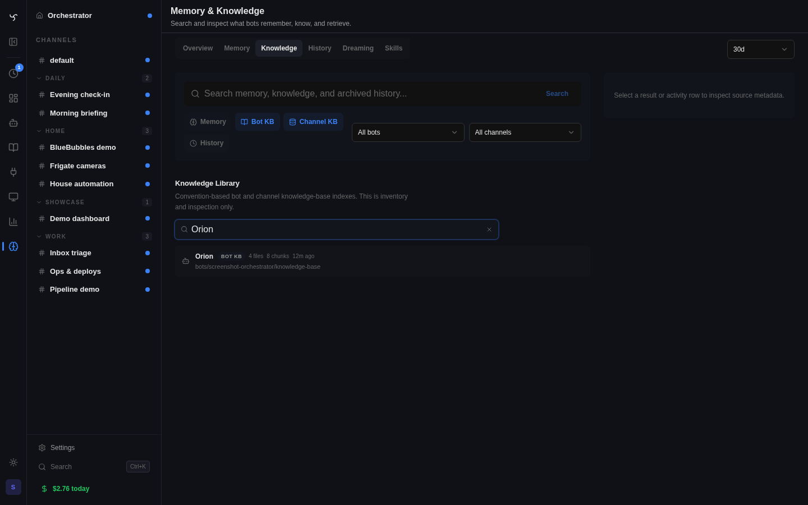

# Knowledge Bases

Spindrel has two curated knowledge layers plus one short-form memory layer:

- `channels/<channel_id>/knowledge-base/`
  - room or project facts
  - scoped to one channel
- `knowledge-base/` or `bots/<bot_id>/knowledge-base/`
  - bot-wide reference material
  - follows the bot across channels
- `memory.md`
  - short behavioral notes and preferences

## Runtime model

Channel knowledge base:

- indexed automatically
- relevant excerpts are auto-retrieved in normal channel chat/execution
- when excerpts are injected, the model is told to use `search_channel_knowledge` for deeper lookups

Bot knowledge base:

- indexed automatically
- relevant excerpts are auto-retrieved for the bot by default
- can be switched to search-only mode from the bot Workspace settings
- when excerpts are injected, the model is told to use `search_bot_knowledge` for deeper lookups

Both layers are narrower than the broad workspace search paths:

- `search_channel_workspace`
- `search_workspace`

Those broad tools are for “where did we put X?” or repo/document discovery. The KB tools are for curated facts.

## What Belongs Where

Use channel KB for:

- project decisions
- runbooks for this room
- channel-specific glossaries
- stable team or household reference docs

Use bot KB for:

- reusable templates
- cross-channel operating playbooks
- stable reference docs the bot should carry everywhere
- canonical facts about the bot’s operating domain

Use `memory.md` for:

- short reply preferences
- user-specific behavioral notes
- high-signal reminders that are not worth giving their own file

Use normal workspace files for:

- transient working notes
- generated outputs
- scratch docs
- code or files that are not curated knowledge

## Retrieval Priority

In channel chat, the practical order is:

1. channel KB
2. bot KB
3. broader workspace retrieval

That keeps room-specific facts ahead of bot-wide defaults, and both ahead of general file search.

## Filesystem Conventions

The folder names are fixed conventions:

- channel: `channels/<channel_id>/knowledge-base/`
- standalone bot: `knowledge-base/`
- shared-workspace bot: `bots/<bot_id>/knowledge-base/`

Subfolders are only organizational. Indexing is recursive.

## Shared Brief Convention

When the bot runs an upfront clarification or interview pass, the default durable brief
belongs in the channel KB:

- `channels/<channel_id>/knowledge-base/project-brief.md`

That file is the canonical place for:

- objective
- success criteria
- constraints
- non-goals
- decisions
- open questions

If the user explicitly wants the same brief to be reusable across channels, store it in
the bot-wide KB instead:

- `knowledge-base/briefs/<slug>.md`
- shared-workspace equivalent: `bots/<bot_id>/knowledge-base/briefs/<slug>.md`

## Search Tools

- `search_channel_knowledge(query)` for room-specific curated facts
- `search_bot_knowledge(query)` for bot-wide curated facts
- `search_channel_workspace(query)` for broader channel files
- `search_workspace(query)` for broader bot/workspace files

If a question might hit both channel and bot knowledge, call both KB tools.
