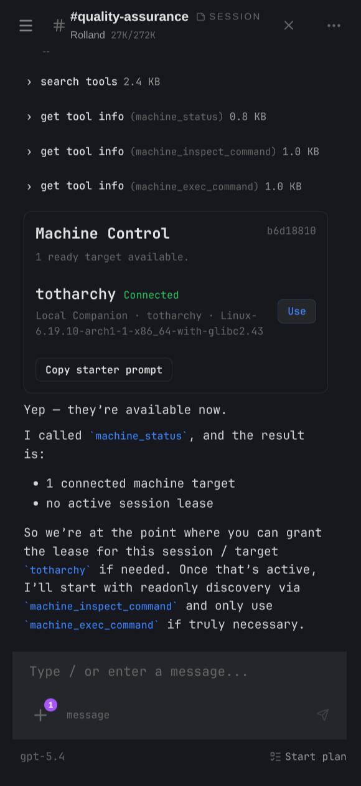

# Local Machine Control



This is the canonical document for Spindrel's "operate on a real machine" architecture.

If the provider contract, lease rules, tool names, admin surfaces, or local companion role change, update this file first and then update the shorter summaries that point at it.

## What this is for

Spindrel runs on a server. That server is not automatically the same machine as the user's workstation, laptop, or other boxes on their network.

Machine control exists for cases where the useful action is:

- inspect the user's actual local checkout
- run a command in the user's real shell environment
- check local git/process/config state
- operate on other explicit machines such as LAN boxes over SSH or other future drivers

The feature exists to preserve that trust boundary rather than blur it with ordinary server-side execution.

## Current design in one sentence

Machine control is a core subsystem with pluggable providers. A live signed-in admin user grants one session a temporary lease for one explicit machine target, or grants one scheduled task definition a durable machine target grant advertised by a provider automation adapter. Core requires a fresh ready check before the selected provider executes work on that target.

## Core mental model

| Term | Meaning |
|---|---|
| `machine target` | A controllable machine endpoint identified by `(provider_id, target_id)` |
| `provider` | The implementation/transport behind the target |
| `driver` | The provider's transport family such as `companion` or `ssh` |
| `profile` | A provider-scoped reusable credentials/trust/config object that one or more targets may reference |
| `ready` | Provider-reported ability to execute right now after a probe or live-status check |
| `connection` | The provider's current live transport handle for drivers that keep one, such as `local_companion` |
| `handle_id` | Provider-specific runtime handle such as a companion connection id or `ssh://user@host:port` |
| `lease` | A session-scoped grant allowing one session to control one target temporarily |
| `task machine grant` | A durable task-definition grant for one provider-advertised machine target, used by scheduled pipelines and task-origin agent tools |
| `execution_policy` | A runtime guard layered on top of normal tool policy |

Important distinctions:

- a target is the machine
- readiness is the execution gate; some providers compute it from a live connection, others from a fresh probe
- a connection is only one possible transport detail, not the cross-provider contract
- a lease is the user's explicit permission for one session to use that target
- a task machine grant is explicit permission for scheduled automation to use one provider-advertised machine target

Spindrel never routes by recency. The target is always explicit.

## Why this is core-owned

Machine control is not just "an integration with some tools."

The app needs native, provider-agnostic surfaces for:

- session lease state
- transcript grant/revoke flows
- rich tool results
- admin machine management
- future provider expansion

If those lived under `local_companion`, every future provider would have to tunnel through someone else's product surface. That would violate the app/integration boundary in the wrong direction.

So the split is:

- core owns the abstraction, tools, leases, admin page, session APIs, and result renderers
- integrations implement a typed machine-control provider contract

## Current architecture

```text
chat or plan session
    │
    │ uses machine_* tool
    ▼
execution-policy gate
    │
    ├── requires live JWT user
    ├── requires active presence
    ├── requires valid session lease
    └── requires freshly ready leased target
    ▼
core machine-control service
    │
    │ dispatch(provider_id, target_id, op, args)
    ▼
provider implementation
    │
    ├── local_companion
    ├── ssh
    └── other providers later
    ▼
target machine
```

Scheduled automation has a separate entry path:

```text
scheduled task or pipeline
    │
    ├── deterministic step: machine_inspect / machine_exec
    │       └── validates task_machine_grants row and probes machine target
    │
    └── agent step / prompt task
            └── materializes a short session lease from the task grant
                before machine_* tools can run
```

## Current shipped pieces

### 1. Core service and provider registry

`app/services/machine_control.py` is the core service.

It owns:

- provider discovery
- provider-aware target payloads
- provider-aware lease grant/revoke
- execution-policy validation
- admin machines aggregation
- helper payloads for session and transcript surfaces

Providers are discovered from integrations that declare machine control through:

- `provides: ["machine_control"]`
- an optional `machine_control:` block in `integration.yaml`
- a runtime module at `integrations/<id>/machine_control.py`

### 2. Provider contract

Each provider implements a machine-control contract that exposes:

- identity metadata: `provider_id`, `label`, `driver`
- optional provider-scoped profile CRUD and safe profile summaries
- target enumeration and lookup
- cached target status lookup
- fresh probe capability
- optional enrollment/removal
- provider-defined enrollment fields/config
- command execution methods

This keeps core UI and APIs provider-agnostic while still letting providers add metadata.

Providers that are safe for unattended scheduled task runs opt in through the manifest block `machine_control.task_automation`. Core reads that block to build task-editor grant options, expose only supported machine step types, and validate task grants. Implementing `machine_control.py` alone is not enough to make a provider available to scheduled automation.

### 3. Session lease state

The active session lease lives in:

- `machine_target_leases` as the canonical store
- legacy `Session.metadata_["machine_target_lease"]` payloads as a backward-compatible fallback

Current stored fields:

- `lease_id`
- `provider_id`
- `target_id`
- `user_id`
- `granted_at`
- `expires_at`
- `capabilities`
- `handle_id`

Compatibility note:

- older payloads may still expose `connection_id` / `connected`
- current canonical fields are `handle_id` / `ready` / `status` / `reason` / `checked_at`

Load-bearing invariants:

- one session may lease one target
- one target may be leased by one session
- leases are always explicit and session-scoped
- scheduled task grants are definition-scoped and limited to providers that advertise `machine_control.task_automation`
- a task grant may create a short session lease for an agent run, but it does not create a persistent SSH PTY/session
- saved task grants surface diagnostics when the provider, target, or required capability drifts

### 4. Execution policies

Machine tools use runtime execution policies in addition to normal tool policy.

Current policy values:

| Policy | Meaning |
|---|---|
| `normal` | no extra runtime gate |
| `interactive_user` | requires a live signed-in user with active presence |
| `live_target_lease` | requires the above plus a valid session lease for a ready target after a fresh provider probe |

For autonomous origins (`task`, `subagent`, `heartbeat`, `hygiene`), machine-control tools remain denied unless the current task resolves to an active `task_machine_grants` row. Agent tasks with such a grant get a short runtime lease for their resolved channel session; deterministic pipeline machine steps use the grant directly and probe before command execution.

Current core machine tools:

| Tool | Tier | Execution policy |
|---|---|---|
| `machine_status` | `readonly` | `interactive_user` |
| `machine_probe_catalog` | `readonly` | `interactive_user` |
| `machine_run_probe` | `readonly` | `live_target_lease` |
| `machine_inspect_command` | `readonly` | `live_target_lease` |
| `machine_exec_command` | `exec_capable` | `live_target_lease` |

These are core tools in `app/tools/local/machine_control.py` and
`app/tools/local/machine_probes.py`. They are not owned by `local_companion`.

### 5. Core APIs and UI surfaces

Current core APIs:

- Session lease/state:
  - `GET /api/v1/sessions/{id}/machine-target`
  - `POST /api/v1/sessions/{id}/machine-target/lease`
  - `DELETE /api/v1/sessions/{id}/machine-target/lease`
- Task machine grants:
  - `GET /api/v1/admin/tasks/machine-automation-options`
  - `machine_target_grant` field on `POST /api/v1/admin/tasks`
  - `machine_target_grant` field on `PATCH /api/v1/admin/tasks/{task_id}`
- Admin machine center:
  - `GET /api/v1/admin/machines`
  - `POST /api/v1/admin/machines/providers/{provider_id}/profiles`
  - `PUT /api/v1/admin/machines/providers/{provider_id}/profiles/{profile_id}`
  - `DELETE /api/v1/admin/machines/providers/{provider_id}/profiles/{profile_id}`
  - `POST /api/v1/admin/machines/providers/{provider_id}/enroll`
  - `POST /api/v1/admin/machines/providers/{provider_id}/targets/{target_id}/probe`
  - `DELETE /api/v1/admin/machines/providers/{provider_id}/targets/{target_id}`

Current core UI:

- `Admin > Machines` for provider/target management
- transcript-native `core.machine_access_required` grant UI
- transcript/native result views:
  - `core.machine_target_status`
  - `core.command_result`
  - `core.machine_access_required`
- optional native widget `core/machine_control_native` for channel-scoped status + controls

Machine control no longer renders as default chat-header chrome. Required grant/revoke interactions are transcript-first, and the optional native widget is a convenience surface the user pins deliberately.

### 6. `local_companion` provider

`integrations/local_companion/` is the paired-machine provider for the user's current workstation or laptop.

It owns:

- `machine_control.py` provider implementation
- `bridge.py` live websocket bridge
- `router.py` websocket endpoint at `/integrations/local_companion/ws`
- `client.py` companion process run on the target machine

It no longer owns:

- the machine tools
- the machine admin center
- the session lease APIs

This provider uses `driver="companion"` and derives readiness from its live outbound WebSocket connection.

### 7. `ssh` provider

`integrations/ssh/` is the headless-machine provider for LAN boxes or other reachable SSH hosts.

It owns:

- `machine_control.py` provider implementation
- provider-wide timeout/output settings in integration settings
- provider-scoped SSH profiles for credentials and host trust
- target enrollment metadata such as host, username, port, and optional default working directory

It uses `driver="ssh"` and derives readiness from a fresh SSH probe rather than a long-lived live connection.

SSH profiles live in app-managed provider settings, not ephemeral container filesystem state, so container rebuilds do not wipe configured keys or `known_hosts`.

## Current request flow

### Enroll a target

1. If the provider supports profiles, admin creates or updates a profile first.
2. Admin calls `POST /api/v1/admin/machines/providers/{provider_id}/enroll`.
3. Core resolves the provider and asks it to enroll a target.
4. The provider creates target state and returns any provider-specific setup information.
5. For `local_companion`, the response includes the example companion launch command.

### Create or update a provider profile

1. Admin calls one of:
   - `POST /api/v1/admin/machines/providers/{provider_id}/profiles`
   - `PUT /api/v1/admin/machines/providers/{provider_id}/profiles/{profile_id}`
2. Core resolves the provider and hands off profile validation/storage.
3. The provider persists the profile in provider-owned durable storage.
4. Core only receives safe summary payloads back. Secret values are never echoed into the UI.

### Refresh or probe a target

1. Admin or the session UI triggers a probe or the runtime needs one for lease/tool validation.
2. Core asks the provider for a fresh readiness check.
3. The provider updates cached target metadata such as `ready`, `status`, `reason`, `checked_at`, and `handle_id`.
4. The machine center and session surfaces render from that cached status, but lease grant and execution still require a fresh successful probe.

### Connect the companion

1. The user runs the companion on the target machine.
2. The companion connects outbound to `/integrations/local_companion/ws`.
3. The provider updates connection metadata for that `target_id`.
4. Core machine status now reports the target as ready/connected.

### Probe an SSH target

1. The SSH provider materializes the configured private key and `known_hosts` blob into locked temp files at runtime.
2. It runs a strict non-interactive OpenSSH probe.
3. Cached target metadata is updated with reachability, hostname, platform, and readiness reason.
4. Temp files are deleted after the subprocess completes.

### Grant a session lease

1. A live signed-in admin chooses a target for a session.
2. Core performs a fresh provider probe for that target.
3. If the target is ready, the session API stores a lease in `machine_target_leases`.
4. Conflict checks ensure no other session already owns that target.

### Grant a scheduled machine task

1. Admin creates or edits a task definition and selects one provider-advertised machine target in the task execution settings.
2. The API stores a `task_machine_grants` row with provider id, target id, capabilities, and whether LLM machine tools are allowed.
3. The task detail payload includes non-blocking diagnostics if the pipeline has machine steps without a grant, the grant target disappears, or the selected provider no longer advertises a required capability.
4. Pipeline `machine_inspect` / `machine_exec` steps validate that row and probe the target immediately before running the provider command.
5. Prompt tasks and pipeline `agent` steps with machine tools create a short `machine_target_leases` row for the task's resolved session before the agent loop starts.

### Execute a machine tool

1. A chat or plan session calls `machine_inspect_command` or `machine_exec_command`.
2. The execution-policy gate verifies:
   - live signed-in user
   - active presence
   - current session id
   - valid unexpired lease
   - current leased target passes a fresh readiness probe
3. Core dispatches the operation through the selected provider.
4. The provider talks to its transport and returns the result.
5. The tool emits a structured rich result envelope.

## How to use it now

### Operator flow

#### Local companion

1. Go to `Admin > Machines`.
2. Enroll a target under the `Local Companion` provider.
3. Copy the returned launch command.
4. Run that command on the target machine. The current launch flow downloads the companion script from the server first, then starts it locally with Python.
5. Confirm the machine appears as ready in `Admin > Machines`.

If you lose the launch command, open the target row in `Admin > Machines` and use `Copy launcher` to regenerate it. Use `Install service` when the target should reconnect automatically after a crash, server restart, or websocket disconnect. The user-service installer creates an isolated Python environment under the user's home directory, installs the `websockets` dependency, writes a `systemd --user` service, and starts it.

Local Companion is the best fit for a workstation or laptop where outbound WebSocket pairing is easier than exposing SSH. It runs locally as the user's account and uses target-side guardrails such as allowed roots, inspect prefixes, blocked patterns, timeouts, and output caps.

#### SSH

1. Go to `Admin > Machines`.
2. Under the `SSH` provider, create at least one profile containing:
   - private key
   - `known_hosts`
3. Enroll a target under the `SSH` provider with:
   - profile
   - `host`
   - `username`
   - optional `port`
   - optional default `working_dir`
4. Use `Probe` from `Admin > Machines` to confirm the target becomes reachable.
5. Grant that target to the session you want to use.

SSH profiles and target references survive container rebuilds because they live in app-managed provider settings. Only short-lived temp files are created at runtime for the actual `ssh` subprocess.

SSH is the best fit for headless machines, LAN boxes, and hosts that already have key-based access. It does not run a companion process; readiness comes from a fresh probe using the selected profile's private key and `known_hosts`.

### Session flow

1. Open the session you want to use.
2. Call `machine_status` or let the transcript surface the inline access-required card.
3. Grant a lease for the target you want to use.
4. Optionally pin the native `Machine control` widget if you want persistent session-scoped quick controls in the channel workspace.
5. Use `machine_inspect_command` for discovery first.
6. Use `machine_probe_catalog` and `machine_run_probe` for bounded
   progressive discovery when the symptom is network, DNS, port, Docker,
   Compose, or service reachability related.
7. Pin a Machine Probe preset when you want the same check to refresh on a
   dashboard. Current presets cover TCP port checks, DNS lookup, HTTP
   reachability, Docker summary, and Docker log tail.
8. Use `machine_exec_command` when you really need execution on that machine.
9. Revoke the lease or let it expire.

The UI now offers copyable starter prompts on machine status/access cards and in the machine center. Those prompts are only guidance for the bot. They do not grant access. The actual gates remain:

- the bot must have or discover the `machine_*` tools
- a live signed-in admin must grant a session-scoped lease
- `machine_exec_command` may still require normal tool-policy approval

## Safety model

Machine control is intentionally fail-closed.

### Required by default

- a live signed-in admin user
- active user presence
- a valid session lease
- a freshly ready leased target

### Denied by default

These origins do not get to use machine-control tools just because they can call tools:

- tasks
- heartbeats
- hygiene/background runs
- subagents
- bot-key `/api/v1/internal/tools/exec`
- other non-interactive surfaces without a live user context

They must go through an explicit task machine grant. In the current build only providers that advertise `machine_control.task_automation` are grantable to scheduled automation. SSH advertises `inspect` and `exec`; Local Companion advertises `inspect` only and must be currently connected when the scheduled inspect step runs.

### Provider-side guardrails still matter

Core lease checks are not the only defense.

Across all providers:

- `machine_inspect_command` is validated by a shared core inspect-command policy before provider dispatch
- lease grant and lease-gated execution require a fresh provider probe

For `local_companion`, the target-side process still enforces local limits such as:

- allowed roots
- inspect-command restrictions
- blocked patterns
- timeouts
- output caps

That matters because the target machine remains the final trust boundary.

For `ssh`, the provider still enforces:

- key-only auth
- strict host key checking
- no password prompts
- no TTY allocation
- no forwarding
- subprocess timeouts and output caps

## Current limits

- Two providers are shipped: `local_companion` and `ssh`.
- SSH uses provider-scoped named profiles. There is no provider-global ambient SSH key fallback.
- `local_companion` bridge state is still in-memory; multi-worker deployments need shared coordination before companion transport becomes horizontally safe.
- Both shipped providers are shell-first.
- `browser_live` has not yet been moved onto this same lease model.
- SSH is non-interactive and key-only in this build. No password auth, TOFU, port forwarding, or persistent SSH session manager yet. Scheduled task machine grants are stable provider target/profile references executed through provider commands, not reusable remote PTYs.

## Planned next steps

- Unify other machine-adjacent control surfaces such as `browser_live` onto the same live-user lease model where appropriate.
- Broaden companion packaging beyond the current Linux/systemd user-service installer.
- Add macOS and Windows service installers if Local Companion grows beyond the current Linux/systemd-first shape.
- Add richer grant audit metadata after the provider/lease contract stays stable.
- Add shared coordination for live provider state where needed for multi-worker deployments.

## Source map

Use these as the main code anchors for the current architecture:

- `app/services/machine_control.py`
- `app/services/machine_task_grants.py`
- `app/tools/local/machine_control.py`
- `app/tools/local/machine_probes.py`
- `app/routers/api_v1_admin/machines.py`
- `app/routers/sessions.py`
- `integrations/local_companion/machine_control.py`
- `integrations/local_companion/router.py`
- `integrations/local_companion/bridge.py`
- `integrations/ssh/machine_control.py`
- `ui/app/(app)/admin/machines/index.tsx`
- `app/services/native_app_widgets.py`
- `ui/src/components/chat/renderers/nativeApps/MachineControlWidget.tsx`
- `ui/src/components/chat/renderers/machineControl/`
