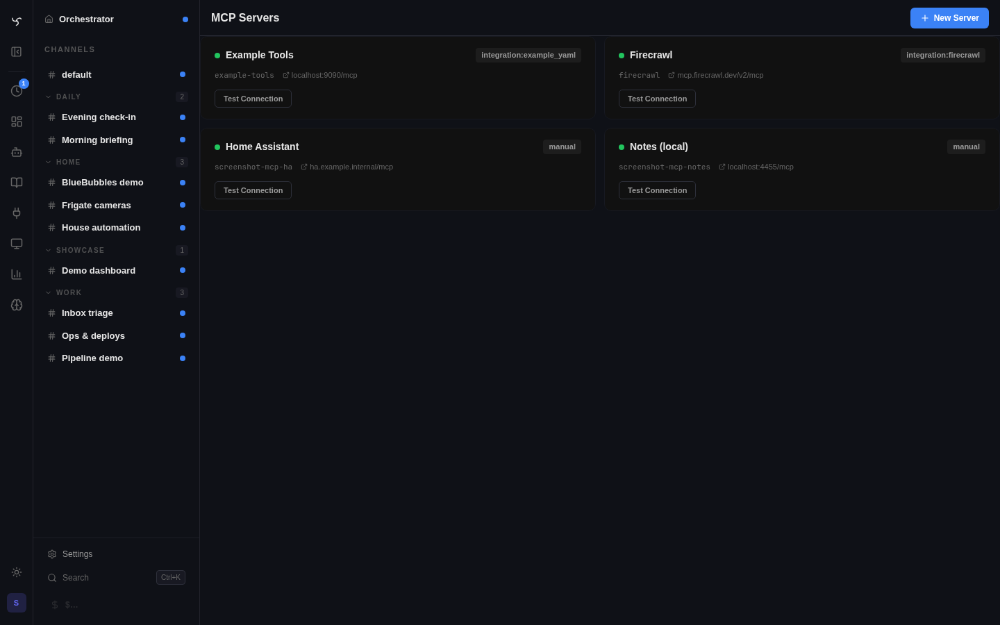

# MCP Servers

MCP (Model Context Protocol) servers expose external tools to your bots — Home Assistant, databases, development environments, custom APIs, and more. Any [MCP-compatible server](https://modelcontextprotocol.io/) can be connected to Spindrel.

When you connect an MCP server, its tools are automatically discovered, indexed for retrieval, and available to any bot you assign it to. Pair with a [capability](#capabilities-the-intelligence-layer) to teach the bot *how* to use the tools effectively.


*Admin > MCP Servers — connected servers with discovered tool counts and live connection status.*

## Setup

### Option 1: Admin UI (recommended)

1. Go to **Admin > MCP Servers**
2. Click **New Server**
3. Enter the server URL and optional API key
4. Click **Test Connection** — discovered tools appear immediately
5. Assign the server to a bot in the bot's YAML config

### Option 2: YAML seed (first boot)

If you have a `mcp.yaml` file when the server starts for the first time (empty DB), it will be imported automatically:

```yaml
# mcp.yaml
homeassistant:
  url: http://your-ha-host:8123/mcp_server
  api_key: ${HA_MCP_KEY}

another-server:
  url: http://localhost:3000/mcp
```

Environment variable substitution (`${VAR_NAME}`) is supported for secrets.

!!! note
    The YAML seed is **one-time only** — once servers exist in the database, `mcp.yaml` is ignored. After first boot, manage everything through the Admin UI. For Docker, uncomment the `mcp.yaml` volume mount in `docker-compose.yml`.

### Assign to bots

Add the MCP server name to your bot YAML:

```yaml
# bots/assistant.yaml
mcp_servers: [homeassistant]
```

The server name must match the key in the Admin UI or `mcp.yaml`. All tools from that server become available to the bot, subject to [tool retrieval](../reference/rag-pipeline.md) (only relevant tools are sent to the LLM per request).

## How MCP Tools Work in Spindrel

```
MCP Server (external)     Spindrel                    LLM
┌──────────────────┐     ┌────────────────────────┐
│ ha_call_service   │     │ 1. Discover tools       │
│ ha_get_state      │────▶│ 2. Index for retrieval  │──▶ Only relevant
│ ha_search_entities│     │ 3. Cache schemas (60s)  │    tools per request
│ ha_bulk_control   │     │ 4. Proxy calls          │◀── LLM calls tool
│ ...92 tools       │     └────────────────────────┘
└──────────────────┘
```

1. **Discovery**: On startup (and periodically), Spindrel fetches tool schemas from the MCP server
2. **Indexing**: Tool names and descriptions are embedded for semantic retrieval
3. **Retrieval**: Each user message triggers a cosine-similarity search — only the top-K relevant tools are sent to the LLM (not all 92+)
4. **Execution**: When the LLM calls a tool, Spindrel proxies the request to the MCP server and returns the result
5. **Caching**: Tool schemas are cached for 60 seconds to avoid repeated discovery calls

## Capabilities: The Intelligence Layer

An MCP server gives your bot tools. A **capability** teaches the bot *when and how* to use them well.

Without a capability, a bot with 92 Home Assistant tools can technically control your home — but it won't know your light preferences, won't learn your routines, won't maintain a device inventory, and won't proactively check device health. It's tools without expertise.

A capability adds:

- **System prompt fragment** — always-injected routing instructions ("when the user says X, do Y")
- **Skills** — on-demand deep knowledge the bot fetches when needed (automation patterns, debugging guides, service call reference)
- **Local tools** — complementary tools from Spindrel itself (task boards, timelines)
- **Workspace schema** — a template that organizes the channel's files for the domain

### Shipped capabilities for MCP servers

Spindrel ships capabilities designed for popular MCP servers:

| Capability | MCP Server | What it adds |
|----------|-----------|--------------|
| `home-assistant` | [ha-mcp](https://github.com/homeassistant-ai/ha-mcp) | Preference learning, routine tracking, device inventory, automation management, daily health checks |

These live in `integrations/mission_control/carapaces/` and are Mission Control compatible (task boards, timelines).

### Using a shipped capability

```yaml
# bots/assistant.yaml
mcp_servers: [homeassistant]       # your HA MCP server name
carapaces: [home-assistant]         # shipped capability (`carapaces` is the config key for capabilities)
```

The capability doesn't care what you named your MCP server — it references tool names (like `ha_call_service`) which are stable across all ha-mcp installations.

### Building your own capability for an MCP server

If you connect a new MCP server and want to add an intelligence layer:

1. Create a capability YAML (in your extensions dir or `carapaces/`)
2. Write a skill with domain knowledge
3. Optionally create a workspace schema template

See the [Custom Tools & Extensions](custom-tools.md) guide for the full walkthrough, or use the `home-assistant` capability as a reference: `integrations/homeassistant/carapaces/home-assistant.yaml`.

## Worked Example: Home Assistant

This walks through connecting Home Assistant to Spindrel with full smart home management.

!!! tip "In-tree Home Assistant integration"
    Spindrel also ships a native `homeassistant` integration (`integrations/homeassistant/`) that bundles its own MCP connection, tools, and interactive widgets (toggle + brightness slider for `HassLightSet`, toggle for `HassTurnOn`/`HassTurnOff`). If you just want smart-home control without wiring up your own MCP server config, activate that integration on a channel and skip this walkthrough. The MCP-server route below is the right choice if you want to combine ha-mcp's full 92-tool surface with Spindrel's capability, or wire multiple HA instances.

### Two MCP Server Options

There are two ways to connect Home Assistant via MCP — you can use either or both:

| | Official HA MCP Integration | Community ha-mcp |
|---|---|---|
| **What it is** | Built into Home Assistant (2024.12+) | Separate [add-on / Docker container](https://github.com/homeassistant-ai/ha-mcp) |
| **Tools** | ~20 intent-based (`HassTurnOn`, `HassLightSet`, etc.) + exposed scripts | 92+ full API tools (`ha_call_service`, `ha_get_state`, etc.) |
| **Can do** | Control devices, run scripts, get states | Everything: automations, history, dashboards, debugging, HACS, backups |
| **Can't do** | Create/edit automations, query history, manage dashboards | — |
| **Setup** | Enable in HA Integrations page | Add repository to Add-on Store |
| **Entity access** | Only entities exposed to voice assistants | All entities |

**Recommendation**: Install ha-mcp for the full toolset. Keep the official integration too if you already have it — the `home-assistant` capability handles both tool naming conventions automatically.

### Option A: Official HA MCP Integration (quick start)

If you already have this enabled (you'll see `HassTurnOn`, `HassLightSet` tools), you're set. To expose more entities:

1. Go to **Settings > Voice Assistants** in Home Assistant
2. Click the **Expose** tab
3. Toggle on all entities you want the AI to control (lights, switches, climate, media, covers, locks)
4. Exposed scripts appear as named tools (e.g., `bedroom_set_scene_based_on_time`)

The MCP URL is typically `http://your-ha-host:8123/mcp_server` — configure this in Spindrel's Admin UI or `mcp.yaml`.

### Option B: Community ha-mcp (recommended for full control)

ha-mcp is **not in HACS** — it's a standalone HA add-on with its own repository.

**Home Assistant OS** (add-on):

1. Go to **Settings > Add-ons > Add-on Store**
2. Click **⋮** (three dots, top right) → **Repositories**
3. Add: `https://github.com/homeassistant-ai/ha-mcp`
4. Find **"Home Assistant MCP Server"** in the store and install it
5. Click **Start**, then check the **Logs** tab for your MCP URL
6. No token setup needed — the add-on connects to HA automatically

**Docker / standalone**:

```bash
docker run -d \
  -e HOMEASSISTANT_URL=http://homeassistant:8123 \
  -e HOMEASSISTANT_TOKEN=your_long_lived_access_token \
  -p 8000:8000 \
  ghcr.io/homeassistant-ai/ha-mcp:latest
```

Create a [long-lived access token](https://www.home-assistant.io/docs/authentication/#your-account-profile) in your HA profile page.

### Connect to Spindrel

**Admin UI**: Go to **Admin > MCP Servers > New Server**, enter the MCP URL, add the API key if needed, and test the connection.

**Or via mcp.yaml** (first boot only):

```yaml
# For ha-mcp add-on (check add-on logs for exact URL)
homeassistant:
  url: http://your-ha-host:8000/mcp
  api_key: ${HA_MCP_KEY}

# For official HA MCP integration
# homeassistant:
#   url: http://your-ha-host:8123/mcp_server
#   api_key: ${HA_LONG_LIVED_TOKEN}
```

If you're running both, add them as separate MCP servers with different names.

### Configure your bot

```yaml
# bots/assistant.yaml
id: assistant
name: Assistant
model: gemini/gemini-2.5-flash

mcp_servers: [homeassistant]
carapaces: [home-assistant]

workspace:
  enabled: true

memory_scheme: workspace-files
history_mode: file
```

The `home-assistant` capability gives the bot:

- **Preference learning** — remembers your lighting, temperature, and comfort preferences per room and time of day
- **Routine management** — named routines (Morning, Movie Night, Good Night) with exact service calls
- **Device inventory** — tracks entity IDs, areas, models, and quirks
- **Automation management** — creates, debugs, and tracks HA automations
- **Daily health checks** — via heartbeat (unavailable devices, low batteries, failed automations)

### Step 4: Set up the channel

1. Create a channel for your home (e.g., "Home")
2. In channel settings, pick the **Smart Home (Home Assistant)** workspace template
3. Optionally configure a **heartbeat** for daily health checks:
    - **Prompt**: "Run a smart home health check. Query HA for unavailable entities, low batteries, pending updates, and failed automations. Update status.md."
    - **Interval**: daily
    - **Quiet hours**: 23:00–07:00

### Step 5: Teach it your preferences

Just use the bot naturally. As you interact, it learns:

> **You**: Turn on the living room lights
> **Bot**: *Turns on living room lights at 100%, 4000K*
>
> **You**: That's too bright, make it warmer
> **Bot**: *Dims to 50%, shifts to 2700K warm. Updated preferences — living room evening: 50% brightness, 2700K.*

Over time, `preferences.md` builds into a comprehensive profile of your household's comfort settings. The bot applies learned preferences automatically:

> **You**: Turn on the living room lights
> **Bot**: *Living room on at 50%, 2700K — your evening preference.*

### Step 6: Define routines

> **You**: Let's set up a movie night routine — dim the living room to 15%, close the blinds, turn on the TV
> **Bot**: *Got it. Saved "Movie Night" routine to routines.md with trigger phrases "movie night", "movie mode". Want me to run it now?*

Next time:

> **You**: Movie night
> **Bot**: *Running Movie Night — 3 service calls.* ✓ *Lights dimmed, blinds closed, TV on.*

## Tips

### Pin frequently-used tools

If your bot always needs certain MCP tools (not just when retrieval finds them), pin them:

```yaml
# For ha-mcp (community)
pinned_tools: [ha_call_service, ha_get_state, ha_search_entities]

# For official HA MCP
pinned_tools: [HassTurnOn, HassTurnOff, HassLightSet, HassClimateSetTemperature]
```

Pinned tools bypass retrieval and are always sent to the LLM.

### Tool retrieval tuning

With 92+ HA tools, retrieval is important — you don't want to send all of them every request. The defaults work well, but you can tune:

```yaml
tool_retrieval: true                # default; set false to send ALL tools
tool_similarity_threshold: 0.35     # lower = more tools matched, higher = stricter
```

### Multiple MCP servers

Bots can connect to multiple MCP servers simultaneously:

```yaml
mcp_servers: [homeassistant, postgres, github-mcp]
carapaces: [home-assistant, ...]
```

Each server's tools are indexed independently and retrieved based on relevance.

### Troubleshooting

| Issue | Check |
|-------|-------|
| "No tools discovered" | Verify the MCP URL is reachable from the Spindrel container. Test with `curl <url>`. |
| Tools appear but bot doesn't use them | Tool retrieval may not be matching. Try pinning key tools or lowering `tool_similarity_threshold`. |
| "Connection refused" | MCP server may not be running. Check its logs. For Docker, ensure both containers are on the same network. |
| Tools work but bot doesn't know *how* | Add a capability. Without one, the bot has tools but no domain expertise. |
| Stale tool list after MCP server update | Tool schemas are cached for 60s. Wait or restart the Spindrel server. |
| Official HA MCP: "entity not found" | Entity isn't exposed to voice assistants. Go to HA **Settings > Voice Assistants > Expose**. |
| ha-mcp not in HACS | ha-mcp is an **add-on repository**, not a HACS integration. Add `https://github.com/homeassistant-ai/ha-mcp` in **Settings > Add-ons > Add-on Store > ⋮ > Repositories**. |
| Only see ~20 tools from official HA MCP | That's expected — the official integration only exposes intent-based tools. Install ha-mcp for the full 92+ toolset. |
