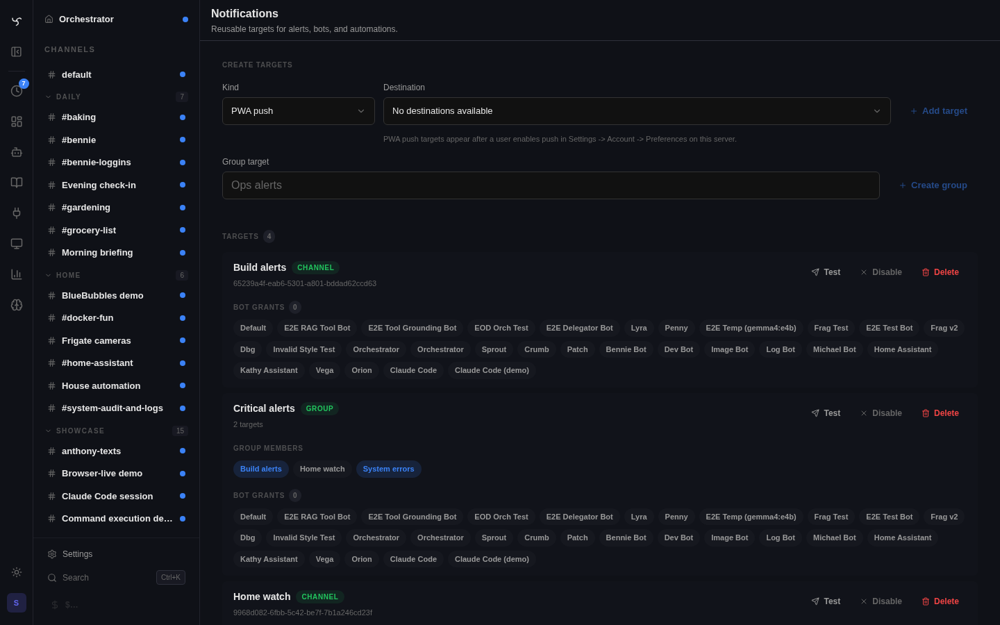

# Notifications

Core notification targets are reusable, admin-managed destinations for human-facing alerts.

## Target Kinds

- `user_push` wraps the PWA Web Push service for one subscribed user.
- `channel` posts a system message into an existing channel path and fans out through the existing channel outbox.
- `integration_binding` resolves one integration binding target and calls its renderer directly.
- `group` fans out to other notification targets best-effort with cycle protection.

The v1 payload is deliberately small: `title`, `body`, optional `url`, `severity`, and `tag`.

## Admin Surface

Admins manage targets at `/admin/notifications`.

The page can create targets from available destinations, create groups, enable or disable targets, grant targets to bots, send tests, and inspect delivery history.

## Bot and Pipeline Use

Bots use two local tools:

- `list_notification_targets` returns only enabled targets granted to the current bot.
- `send_notification` sends to one granted target id.

Assigning `send_notification` is necessary but not sufficient. The target's `allowed_bot_ids` must include the calling bot.

Pipeline tool steps can call the same tool surface when the selected bot has the tool and target grant.

## Delivery Rules

Notifications reuse existing delivery infrastructure. Do not add a second channel delivery stack for notification-specific sends.

- PWA notifications call `app.services.push.send_push`.
- Channel notifications persist a system message when a channel session exists, publish the web event, and enqueue the existing outbox delivery.
- Direct integration-binding notifications create only notification delivery audit rows, not channel history.
- Groups log per-child success or failure; one failed child does not stop the rest.

Usage spike alerts use shared notification `target_ids`. Legacy spike target JSON is migrated lazily into saved notification targets.
