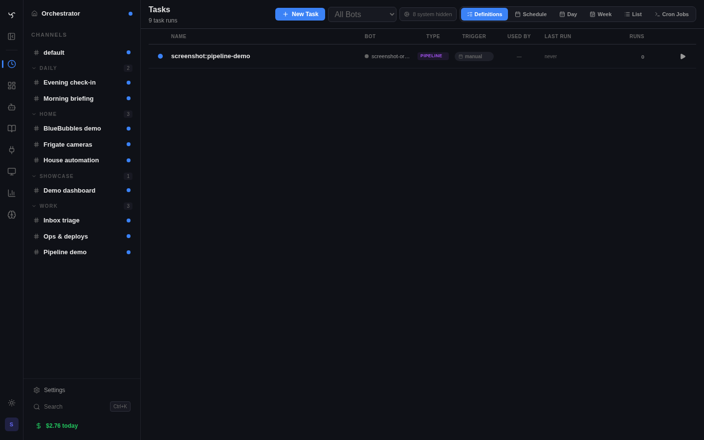

# Pipelines



Pipelines are the automation primitive. A pipeline is a Task with a `steps` array — an ordered list of step definitions that execute sequentially. Each step picks the cheapest engine for its job: a shell command, a direct tool call, an LLM turn, a human approval gate, or a loop over a list.

Design principle: use `exec` and `tool` steps for deterministic work (they don't burn LLM tokens); use `agent` steps only where judgment is required; use `user_prompt` / `foreach` where you'd otherwise reach for bespoke plumbing.

---

## Creating a Pipeline

### From a Bot

```text
define_pipeline(
  title="Health check",
  steps='[
    {"id": "check", "type": "exec", "prompt": "df -h / && free -h"},
    {"id": "analyze", "type": "agent", "prompt": "Flag any concerns from the health data."}
  ]'
)
```

`define_pipeline` requires `steps`. `recurrence`, `bot_id`, `trigger_config`, `scheduled_at`, `max_run_seconds`, and `execution_config` work as documented in the tool schema. For single-prompt Automations (no steps), call `schedule_prompt` instead.

Use `run_pipeline(pipeline_id=...)` to spawn a Run from a Pipeline definition (accepts a slug or UUID). Pass `params={"key": "value"}` to bind runtime inputs into `{{params.*}}` substitutions. `run_task(task_id=...)` works for any Automation Run by id.

### From YAML (System Pipelines)

Drop a YAML file in `app/data/system_pipelines/` — seeded on startup via `ensure_system_pipelines()`. System rows are re-synced from YAML on every boot (user-authored rows are never clobbered).

```yaml
# app/data/system_pipelines/deploy.yaml
id: 3a8f...              # UUID — deterministic via uuid5(slug) in practice
slug: deploy
title: Deploy
source: system
steps:
  - id: test
    type: exec
    prompt: pytest -q
  - id: build
    type: exec
    prompt: docker build -t app:latest .
    when: { step: test, status: done }
```

### From the Admin UI

**Admin → Tasks → New Task → Steps tab.** Each step is an expandable card with type-specific fields and a condition editor.

When a Pipeline is launched from a channel, the pre-run pane exposes the same
run-target selector used by scheduled prompts and heartbeats: primary session,
one existing channel session, or a fresh visible session for that run. This is
stored as `execution_config.session_target` on the concrete run and is separate
from `run_isolation` / `run_session_id`, which only control the pipeline
transcript session.

---

## Step Types

| Type | What it does | LLM cost |
|------|-------------|----------|
| `exec` | Shell command in the workspace | No |
| `tool` | Direct tool invocation with fixed args | No |
| `agent` | Spawns a child task — full LLM loop with tools and skills | Yes |
| `user_prompt` | Pauses pipeline; resumes when a human resolves a widget | No |
| `foreach` | Iterates `do` sub-steps over a list from a prior step or param | Per sub-step |

### `exec` — Shell

```yaml
- id: check
  type: exec
  prompt: df -h / | tail -1 | awk '{print $5}'
  working_directory: /opt/app
  timeout: 30
  on_failure: continue
```

Prior-step results are auto-exported as env vars: `$STEP_CHECK_RESULT`, `$STEP_CHECK_STATUS`, plus top-level JSON keys for structured results (`$STEP_CHECK_llm`, etc.).

### `tool` — Direct Dispatch

```yaml
- id: notify
  type: tool
  tool_name: slack-send_message
  tool_args:
    channel: "#alerts"
    text: "Disk: {{steps.check.result}}%"
```

No LLM. Template substitution runs on `tool_args` before dispatch.

### `agent` — LLM Turn

```yaml
- id: analyze
  type: agent
  prompt: |
    Analyze disk usage ({{steps.check.result}}%) and recommend action.
  model: gpt-4o-mini
  tools: [exec_command]              # add to bot's base tools (additive, not whitelist)
  skills: [pipeline_authoring]       # ephemerally inject a skill into this step only
  timeout: 120
```

Prior step results are auto-prepended to the system preamble. `tools` and `skills` are **per-step** — they apply only to this step's child task, not the rest of the pipeline. The pipeline has no global `defaults:` block (intentional — keeps step definitions self-contained).

### `user_prompt` — Human Gate

Pauses the pipeline until a human (or bot) resolves it. Pipeline execution *blocks* here — unlike an agent step that merely asks a question.

```yaml
- id: approve
  type: user_prompt
  widget_template: confirmation_card
  widget_args:
    title: "Deploy {{params.version}}?"
    body: "{{steps.test.result}}"
  response_schema:
    type: binary
```

`response_schema` supports `{type: binary}` (approve / reject) and `{type: multi_item, items: [...]}` (per-item approval). Resolved via:

```bash
POST /api/v1/admin/tasks/{task_id}/steps/{step_index}/resolve
```

The endpoint validates the payload, writes it to `step_states[i].result`, flips status to `done`, and resumes the pipeline.

Use `user_prompt` (not an agent step) when you need: blocking, structured response, auditable approval, or a widget UI.

### `foreach` — Iterate

Runs `do` sub-steps sequentially for each item in a list. In v1, sub-steps must be `type: tool` (other sub-step types are deferred).

```yaml
- id: apply
  type: foreach
  over: "{{steps.review.result.proposals}}"
  do:
    - id: apply_one
      type: tool
      tool_name: call_api
      tool_args:
        method: PATCH
        path: "/api/v1/admin/bots/{{item.bot_id}}"
        body: "{{item.patch}}"
      when:
        step: approve
        output_contains: approve
  on_failure: continue
```

Inside `do`, these substitutions are bound per iteration:

| Pattern | Value |
|---------|-------|
| `{{item}}` | Current item (JSON-encoded if dict/list) |
| `{{item.key}}` / `{{item.a.b}}` | Dotted access into dict items |
| `{{item_index}}` | 0-based index |
| `{{item_count}}` | Total items |

**Known limitation (v1)**: the inner `when:` is step-level, not per-item. If the outer condition references the *whole* review result, every iteration sees the same answer. For strict per-item filtering today, pre-filter the list in an `agent` step and have `foreach` iterate the already-approved subset.

---

## Params

Pass runtime inputs to a pipeline:

```bash
POST /api/v1/admin/tasks/{id}/run
{"params": {"version": "1.2.3", "target_bot": "rolland"}}
```

Or from a bot:

```text
run_task(task_id="<uuid>", params='{"version": "1.2.3"}')
```

Reference inside steps: `{{params.version}}`, `{{params.a.b.c}}`. Dict/list params are JSON-encoded when substituted into a string — so `"body": "{{params.patch}}"` in `tool_args` produces valid JSON.

---

## Template Syntax

| Pattern | Resolves to |
|---------|-------------|
| `{{steps.<id>.result}}` | Prior step output |
| `{{steps.<id>.result.<key>}}` | Dotted access into JSON result |
| `{{steps.<id>.status}}` | `done` / `failed` / `skipped` / `awaiting_user_input` |
| `{{params.<key>}}` | Runtime param |
| `{{item}}` / `{{item.<key>}}` / `{{item_index}}` | Foreach iteration bindings |

Unresolved templates are left as-is — safe fallback for debugging.

---

## Conditions (`when:`)

Skip a step if its condition is false. Skipped steps get status `skipped` — not `failed`.

```yaml
when: { step: check, status: done }
when: { step: check, output_contains: "CRITICAL" }
when: { step: check, output_not_contains: "OK" }
when: { param: severity, equals: critical }

when:
  all:
    - { step: check, status: done }
    - { param: mode, equals: deep }

when:
  any:
    - { param: target, equals: all }
    - { param: target, equals: services }

when:
  not: { step: check, status: failed }
```

---

## Failure Handling

| `on_failure` | Behavior |
|--------------|----------|
| `abort` (default) | Stop the pipeline, mark run failed |
| `continue` | Mark the step failed, proceed |

If *any* step failed, the pipeline's final status is `failed` — even with `continue`. Skipped steps are not failures.

---

## Triggering

- **Admin UI** — Admin → Automations → select definition → Run
- **Schedule** — `recurrence: "0 9 * * *"` on the definition
- **Event** — `trigger_config: {type: event, event_source: github, event_type: push}`
- **Bot** — `run_pipeline(pipeline_id=...)` / `define_pipeline(steps=...)`
- **API** — `POST /api/v1/admin/tasks/{id}/run` with `{params: {...}}`
- **Resolve a gate** — `POST /api/v1/admin/tasks/{id}/steps/{i}/resolve`

---

## Examples

### Review → Approve → Apply

Agent proposes, human approves, foreach applies. Zero bespoke apply-tools:

```yaml
steps:
  - id: scan
    type: tool
    tool_name: list_api_endpoints

  - id: review
    type: agent
    prompt: |
      Scan results:
      {{steps.scan.result}}

      Propose a JSON list of patches as {"proposals": [{"bot_id": "...", "patch": {...}}]}.

  - id: approve
    type: user_prompt
    widget_template: confirmation_card
    widget_args:
      title: "Apply these patches?"
      body: "{{steps.review.result}}"
    response_schema: { type: binary }

  - id: apply
    type: foreach
    over: "{{steps.review.result.proposals}}"
    do:
      - id: apply_one
        type: tool
        tool_name: call_api
        tool_args:
          method: PATCH
          path: "/api/v1/admin/bots/{{item.bot_id}}"
          body: "{{item.patch}}"
        when: { step: approve, output_contains: approve }
    on_failure: continue
```

Three seeded orchestrator pipelines (`orchestrator.full_scan`, `orchestrator.deep_dive_bot`, `orchestrator.analyze_discovery`) use exactly this shape — see `app/data/system_pipelines/`.

### Gather → Analyze

```yaml
steps:
  - id: data
    type: exec
    prompt: docker stats --no-stream --format json

  - id: report
    type: agent
    prompt: Analyze the container health data and flag issues.
```

### Conditional Remediation

```yaml
steps:
  - id: check
    type: exec
    prompt: df -h / | awk 'NR==2{print $5}' | tr -d '%'

  - id: cleanup
    type: exec
    prompt: docker system prune -af
    when: { step: check, output_contains: "9" }
    on_failure: continue

  - id: report
    type: agent
    prompt: Report disk status and any cleanup actions taken.
```

---

## Step State Shape

Each step has a corresponding `step_states[i]` entry:

```json
{
  "status": "done",        // pending | running | done | failed | skipped | awaiting_user_input
  "result": "...",         // string or JSON payload
  "error": null,
  "started_at": "2026-04-17T10:00:00Z",
  "completed_at": "2026-04-17T10:00:01Z",
  "task_id": null          // agent steps: ID of the spawned child task
}
```

`user_prompt` adds `widget_envelope` and `response_schema` while paused. `foreach` replaces `result` with `{items, iterations: [[sub_state, ...], ...]}`.

Inspect a live run with `get_task_result(task_id=...)` or `list_tasks(parent_task_id=...)` for run history.

---

## System Pipelines vs. User Pipelines

Pipelines have a `source` column (migration 202):

- `source: system` — seeded from YAML in `app/data/system_pipelines/`. Re-synced on every boot. Deterministic UUIDs (via `uuid5`). **Do not edit in the UI** — edits detach from YAML.
- `source: user` (default) — created via UI or `define_pipeline`. Never touched by the system seeder.

System pipelines collide gracefully: the seeder refuses to clobber a user-owned row and logs a warning.

---

## When *Not* to Use a Pipeline

| Situation | Use instead |
|---|---|
| One-off reasoning | Single-prompt `schedule_prompt` |
| Parallel fan-out to multiple bots | `delegate_to_agent` |
| Conversational back-and-forth | A regular channel turn, not a pipeline |
| User asks "help me decide" | Let the agent answer — don't wrap a chat in steps |
