# Projects

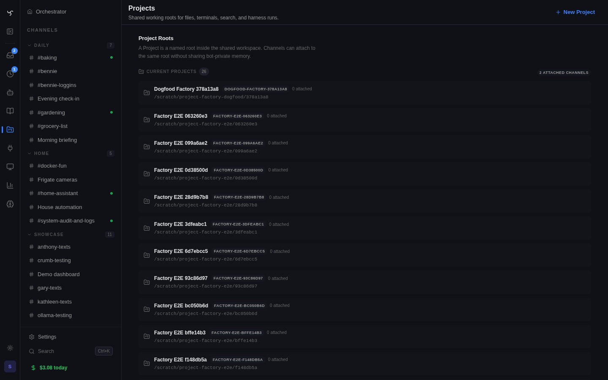

Projects are named roots inside the shared workspace. Multiple channels can
attach to the same Project so files, terminal cwd, search, harness turns, and
Project instructions resolve from one place while bot-private memory remains
separate through the `memory` tool.

The Project binding is the normal primitive. Channel settings no longer expose
the old path-only configuration; attach a channel to a Project so all
WorkSurface consumers resolve the same root.

## Project Roots

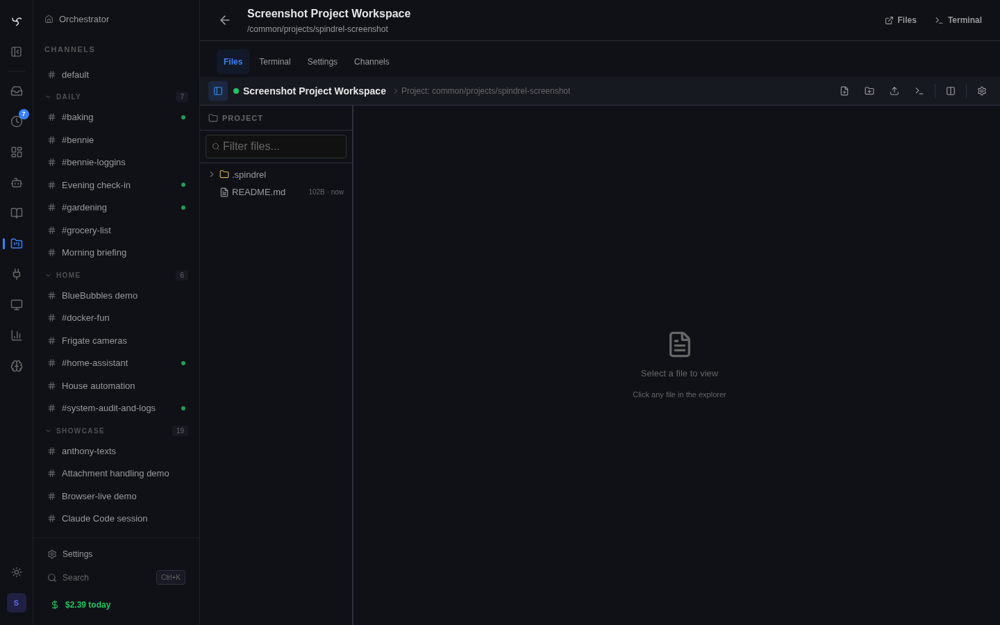

Open `/admin/projects` to create or inspect shared roots. A Project owns:

- a workspace-relative root path such as `common/projects/spindrel`;
- optional Project instructions and prompt-file path;
- Project-scoped knowledge under `.spindrel/knowledge-base`;
- channel membership for every channel that should use that root.

The Project detail page is the work surface: use **Files** for the rooted file
browser, **Terminal** for a Project-root shell, **Setup** for Blueprint runtime
preparation, **Runs** for agent coding-run launch and receipts, **Instances**
for fresh workspaces created from the applied snapshot, **Settings** for
instructions and Blueprint metadata, and **Channels** for membership.
The Settings tab includes a compact Basics block for the root URI, attached
channel count, setup readiness, and runtime environment readiness.

## Blueprints

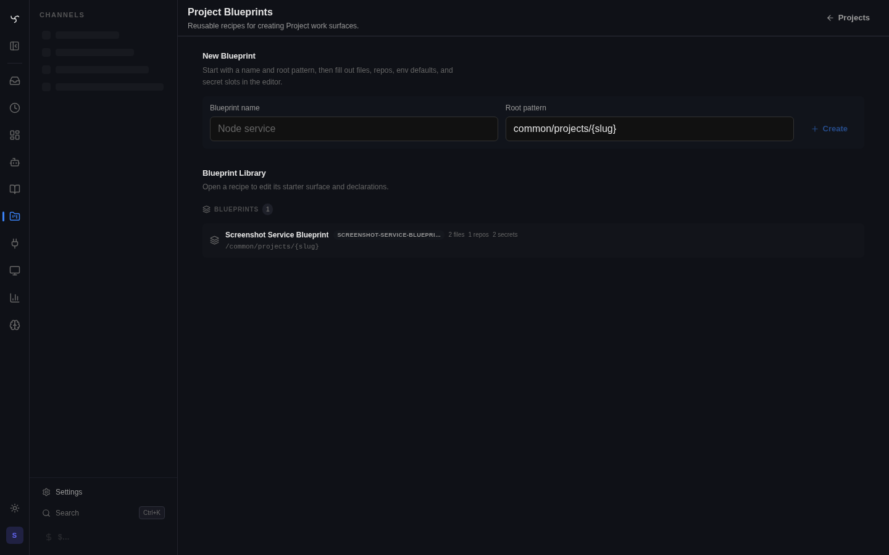

Project Blueprints are reusable recipes for creating Projects. A Blueprint can
declare a default root pattern, Project prompt, starter folders/files, knowledge
files, repo declarations, setup commands, a Dependency Stack spec, env defaults,
and required secret binding slots.

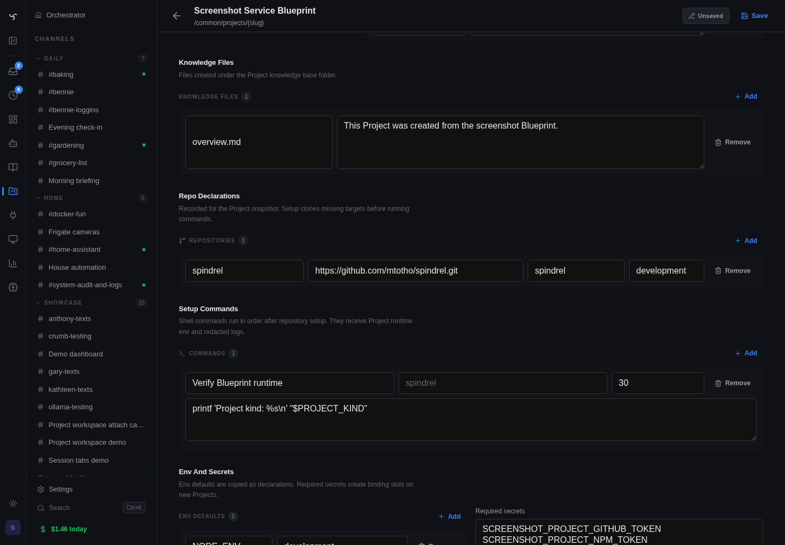

Blueprint materializes files and records declarations. Project Setup turns the
applied snapshot into a manual setup plan: it validates repo targets and
Project-relative command cwd values, checks Project-scoped secret slots, clones
missing repos, skips existing repo paths, runs ordered shell setup commands, and
records redacted run history. Secret values stay in the secret vault; Projects
only store bindings to those vault entries.

## Applied Blueprints

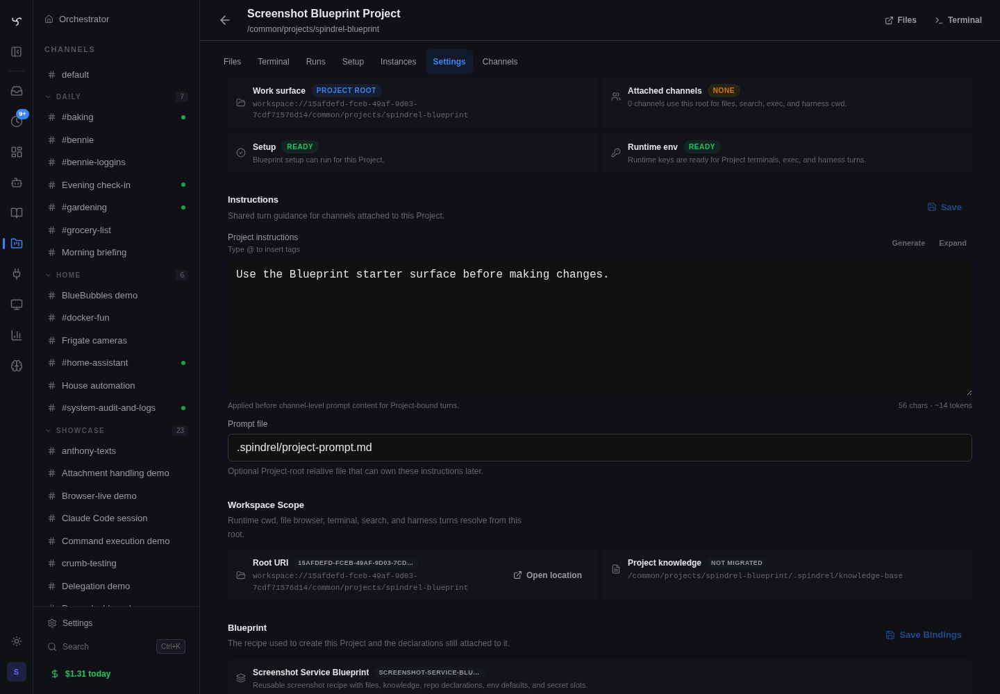

When a Project is created from a Blueprint, the Project stores an applied
snapshot. Editing or deleting the Blueprint later does not rewrite existing
Projects. Use the Project settings Blueprint section to inspect the snapshot,
repo/env declarations, materialization result, and required secret bindings.

The Project runtime environment is derived from the applied snapshot, not from
later Blueprint edits. Env defaults and bound Project secrets are injected into
Project terminals, `exec_command`, and harness-backed Project turns. Settings
show key names and missing bindings only; secret values are not returned by the
Project API or rendered in the UI. Missing required secrets warn in readiness
surfaces but do not block general Project runtimes.

## Fresh Instances

Project Instances are temporary roots created from a Project's frozen Blueprint
snapshot. They live under `common/project-instances/{project-slug}/{id}` and
reuse the parent Project policy: prompt, runtime env, secret bindings,
knowledge-prefix locality, and harness cwd all resolve through the same
work-surface service.

Tasks can opt into a fresh Project instance for each run. The task worker
creates and prepares the instance before invoking the agent, stores the
`project_instance_id` on the task, and sets a run-scoped context override so
file, exec, search, terminal, and harness tools resolve to the instance root
without mutating the shared channel session. Sessions can also be explicitly
bound to a fresh instance through the session Project-instance API. Project
session composers expose that binding as quiet work-surface text near the
composer controls, not as channel header chrome; creating or clearing a fresh
copy affects future turns only.

## Agent Coding Runs

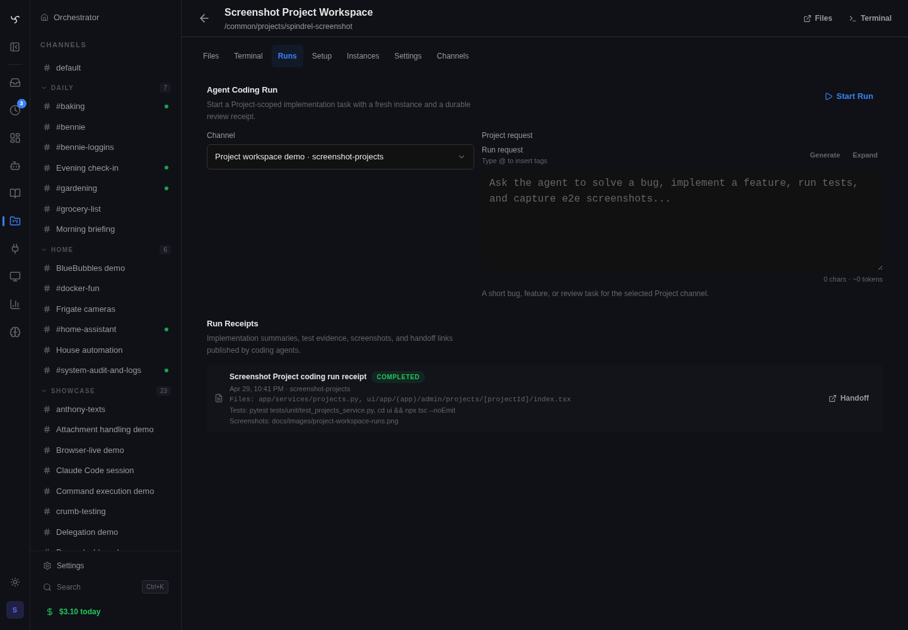

Project coding runs are launched through `/api/v1/projects/{id}/coding-runs`.
The service validates that the selected channel belongs to the Project, creates
a normal background task from the `project_coding_run` preset, and records a
secret-safe handoff config in `execution_config.project_coding_run`: request,
repo, base branch, generated work branch, runtime target key names, new-session
policy, fresh-instance policy, and any task-scoped machine target grant. The
prompt tells the agent to update from the base branch, switch to the generated
branch, use Project runtime env, use the granted e2e/machine target only when
attached to the task, run e2e checks when relevant, and publish
`publish_project_run_receipt` evidence.

Project coding agents that use Codex or Claude Code are harness agents: native
tools own file edits and repo-local commands inside the Project root, including
unit tests. Do not wrap unit tests in Docker, Dockerfile.test, or docker
compose. E2e-testing, screenshots, server/machine actions, and Docker/compose
dependency control must go through task-scoped Spindrel grants. See
[Agent E2E Development](agent-e2e-development.md) for the full boundary.

## Dev Targets

Projects can declare source-run dev targets in Project metadata or Blueprint
snapshot metadata under `dev_targets`. Each target can name a `key`, `label`,
`port_env`, `url_env`, and `port_range`. Project coding runs allocate concrete
ports from those ranges, inject the resulting `SPINDREL_DEV_*_PORT` and
`SPINDREL_DEV_*_URL` values into the task runtime environment, and show the
assigned URLs in Project Runs. Agents start the app/dev server processes
themselves; Spindrel only assigns non-colliding targets and records evidence.

## Dependency Stacks

Project Dependency Stacks are Docker-backed database/service stacks declared by
a Project's applied Blueprint snapshot. They are not raw Docker access. The
Project declares a compose source such as `docker-compose.project.yml`, exported
connection env, and named commands. Spindrel reads the compose file from the
Project work surface, validates Docker red lines, applies it through the
managed Docker stack service, and returns dependency env, service status, logs,
health, and command results.

Coding runs use run-scoped stack instances by default. The reusable spec belongs
to the Project, but the actual Docker Compose project, network, volumes, logs,
and lifecycle belong to the task/fresh Project Instance. Parallel coding runs
therefore do not restart or mutate the same database/service stack. Agents run
their own app/dev server processes from source on assigned or unused ports. A
manual shared Project dependency stack is available from the Project Setup
surface for interactive development.

When a Project coding run starts and the Project has a dependency stack,
Spindrel preflights the task-scoped stack before the first harness turn. The run
prompt and Runs API expose only secret-safe readiness fields: status, source,
declared commands, and env key names. The actual connection values are injected
into Project terminals, exec, and harness turns through the Project runtime env
so project-local commands can use values such as `DATABASE_URL` immediately.

Agents may adjust stack shape during a session by editing the Project compose
file and calling `manage_project_dependency_stack(action="reload")`. The compose
file diff is then reviewable in the same PR as the code change. Phase 1 keeps
the Docker red line at Spindrel: harness shells should not call raw `docker` or
`docker compose`, and dependency stack validation rejects Docker sockets,
privileged containers, host networking, dangerous host mounts, and mounts
outside the Project root or dependency scratch path. Dependency stacks are for
backing services, not for running unit tests.

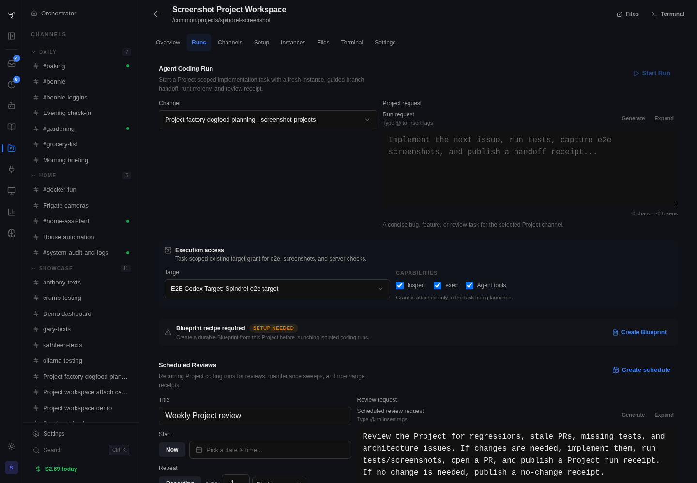

Execution access deliberately uses the same task machine-grant primitive as
normal scheduled tasks. The Project does not gain ambient machine power; the
operator grants one existing target to the run being launched, with explicit
inspect/exec capabilities and an optional LLM-tool toggle.

The Runs tab reads `/api/v1/projects/{id}/coding-runs` as the review cockpit. It
shows the launch form, recent API-launched runs, branch/base/repo state, recent
activity, task links, handoff links, and the latest receipt for each run. The
receipt records the implementation summary, changed files, tests, screenshots,
branch or review handoff, and task/session linkage so a later session can pick
up from durable Project state instead of searching chat history.

Supplemental smoke artifacts cover the coding-run cockpit and its channel-side
handoff: [Runs tab smoke](../images/project-coding-run-smoke-runs.png) and
[channel smoke](../images/project-coding-run-smoke-channel.png).

Reviewers can request changes from an existing coding run. The continuation
endpoint creates a linked follow-up task that keeps the same Project, channel,
repo, branch, and PR handoff while adding reviewer feedback, parent/root task
lineage, and prior evidence context to the new task prompt. Follow-up agents
should update the same branch/PR, rerun relevant tests or screenshots, and
publish a new Project run receipt.

Review sessions use the `workspace/project_coding_runs` runtime skill and should
call `get_project_coding_run_review_context` before finalizing selected runs.
That read-only manifest returns the selected run list, evidence counts, handoff
URLs, runtime/e2e/GitHub readiness, merge defaults, and finalization rules from
fresh server state. `finalize_project_coding_run_review` keeps accepted-only
reviewed semantics and returns structured error fields when a run was not
selected or a merge/finalization step is blocked.

Normal Project-bound agents can also turn a planning conversation into proposed
work packs before any coding run launches. `publish_issue_intake` captures a
single rough note for later triage; `create_issue_work_packs` creates one or
more proposed work packs from the current conversation and automatically creates
backing issue-intake source records when the agent does not provide existing
source item ids. `report_issue_work_packs` stays reserved for scheduled
issue-intake triage tasks.
Agent Capabilities recommends the `workspace/issue_intake` runtime skill during
Project-bound planning sessions so ordinary Codex/Claude agents can use the LLM
to group a plan or rough issue list into proposed packs without a separate
triage bot. The work-pack launch prompt should carry enough verification
expectations for a later coding run: repo-local tests, screenshots when
relevant, handoff/PR intent, and receipt evidence.
Each grouping pass should also publish a triage receipt. Conversational
`create_issue_work_packs` calls and scheduled `report_issue_work_packs` calls
store `triage_receipt_id` / `triage_receipt` on the created packs and mirror the
receipt summary back to source item `evidence.issue_triage`. The receipt is
provenance, not approval: it explains why items were grouped, what is
launch-ready, what needs info, and what was excluded or classified as non-code
work.

Work Packs are reviewed before launch from the Issue Intake workspace. The
review cockpit lets an operator refine title, summary, category, confidence,
launch prompt, Project/channel target, and source items; dismiss the pack; mark
it needs-info; or reopen it. These are not separate approval states: the only
launchable status remains `proposed`. Every review mutation appends
`metadata.review_actions` and updates `latest_review_action`; launched packs are
immutable except for launch provenance.

Operators can launch several proposed Work Packs together from the same Issue
Intake workspace. Batch launch is intentionally all-or-nothing: every selected
pack must still be `proposed`, have a launch prompt, and target a channel that
belongs to the selected Project before any Project coding-run task is created.
Successful batches store the same `launch_batch_id` on each Work Pack and its
launch review action, so later review sessions can group the overnight runs
back to the human-approved launch set.

Project Runs exposes that launch batch on each coding run and shows grouped
batch actions when two or more runs share the same id. Review batch starts the
normal `project_coding_run_review` task with every run from the launch batch
selected; it is not a separate review system. When the review agent accepts a
run, finalization marks the run reviewed and appends a `reviewed` action back
to the source Work Pack metadata with the review task/session ids, outcome,
summary, merge method, and `launch_batch_id`.

Project Runs also exposes a Review Inbox above the individual run list. The
inbox is a derived read model, not a new state machine: it groups runs by
`launch_batch_id`, joins the source Work Packs and review-session tasks, and
summarizes status counts, evidence counts, active review tasks, and available
actions. Use it for the morning review workflow: identify launched batches,
select the batch's runs, start the normal review session, or reopen the active
review task if one already exists.

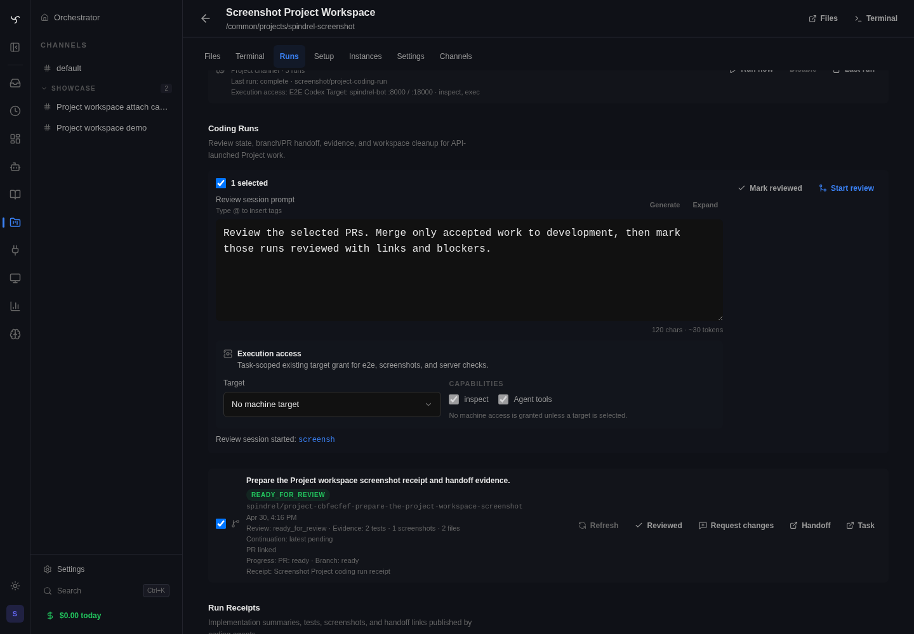

Launching a review session creates a normal task from the
`project_coding_run_review` preset and links it back to the selected runs. The
review task receives the selected task ids, Project/repo context, review prompt,
merge method default, and optional task-scoped machine grant in
`execution_config.project_coding_run_review`.

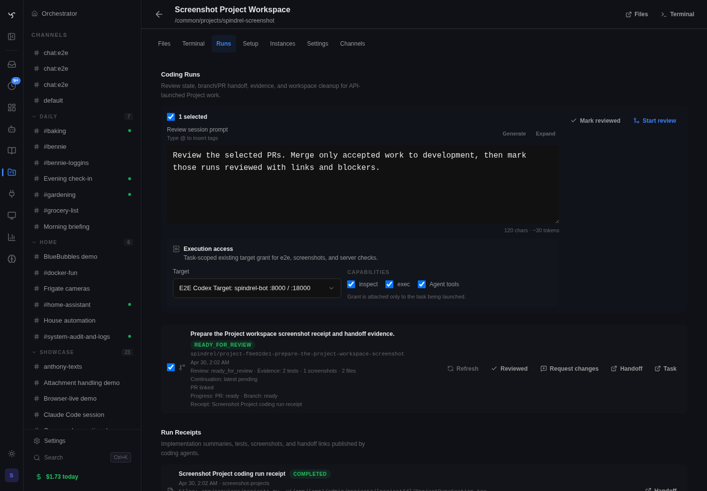

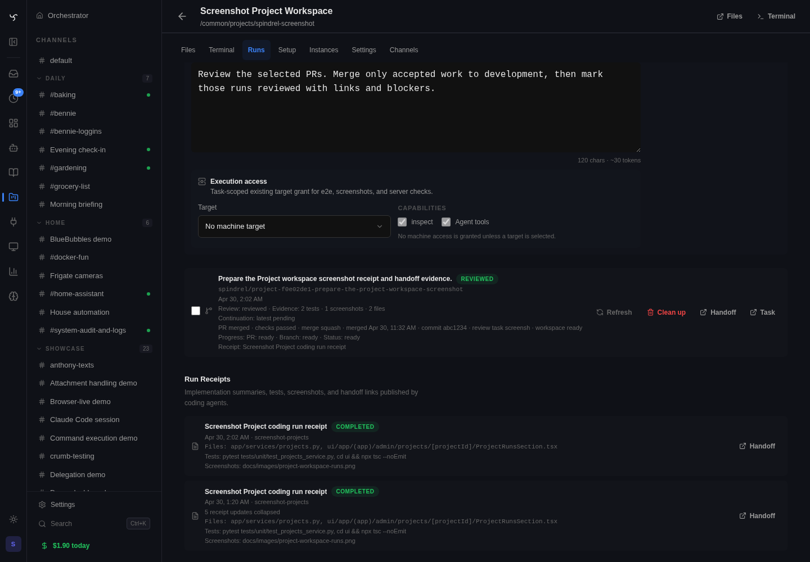

After the review agent accepts and merges a run, the run row shows the durable
provenance the human needs to audit: reviewed status, PR merged state, check
status, merge method, merge commit, review task link, handoff link, and the
evidence receipt that was reviewed.

Receipts are idempotent by task, handoff URL, git handoff metadata, or an
explicit `idempotency_key`. Retrying `publish_project_run_receipt` updates the
same review record instead of creating a stack of duplicate receipts. The
Project Factory verification loop is Project-defined: agents run repo-local
commands and tests from the Project work surface, use injected runtime and
Dependency Stack env, start app/dev servers on assigned dev target ports, and
attach screenshots plus command results to the receipt.
Each coding run exposes a secret-safe `readiness` manifest in the Runs API with
runtime blockers, dependency-stack status, assigned dev targets, handoff branch
details, machine-target grant summary, and required receipt-evidence fields.
Agents should inspect that manifest before starting work and reflect any blocker
or missing evidence in the final Project run receipt.
Ordinary Project runs must not bootstrap or restart the host Spindrel e2e/API
server; source-run app processes belong on the run's own assigned or unused
ports.

### Review-Agent Evidence

The current Project factory path is covered by source-controlled screenshot
artifacts, not ad hoc local captures:

| Artifact | What it proves |
|---|---|
| [Project Review Inbox](../images/project-workspace-review-inbox.png) | Launch-batch morning review queue with source Work Packs, run readiness, evidence counts, Select runs, and Start review actions. |
| [Project Runs cockpit](../images/project-workspace-runs.png) | Coding-run launch, Review Inbox launch-batch readiness, launch-batch grouping/review controls, selected-run review prompt, batch mark-reviewed/review-session controls, branch/PR progress, continuation action, handoff links, and receipt evidence. |
| [Coding-run execution access](../images/project-workspace-execution-access.png) | Launching a coding run can grant one existing e2e/machine target with explicit inspect/exec and agent-tool controls. |
| [Review session launched](../images/project-workspace-review-launched.png) | Clicking Start review on a selected run returns a review task and surfaces the task link in the cockpit. |
| [Review execution access](../images/project-workspace-review-execution-access.png) | Launching a review session can carry the same task-scoped e2e/machine grant for tests, screenshots, and merge verification. |
| [Review finalized and merged](../images/project-workspace-review-finalized.png) | Accepted review provenance after merge: reviewed status, merged PR, check status, merge method, merge commit, review task, and handoff. |
| [Project memory-tool transcript](../images/project-workspace-memory-tool.png) | Project-bound channels still render the memory tool result envelope with the expected `path` and completion message. |
| [Issue intake work-pack review](../images/spatial-check-issue-intake-work-packs.png) | Mission Control Issue Intake renders raw issue notes, Work Pack review controls, selected batch launch, source provenance, and Project/channel launch targets before coding-run launch. |
| [Project terminal](../images/project-workspace-terminal.png) | Project-rooted terminal cwd resolves through the Project work surface. |
| [Project channel settings](../images/project-workspace-channel-settings.png) | Non-harness channel settings bind to the Project primitive instead of a path-only workspace override. |
| [Project instances](../images/project-workspace-instances.png) | Fresh Project instance readiness and file handoff are visible from the Project work surface. |
| [Codex project terminal](../images/harness-codex-project-terminal.png) | A live Codex project-build e2e run on the main server created and verified files under the Project cwd. |
| [Codex mobile context](../images/harness-codex-mobile-context.png) | The same live Codex session exposes Project cwd, context, and bridge inventory in the mobile inspector. |
| [Codex plan-mode switcher](../images/harness-codex-plan-mode-switcher.png) | The live Codex session preserves the Spindrel plan/implement mode control while using Project cwd. |

`get_project_coding_run_review_context` is a runtime tool contract rather than a
visual surface. Its source-controlled evidence is the focused unit coverage for
selected-run manifests, readiness fields, and structured finalizer errors, plus
the Runs cockpit screenshot that shows the selected-review workflow that invokes
it.

## Channels And Memory

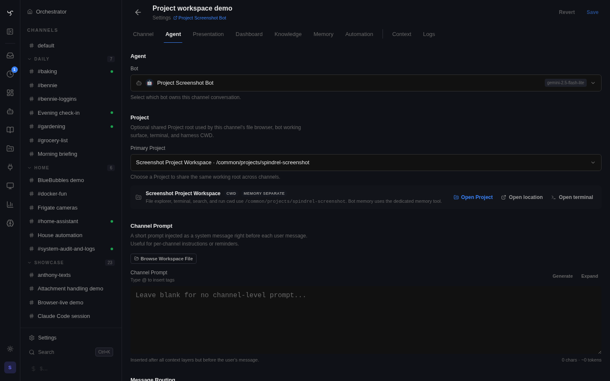

Project-bound channels use the Project root for workspace tools and harness
cwd. Bot memory is still owned by the memory system, not the Project root.
If the Project binding or selected fresh instance cannot be resolved, file,
exec, context, indexing, and harness paths fail visibly instead of falling back
to a different workspace root.

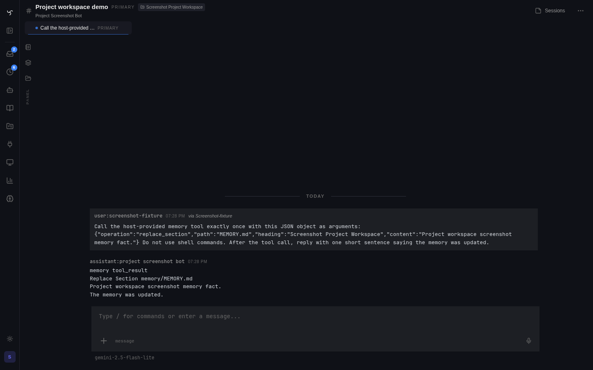
