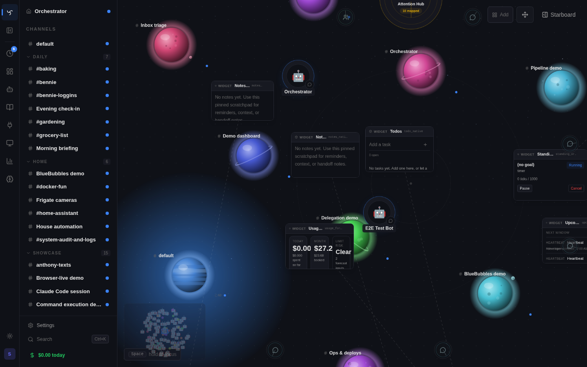
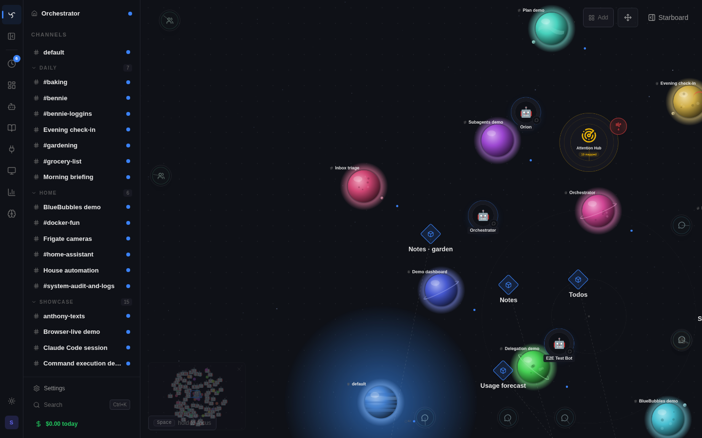
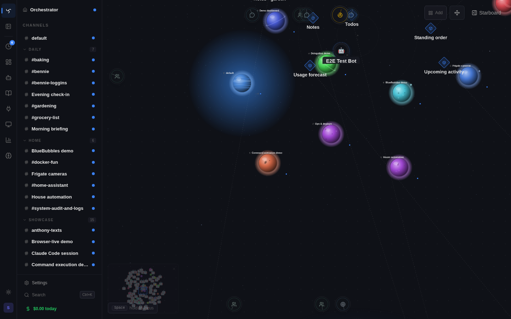
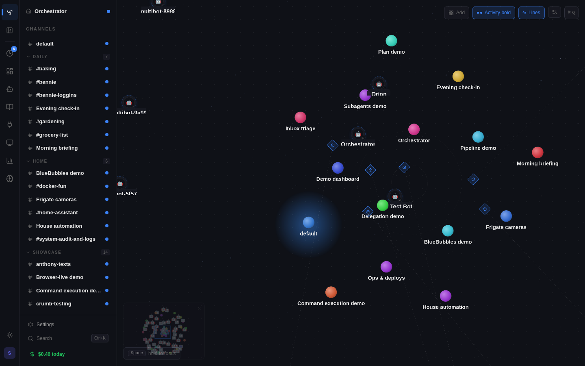
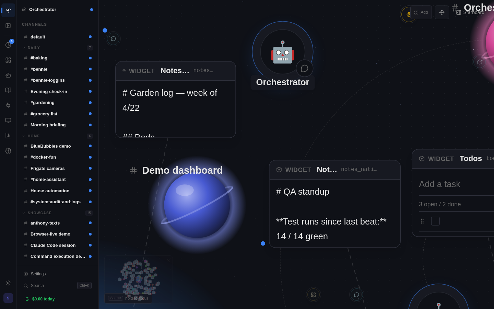
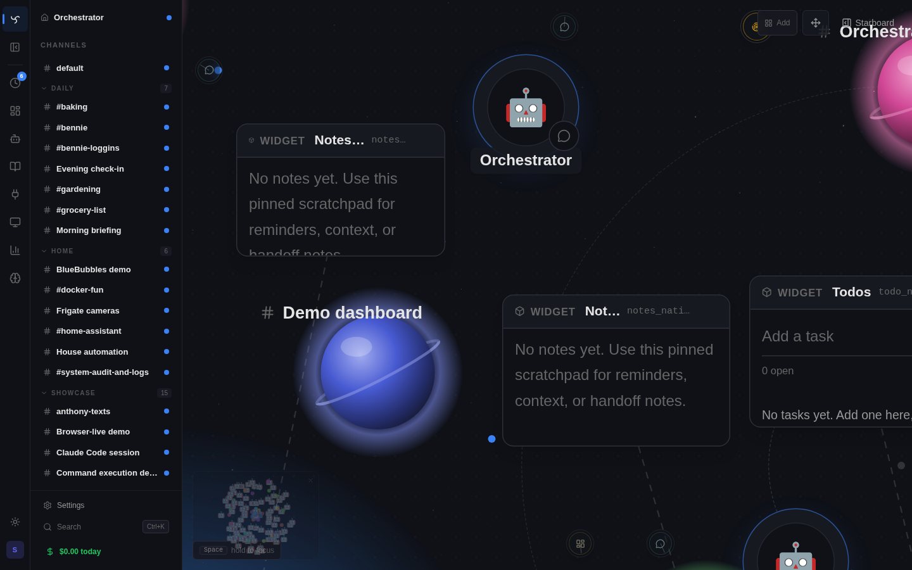
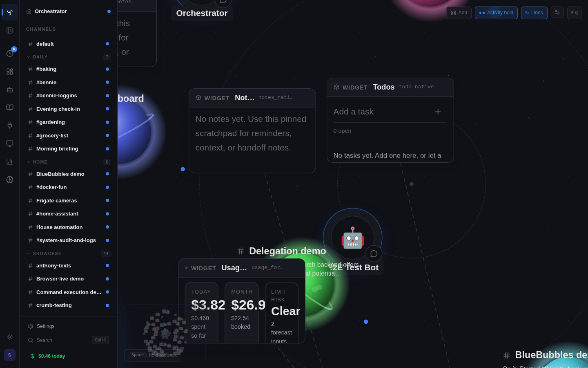
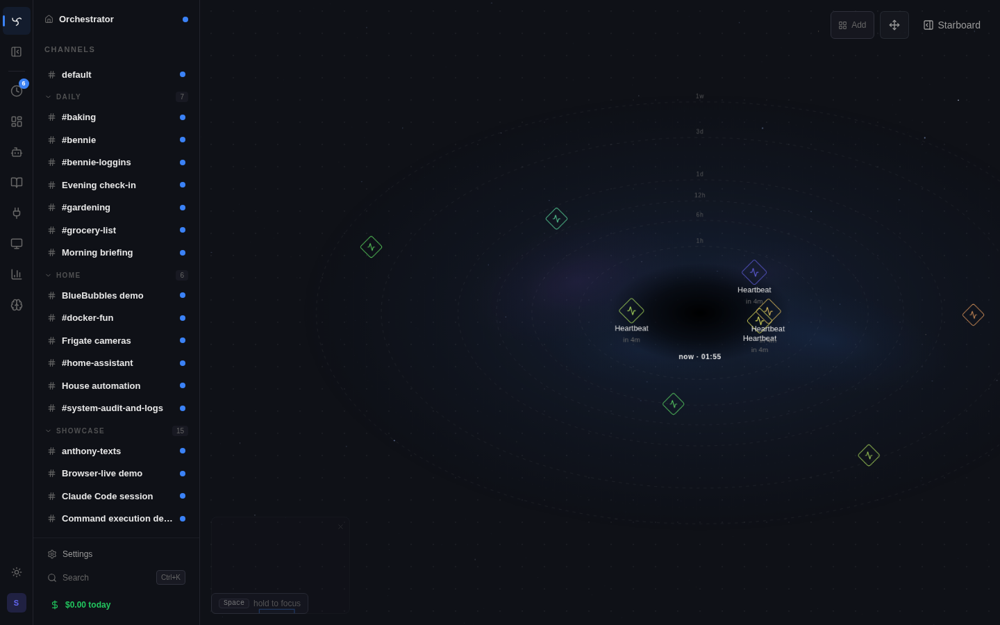
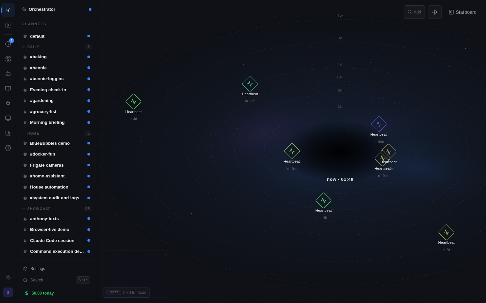

# Spatial Canvas

The spatial canvas is Spindrel's home surface on desktop: a workspace-scope **infinite plane** where every channel and every channel-associated widget lives as a draggable tile. It replaces the old `HomeGrid` "desktopified command palette" with a surface that actually *is* the workspace — channels networked in the middle, widgets living freely around them, scheduled work orbiting a Now Well.

Mobile keeps the existing channel list. The canvas is desktop-only today.

## Visual verification

Spatial Canvas changes need browser screenshots, not only typechecks. Use the
project skill at `.agents/skills/spindrel-visual-feedback-loop` or follow
[Visual Feedback Loop](visual-feedback-loop.md). The canonical screenshot bundle
is `spatial-checks`; it stages e2e canvas state, captures `docs/images/spatial-check-*.png`,
and requires visual inspection before calling a UI pass complete.

## Opening the canvas

| Where | How |
|---|---|
| **Home route** (`/`) on desktop | The canvas IS the home page. No hotkey needed. |
| **From any other route** | `Ctrl+Shift+Space` (Cmd+Shift+Space on macOS) toggles the canvas as an overlay on top of the current page. |
| **Closing the overlay** | Same hotkey, `Esc`, or the close button in the canvas chrome. |

When the overlay opens from a channel page, the camera centers on that channel tile. From elsewhere, the camera restores its last position from `localStorage`.

The route underneath the overlay **stays mounted**. SSE streams, in-flight bot responses, composer drafts, and transient route state all survive opening and closing the canvas — there is no refetch or reconnect.

## Pan and zoom

- **Pan** — click-and-drag on the background.
- **Select items** — in Browse mode, clicking a channel, bot, widget, or
  landmark selects it and opens Map Brief in Starboard. The canvas keeps a
  small selected-object anchor in-world so the user can see what the panel is
  describing without a competing floating rail.
- **Move items** — turn on Arrange in the canvas chrome. Browse mode never
  moves objects, and `Shift` is not a movement override.
- **Zoom** — wheel anywhere on the canvas. Holding the cursor over a widget tile zooms the canvas, not the widget (until the tile is "activated"; see [Widget tiles](#widget-tiles)).
- **Recenter** — use `Cmd+K` / `Ctrl+K` and pick the canvas recenter action.
- **Fly to a channel** — `Cmd+K` and pick a channel. When the canvas is mounted, channel-pick navigates by flying the camera to that tile instead of route-changing.
- **Fly to the Now Well** — use `Cmd+K` / `Ctrl+K` and pick the Now Well action (see [Now Well](#now-well-and-orbital-scheduled-tasks)).

## Channel tiles

Channels auto-populate. The first time a channel appears, the server assigns it a deterministic position via golden-angle phyllotaxis (a sunflower-seed spiral), so layout is stable across reloads and across tabs. Drag a tile to pin it forever — the new position is persisted server-side and never recomputed.

Each channel renders at semantic-zoom levels. The authored bounding boxes stay the same; only the presentation swaps:

| Zoom range | What you see |
|---|---|
| `< 0.22` (**cluster**) | Nearby channel dots collapse by screen proximity. The highest-usage channel is the main dot, small satellite dots hint at the hidden neighbors, and a `+N` badge shows the hidden count. Usage wins the cluster anchor; most-recent activity breaks ties. |
| `< 0.4` (**dot**) | A colored disc + name label. Color is a stable hash of the channel ID, so the same channel always reads the same hue. |
| `0.4 – 1.0` (**preview**) | Compact card: hash chip, colored bullet, name, last activity timestamp. |
| `≥ 1.0` (**snapshot**) | Expanded card with member-bot chips, private flag, and a "double-click to dive" hint. |

Clicking or double-clicking a cluster focuses the camera toward that cluster
only far enough to uncluster nearby channels. It does not select a hidden
winner, open a popover, or navigate directly to a channel. Cluster halos respect
the **Activity** toggle. When Activity is enabled, member halos collapse into
the cluster marker; when Activity is off, the anchor still comes from recent
usage, but no glow is shown.

**Double-click a channel tile to dive in.** A ~300ms zoom-and-translate animation runs to completion, then the route changes to `/channels/:id`. The canvas never embeds the channel page — diving is always a route change.

## Widget tiles

Channel-associated widgets project across the channel dashboard and Spatial Canvas automatically. Pinning a widget onto a channel dashboard also creates a canvas placement near that channel; pinning a widget directly to the canvas with a source channel also creates a dashboard placement. Users move and resize the two placements independently, but they do not have to choose "dashboard-only" versus "spatial-only."

Internally, the canvas still stores widget tiles as reserved `workspace:spatial` dashboard pins plus `workspace_spatial_nodes` rows. Projection metadata links that row to the channel-dashboard pin. For channel-scoped native widgets like Notes and Todo, the paired placements reuse the same `WidgetInstance`, so edits in the channel dashboard and on the spatial tile stay identical. Adding a native widget directly from the canvas catalog without a source channel still creates a fresh instance.

Widget tiles also have three semantic-zoom levels:

| Zoom range | What you see |
|---|---|
| `< 0.4` | Chip — small icon + name. |
| `0.4 – 0.6` | Chip + title. |
| `≥ 0.6` | **Live iframe.** The widget mounts inside the canvas with full interactivity. |

**Iframe gesture handling.** A live widget would normally swallow wheel and
click events. The canvas covers the iframe with a transparent shield until the
tile is activated from the selected-object rail or Starboard action menu. Once
activated, wheel and click reach the iframe; pan/zoom of the canvas pauses
inside the tile. `Esc` or clicking the canvas background deactivates.

**Viewport culling.** Only tiles inside (or within one viewport of) the camera get a live iframe; far-away tiles render a static body. Pan a viewport away and back without the iframe remounting. Pan farther and state is discarded — by design.

Widgets on the canvas use the same iframe contract, SDK, theme, and bot-scoped auth as channel-dashboard widgets. The widget runs as the bot that authored it.

## Bot nodes

Bots that participate in channels can appear as actor nodes on the canvas when a channel's spatial-bot policy enables them. Their world position is global per bot, while awareness, self-movement, object tugging, inspection, map view, and bot-owned widget management are gated per channel.

Bot nodes are seeded near their primary or member channel, but not inside the channel/widget cluster. The server tests candidate spawn positions against existing canvas rectangles and keeps at least the default edge-clearance gap, so a bot is not born already crowding another object. Older untouched bot rows that still match the former overlapping spawn distance are repaired the next time the bot node is ensured.

Clicking a bot selects it and opens Map Brief. Chat and bot settings are
explicit actions in Map Brief or context menus, so a normal canvas click never
randomly opens chat while the user is trying to inspect or navigate.

`move_on_canvas` moves by bounded grid steps. If a move would worsen under-clearance crowding, the tool rejects it and names the blocking object plus the before/after edge gap in policy steps.

`view_spatial_canvas` is a read-only map-view tool gated by `allow_map_view`. It accepts presets (`whole_map`, `cluster`, `dot`, `preview`, `snapshot`) plus optional camera coordinates, or a focus token returned by a prior call. The result mirrors what a human-visible viewport would expose at that zoom: surface labels, semantic tiers, cluster counts, satellite hues, connection summaries, world bounds, and screen-relative coordinates. It does not expose hidden cluster member names or widget iframe contents. Heartbeats can opt into a compact far-zoom overview with the separate **Include map overview** toggle.

## Connection lines

Pinned widgets are drawn with a faint dashed curve back to their source channel tile. Hovering a widget tile brightens its outgoing line to accent color, making it obvious which channel a widget belongs to.

Toggle the layer from **Starboard → Controls → Connection lines**. The setting persists in `localStorage`.

## Scheduled work satellites

Enabled heartbeats and channel-bound scheduled tasks appear in two places:
the Now Well keeps the global timeline, and the channel gets compact local
satellites for the next few scheduled items. The local satellites use the same
connection-line preference for their faint tethers, so turning off connection
lines quiets both widget and schedule tethers without hiding the scheduled
work itself.

Click a heartbeat satellite to open that channel's Automation settings. Click
a task satellite to open the automation detail page. Items due soon get a
restrained semantic ring instead of a colored side stripe.

## Starboard

The **Starboard** panel is the right-side canvas command surface. It is a
docked full-height surface with a header station switcher so future map
workflows can live in one place instead of scattering small popovers across the
viewport. The last station choice persists in `localStorage`.

- **Map Brief** is the contextual inspector. Selecting a world object shows what
  it is, what needs attention, what runs next, recent updates, and one primary
  route into the full review surface when work is needed. It stays shallow by
  design; it is not the place to run queue triage or read long transcripts.
- **Attention** is a compact map summary station. It lists the next local
  signals and launches the full review deck; it does not embed the workbench.
- **Launch Bay** hosts the add-to-canvas flow, including the optional
  `core/command_center_native` widget for users who want a removable world tile.
  The top-right `+ Add` button and the background context menu both open this
  station; background placement keeps the clicked map position as the drop
  target.
- **Daily Health** embeds the deterministic 24h server-error rollup so the
  canvas does not open a competing side panel.
- **Objects** lists positioned canvas entities ordered by distance from the
  current viewport center. It includes channel, widget, bot, and landmark
  positions. The list has client-side search, and clicking a row selects that
  object and flies the camera to it without changing the user's current zoom
  unless they are far out. Channel rows still double-click to dive.
  Right-clicking a row opens Starboard-local actions such as open channel, open
  bot chat/settings, activate widget, or open source channel.
- **Controls** owns canvas behavior toggles: command palette, Attention
  signals, connection lines, Activity halos, bot visibility, and edge beacons.

## Density halos

Each channel tile carries a soft glow halo whose radius and opacity scale with the channel's recent token usage. Heavy channels glow visibly larger; quiet channels barely glow at all. Halos use the channel's hue, so they amplify identity rather than introducing a parallel color system.

Cycle intensity from **Starboard → Controls → Activity**: `subtle` (default) → `bold` → `off`. The same panel exposes:

- **Time window** — `24h` / `7d` / `30d`.
- **Spike colors** — instead of channel-hued halos, tint by current-vs-prior-period ratio (cool below baseline, warm above).
- **Breathe** — slow opacity + scale oscillation, period scaled to volume so heavy halos breathe slower.

State persists per setting in `localStorage`.

## Focus+context lens

Hold **`Space`** to engage a fisheye lens. The cursor is the focal point; tiles inside the lens stay at native size, tiles outside are pulled toward the focal point and shrunk on a logarithmic curve. Release `Space` to drop the lens.

The lens is render-only — no DB writes, no persisted state changes — so it is safe to engage anywhere. It auto-disengages on pan-start, drag-start, dive, or when typing into an input.

## Now Well and orbital scheduled tasks

A landmark sits below the channel constellation: the **Now Well**, a stack of quiet concentric squashed ellipses with a black inner gradient, soft blue/violet haze, and a live `now · HH:MM` clock. It reads as an isometric hole in the floor. The 1-week horizon uses granular time bands (`15m`, `1h`, `6h`, `12h`, `1d`, `2d`, `3d`, `5d`, `1w`) so multi-day work does not collapse into one crowded ring.

Scheduled work orbits the well. Each upcoming item — a scheduled task, a heartbeat, a memory-hygiene job — renders as a diamond glyph at a polar position whose **radius** encodes how far in the future the item fires (closer = sooner) and whose **angle** is a stable hash of the item's identity. Three semantic-zoom levels mirror channel tiles: distant items are dots, mid-zoom shows the diamond glyph, close-up shows glyph + title + relative time.

- Items firing within 60 minutes get an **imminent boost** — they jump up a tier so they are readable without zooming in.
- Type-specific inner icons: tasks get a clock, heartbeats get an activity pulse, memory-hygiene gets a sparkle.
- Color follows the source channel's hue (or the bot's, when no channel is bound).
- Items in the same coarse radius/angle cell get a small deterministic visual fan-out so they do not sit directly on top of each other.
- A 5-second client tick advances orbit radii smoothly between fetches.
- Click a tile: tasks open the task detail page; heartbeats open the channel.
- Click the well's center to jump to the admin tasks list.

Orbital tiles are **rendered**, not stored. They are not `WorkspaceSpatialNode` rows.

## Memory Observatory and edge beacons

The canvas also has a fixed far-left **Memory Observatory** landmark. It gives the workspace memory system a visible place on the map instead of hiding it behind admin tables:

- Hot memory files render as bodies grouped by bot lane.
- Recent writes emit small sparks so new memory activity is visible while scanning the canvas.
- Memory-only search can fly the camera to matching memory bodies.
- Source inspection opens the selected memory file body without leaving the canvas.

The canvas can also show **edge beacons** for important off-screen landmarks and active surfaces: Memory Observatory, Now Well, channels, widgets, and bots. Beacons sit on the viewport edge and can fly the camera to their target. The beacon toggle persists in `localStorage`.

## Attention Beacons

Attention Beacons are active [Attention Items](attention-beacons.md) rendered
on the canvas. They attach to existing channel, bot, widget, or system
targets and do not create or move `workspace_spatial_nodes` rows.

Bot-authored and user-authored actionable items render as one target-owned
rim signal using the worst active severity for that target. The map does not
show counts on idle targets; counts, repeated occurrences, evidence, and issue
navigation live in the Hub. Structured system failures render on the map only
when they are critical, severe, or repeated enough to be actionable; quieter
one-off tool failures stay Hub-only.

Signals render in the high-z canvas world layer anchored to their target or
cluster, so nearby widgets cannot clip or cover them. They keep a stable screen
size through inverse scaling while their anchor follows the bound tile during
pan, zoom, and semantic-zoom transitions. The local **Starboard → Controls →
Attention signals** toggle hides these map signals without changing Attention
Item state.

Clicking a target signal selects the target and opens Map Brief. Map Brief can
link directly to the unreviewed item or reviewed finding in `/hub/attention`;
the full page owns queue triage, acknowledgements, bot reports, Operator
findings, sweep receipts, and transcript evidence. The global Attention entry
point can still acknowledge all visible active items after confirmation.

The canvas also has a fixed **Attention Hub** landmark above the seed center.
Opening it shows the compact Attention station in Starboard; the station's
primary action opens the full Mission Control Review deck at `/hub/attention`.
When mapped items exist and Attention signals are visible, the Hub's edge beacon
remains available whenever the Hub is offscreen.

## Reserved dashboard slug

Internally, canvas widget pins live under a reserved widget-dashboard slug, `workspace:spatial`. This slug is filtered out of every UI surface that lists dashboards (tabs, target pickers, recents, sidebar). It exists so canvas pins reuse the entire existing widget-dashboard plumbing — envelope, contract snapshot, presentation snapshot, source bot, iframe auth — without a parallel widget host path.

You will never see `workspace:spatial` in the UI. If you ever do, that is a bug.

## What is not on the canvas (yet)

- **Mobile.** Mobile home stays as the channel list.
- **Embedded live channels.** Diving always navigates; the canvas does not embed `ChannelDashboardMultiCanvas` at max zoom.
- **Auto-edges.** Edges between tiles are limited to widget→channel connection lines today. User-drawn edges, shared-bot edges, etc. are backlog.
- **Multi-select / undo / snap-to-grid.** Single-tile drag only.
- **Activity pulses.** Halos summarize *historical* token usage; there is no SSE-driven live pulse on tile updates yet.
- **Other node types.** Files, pipelines, automations, and pinned sessions are backlog. The schema reserves room for them.

## Data model

`workspace_spatial_nodes` is the single source of truth for tile positions. It is a polymorphic-by-nullable-FK table:

- `channel_id` (nullable, FK `channels.id`, cascade delete)
- `widget_pin_id` (nullable, FK `widget_dashboard_pins.id`, cascade delete)
- `bot_id` (nullable; registry-backed bot id)
- CHECK: exactly one target is non-null
- `world_x`, `world_y`, `world_w`, `world_h`
- `seed_index` (monotonic; used for deterministic phyllotaxis seeding; never recomputed)
- `last_movement` (short-lived movement trace for bot movement and object tugs)
- `pinned_at`, `updated_at`

Channel positions never leak into the `channels` table. Widget canvas positions never leak into `widget_dashboard_pins.grid_layout`.

## See also

- [Widget System](widget-system.md) — the canonical widget contract that canvas widget tiles consume.
- [Widget Dashboards](widget-dashboards.md) — channel and named dashboards. Canvas pins are a third dashboard surface that piggybacks on the same model.
- [HTML Widgets](html-widgets.md) — bot-authored widgets and the bot-scoped auth model used inside canvas iframes.
- [UI Design](ui-design.md) — token system and chrome rules. The canvas chrome (Add plus the Starboard trigger) follows the standard control surface language.
