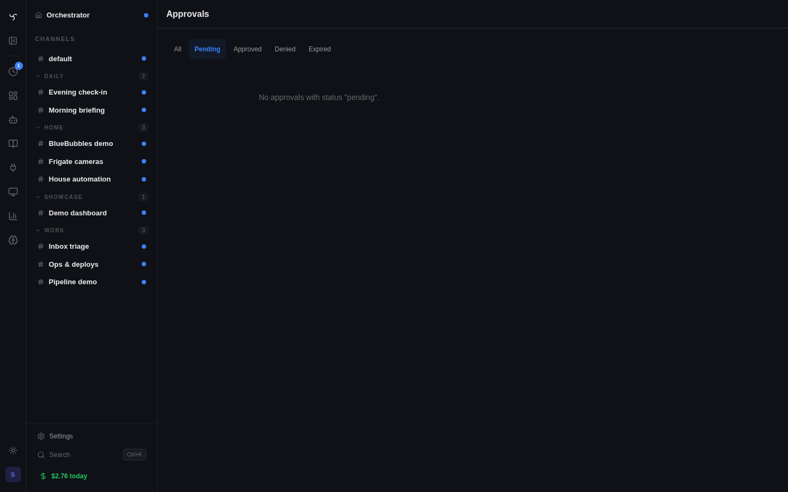

# Tool Policies



Tool policies control which tools require approval before execution. Policies can deny tool calls outright or require manual approval from an admin.

---

## Autonomous Runs (Heartbeats & Tasks)

Heartbeats and scheduled tasks run without a user watching the chat. When these autonomous runs trigger a tool that requires approval, the run blocks waiting for someone to approve it — and if nobody does within the timeout (default 5 minutes), it fails silently.

### Auto-approve for heartbeats

Enable **Auto-approve tool calls** in the heartbeat's Advanced settings to skip all tool policy checks during heartbeat runs.

1. Open a channel → **Settings** → **Heartbeat** tab
2. Expand **Advanced**
3. Toggle **Auto-approve tool calls** on
4. Save

### Auto-approve for tasks

Set `skip_tool_approval` in the task's `execution_config`:

```json
{
  "skip_tool_approval": true
}
```

This can be set when creating tasks via API or the `schedule_task` tool.

### Approval visibility

Pending approvals are surfaced across the app so you don't miss them:

- **Sidebar badge** — the Approvals nav item under SECURITY shows a red count badge when pending approvals exist
- **Toast notification** — a toast appears in the bottom-right corner when new pending approvals arrive while you're on any page, with a link to the approvals page
- **Approvals page** — full list at Admin → Security → Approvals with approve/deny actions and rule suggestions
