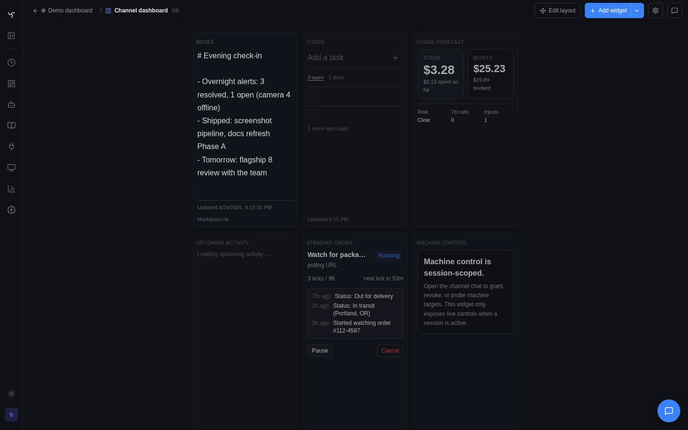

# Widget Dashboards

For the canonical widget taxonomy and how presets, tool widgets, standalone HTML widgets, and native widgets converge on the same placement model, read [Widget System](widget-system.md) first. This guide focuses on placement, dashboards, and pin behavior.

Dashboards are Spindrel's answer to "I want my agent's output *on a wall*, not buried in chat." Pin any tool result — a Home Assistant light toggle, a weather card, a task-status chip, a bot-authored HTML chart — to a dashboard and it keeps working: polling for fresh state, honoring clicks, updating when the underlying data moves.

There are two shapes of dashboard, and both are used by the same pins, grid, and editing tools:

- **Named user dashboards** at `/widgets/<slug>` — your personal pinboards (`default`, plus any you create: `home`, `monitoring`, etc.). Cross-channel; mix tools from any bot on any channel.
- **Channel dashboards** at `/widgets/channel/:channelId` — one per channel, lazy-created. Unlike user dashboards, these map onto the actual chat layout zones: left rail, center dashboard, right rail, and the floating top-center header rail.

A third surface — the **[Spatial Canvas](spatial-canvas.md)** — also pins widgets, on a workspace-scope infinite plane instead of a grid. Canvas pins ride the same envelope, contract snapshot, and bot-scoped auth as channel-dashboard pins; they live under a reserved dashboard slug that is filtered out of every dashboard-listing surface.

You reach the `/widgets` page from the left sidebar rail ("Widgets" tab). Channel dashboards are reachable from the channel header's `LayoutDashboard` icon and the command palette ("Channel dashboard" under THIS CHANNEL).

## Three definition kinds, one dashboard

Any widget may be placed in any dashboard zone, but not every widget is authored for every host surface. The dashboard accepts all definition kinds; clean fit still depends on the widget's presentation family and the available space.

| Kind | Authored by | How it renders | Example |
|---|---|---|---|
| **Tool widget** | A tool's YAML definition (for example `tool_widgets:`) | Either structured JSON via the built-in renderer or a tool-bound `html_template` renderer | Home Assistant status/control cards; weather cards; `schedule_task` status |
| **HTML widget** | A bot or user-authored standalone bundle | Sandboxed iframe with custom HTML + JS + CSS. Runs fetches against `/api/v1/...` via `window.spindrel.api()` | A recent-messages panel; a custom Chart.js bar chart; a per-project mini-control-surface |
| **Native widget** | Core app only | Host-rendered first-party widget with instance-backed state | Notes; Todo |

Mix freely. A typical channel dashboard might have a Home Assistant tool widget, a bot-authored HTML chart, a native Notes card, and a pinned `schedule_task` status on the same grid.

For the authoring deep-dive on each kind, see [Widget Templates](../widget-templates.md) (component widgets) and [HTML Widgets](html-widgets.md).

## Named user dashboards

The `/widgets` page shows a tab strip of your user dashboards (channel dashboards are filtered out so the tabs don't flood). Each tab is a full grid.

**Creating + managing:**

- **Create** (`+` button next to the tabs) → a sheet asks for slug, name, optional icon. The slug becomes the URL (`/widgets/<slug>`).
- **Rename / set icon / switch grid preset** (`⚙️` button on the active tab) → `EditDashboardDrawer`.
- **Delete** — any dashboard except `default`. `default` is your home board and always exists.

**Adding widgets:**

- **From chat** — every widget card has a pin icon (`📌`). Click and it lands on the **channel** dashboard (the conversation-local board). From there you can move it into a named dashboard using "Add from channel" (below).
- **From `/widgets`** — the "Add widget" split-button opens the `AddFromChannelSheet`: browse pins on any channel's dashboard, search by name, or switch to the **Library** tab to pin reusable widget bundles from the core/bot/workspace library. Adding here doesn't remove a source pin — pins are copied by envelope.
- **From a bot** — ask the bot to pin its output. Bots can author HTML widgets via `emit_html_widget`; the user still confirms the pin.

The split-button's secondary menu also exposes **Developer tools**, which jumps straight into `/widgets/dev` with the current dashboard preserved as the origin target.

## Channel dashboards

Every channel gets an implicit widget dashboard under slug `channel:<uuid>`, created on first read or first pin — no setup required. The dashboard is cascade-deleted when the channel is.

**Two views onto the same pins:**

- **Full dashboard** at `/widgets/channel/:channelId` — the editing surface where you place pins into channel-layout zones.
- **Live chat layout** on the channel page — the same pins rendered back into the channel chrome around the conversation.

### Channel layout zones

Channel dashboards are not just "a grid plus a left rail." They map onto four distinct zones:

- **Left rail** — supporting widgets to the left of the conversation
- **Center dashboard** — the main dashboard canvas in the middle
- **Right rail** — supporting widgets to the right of the conversation
- **Floating header rail** — a top-center overlay rail above the channel content

The edit surface reflects those zones so you can place pins where they will actually live in chat, not in an abstract dashboard-only layout.

### What shows where

- **Rail zones** are for persistent side widgets that flank the conversation
- **Center dashboard** is for the main, larger widget canvas
- **Floating header rail** is best for compact status/control widgets and short utility cards that sit above the main channel content

This matters because zone and presentation family are different:

- `header` is the top-rail placement zone
- `chip` is a presentation family, not a persisted zone
- chip-family widgets are authored for that compact rail
- card-family widgets can still be placed there, but they render as constrained short cards rather than automatically becoming chips
- The floating header rail's unset shell mode resolves to Glass. Channel settings can still choose Surface or Clear explicitly.

**Mobile note:** the channel side surfaces collapse into mobile-friendly sheets/drawers, but the underlying pin zones are still the same.

## Layout, editing, and grid presets

Under the hood the grid is `react-grid-layout` — drag to move, corner-handle to resize. Layout changes are optimistic and commit in one bulk `POST /pins/layout` call.

**Per-pin editing** (edit mode → pencil icon on a tile):

- **Display label** — what the card header says. Defaults to the envelope's `display_label` or the tool name.
- **Widget config** — free-form JSON. For widgets whose YAML template substitutes `{{widget_config.*}}`, this is where "Show Fahrenheit", "Hide forecast", "Compact mode", etc. live. `{{config.*}}` remains a compatibility alias only.

**Authored layout defaults:**

- `widget_presentation.layout_hints.preferred_zone` seeds the initial zone when a pin is created without an explicit placement.
- `min_cells` / `max_cells` clamp the seeded default size only when the pin is created in the hinted zone.
- These are defaults, not locks: users can still drag any widget into another zone. The editor then uses that zone's resize bounds, so a chip moved to the main grid can grow like a grid tile.
- Native/component responsiveness still comes from measured host geometry; `layout_hints` tells the host how large the tile should start, not how the tile must be stretched forever.

**Grid presets:**

| Preset | Columns | Row height | Main use | Best for |
|---|---|---|---|---|
| **Standard** (default) | 12 | 30 px | Balanced channel/user dashboards | Most dashboards; friendlier grid |
| **Fine** | 24 | 15 px | Denser placement and alignment | Information-dense boards; half-tile increments |

Switch from `EditDashboardDrawer`. Rescaling is atomic and integer-safe (std↔fine = ×2), so the visual arrangement survives the switch.

## Panel mode

Some dashboards want one large "main panel" and a strip of supporting widgets instead of an all-grid wall. Panel mode does that.

### What it is

- One pin is marked as the dashboard's **main panel**
- The dashboard flips from grid layout to a **two-column panel view**
- The main panel gets the large content area
- The remaining pins stay visible in the side rail strip

On mobile, the panel stacks above the supporting rail instead of staying side-by-side.

### How to use it

In edit mode, eligible interactive HTML pins expose a **Promote to panel** action in the pin editor. Promoting a pin:

- marks that pin as the dashboard's main panel
- clears any previous panel pin in the same dashboard
- flips `grid_config.layout_mode` to `"panel"`

Demoting the panel pin (or deleting it) returns the dashboard to normal grid mode.

### When it fits

Use panel mode when one widget is clearly the star:

- a large bot-authored HTML dashboard
- a room-control or system-control surface
- a notes or todo panel you actively work inside

Keep grid mode when the dashboard is more of a status wall than a focused workspace.

## Authorization and ownership

- **Dashboards are shared, not per-user** (current iteration). Any authenticated user with `channels:write` can create, rename, delete, and pin. Multi-tenancy isolation is a roadmap item.
- **Widgets run as the bot that authored them**, not as you. For component widgets this is a non-issue (tools already run server-side under the bot's identity). For HTML widgets it's load-bearing security — see [HTML Widgets → Security model](html-widgets.md#the-security-model--widgets-run-as-the-bot-not-as-you). The `@botname` chip on an HTML widget's iframe tells you who it's acting as.

## Troubleshooting

| Symptom | Usual cause |
|---|---|
| Widget is showing in the wrong part of the channel UI | It was pinned into the wrong channel zone. Open the full channel dashboard and move it between left rail, center dashboard, right rail, or the floating header rail. |
| "No widgets pinned" on the channel dashboard even though you see widgets in chat | You're probably on a user dashboard, not the channel one. The channel dashboard URL is `/widgets/channel/:channelId`; the page shows a breadcrumb instead of the tab strip when you're on it. |
| A library widget previews but won't load when pinned | Bot/workspace library widgets need a bot context for auth and workspace resolution. Pick the correct bot before pinning from the Library tab. |
| The "Promote to panel" action is missing | Panel mode is only offered on eligible interactive HTML pins, not every component tile. |
| Widget says "Widget auth failed" | It's an HTML widget and the emitting bot has no API key. Admin UI → Bots → this bot → API Permissions. |
| Clicking a component widget toggle 403s | The bot doesn't have the scope the tool requires. Broaden the bot's scopes, not yours. |
| Mobile bottom sheet feels stuck | The sheet has two snap points only (tall + dismissed). Swipe down to dismiss; tap the handle to reopen. The middle "half" state is intentionally gone. |

## See also

- [HTML Widgets](html-widgets.md) — bot-authored iframe widgets and their bot-scoped auth model.
- [Widget Templates](../widget-templates.md) — authoring component widgets from YAML.
- [Developer API](api.md) — the endpoints widgets call when they need live data.
