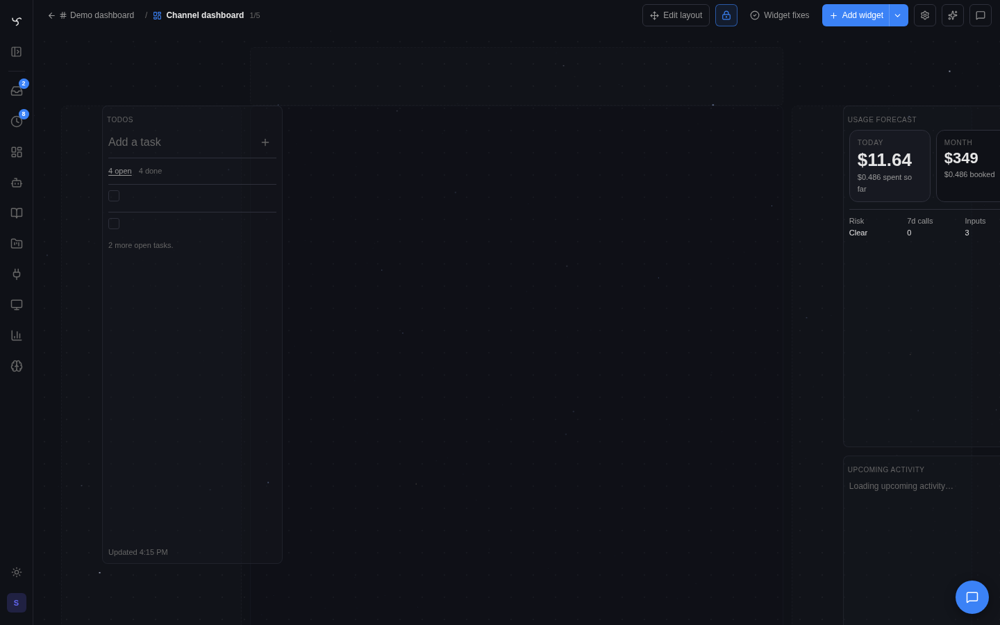

# Widget System



This is the canonical reference for how the widget system works.

If other docs, UI copy, or track notes disagree with this page, this page wins.

## The shortest correct model

There are three widget definition kinds:

| Public term | Internal/API term | Who authors it | User-addable |
|---|---|---|---|
| Tool widget | `tool_widget` | integration authors, admins, advanced users | yes |
| HTML widget | `html_widget` | bots, users, integrations | yes |
| Native widget | `native_widget` | core app only | no |

There are also several instantiation paths:

| Instantiation path | Internal/API term | What it means |
|---|---|---|
| Direct tool call | `direct_tool_call` | a tool widget rendered from a normal tool result |
| Preset | `preset` | a guided binding flow that instantiates a tool widget |
| Library pin | `library_pin` | a standalone HTML widget pinned from the library |
| Runtime emit | `runtime_emit` | a standalone HTML widget emitted at runtime, usually via `emit_html_widget` |
| Native catalog | `native_catalog` | a first-party native widget placed from the catalog |

The same placed thing can appear as:

- a rich result in chat
- a pinned dashboard widget
- a channel dashboard placement

That shared placement surface is real. The authoring model underneath is not one single thing.

## The four-layer model

Keep these layers separate:

1. `widget_contract` — the semantic/runtime kind
2. `widget_origin` — how this concrete instance or pin was created
3. `widget_presentation` — authored presentation intent
4. `resolved_host_policy` — the host's final rendering decision for one placement

The system is much easier to reason about if those are not collapsed together.

### `widget_contract`

This answers: "What is this widget, semantically?"

It covers things like:

- definition kind
- binding kind
- instantiation kind
- auth model
- state model
- refresh model
- theme model
- declared actions

### `widget_origin`

This answers: "Where did this pin come from?"

Examples:

- direct tool result pin
- preset-backed tool widget
- library HTML widget
- runtime-emitted HTML widget
- native catalog widget

### `widget_presentation`

This answers: "What kind of host surface was this authored for?"

Current fields include:

- `presentation_family` — `card`, `chip`, or `panel`
- `panel_title`
- `show_panel_title`
- `layout_hints` — authored placement defaults and host-size bounds:
  - `preferred_zone` seeds initial placement when the pin call does not pass an explicit zone
  - `min_cells` / `max_cells` clamp the seeded default size only while the pin is created in the hinted zone
  - editor resize bounds come from the current host zone, so moving a chip-family widget to the grid does not trap it at chip size
  - these do not forbid moving or resizing a widget in another zone
  - they do not replace renderer-native responsiveness, which still depends on measured host size

### `resolved_host_policy`

This answers: "How should this specific placement render right now?"

It is derived from:

- placement zone
- authored `widget_presentation`
- dashboard chrome
- per-pin runtime overrides

## The two distinctions that matter

Most confusion comes from collapsing these questions together:

1. What kind of widget definition is this?
2. How did this particular widget instance get created?

Those are different.

### Definition kind

This is the durable authoring/runtime contract.

- `tool_widget`
- `html_widget`
- `native_widget`

### Instantiation kind

This is how one concrete widget instance got into the world.

- `direct_tool_call`
- `preset`
- `library_pin`
- `runtime_emit`
- `native_catalog`

A preset is therefore not a fourth widget kind. It is an instantiation path, usually for a tool widget.

## Tool widgets

Tool widgets are the YAML-backed lane.

They are defined under a tool and are bound to that tool's output contract. The current public contract for them is:

- `definition_kind = tool_widget`
- `binding_kind = tool_bound`
- `auth_model = server_context`
- `state_model = tool_result`

### What a tool widget is

A tool widget is:

- bound to one tool name
- rendered from that tool's result plus optional `widget_config`
- optionally refreshable via `state_poll`
- placeable as a rich tool result or as a pinned widget

### What a tool widget is not

A tool widget is not:

- a standalone widget bundle
- a free-form mini app
- a synonym for preset

### Important clarification: YAML tool widgets can render two ways

This is the subtle part that caused the most confusion.

A tool widget may render through:

- the component/template renderer via `template:`
- an HTML-backed renderer via `html_template:`
- a core semantic renderer via `view_key` plus renderer-neutral `data`

All three are still `tool_widget`.

`html_template` does not turn the definition into a standalone HTML widget. It only changes how that tool-bound widget renders.

`view_key` is different: it lets a tool widget opt into a first-party semantic renderer when the payload shape is generic enough for core to own. For example, Web Search uses `view_key: core.search_results` with `{query, count, results[]}` data. The integration still owns the tool and fallback component template; core owns the reusable search-results presentation for default and terminal chat modes.

Component-template widgets follow the shared low-chrome component design
language in [Widget Templates](../widget-templates.md#component-design-language).
Cards adapt across compact/standard/expanded dashboard sizes; chip widgets
remain explicit chip presets/templates rather than automatic card collapse.

That means a YAML-defined Home Assistant card can feel visually native or custom, but it is still fundamentally:

- tool-bound
- state-from-tool-result
- instantiated from a tool call or preset

## HTML widgets

HTML widgets are the standalone iframe/widget-SDK lane.

Their public contract is:

- `definition_kind = html_widget`
- `binding_kind = standalone`
- `state_model = bundle_runtime`
- `refresh_model = widget_runtime`

They are the right lane when the widget should behave like a small app rather than a decorated tool result.

### Typical ways HTML widgets appear

- a library widget bundle discovered from core, bot, workspace, channel, or integration scope (files under `integrations/<id>/widgets/*.html` are auto-scanned and published to the catalog with `source="integration"`)
- a runtime-emitted widget from `emit_html_widget`

Those are different instantiation paths over the same definition kind.

### What makes HTML widgets different

HTML widgets own more of their own lifecycle:

- local JS state
- custom fetches
- custom polling
- custom layout and rendering
- bundle-owned storage or workspace-file coordination

They are not tool-bound by default, even if they happen to call tools or APIs internally.

### Runtime flavor: `html` (default) and `react`

HTML widgets ship in two runtime flavors that share the same iframe sandbox, theme tokens, widget-auth mint, and `window.spindrel.api` SDK. Pick by setting `runtime` in any of three places — the envelope-level value wins; falls back to the body's frontmatter; defaults to `html`.

1. **Library / path-mode bundles** — YAML frontmatter at the top of the body: `runtime: react`.
2. **Integration `tool_widgets`** — declare alongside `html_template` in `integration.yaml`:
   ```yaml
   tool_widgets:
     sonarr_calendar:
       runtime: react
       html_template:
         path: widgets/sonarr_calendar.html
   ```
   The frontmatter parser only sees the start of the body, and the body gets a preamble prepended before render — declare on the manifest side so the envelope is stamped at template-resolution time.
3. **Runtime emission** — pass `runtime="react"` to `emit_html_widget`.

| Flavor | Body convention | When to pick |
|---|---|---|
| `html` (default) | Plain HTML + optional `<script>` | Static layouts, light DOM updates, anything that's already simple in raw HTML |
| `react` | `<script type="text/spindrel-react">` containing JSX | Stateful widgets, list rendering, anything ergonomic in React |

The `react` flavor injects vendored React 18 + ReactDOM + `@babel/standalone` from `/widget-runtime/` (mounted by `app/main.py`) into the iframe `<head>`. A small mount shim scans for `<script type="text/spindrel-react">` blocks, compiles each through Babel with the `react` + `typescript` presets (TS types are **stripped, never typechecked**), and executes inside a closure where `React`, `ReactDOM`, and `spindrel` are in scope. Compile errors render a host-styled error card so a broken JSX block degrades visibly instead of producing a blank iframe.

Authoring example:

```html
<!--
---
name: Burndown
runtime: react
---
-->
<div id="root"></div>
<script type="text/spindrel-react">
  const { useState, useEffect } = React;
  function Burndown() {
    const [issues, setIssues] = useState([]);
    useEffect(() => {
      window.spindrel.api('/api/v1/issues').then(r => r.json()).then(setIssues);
    }, []);
    return (
      <div className="sd-card sd-stack">
        {issues.map(i => <div key={i.id}>{i.title}</div>)}
      </div>
    );
  }
  ReactDOM.createRoot(document.getElementById('root')).render(<Burndown />);
</script>
```

Why a custom MIME (`text/spindrel-react`) instead of `text/babel`: `@babel/standalone` auto-runs every `<script type="text/babel">` after `DOMContentLoaded`. The custom MIME stops that auto-runner from racing the spindrel mount shim — the shim controls compile presets and error rendering.

Theming applies identically to both flavors. `var(--sd-accent)`, `className="sd-btn"`, the entire `sd-*` utility set, and dark-mode propagation work without extra wiring. Two ergonomic helpers are exposed on `window.spindrel`:

- `window.spindrel.useApi()` — returns the bearer-attaching `api` function
- `window.spindrel.useTheme()` — React hook returning the resolved theme tokens; re-renders on host theme flips

Trust boundary is unchanged: a `runtime: react` widget is still authored by a bot or user, runs in the same sandbox, mints the same short-lived token, and inherits the emitting bot's API scopes. It does **not** import host components and is **not** the native lane (see below).

Cost: ~3 MB raw / ~600 KB gzipped for the three vendored bundles, parsed once per iframe boot. Pinned-widget pooling amortizes this for dashboard tiles. Reserve the React flavor for widgets where statefulness actually pays for itself.

### Authoring feedback loop — what bots can call

Both flavors share the same two-tool authoring loop. There is no JSX server-side typecheck or external linter — the loop is the lint.

| Tool | When | What it surfaces |
|---|---|---|
| `preview_widget` | Pre-pin dry-run | Manifest errors, CSP rejections, library-ref / path-resolution failures, mode-conflict input errors. Returns the same envelope shape `emit_html_widget` would produce, plus a structured `errors: [{phase, message, severity}]` list. Does **not** compile JSX (Babel runs in the iframe, not on the server). |
| `inspect_widget_pin` | Post-pin runtime trace | Reads the in-memory debug ring (cap 50, newest-first) for a pinned widget: every `callTool` request+response (real envelope shape — no guessing the JSON path), every `loadAttachment` result, every uncaught JS error / unhandled promise rejection / `console.*` call / `spindrel.log.*` entry. For `runtime: react`, Babel compile errors are mirrored to `spindrel.log.error` so they show up here with the same shape as a runtime JS error. |

Iteration recipe for a React widget:

1. Author v1, `preview_widget` to catch envelope/CSP/path errors.
2. Pin it.
3. Call `inspect_widget_pin(pin_id)` — read the `tool-call` event's `response` for ground-truth tool envelopes, read `error` / `rejection` / `log` events for JSX compile errors and JS bugs.
4. Rewrite against confirmed shape; re-emit. No fallback chains.

## Native widgets

Native widgets are first-party host-rendered widgets.

Their public contract is:

- `definition_kind = native_widget`
- `binding_kind = standalone`
- `auth_model = host_native`
- `state_model = instance_state`

They are used for core widgets such as Notes and Todo where the app wants:

- host-owned persistence
- host-owned actions
- deep shell integration

Native widgets are not a public authoring lane.

### Choosing the lane for a new surface

When building a new durable product primitive — something users will rely on, something with non-trivial UX, something that needs first-party trust — the default is a **native widget**, not an HTML widget. That is true even when the thing is spawned by a bot at runtime.

Pick **native** when any of these apply:

- the surface is a core product feature (a sibling of Notes, Todo, Context Tracker)
- it needs rich React UX that would be awkward in sandboxed HTML
- it needs first-party trust: direct bot identity, full tool scopes, channel message emission without round-tripping sandbox auth
- it benefits from a typed contract (`NativeWidgetSpec.default_state`, `actions`, `args_schema`, `layout_hints`) and from the shared chrome in `PinnedToolWidget` + dashboard rail

Pick **HTML** when the surface is a bot-authored or user-authored artifact that should stay inside the sandboxed `window.spindrel.api` surface — the HTML lane exists for that, not for core features.

Do not confine a core feature to the HTML lane just because a bot spawns it. The spawning verb and the rendering lane are independent concerns.

### Native widget storage model

For catalog-backed native widgets, the authoritative state lives in
`widget_instances`, not only in dashboard pins.

- identity is keyed by `(widget_kind, widget_ref, scope_kind, scope_ref)`
- pins cache render envelopes for fast reads, but native pin envelopes are
  rebuilt from the widget instance when the cache drifts
- durable user-edited data belongs in `widget_instances.state`
- `widget_instances.config` exists for widget-local config, though the current
  shipped native set uses little or none of it

One important exception exists:

- `core/plan_questions` is a transcript-native card emitted by
  `ask_plan_questions`; it is not a catalog-backed `widget_instances` object

### Shipped native widgets (current)

This is the canonical answer to "which native widgets do we ship and where
does their real data live?"

| Widget ref | Primary scope | Authoritative data | Key stored state / behavior |
|---|---|---|---|
| `core/notes_native` | `channel`, `dashboard` | `widget_instances.state` | Persistent scratchpad body plus `created_at` / `updated_at`; bot/UI actions mutate the stored note body. |
| `core/todo_native` | `channel`, `dashboard` | `widget_instances.state` | Persistent todo item list plus timestamps; items are stored as explicit open/completed records with add/toggle/rename/delete/reorder/clear actions. |
| `core/context_tracker` | `channel` | native widget instance + host-rendered payload | Channel-scoped first-party context surface. Instance identity is durable; the meaningful displayed payload is host-provided context budget / compaction state rather than user-authored content. |
| `core/usage_forecast_native` | `channel`, `dashboard` | native widget instance + host-rendered payload | Usage/forecast surface with minimal durable instance state; the meaningful visible data is host-provided forecast/activity data. |
| `core/agent_smell_native` | `dashboard` | native widget instance + host-rendered payload | Agent Smell ranking with minimal durable instance state; the meaningful visible data is computed live from trace events and tool calls. |
| `core/channel_files_native` | `channel` | native widget instance + shared channel file/navigation state | Channel file browser surface. It intentionally reuses the main channel file/navigation model instead of inventing a separate widget-local file database. |
| `core/pinned_files_native` | `channel` | `widget_instances.state` | Stores `pinned_files[]`, `active_path`, and timestamps in the channel-scoped widget instance. This hidden native widget is the source of truth for pinned channel files. |
| `core/upcoming_activity_native` | `channel`, `dashboard` | native widget instance + host-rendered payload | First-party schedule/activity view with little durable user-edited state; the meaningful payload is derived by the host. |
| `core/command_center_native` | `channel`, `dashboard` | native widget instance + host-rendered payload | Mission Control snapshot for mission load, bot lanes, Attention signals, and spatial readiness. Convenience UI only; it deliberately does not export prompt context. |
| `core/machine_control_native` | `channel` | native widget instance + session-scoped host state | Optional native machine-control surface for lease status, ready targets, and quick `Use` / `Revoke` / `Probe` controls. It is convenience UI only and deliberately does not export prompt context. |
| `core/standing_order_native` | `dashboard` (synthetic per-order scope) | `widget_instances.state` | Bot-spawned durable work item. Ticks on a schedule via the native cron dispatcher, without consuming an LLM turn per tick. Stores goal, status, strategy config, iteration count, completion criteria, and a log of recent tick outcomes. One instance per Standing Order (unique synthetic `scope_ref`), not one-per-channel. |
| `core/plan_questions` | transcript / session flow | tool envelope + transcript / `planning_state` | Not catalog-backed. Emitted by `ask_plan_questions`; answers are persisted as a normal user message and as structured planning state, not in `widget_instances`. |

### Native widget invariants that matter in practice

- `core/pinned_files_native` is special: it is usually created/managed
  indirectly and hidden from the normal widget catalog
- deleting a native pin is not the same thing as deleting the authoritative
  native widget state unless the underlying widget instance is also removed
- spatial-canvas promotions from channel dashboards may reuse the source
  channel widget instance; this is intentional for Notes/Todo projections so
  the channel dashboard and spatial tile show the same values
- "native widget" does not automatically mean "instance-backed persistence" for
  every case; `core/plan_questions` is the deliberate transcript-native
  exception
- renderer responsiveness is a UI concern; storage authority still comes from
  the widget instance or transcript path above

### Standing Orders — the first scheduled native widget

`core/standing_order_native` is the first native widget that ticks on its own.
It's a bot-spawned durable work item: a user-visible, cancellable tile that
keeps running after the conversation ends. Sibling to Notes and Todo in
registration, but different in lifecycle — it's the minimum viable seam for
"bot-planted async work."

**What makes it new:**

- The `NativeWidgetSpec` carries an optional `cron: NativeWidgetCronSpec` with
  a handler function. No other native widget has this today.
- A parallel scheduler path (`standing_orders.spawn_due_native_widget_ticks`)
  runs alongside the existing HTML `@on_cron` dispatcher, queries native
  widget instances with `status == "running"` and a due `next_tick_at`, and
  calls the spec's cron handler per tick.
- No LLM call per tick by default — strategies are plain async Python
  (`poll_url`, `timer`).
- Multiple Standing Orders can coexist on one channel. Each gets a unique
  synthetic `scope_ref` (`standing_order/<uuid>`), bypassing the singleton
  `(widget_kind, widget_ref, scope_kind, scope_ref)` constraint that
  Notes/Todo rely on. The `create_pin` path supports this via the
  `override_widget_instance` parameter.

**When to pick a Standing Order over a sub-session or automation pipeline:**

| If you want... | Use |
|---|---|
| a conversational multi-turn worker that reasons each step | sub-session |
| a pre-authored, admin-configured, invisible scheduled pipeline | automation pipeline |
| a bot-spawned, user-visible, cancellable tile that waits and pings back | **Standing Order** |

**Completion must be explicit**, not LLM-judged. Four supported kinds:

- `after_n_iterations` — stop after N ticks
- `state_field_equals` — stop when a field in state matches a value
- `deadline_passed` — stop when an ISO timestamp has passed
- *(reserved)* `event_seen` — not shipped in v1

If a goal can't be expressed as one of these, a Standing Order is the wrong
primitive.

**Caps (server-enforced):**

- 5 active per bot
- >= 10s interval
- 1000 iterations hard cap
- 2s wall time per tick

**Consent:** a bot can only spawn a Standing Order inside a channel it's a
member of, during an active turn. The tile is owned by the bot scope,
visible to all channel members, cancellable by the channel owner. When the
order completes, it posts an ordinary chat message as the owning bot via
the normal `Message` + `publish_message` path — no backchannel.

See `app/services/standing_orders.py` for the cron handler and strategy
handlers, `app/tools/local/standing_order_tools.py` for the `spawn_standing_order`
tool, and `skills/standing_orders.md` for the bot-facing skill doc.

## Presets

Presets are guided binding flows.

They are not a separate definition kind and they are not interchangeable with tool widgets.

The clean mental model is:

- preset = guided setup flow
- tool widget = the underlying definition that actually renders

Example:

- "Home Assistant Light Card" can be a preset
- the resulting pinned thing is usually still a `tool_widget`

### Why presets exist

Some widgets need the user to bind a real object before they make sense:

- an entity
- a device
- a mailbox
- a room
- a feed

Without presets, users would be dropped into raw tool args and ad hoc config.

### Presets versus rich tool results

A preset usually compiles a known binding into a reusable pinned widget flow.

A direct rich tool result usually comes from:

- one tool call
- maybe a `state_poll`
- pinning the resulting card as-is

Both can land on the dashboard. They are not the same DX path.

### Where presets surface

The dashboard's preset picker (`WidgetPresetsPane`) is the canonical entry
point for `widget_presets`. The same pane also drives:

- **Spatial canvas → "Add to canvas" sheet** — `Presets` tab (default).
  Pinning routes through `POST /api/v1/workspace/spatial/preset-pins`, which
  runs the same `preview_widget_preset` pipeline as the dashboard pin and then
  persists the resulting envelope on the `workspace:spatial` dashboard with
  matching `workspace_spatial_nodes` row at camera-center coords.

The `Library` tab on the canvas sheet shows standalone HTML widget bundles
(core / bot / workspace scopes) — bundles that don't need tool args. **Tool
widgets that ship under `tool_widgets:` are intentionally NOT listed
standalone**; an integration that wants its tool widget to be pinnable must
also declare a matching `widget_presets` entry. Without that, the tool widget
only renders when the bot calls the underlying tool in chat.

### Preset dependency contract

Presets may use more than one tool during setup and operation: a binding source can discover options, the backing tool can render, and action tools can mutate state.

That power has a hard boundary: a preset that declares `tool_family` must keep all declared dependencies inside that family. Registration now fails if a preset mixes incompatible tool families. Home Assistant uses this to keep official HA MCP presets on `GetLiveContext` / `Hass*` tools and away from community `ha_get_state`, so a user with only one HA MCP server does not get a broken "simple" preset.

Preset responses expose this as `dependency_contract`:

- `tool_family` is the declared family id/label/tool set when present.
- `tools` is the normalized set of tools the preset depends on.

## Concrete examples

| Scenario | Definition kind | Instantiation kind |
|---|---|---|
| Call a tool and get a YAML-rendered result card | `tool_widget` | `direct_tool_call` |
| Add a Home Assistant preset and pick one entity | `tool_widget` | `preset` |
| Pin a reusable bot-authored HTML bundle from the library | `html_widget` | `library_pin` |
| Have a bot emit a one-off custom HTML dashboard in chat | `html_widget` | `runtime_emit` |
| Place Notes from the built-in catalog | `native_widget` | `native_catalog` |

## The shared public contract

The system now exposes a normalized `widget_contract` object so humans and code do not need to infer behavior from manifest details or source paths.

Current fields:

| Field | Meaning |
|---|---|
| `definition_kind` | `tool_widget`, `html_widget`, or `native_widget` |
| `binding_kind` | whether the widget is tool-bound or standalone |
| `instantiation_kind` | how this concrete widget instance was created |
| `auth_model` | who the widget ultimately acts as |
| `state_model` | where authoritative state lives |
| `refresh_model` | how refresh/update is expected to happen |
| `theme_model` | which theming lane it participates in |
| `supported_scopes` | which scopes the definition claims to support |
| `actions` | declared callable actions exposed by the widget |

This is now surfaced in:

- widget library entries
- preset previews
- tool preview responses
- pinned widget serialization
- native catalog entries

`widget_contract` should stay semantic. Presentation-family concerns belong in `widget_presentation`, even if some compatibility fields still overlap today.

## Presentation families versus placement zones

This distinction is now load-bearing.

### Placement zones

Zones are host surfaces:

- `rail`
- `header`
- `dock`
- `grid`

They answer: "Where is this pin placed?"

### Presentation families

Presentation families are rendering intent:

- `card`
- `chip`
- `panel`

They answer: "What kind of host surface was this widget authored for?"

Important rules:

- `header` is a zone, not a synonym for chip
- `chip` is a presentation family, not a persisted dashboard zone
- any widget may be placed in any zone
- only a matching family is guaranteed to fit cleanly

Compatibility note:

- `preferred_zone: chip` remains a compatibility alias that resolves to header placement defaults for compact widgets

## Config surfaces

There are three different config-shaped things in the system. They should not be conflated.

### `binding_schema`

This is preset-only.

It describes the guided user inputs needed to instantiate a preset, such as:

- entity selection
- device selection
- display mode choice

### `default_config`

This is the widget's default runtime config.

It seeds per-instance `widget_config` values for a tool widget or preset-backed tool widget.

Namespace rule:

- `result.*` = raw tool result
- `widget_config.*` = runtime widget config
- `binding.*` = preset setup inputs when present
- `pin.*` = pin/runtime metadata when present
- `config.*` = deprecated compatibility alias to `widget_config.*`

### `config_schema`

This is the editable runtime config contract.

It describes which config keys are valid for the placed widget instance. It now ships on:

- tool widgets
- preset responses derived from the preset `binding_schema`
- HTML widget manifests
- native widget catalog entries
- pins

The dashboard editor uses it to render schema-backed fields where possible instead of forcing raw JSON for everything.

## Pin provenance

Pins now persist canonical origin metadata instead of depending only on envelope heuristics.

Each pin may carry:

- `widget_origin`
- `provenance_confidence`
- `widget_contract_snapshot`
- `config_schema_snapshot`
- `widget_presentation_snapshot`

Read-path rule:

- resolve fresh metadata from `widget_origin` when possible
- fall back to snapshots when the live source is missing or ambiguous

Pins created with an explicit caller-supplied `widget_origin` are written as `authoritative`. Inferred rows remain `inferred`, and legacy rows self-heal the same way on read.

## Host rendering policy

The host should render from one resolved policy, not from scattered booleans.

The current resolver combines:

- placement zone
- authored `widget_presentation`
- dashboard chrome
- per-pin runtime config overrides such as title visibility and wrapper surface

The resulting host policy decides things like:

- wrapper surface (`surface` vs `plain`)
- title mode (`hidden`, generic host title, or panel title)
- hover-scrollbar behavior
- whether the tile should fill host height

This matters because the same pin can appear in chat, the channel dashboard editor, the runtime header rail, the OmniPanel rail, and a named dashboard. Host policy is what keeps those placements coherent without mutating the underlying authored definition.

## Auth and trust boundaries

This remains load-bearing.

### Tool widgets

Tool widgets execute through server-side tool execution and widget action handling. They do not run arbitrary browser JS as the viewer.

### HTML widgets

Standalone HTML widgets run through the widget SDK and act as the source bot when bot-scoped. They do not silently inherit the viewing user's privileges.

In catalog contexts without a concrete source bot yet, the surfaced contract may show a more generic auth model because the final runtime authority is not resolved until instantiation.

### Native widgets

Native widgets are host-owned. There is no public React/native authoring lane.

## What is implemented soundly

Two parts of the current system are in good shape and are worth keeping stable:

### Placement is genuinely unified

No matter which definition kind produced it, the end-user experience converges on the same broad placement model:

- rich result
- pin
- dashboard placement
- widget action surface

That part should stay shared.

### The contract surface is finally explicit

The system no longer needs humans to reverse-engineer a widget from source paths, manifest shape, or special cases in the UI.

The addition of `widget_contract` and `config_schema` is the right direction for both DX and debugging.

## Current limitations and real gaps

These are current limitations, not theoretical ones.

### 1. Preset dependency validation is structural, not capability discovery

Preset manifests now fail fast when a `tool_family` preset declares dependencies outside that family.

What it does not do yet:

- verify the user's configured bot actually has that MCP server enabled
- express intentional multi-family presets with a richer compatibility matrix
- explain missing runtime capability in the preset picker before execution

Recommended fix:

- add preset availability checks against the selected bot's enabled tools/MCP servers
- only introduce explicit multi-family presets with a first-class manifest shape and UI explanation

### 2. Tool widget terminology still has historical drag

The code is now converging on `tool_widget`, but older docs and some UI still use:

- template
- tool renderer
- tool result template

Those are close enough to be dangerous.

Recommended fix:

- use "Tool widget" as the canonical public term
- keep legacy terms only as parenthetical implementation notes
- keep `widget_config` as the canonical runtime config name and treat bare `config` as compatibility language only

## How to choose the right lane

Match the row that describes your widget, then go to that lane's section for mechanics.

| Your widget is… | Definition kind + authoring path | Where it lives |
|---|---|---|
| The rendered result of a tool call — widget shape is a function of tool output | `tool_widget` declared under `tool_widgets:` in `integration.yaml` | `tool_widgets.<name>.html_template.path` (or `template:` / `view_key:`). Rendered per tool call; optionally refreshed via `state_poll`. |
| A guided binding of a tool widget to a concrete entity / device / mailbox / feed | `tool_widget` reached through a preset | Preset `binding_schema` collects setup inputs; the pin that lands is still a `tool_widget` |
| A standalone operational view (status panel, live monitor, config dashboard) owned by an integration, independent of any one tool | `html_widget` file dropped under `integrations/<id>/widgets/<name>.html` | Auto-discovered by `html_widget_scanner.scan_integration()`; published to the library with `source="integration"`; pinnable on channel dashboards |
| A reusable HTML bundle authored by a bot, workspace, or channel | `html_widget` library entry | `bot:`, `workspace:`, or `channel:` scope in the library |
| An ad-hoc one-shot HTML surface a bot wants to emit in chat | `html_widget` runtime emit | `emit_html_widget(...)` inside a tool — lives in the message, not the catalog |
| A first-party host feature (Notes, Todo, etc.) | `native_widget` | Core only — not a public authoring lane |

A few rules of thumb that the table encodes:

- **Tool output drives the shape?** `tool_widget`. The widget re-renders every call; state lives in the tool result.
- **Pin-first, poll-its-own-data, lives next to the integration that owns it?** Standalone HTML widget in `integrations/<id>/widgets/`. It calls `window.spindrel.api(...)` and owns its own refresh cadence (`state_poll` or plain `setInterval`).
- **One-off bespoke reply?** `emit_html_widget` from the tool.
- **Core feature we want to ship with the host?** Native widget — not a public lane.

## Invariants we should keep stable

- Preset is an instantiation path, not a definition kind.
- A YAML-defined widget that uses `html_template` is still a tool widget.
- Standalone HTML widgets and tool widgets are different contracts even if both may render through HTML.
- Native widgets remain core-only.
- Placement stays unified even though definition/runtime internals are not.
- `widget_contract` and `config_schema` are the public inspection surfaces and should be expanded, not bypassed.

## See also

- [Widget Inventory](../reference/widget-inventory.md)
- [Widget Templates](../widget-templates.md)
- [HTML Widgets](html-widgets.md)
- [Widget Dashboards](widget-dashboards.md)
- [Developer Panel](dev-panel.md)
