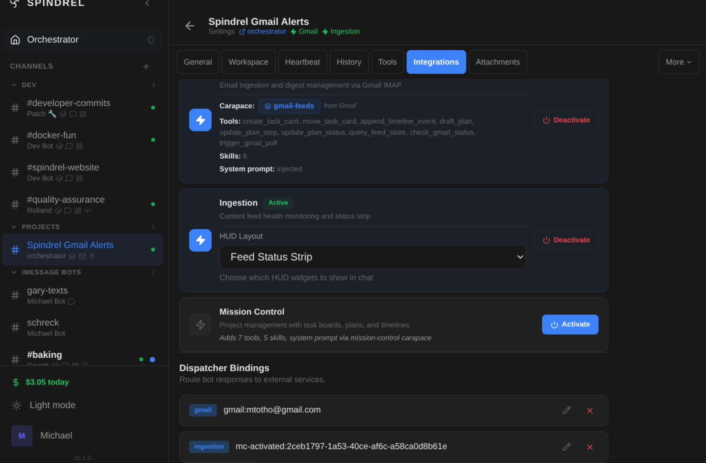

# Creating an Integration

This guide explains how to create a new integration — a self-contained module that
connects an external service (GitHub, Gmail, webhooks, etc.) to the agent server without
touching core code.

> **Architecture decisions and design philosophy** → see [Design Philosophy](design.md)

---

## Workspace Integrations

The shared workspace includes an `integrations/` directory that is automatically added
to the discovery path at startup. Bots can write integration code directly to
`/workspace/integrations/` and it will be discovered on the next server restart.

This is the bridge between bot-generated code and the integration system — bots
(especially via Claude Code) can scaffold complete integrations that the server picks
up automatically. No manual `INTEGRATION_DIRS` configuration needed.

```
/workspace/integrations/
├── my_api_client/
│   └── tools/
│       └── api_tool.py     # Custom tool — auto-discovered
├── my_webhook/
│   ├── router.py            # Webhook endpoint
│   ├── integration.yaml     # Metadata + settings declarations
│   └── tools/
│       └── handler.py
```

In Docker, this works automatically — the workspace volume mount covers it.

---

## External Integrations (INTEGRATION_DIRS)

Integrations don't have to live inside the agent-server repo. Set `INTEGRATION_DIRS` in
`.env` to point to one or more directories containing integration folders:

```bash
# .env
INTEGRATION_DIRS=/home/you/my-integrations
```

Colon-separated for multiple directories. Tilde (`~`) is expanded to your home directory. Each directory is scanned the same way as `integrations/` — any subfolder with a
`router.py`, `tools/*.py`, `skills/*.md`, or `integration.yaml` is discovered
automatically.

**Docker deployment:** mount your external integrations directory into the container and
set `INTEGRATION_DIRS` to the mount point:

```yaml
# docker-compose.override.yml
services:
  agent-server:
    volumes:
      - /home/you/my-integrations:/app/ext-integrations:ro
    environment:
      - INTEGRATION_DIRS=/app/ext-integrations
```

**Self-contained structure:** each external integration should include its own `config.py`
for settings and use `integrations/_register.py` (or a local copy of the stub) for tool
registration. See the "Creating an External Integration" section in [example.md](example.md).

---

## Folder Structure

Each integration lives under `integrations/<name>/`. The auto-discovery system scans
this directory at startup. All files are optional except your integration must have at
least one of `integration.yaml`, `router.py`, or `tools/*.py` to do anything useful.

```
integrations/
├── __init__.py          # auto-discovery (don't edit)
├── sdk.py               # single-import convenience module
├── utils.py             # helpers: ingest_document, inject_message, etc.
└── mygithub/            # your integration folder
    ├── integration.yaml # metadata, settings, events, binding, capabilities
    ├── router.py        # HTTP endpoints → registered at /integrations/mygithub/
    ├── target.py        # typed dispatch target (optional — can be declared in YAML)
    ├── renderer.py      # message delivery via the channel-events bus
    ├── hooks.py         # lifecycle hooks (metadata auto-registered from YAML)
    ├── config.py        # integration-specific settings (DB-backed properties)
    ├── tools/
    │   ├── __init__.py
    │   └── my_tool.py   # agent tools — auto-discovered by the loader
    ├── skills/
    │   └── mygithub.md  # skill documents — synced at startup
    └── carapaces/
        └── mygithub.yaml # capability definitions
```

### What each file does

| File | Auto-loaded? | Purpose |
|---|---|---|
| `integration.yaml` | Yes — seeded to DB on first startup | Metadata, settings, events, binding config, capabilities, process declaration |
| `router.py` | Yes — registered at `/integrations/<name>/` | Receive webhooks, expose config endpoints |
| `target.py` | Yes — registers typed dispatch target | Define where/how to deliver messages (can also be declared in YAML `target:` section) |
| `renderer.py` | Yes — registers with renderer registry | Deliver channel events (messages, streaming, reactions) to the external service |
| `hooks.py` | Yes — registers metadata + lifecycle hooks | Integration metadata (auto-registered from YAML if not provided) + lifecycle event callbacks |
| `config.py` | No (imported by your code) | Integration-specific settings with DB-backed `get_value()` accessors |
| `tools/*.py` | Yes — auto-discovered | Agent tools (underscore-prefixed files skipped) |
| `skills/*.md` | Yes — synced at startup | Skill documents ingested into the skill system |
| `carapaces/*.yaml` | Yes — synced at startup | Capability definitions that can be activated on bots |
| `setup.py` | *(legacy, deprecated)* | Old metadata format — use `integration.yaml` instead |

---

## Agent Tools

Integration tools live in `integrations/<name>/tools/*.py`. The loader auto-discovers
them at startup — any `*.py` file (except underscore-prefixed) is imported and its
`@register`-decorated functions become available as agent tools.

### Registration

Import `register` from the shim at `integrations/_register.py`:

```python
from integrations.sdk import register_tool as register

@register({
    "type": "function",
    "function": {
        "name": "my_tool",
        "description": "Does something useful.",
        "parameters": {"type": "object", "properties": {}},
    },
})
async def my_tool() -> str:
    return '{"result": "ok"}'
```

When running inside the agent server, this resolves to the real registry. When
developing an integration **outside** the server (standalone repo, tests, etc.),
it falls back to a stub that attaches the schema to the function — no server
dependency needed.

**If you're building an external integration**, you only need this stub:

```python
# Minimal drop-in replacement for integrations/_register.py
def register(schema, *, source_dir=None):
    def decorator(func):
        func._tool_schema = schema
        return func
    return decorator
```

To deploy: drop your integration folder into `integrations/` and add your tool
directory to `TOOL_DIRS` (or rely on the `integrations/*/tools/` auto-discovery).

### Config

Integration-specific settings go in your own `config.py` — **not** in `app/config.py`:

```python
# integrations/mygithub/config.py
from pydantic_settings import BaseSettings

class MyConfig(BaseSettings):
    MYGITHUB_TOKEN: str = ""
    MYGITHUB_WEBHOOK_SECRET: str = ""

    model_config = {"env_file": ".env", "extra": "ignore"}

settings = MyConfig()
```

Then import from your tools: `from integrations.mygithub.config import settings`.

### Shared helpers

Use underscore-prefixed files for shared code within your integration (the loader
skips them): `integrations/<name>/tools/_helpers.py`.

---

## Quickstart

### 1. Create the folder and manifest

```bash
mkdir integrations/mygithub
```

Create `integrations/mygithub/integration.yaml`:

```yaml
id: mygithub
name: GitHub Integration
icon: Code2
description: GitHub repository management.
version: "1.0"

settings:
  - key: MYGITHUB_TOKEN
    type: string
    label: "Personal access token"
    required: true
    secret: true
  - key: MYGITHUB_WEBHOOK_SECRET
    type: string
    label: "Webhook signature secret"
    secret: true

events:
  - { type: pull_request, label: Pull requests, category: webhook }
  - { type: push, label: Pushes, category: webhook }

webhook:
  path: /integrations/mygithub/webhook
  description: "Receives push and PR events from GitHub"

binding:
  client_id_prefix: "mygithub:"
  client_id_placeholder: "mygithub:owner/repo"
  client_id_description: "GitHub owner/repo"

activation:
  carapaces: [mygithub]
  description: "GitHub repository management"
```

See the [integration.yaml Reference](#integrationyaml-reference) section below for all
available keys.

### 2. Add `__init__.py`

```python
# integrations/mygithub/__init__.py
# (can be empty — metadata comes from integration.yaml)
```

### 3. Add a router (`router.py`)

The router is a standard FastAPI `APIRouter`. It's registered at `/integrations/<name>/`
automatically — no changes to `app/main.py` needed.

```python
from fastapi import APIRouter, Request
from integrations import utils

router = APIRouter()

@router.post("/webhook")
async def github_webhook(request: Request):
    data = await request.json()
    event = request.headers.get("X-GitHub-Event")

    if event == "pull_request":
        pr = data["pull_request"]

        # 1. Get or create a session for this repo
        from app.db.engine import async_session
        async with async_session() as db:
            session_id = await utils.get_or_create_session(
                client_id=f"github:{data['repository']['full_name']}",
                bot_id="code_review_bot",
                db=db,
            )

            # 2. Inject a message — agent runs and result is dispatched
            result = await utils.inject_message(
                session_id=session_id,
                content=f"PR #{pr['number']} opened: {pr['title']}\n{pr['html_url']}",
                source="github",
                run_agent=True,
                notify=True,
                db=db,
            )

    return {"ok": True}
```

### 4. Add a target and renderer (message delivery)

If your integration delivers messages to an external service (e.g. a chat platform),
you need a **target** (where to send) and a **renderer** (how to send).

**Targets** can be declared in `integration.yaml` (preferred for simple cases) or in
`target.py` (for complex validation logic):

```yaml
# integration.yaml — declarative target
target:
  type: mygithub
  fields:
    owner: string
    repo: string
    issue_number: int
    token: string
```

This auto-generates a frozen dataclass `MygithubTarget` and registers it. For custom
logic, create `target.py` instead:

```python
# target.py — manual target with custom methods
from integrations.sdk import BaseTarget, target_registry

class MyGitHubTarget(BaseTarget, dispatch_type="mygithub"):
    owner: str
    repo: str
    issue_number: int
    token: str

target_registry.register(MyGitHubTarget)
```

**Renderers** handle the actual delivery. Create `renderer.py`. For most integrations,
use `SimpleRenderer` — it encodes the delivery contract automatically so you only need
to implement `send_text()`:

```python
from integrations.sdk import SimpleRenderer, Capability, renderer_registry

class MyGitHubRenderer(SimpleRenderer):
    integration_id = "mygithub"
    capabilities = frozenset({Capability.TEXT})

    async def send_text(self, target, text: str) -> bool:
        resp = await _post_comment(
            target.owner, target.repo, target.issue_number,
            text, target.token,
        )
        return resp.status_code == 200

renderer_registry.register(MyGitHubRenderer())
```

`SimpleRenderer` handles the delivery contract for you:

- **`NEW_MESSAGE`** (durable, via outbox) calls your `send_text()` for user-visible messages.
- **`TURN_ENDED`** (ephemeral, via bus) is automatically skipped — non-streaming renderers have
  no placeholder to finalize.
- **Echo prevention**: own-origin user messages are filtered automatically.
- **Internal roles** (`tool`, `system`) are filtered automatically.

For streaming integrations that need progressive UX (thinking placeholders, live token
updates), use the raw `ChannelRenderer` Protocol instead — see
[Which base class?](design.md#which-base-class) for guidance.

> **Important: delivery path contract.** `NEW_MESSAGE` is the sole durable delivery path —
> it flows through the outbox with retry guarantees. Streaming kinds (`TURN_STARTED`,
> `TURN_STREAM_TOKEN`, `TURN_ENDED`) flow via the ephemeral bus and are best-effort only.
> Renderers that support streaming can use them for progressive UX (e.g. updating a
> "thinking..." placeholder), but must never rely on them for final message delivery.
> See [Delivery Contract](design.md#delivery-contract-streaming-vs-durable) for details.

**Capabilities** declared in `integration.yaml` override the renderer's `CAPABILITIES`
ClassVar — use YAML to adjust without editing Python:

```yaml
# integration.yaml
capabilities:
  - text
  - rich_text
  - mentions
```

Skip this step if your integration is tool-only (no message delivery) or poll-only
(no outbound messages).

### 5. Add hooks (`hooks.py`)

Hooks let your integration register metadata (client ID prefix, user attribution,
display name resolution) and subscribe to agent lifecycle events — without touching
core code.

**Integration metadata** — register at import time:

```python
from app.agent.hooks import IntegrationMeta, register_integration

def _user_attribution(user) -> dict:
    """Return payload fields for user identity (username, icon)."""
    attrs = {}
    if user.display_name:
        attrs["username"] = user.display_name
    cfg = (user.integration_config or {}).get("mygithub", {})
    if cfg.get("avatar_url"):
        attrs["icon_url"] = cfg["avatar_url"]
    return attrs

register_integration(IntegrationMeta(
    integration_type="mygithub",
    client_id_prefix="mygithub:",
    user_attribution=_user_attribution,
))
```

This registers your integration's client ID prefix (used by `is_integration_client_id()`),
user attribution (used when mirroring messages), and optionally a `resolve_display_names`
callback for the admin UI channel list.

**Lifecycle hooks** — subscribe to agent events:

```python
from app.agent.hooks import HookContext, register_hook

async def _on_after_tool_call(ctx: HookContext, **kwargs) -> None:
    tool = ctx.extra.get("tool_name", "")
    ms = ctx.extra.get("duration_ms", 0)
    print(f"Tool {tool} took {ms}ms for bot {ctx.bot_id}")

register_hook("after_tool_call", _on_after_tool_call)
```

Available lifecycle events:

| Event | Mode | Fired when | `ctx.extra` keys |
|-------|------|-----------|-----------------|
| `before_context_assembly` | fire-and-forget | Before context is built for an LLM call | `user_message` |
| `before_llm_call` | fire-and-forget | Before each LLM API call | `model`, `message_count`, `tools_count`, `provider_id`, `iteration` |
| `after_llm_call` | fire-and-forget | After LLM API call completes | `model`, `duration_ms`, `prompt_tokens`, `completion_tokens`, `total_tokens`, `tool_calls_count`, `fallback_used`, `fallback_model`, `iteration`, `provider_id` |
| `before_tool_execution` | fire-and-forget | After auth/policy checks pass, before tool runs | `tool_name`, `tool_type`, `args`, `iteration` |
| `after_tool_call` | fire-and-forget | After each tool execution | `tool_name`, `tool_args`, `duration_ms` |
| `after_response` | fire-and-forget | After agent returns final response | `response_length`, `tool_calls_made` |
| `before_transcription` | **override-capable** | Before audio is transcribed (STT) | `audio_format`, `audio_size_bytes`, `source` |

All fire-and-forget hooks are broadcast — errors are logged but never propagate.
Both sync and async callbacks are supported. Hooks receive a `HookContext` with
`bot_id`, `session_id`, `channel_id`, `client_id`, `correlation_id`, and `extra`.

**Override-capable hooks** use `fire_hook_with_override()` — the first callback that
returns a non-`None` value short-circuits the chain. This lets integrations replace
default behavior (e.g. providing custom STT for `before_transcription`):

```python
from app.agent.hooks import register_hook

async def _custom_stt(ctx, **kwargs):
    audio_format = ctx.extra.get("audio_format")
    audio_bytes = ctx.extra.get("audio_size_bytes")
    # Call your custom STT service...
    return "transcribed text"  # or None to fall through to default

register_hook("before_transcription", _custom_stt)
```

**Webhook emission** — all hook events are automatically forwarded to webhook endpoints
configured via **Admin > Developer > Webhooks**. Each endpoint supports event filtering,
HMAC-SHA256 signing, and delivery retry. See the [Webhooks guide](../guides/webhooks.md)
for setup details and signature verification examples.

See `integrations/slack/hooks.py` for a real example: Slack uses `after_tool_call`
to add emoji reactions as tool indicators and log tool calls to an audit channel.

### 6. Add a background process

If your integration needs a long-running process (e.g. a bot framework using socket mode),
declare it in `integration.yaml` (preferred) or `process.py`.

**YAML declaration** (preferred):

```yaml
# integration.yaml
process:
  cmd: ["python", "integrations/mygithub/listener.py"]
  description: "GitHub webhook listener"
  required_env: ["GITHUB_WEBHOOK_SECRET", "GITHUB_TOKEN"]
  watch_paths: ["integrations/mygithub/"]  # optional: auto-restart on file changes
```

**Legacy `process.py`** (still supported):

```python
DESCRIPTION = "GitHub webhook listener"
CMD = ["python", "integrations/mygithub/listener.py"]
REQUIRED_ENV = ["GITHUB_WEBHOOK_SECRET", "GITHUB_TOKEN"]
```

The process is only started if every var in `required_env` / `REQUIRED_ENV` is set.

---

## APIs Available to Integrations

### Option A: Python helpers (`integrations/utils.py`)

Use these inside router handlers (they take an open `AsyncSession`):

```python
from integrations import utils
from app.db.engine import async_session

async with async_session() as db:
    # Ingest + embed a document (searchable by agents via RAG)
    doc_id = await utils.ingest_document(
        integration_id="mygithub",
        title="PR #42: Add dark mode",
        content="...",
        session_id=None,           # optional: scope to a session
        metadata={"pr_number": 42},
        db=db,
    )

    # Semantic search across ingested documents
    docs = await utils.search_documents(
        q="dark mode css changes",
        integration_id="mygithub",
        limit=5,
        db=db,
    )

    # Get or create a persistent session for a user/channel/resource
    session_id = await utils.get_or_create_session(
        client_id="github:owner/repo",   # unique identifier for this integration entity
        bot_id="my_bot",
        dispatch_config={               # optional: where to deliver results
            "type": "slack",
            "channel_id": "C12345",
            "token": "xoxb-...",
        },
        db=db,
    )

    # Inject a message into a session
    result = await utils.inject_message(
        session_id=session_id,
        content="New PR from alice: Add dark mode",
        source="github",
        run_agent=True,    # True → runs agent, creates a task, returns task_id
        notify=True,       # True → fans out result to dispatch_config target
        execution_config={                     # optional: per-event agent config
            "system_preamble": "Review this PR...",
            "skills": ["integrations/github/github"],
            "tools": ["github_get_pr"],
        },
        db=db,
    )
    # result = {"message_id": "uuid", "session_id": "uuid", "task_id": "uuid-or-null"}
```

### Option B: Public REST API (`/api/v1/`)

Use this from external processes (your integration's background process, tests, etc.).
All endpoints require `Authorization: Bearer <API_KEY>`.

#### Documents

| Method | Path | Description |
|---|---|---|
| `POST` | `/api/v1/documents` | Ingest + embed a document |
| `GET` | `/api/v1/documents/search?q=...` | Semantic search |
| `GET` | `/api/v1/documents/{id}` | Fetch a document |
| `DELETE` | `/api/v1/documents/{id}` | Delete a document |

```json
// POST /api/v1/documents
{
  "title": "PR #42: Add dark mode",
  "content": "...",
  "integration_id": "mygithub",
  "session_id": null,
  "metadata": {"pr_number": 42}
}
```

```
// GET /api/v1/documents/search
?q=dark+mode&integration_id=mygithub&limit=5
```

#### Sessions

| Method | Path | Description |
|---|---|---|
| `POST` | `/api/v1/sessions` | Create or get a session |
| `POST` | `/api/v1/sessions/{id}/messages` | Inject a message |
| `GET` | `/api/v1/sessions/{id}/messages` | List messages |

```json
// POST /api/v1/sessions
{
  "bot_id": "my_bot",
  "client_id": "github:owner/repo",
  "dispatch_config": {
    "type": "slack",
    "channel_id": "C12345",
    "token": "xoxb-..."
  }
}
// → {"session_id": "uuid"}
```

```json
// POST /api/v1/sessions/{id}/messages
{
  "content": "New PR from alice: Add dark mode",
  "source": "github",
  "run_agent": true,
  "notify": true
}
// → {"message_id": "uuid", "session_id": "uuid", "task_id": "uuid-or-null"}
```

#### Tasks

| Method | Path | Description |
|---|---|---|
| `GET` | `/api/v1/tasks/{id}` | Poll a task's status and result |

Poll this after `run_agent=true` returns a `task_id`. Status: `pending`, `running`, `complete`, `failed`.

---

## Webhook Prompt Injection (execution_config)

When a webhook fires, the bot often needs event-specific instructions, skills, and tools
that aren't permanently assigned to it. Instead of bloating the bot's config with tools for
every integration it *might* receive webhooks from, integrations inject them per-event via
`execution_config`.

### How it works

Pass `execution_config` to `utils.inject_message()` when `run_agent=True`. It's stored on
the `Task` and read by `run_task()` before calling the agent:

```python
result = await utils.inject_message(
    session_id, content, source="myintegration",
    run_agent=True,
    execution_config={
        "system_preamble": "You are responding to a detection event...",
        "skills": ["integrations/frigate/frigate"],
        "tools": ["frigate_event_snapshot"],
    },
    db=db,
)
```

### Fields

| Field | Type | Effect |
|-------|------|--------|
| `system_preamble` | `str` | Injected as a system message before the agent runs. Use for event-specific instructions. |
| `skills` | `list[str]` | Skill IDs (e.g. `"integrations/github/github"`) — their full content is fetched from the DB and injected into context. The bot does NOT need these skills assigned. |
| `tools` | `list[str]` | Tool names (e.g. `"github_get_pr"`) — their schemas are added to the LLM's tool list for this request only. The bot does NOT need these tools in its config. |
| `model_override` | `str` | Override the bot's model for this task (also supported via `callback_config`). |

All fields are optional. Everything is per-task and one-shot — the bot's permanent config
is not affected.

### How skills and tools are resolved

- **Skills** — looked up by ID in the `documents` table via `fetch_skill_chunks_by_id()`.
  Any skill that has been synced from a `.md` file (including integration skills like
  `integrations/github/skills/github.md`) is available regardless of bot assignment.
  The skill ID is the path-based key: `integrations/<name>/<stem>`.

- **Tools** — looked up by name in the global tool registry via `get_local_tool_schemas()`.
  Any registered tool (from `tools/`, `app/tools/local/`, or `integrations/*/tools/`) is
  available. They're passed as `injected_tools` to `run()`, which merges them into the
  LLM's tool list via the `current_injected_tools` ContextVar.

- **Ephemeral skills merge** — if the user's message also contains `@skill:name` tags,
  the tagged skills are merged with execution_config skills (not replaced). Deduplication
  is automatic.

### Built-in webhook prompts

The GitHub and Frigate integrations ship with `_build_execution_config()` functions that
return event-specific preambles, skills, and tools:

**GitHub** (`integrations/github/router.py`):

| Event | Preamble | Tools | Skill |
|-------|----------|-------|-------|
| `pull_request` (opened) | Review code, provide feedback | `github_get_pr` | `integrations/github/github` |
| `issues` (opened) | Triage, suggest solutions | — | `integrations/github/github` |
| `issue_comment` | Read context, respond | — | `integrations/github/github` |
| `pull_request_review` (changes_requested) | Address concerns | `github_get_pr` | `integrations/github/github` |
| `pull_request_review_comment` | Focus on code discussed | `github_get_pr` | `integrations/github/github` |

**Frigate** (`integrations/frigate/router.py`):

| Event | Preamble | Tools | Skill |
|-------|----------|-------|-------|
| Detection (new) | Camera/label/score context, view snapshot | `frigate_event_snapshot` | `integrations/frigate/frigate` |

---

## integration.yaml Reference

`integration.yaml` is the preferred way to declare integration metadata. It is seeded
to the database on first startup; after that, the DB is the source of truth (editable
via the admin UI). The server reports drift if the file changes after seeding.

### Full key reference

```yaml
# Required
id: mygithub                    # unique integration identifier
name: My GitHub                 # display name
version: "1.0"                  # semver string

# Optional metadata
icon: Code2                     # lucide-react icon name (default: Plug)
description: "Short description shown in admin UI"

# Settings — rendered as a form in Admin > Integrations > [name]
settings:
  - key: MY_TOKEN               # env var name
    type: string                # string | number | boolean
    label: "Human-readable label"
    required: true              # default: false
    secret: true                # mask value in UI (default: false)
    default: ""                 # default value if not set
    description: "Optional longer help text"

# Events — what this integration can emit (used by task trigger UI)
events:
  - type: pull_request          # event type identifier
    label: Pull requests        # human-readable label
    description: "PR opened, closed, merged"  # optional tooltip
    category: webhook           # webhook | message | poll | device

# Webhook — displayed in admin UI for users to configure in external services
webhook:
  path: /integrations/mygithub/webhook
  description: "Receives events from GitHub"

# Binding — how channels are linked to this integration
binding:
  client_id_prefix: "mygithub:"
  client_id_placeholder: "mygithub:owner/repo"
  client_id_description: "GitHub owner/repo"
  display_name_placeholder: "octocat/hello-world"
  suggestions_endpoint: "/integrations/mygithub/binding-suggestions"
  config_fields:
    - key: event_filter
      type: multiselect
      label: Event Filter
      description: "Which events to process (empty = all)"
      # options auto-derived from top-level events: section

# Target — typed dispatch target (alternative to target.py)
target:
  type: mygithub
  fields:
    owner: string
    repo: string
    issue_number: int
    token: string
    thread_id: string?          # ? suffix = optional field
    reply: bool = false         # default values supported

# Capabilities — what the renderer supports (overrides renderer ClassVar)
capabilities:
  - text
  - rich_text
  - threading
  - reactions
  - attachments
  - streaming_edit
  - approval_buttons
  # ... see app/domain/capability.py for full list

# Activation — what gets activated when this integration is enabled on a bot
activation:
  carapaces: [mygithub]         # capability definitions to activate
  requires_workspace: false
  description: "GitHub repository management"

# Provides — what modules this integration supplies (auto-detected if omitted)
provides:
  - target
  - renderer
  - router
  - hooks
  - tools
  - skills
  - carapaces

# Process — background process declaration (alternative to process.py)
process:
  cmd: ["python", "integrations/mygithub/listener.py"]
  description: "GitHub webhook listener"
  required_env: ["MY_TOKEN"]
  watch_paths: ["integrations/mygithub/"]

# API permissions — scopes required for the integration's router
api_permissions:
  - chat
  - bots:read
  - channels:read

# Sidebar navigation section
sidebar_section:
  id: my-dashboard
  title: MY DASHBOARD
  icon: LayoutDashboard
  items:
    - { label: Overview, href: /my-dashboard, icon: LayoutDashboard }

# Dashboard modules
dashboard_modules:
  - { id: analytics, label: Analytics, icon: BarChart3, description: "Usage analytics" }

# Chat HUD widgets
chat_hud:
  - { id: my-status, style: status_strip, endpoint: /hud/status, poll_interval: 30 }

chat_hud_presets:
  default: { label: "Status", widgets: [my-status] }
  none: { label: "No HUD", widgets: [] }
```

All keys are optional except `id`. See `integrations/github/integration.yaml` and
`integrations/slack/integration.yaml` for real-world examples.

---

## Polling Patterns

For integrations that poll an external service (no inbound webhooks), the recommended
pattern is a background process that calls the agent server's REST API.

**Example: Gmail poller** (`integrations/gmail/poller.py`)

The Gmail integration polls IMAP on an interval and injects messages via HTTP:

1. Declare the process in `integration.yaml`:
   ```yaml
   process:
     cmd: ["python", "integrations/gmail/poller.py"]
     description: "Gmail IMAP poller"
     required_env: ["GMAIL_EMAIL", "GMAIL_APP_PASSWORD"]
   ```

2. The poller loop fetches new items, then calls:
   ```python
   POST /api/v1/sessions/{session_id}/messages
   {"content": "New email from ...", "source": "gmail", "run_agent": true}
   ```

3. Emit events for task triggers:
   ```python
   from integrations.sdk import emit_integration_event
   emit_integration_event("gmail", "new_email", {"subject": "...", "from": "..."})
   ```

This pattern provides process isolation (poller crash doesn't affect the server),
works with external integrations (no `app/` imports needed in the poller), and
scales naturally (run multiple pollers for different accounts).

**Cooldowns**: `emit_integration_event` has per-category defaults to prevent spam:
- `webhook`: 0s (every event fires)
- `message`: 300s (5-minute cooldown per source)
- `poll`: 60s (1-minute cooldown)
- `device`: 30s

Override via `cooldown=0` parameter if you need every event.

---

## Setup Manifest (`setup.py`) *(legacy, deprecated)*

> **Use `integration.yaml` instead.** `setup.py` is the legacy metadata format. Existing
> integrations are being migrated to YAML. New integrations should not use `setup.py`.

Each integration can provide a `setup.py` file with a `SETUP` dict that declares
configuration, UI components, and capabilities. The admin UI reads this to render
integration settings, sidebar navigation, and dashboard modules.

### Basic structure

```python
# integrations/myintegration/setup.py

SETUP = {
    "env_vars": [...],
    "webhook": {...},
    "sidebar_section": {...},
    "dashboard_modules": [...],
}
```

All fields are optional. The admin integration page auto-discovers `setup.py` and
uses it to render the configuration UI.

### `env_vars` — Environment variables

Declare the env vars your integration needs. The admin UI renders a settings form
with set/unset status indicators.

```python
"env_vars": [
    {
        "key": "MY_API_TOKEN",
        "required": True,
        "secret": True,
        "description": "API token for the external service",
    },
    {
        "key": "MY_PORT",
        "required": False,
        "description": "Port for the listener",
        "default": "8080",
    },
],
```

| Field | Type | Description |
|-------|------|-------------|
| `key` | `str` | Environment variable name |
| `required` | `bool` | Whether the integration needs this to function |
| `secret` | `bool` | If true, value is masked in the UI (optional, default false) |
| `description` | `str` | Human-readable explanation |
| `default` | `str` | Default value if not set (optional) |

Values are resolved in order: DB setting → environment variable → default.

### `webhook` — Webhook endpoint

If your integration receives webhooks, declare the endpoint so the admin UI can
display the full URL for users to configure in external services.

```python
"webhook": {
    "path": "/integrations/myintegration/webhook",
    "description": "Receives events from the external service",
},
```

### `sidebar_section` — Sidebar navigation

Integrations can add a navigation section to the main sidebar. The UI fetches
declared sections from `GET /api/v1/admin/integrations/sidebar-sections` and
renders them dynamically.

```python
"sidebar_section": {
    "id": "my-dashboard",                  # unique section ID
    "title": "MY DASHBOARD",               # sidebar header text
    "icon": "LayoutDashboard",             # lucide-react icon name
    "items": [
        {"label": "Overview",  "href": "/my-dashboard",          "icon": "LayoutDashboard"},
        {"label": "Reports",   "href": "/my-dashboard/reports",  "icon": "BarChart3"},
        {"label": "Settings",  "href": "/my-dashboard/settings", "icon": "Settings"},
    ],
    "readiness_endpoint": "/api/v1/my-dashboard/readiness",  # optional
    "readiness_field": "overview",                            # optional
},
```

| Field | Type | Description |
|-------|------|-------------|
| `id` | `str` | **Required.** Unique section identifier. Used for hide/show toggle. |
| `title` | `str` | Header text shown above the nav items. Defaults to `id.upper()`. |
| `icon` | `str` | [Lucide icon](https://lucide.dev) name for the collapsed sidebar rail. Defaults to `"Plug"`. |
| `items` | `list[dict]` | **Required.** Navigation items with `label`, `href`, and `icon` fields. |
| `readiness_endpoint` | `str` | Optional API path to check feature health status. |
| `readiness_field` | `str` | Optional field name in the readiness response to read. |

Each item in `items`:

| Field | Type | Description |
|-------|------|-------------|
| `label` | `str` | **Required.** Display text in the sidebar. |
| `href` | `str` | **Required.** Route path (e.g. `/my-dashboard/reports`). |
| `icon` | `str` | Lucide icon name. Defaults to `"Plug"`. |

Users can hide sidebar sections via the Zustand-persisted UI store (toggle in the
integration's settings page).

!!! note "Available icons"
    The frontend resolves icon names from a built-in map. Supported names include:
    `LayoutDashboard`, `Columns`, `BookOpen`, `Brain`, `HelpCircle`, `Settings`,
    `Zap`, `Plug`, `Bot`, `Layers`, `FileText`, `Paperclip`, `ClipboardList`,
    `Key`, `Shield`, `ShieldCheck`, `Activity`, `Server`, `Wrench`, `BarChart3`,
    `Users`, `HardDrive`, `Code2`, `Hash`, `Home`, `MessageSquare`, `Container`,
    `Clock`, `Heart`, `Lock`, `Sun`, `Moon`. Unrecognized names fall back to `Plug`.

### `dashboard_modules` — Pluggable dashboard panels

Integrations can register custom modules that appear on the Mission Control
dashboard (or any integration-owned dashboard).

```python
"dashboard_modules": [
    {
        "id": "analytics",
        "label": "Analytics",
        "icon": "BarChart3",
        "description": "Usage analytics and trends",
    },
],
```

| Field | Type | Description |
|-------|------|-------------|
| `id` | `str` | Unique module identifier |
| `label` | `str` | Display name |
| `icon` | `str` | Lucide icon name |
| `description` | `str` | Short description shown on the dashboard card |

Modules are data-driven — integrations serve structured JSON from their router
endpoints, and the frontend renders it generically.

### `chat_hud` — In-chat status widgets

Integrations can declare HUD (heads-up display) widgets that appear inside the chat
interface when the integration is activated on a channel. Widgets poll an endpoint
on your integration's router and render real-time status, controls, or metrics.

```python
"chat_hud": [
    {
        "id": "bb-status",
        "style": "status_strip",
        "endpoint": "/hud/status",
        "poll_interval": 30,
        "label": "iMessage",
        "icon": "MessageCircle",
    },
],
```

| Field | Type | Description |
|-------|------|-------------|
| `id` | `str` | **Required.** Unique widget identifier within this integration. |
| `style` | `str` | **Required.** Widget layout style. One of: `status_strip`, `side_panel`, `input_bar`, `floating_action`. |
| `endpoint` | `str` | Router-relative path that returns widget data (e.g. `/hud/status`). The full URL is resolved as `/integrations/<name><endpoint>`. |
| `poll_interval` | `int` | Seconds between polls. Default varies by style. |
| `label` | `str` | Human-readable label shown alongside the widget. |
| `icon` | `str` | [Lucide icon](https://lucide.dev) name for the widget header. |

**Widget styles:**

| Style | Layout | Typical use |
|-------|--------|------------|
| `status_strip` | Compact horizontal bar above or below the chat input | Connection status, health indicators, quick actions |
| `side_panel` | Collapsible panel alongside the chat | Workflow history, detailed status, logs |
| `input_bar` | Inline element in the chat input area | Quick-entry controls |
| `floating_action` | Floating button/overlay | Toggle controls, notification badges |

#### HUD status endpoint pattern

Your HUD endpoint should return a JSON array of status items. Each item can be a
badge, action button, or text element:

```python
@router.get("/hud/status")
async def hud_status():
    return [
        {
            "type": "badge",
            "label": "Connected",
            "variant": "success",      # success | danger | warning | muted
            "icon": "CheckCircle",
        },
        {
            "type": "action",
            "label": "Pause",
            "action": "post",
            "url": "/integrations/bluebubbles/pause",
            "variant": "warning",
            "icon": "PauseCircle",
        },
    ]
```

The frontend renders badges as colored pills and actions as clickable buttons that
POST to the specified URL. This pattern keeps integration-specific UI logic on the
server — the frontend is a generic renderer.

### `chat_hud_presets` — HUD layout presets

Define named presets that bundle specific widgets into configurations users can
choose per-channel. Every integration with `chat_hud` should provide at least a
`"default"` and `"none"` preset.

```python
"chat_hud_presets": {
    "default": {"label": "Connection Status", "widgets": ["bb-status"]},
    "none":    {"label": "No HUD", "widgets": []},
},
```

| Field | Type | Description |
|-------|------|-------------|
| `label` | `str` | **Required.** Human-readable name shown in the preset picker. |
| `widgets` | `list[str]` | Widget IDs (from `chat_hud`) to include. Must reference valid widget IDs declared by the same integration. |

Users select a preset in the channel's integration configuration tab. The `"none"` preset
lets users disable the HUD entirely without removing the integration.



### `tool_widgets` — Interactive tool result widgets

Integrations can declare widget templates that transform MCP tool results into
interactive component UIs rendered inline in chat. When a tool returns raw JSON,
the template engine matches the tool name, substitutes variables from the result
data, and produces a rich component envelope.

```yaml
tool_widgets:
  MyToolName:
    content_type: application/vnd.spindrel.components+json
    display: inline
    template:
      v: 1
      components:
        - type: status
          text: "Done"
          color: success
        - type: toggle
          label: Power
          value: true
          action:
            dispatch: tool
            tool: MyInverseTool
            args:
              name: "{{data.result_field}}"
            optimistic: true
        - type: properties
          layout: inline
          items: "{{data.items | map: {label: type, value: name}}}"
```

**Template fields:**

| Field | Type | Description |
|-------|------|-------------|
| `content_type` | `str` | Output MIME type. Use `application/vnd.spindrel.components+json` for interactive widgets. |
| `display` | `str` | `"inline"` renders as a standalone card below the message. `"badge"` renders inside ToolBadges. |
| `template` | `object` | Component body with `v: 1` schema version and `components` array. |

**Component primitives:** `text`, `heading`, `status`, `properties`, `table`, `toggle`,
`button`, `select`, `input`, `slider`, `form`, `section`, `divider`, `code`, `image`, `links`.

**Interactive components** carry a `WidgetAction` with `dispatch: "tool"` or `dispatch: "api"`.
When the user interacts (toggle, slider change, button click), the action is sent to
`POST /api/v1/widget-actions`. For `dispatch: "tool"`, the named tool is called and the
response is rendered through the same template pipeline — enabling cycling between states
(e.g., toggle on → off → on).

**Template expressions** use `{{...}}` syntax:

| Expression | Example | Result |
|-----------|---------|--------|
| Key lookup | `{{name}}` | `data["name"]` |
| Dot path | `{{a.b.c}}` | Nested object access |
| Array index | `{{a[0].b}}` | Array + nested access |
| Equality | `{{a == 'val'}}` | Boolean comparison |
| Pipe transforms | `{{a \| pluck: name}}` | Extract field from each item |

**Pipe transforms:** `pluck: key`, `join: separator`, `map: {out: src}`,
`where: key=value`, `first`, `default: fallback`. Transforms chain with `|`.

**Envelope replacement:** When a widget action returns a component envelope, WidgetCard
replaces its body and re-renders — enabling stateful cycling (e.g., HassTurnOn → toggle →
HassTurnOff response → card updates to "Off" state with inverse action).

See `integrations/homeassistant/integration.yaml` for a complete example with toggle,
slider, and entity property display.

### `activation` — Integration activation + template compatibility

Integrations can declare an activation manifest that auto-injects capabilities and
declares template compatibility. See [Activation & Templates](activation-and-templates.md)
for the full guide on capability injection, workspace template compatibility, versioning,
and how to create compatible templates.

---

## Dispatch Targets

Each channel has a `dispatch_config` JSONB field that describes where to deliver messages.
When a renderer receives a `ChannelEvent`, it reads the target from `event.target` — a
typed dataclass built from `dispatch_config`.

Standard target shapes:

```json
// dispatch_type = "slack"
{"channel_id": "C123", "token": "xoxb-...", "thread_ts": "1234.56", "reply_in_thread": true}

// dispatch_type = "webhook"
{"url": "https://myservice.example.com/hook"}

// dispatch_type = "internal"  (injects result back into a session as a user message)
{"session_id": "uuid"}

// dispatch_type = "none"  (result stays in DB; caller polls /api/v1/tasks/{id})
{}
```

For a custom dispatch type, declare a `target:` section in `integration.yaml` or create
a `target.py` (see step 4 above), then create a `renderer.py` to handle delivery.

---

## Example

See [example.md](example.md) for the minimal `integrations/example/` scaffold.

---

## Potential Future Integrations

| Integration | Description | Effort |
|-------------|-------------|--------|
| **Telegram** | Mobile chat access to all bots via Telegram Bot API (polling or webhook mode) | Small |
| **Ntfy** | Push notifications from bots to phone/desktop via [ntfy.sh](https://ntfy.sh) (self-hostable) | Tiny |

---

## What Integration Code Must Not Do

- Import from `app/` directly — use `integrations/sdk.py` for all SDK imports, `integrations/utils.py` for helpers, and keep config in your own `config.py`
- Put integration-specific config in `app/config.py` — create your own `integrations/<name>/config.py`
- Duplicate Slack API call logic — use `integrations/slack/client.py` for messages and `integrations/slack/uploads.py` for file uploads
- Add new columns to core models (`Bot`, `Task`, `Session`) for integration-specific data — use `dispatch_config`, `integration_config` JSONB fields, or add your own table
- Edit `app/main.py` or `app/agent/tasks.py` — integration code stays in `integrations/`
