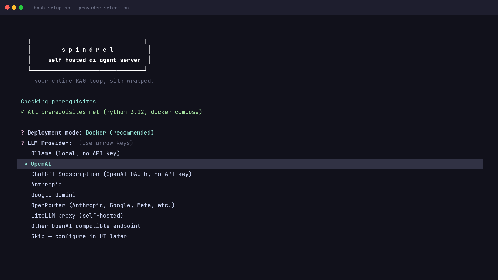
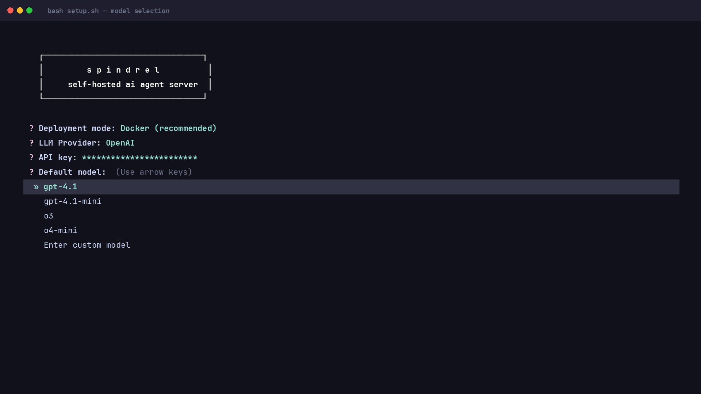
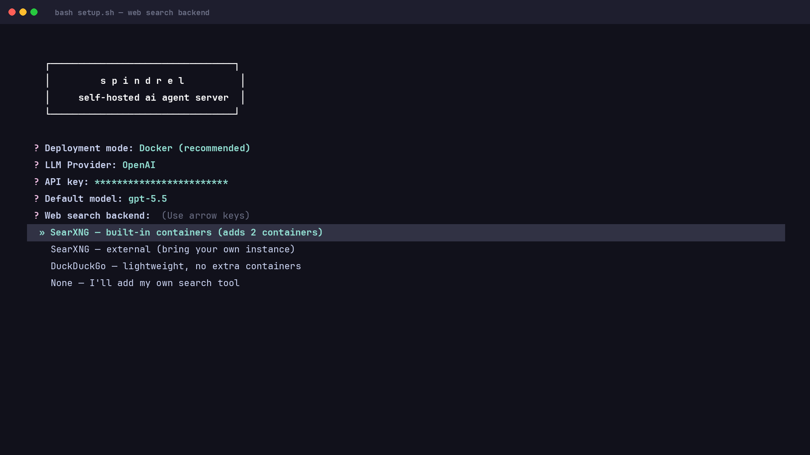
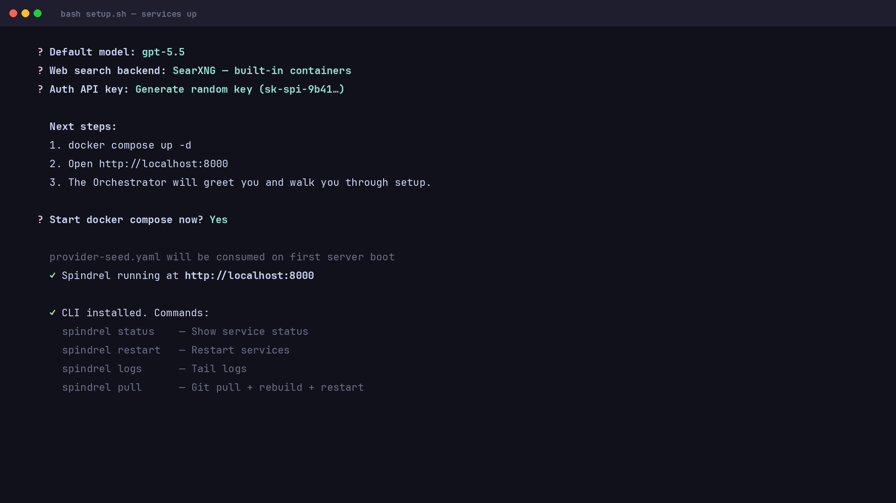
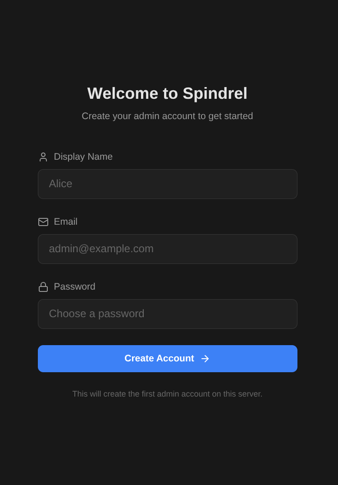
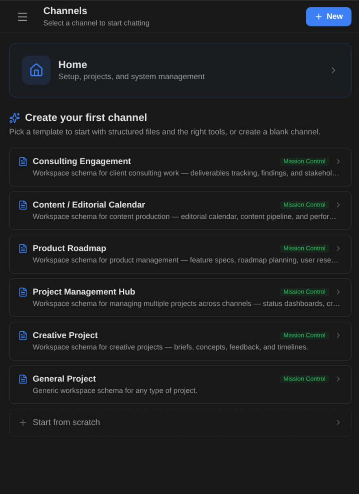
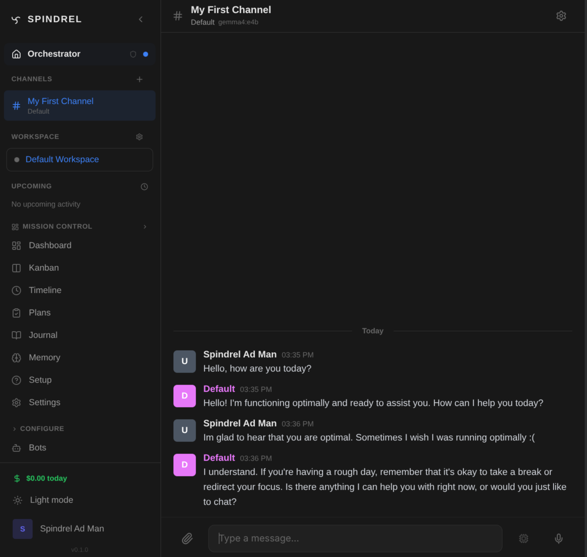
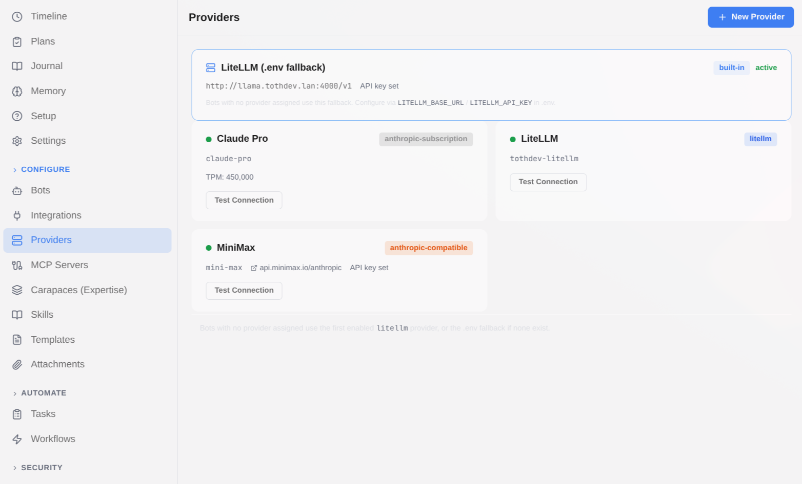

# Spindrel Setup Guide

## Quick Start

One command to get started:

```bash
# Clone and run the interactive setup wizard
git clone https://github.com/mtotho/spindrel.git
cd spindrel
bash setup.sh
```

Or as a one-liner (clones the repo for you):

```bash
curl -fsSL https://raw.githubusercontent.com/mtotho/spindrel/master/setup.sh | bash
```

### What the wizard does

The setup wizard generates two files and optionally starts the server:

1. **`.env`** — runtime configuration (database URL, API key, web search mode)
2. **`provider-seed.yaml`** — LLM provider config, consumed on first server boot and then deleted

It does **not** create bot YAML files or modify any code. Two system bots (`default` and `orchestrator`) are auto-seeded on first boot from `app/data/system_bots/`. The Orchestrator handles the rest of the onboarding conversationally.

### Prerequisites

- **Python 3.12+** with `pip` or `ensurepip` (on Debian/Ubuntu: `apt install python3-pip python3-venv`)
- **Docker** with the Compose v2 plugin
- **git**

The setup wizard is an interactive TUI that checks these prerequisites, then walks you through:

1. **Deployment mode** — Docker (recommended) or local dev
2. **LLM provider** — Pick from presets (Ollama, OpenAI, Anthropic, Google Gemini, OpenRouter, LiteLLM proxy) or enter a custom OpenAI-compatible endpoint
3. **Default model** — Provider-specific model list with option for custom model names
4. **Web search backend** — SearXNG (built-in or external), DuckDuckGo, or disabled
5. **API authentication** — Auto-generate a random key or enter your own


*The setup wizard checks prerequisites and lets you pick an LLM provider.*


*Choose a default model (provider-specific list with custom option).*


*Configure web search — SearXNG (self-hosted), DuckDuckGo, or disabled.*


*The wizard generates `.env` and starts Docker services.*

The wizard generates `.env` and a `provider-seed.yaml` file. On first server boot, the seed file is consumed to create a typed provider in the database — giving you full driver features (model management, connection testing, model pull/delete for Ollama). The whole process takes about 60 seconds.

### After setup

Open the UI and the **Orchestrator** bot will greet you in the Home channel. It walks you through creating your first bot, enabling integrations, and configuring workspaces — all conversationally.


*Log in with your API key.*


*Create your first channel — the Orchestrator guides you through it.*


*Your first conversation — the sidebar shows channels, workspace, and navigation.*

> **Tip:** You can add more LLM providers later via **Admin UI > Providers**. The wizard just configures the first one.

## Manual Setup

If you prefer to configure everything manually:

### 1. Create .env

```bash
cp .env.example .env
```

Edit `.env` with your settings. Required fields:

| Variable | Description |
|----------|-------------|
| `API_KEY` | Bearer token for API authentication |
| `DATABASE_URL` | PostgreSQL connection string |
| `DEFAULT_MODEL` | Default LLM model (e.g. `gemma4:e4b` for Ollama) |

Then configure your LLM provider via **Admin UI > Providers**, or create a `provider-seed.yaml` for first-boot seeding (see `scripts/setup.py` for the format).

You can also set `LLM_BASE_URL` and `LLM_API_KEY` in `.env` for a typeless OpenAI-compatible fallback — but a proper DB provider (created by the setup wizard or Admin UI) is recommended for full features.

> **Note:** `LITELLM_BASE_URL` and `LITELLM_API_KEY` are accepted as aliases for backward compatibility.

> **Tip:** These `.env` values and all other configured secrets (provider keys, integration tokens, etc.) are automatically redacted from tool results and LLM output. You can also store additional secrets via **Admin > Security > Secrets** — see the [Secrets & Redaction guide](guides/secrets.md).

### 2. Start Services

```bash
docker compose up -d
```

> **Tip:** The Docker image builds integration dashboards (e.g. Mission Control) by default. To skip this step and save build time:
> ```bash
> docker compose build --build-arg BUILD_DASHBOARDS=false
> ```
> Dashboards are optional — all core features work without them.

## Updating

### With the Spindrel CLI

```bash
spindrel pull    # git pull + rebuild + restart
```

Install the CLI if you haven't:

```bash
sudo ln -sf /path/to/spindrel/scripts/spindrel /usr/local/bin/spindrel
```

The setup wizard offers to do this automatically.

### Manually (Docker)

```bash
git pull
docker compose up -d --build
```

`--build` is required — `docker compose restart` only restarts the old image without picking up code changes.

### Manually (host / systemd)

```bash
git pull
spindrel restart
```

Or without the CLI: `sudo systemctl restart spindrel`

## Web Search

Web search is provided by the `web_search` integration. Configure it via **Admin UI > Integrations > Web Search**, or with env vars:

| Mode | `WEB_SEARCH_MODE` | `WEB_SEARCH_CONTAINERS` | Description |
|---|---|---|---|
| Managed SearXNG | `searxng` | `true` | Integration starts SearXNG + Playwright containers |
| External SearXNG | `searxng` | (unset) | User provides `SEARXNG_URL` |
| DuckDuckGo | `ddgs` | (unset) | Lightweight, no containers needed |
| Disabled | `disabled` | (unset) | Bring your own search tool in `tools/` |

### SearXNG mode (default)

**Built-in containers** (simplest):

```bash
WEB_SEARCH_MODE=searxng
WEB_SEARCH_CONTAINERS=true
```

The integration automatically starts SearXNG and Playwright containers and connects them to the agent server network. Managed containers appear in **Admin UI > Docker Stacks** where you can monitor status, view service health, read logs, and start/stop them.

**External instances** (bring your own SearXNG/Playwright):

```bash
WEB_SEARCH_MODE=searxng
SEARXNG_URL=http://my-searxng:8080
PLAYWRIGHT_WS_URL=ws://my-playwright:3000   # optional — fetch_url falls back to httpx
```

All settings are configurable at runtime in **Admin UI > Integrations > Web Search**. Private — queries never leave your network.

### DuckDuckGo mode

```bash
WEB_SEARCH_MODE=ddgs
```

Uses `ddgs` to search DuckDuckGo, Google, Brave, and other public engines. No containers, no API keys. Good for occasional searches.

### Disabled

```bash
WEB_SEARCH_MODE=disabled
```

The `web_search` tool returns an error directing bots to enable it. Add custom search tools in `tools/`.

You can switch modes at any time via the Integrations UI — no restart required. The `fetch_url` tool always works regardless of mode (falls back to httpx when Playwright is unavailable).

> **Upgrading from COMPOSE_PROFILES?** Replace `COMPOSE_PROFILES=web-search` with `WEB_SEARCH_CONTAINERS=true` in your `.env`.

## LLM Provider Configuration

### Default provider (`.env`)

The `.env` variables `LLM_BASE_URL` and `LLM_API_KEY` configure the default provider.
This uses an OpenAI-compatible client, so any endpoint that speaks the OpenAI chat completions
format works:

| Provider | LLM_BASE_URL | Notes |
|----------|-------------|-------|
| **Ollama** (default) | `http://localhost:11434/v1` | Local models, no API key needed |
| LiteLLM proxy | `http://litellm:4000/v1` | Self-hosted, supports 100+ models |
| OpenAI | `https://api.openai.com/v1` | Direct OpenAI API |
| Google Gemini | `https://generativelanguage.googleapis.com/v1beta/openai/` | OpenAI-compatible endpoint |
| OpenRouter | `https://openrouter.ai/api/v1` | Multi-provider (Anthropic, Google, Meta, etc.) |

### Additional providers (Admin UI)

You can configure multiple LLM providers simultaneously via **Admin UI > Providers**.
Each provider has its own API key, base URL, and rate limits.


*Admin > Providers — manage multiple LLM providers with connection testing.*

Supported provider types:

| Type | Description |
|------|-------------|
| `openai` | Direct OpenAI API |
| `openai-compatible` | Any OpenAI-compatible endpoint (Gemini, Ollama, vLLM, etc.) |
| `anthropic` | Direct Anthropic API (native support, no proxy needed) |
| `anthropic-compatible` | Anthropic-compatible proxies (Bedrock, etc.) |
| `litellm` | LiteLLM proxy instance |

Assign providers to individual bots via the `model_provider_id` field. Bots without a
provider ID fall back to the `.env` default.

**Anthropic (Claude) models**: Use OpenRouter as your default provider for the simplest
setup, or add a dedicated Anthropic provider in Admin UI > Providers for direct API access.

For cost tracking, budget limits, and spend forecasting, see the [Usage & Billing guide](guides/usage-and-billing.md).

## MCP Servers

MCP (Model Context Protocol) servers give bots access to remote tool endpoints — Home Assistant, databases, custom APIs, etc.

**Configure via Admin UI** (recommended): Go to **Admin > MCP Servers**, click **New Server**, enter the URL and optional API key, and test the connection. Discovered tools are available immediately.

**First-boot seed from YAML** (optional): If you have a `mcp.yaml` file when the server starts for the first time (empty DB), it will be imported automatically. After that, manage everything through the UI.

```yaml
# mcp.yaml (see mcp.example.yaml)
homeassistant:
  url: http://your-ha-host:4000/homeassistant/mcp
  api_key: ${HA_MCP_KEY}
```

> **Note:** The YAML seed is one-time only — once servers exist in the database, `mcp.yaml` is ignored. For Docker, uncomment the `mcp.yaml` volume mount in `docker-compose.yml` if you want to use this.

**Assign to bots**: In your bot YAML, list the MCP servers by name:

```yaml
# bots/assistant.yaml
mcp_servers: [homeassistant]
```

For a full walkthrough including capabilities, workspace templates, and a Home Assistant worked example, see the [MCP Servers guide](guides/mcp-servers.md).

## Workspaces

Workspaces provide persistent file storage for bots. Each bot with `workspace.enabled: true` gets a directory for memory files, daily logs, and reference documents.

```bash
# .env
WORKSPACE_BASE_DIR=~/.spindrel-workspaces

# For Docker deployment (sibling container pattern):
WORKSPACE_HOST_DIR=/home/you/.spindrel-workspaces  # host path
WORKSPACE_LOCAL_DIR=/workspace-data                  # container mount
```

### Memory System

The recommended memory system is `workspace-files`:

```yaml
# bots/assistant.yaml
memory_scheme: workspace-files
workspace:
  enabled: true
```

This creates:
- `MEMORY.md` — curated knowledge base (stable facts, preferences)
- `logs/YYYY-MM-DD.md` — daily session logs
- `reference/` — longer guides and documentation

### Docker Workspace Container

The Default Workspace runs a Docker container where bots can execute code, install packages, and run scripts. The workspace image is built during setup:

```bash
docker build -t agent-workspace:latest -f Dockerfile.workspace .
```

The default image (`agent-workspace:latest`) ships with Python, Node.js, git, ripgrep, and common utilities. You can configure the container via **Admin UI > Workspaces > Docker** tab:

- **Image** — use any Docker image you want (e.g. your own with extra tools pre-installed)
- **Network** — `bridge` (default, internet access) or `none` (isolated)
- **Startup Script** — runs every time the container starts or is recreated
- **Resources** — CPU and memory limits

#### Startup Script (recommended)

Containers are ephemeral — anything installed at runtime (pip packages, apt packages, config files) is lost when the container restarts. Use the startup script to reinstall persistent dependencies:

1. Create `/workspace/startup.sh` inside the workspace (via the Files tab or bot)
2. Add your install commands:
   ```bash
   #!/bin/bash
   pip install -q numpy scipy matplotlib
   apt-get update && apt-get install -y -qq ffmpeg
   ```
3. The path `/workspace/startup.sh` is the default — it runs automatically on every container start

Since `/workspace/` is a bind-mounted volume, the script persists across container restarts and recreations.

#### Custom Images

If you need a more specialized environment, build your own image and set it in the Docker tab:

```dockerfile
FROM agent-workspace:latest
RUN apt-get update && apt-get install -y ffmpeg imagemagick
RUN pip install numpy pandas matplotlib
```

```bash
docker build -t my-workspace:latest -f Dockerfile.my-workspace .
```

Then set the image to `my-workspace:latest` in the workspace Docker settings. This is faster than a startup script since everything is baked into the image.

## Integrations

Integrations are discovered from `integrations/*/` directories. Each can provide:
- **Router** — API endpoints
- **Dispatcher** — message delivery
- **Hooks** — event handlers
- **Process** — background service (e.g., Slack bot, MQTT listener)
- **Tools** — bot-callable functions
- **Skills** — knowledge documents
- **Capabilities** — composable expertise bundles
- **Templates** — workspace schema templates

### Enabling an Integration

1. Set required env vars (via `.env` or Admin UI > Integrations)
2. Restart the server

Integration processes (Slack bot, Frigate listener, etc.) auto-start when their required env vars are set. Toggle auto-start in Admin UI > Integrations.

### Activating on a Channel

Once an integration is enabled, you can **activate** it on individual channels to inject its tools, skills, and behavioral instructions automatically:

1. Open a channel and go to the **Integrations** tab
2. Click **Activate** on the integration
3. The integration's capability is injected — the bot gains new capabilities for this channel only

For example, activating Mission Control gives the bot task board tools, project management skills, and knowledge of the MC protocol — without manually configuring any of that on the bot.

### Workspace Templates

Integrations can ship workspace templates that define file structures compatible with their tools. After activating an integration:

1. Go to the channel's **Workspace** tab
2. Compatible templates appear under **Suggested schemas** with a green badge
3. Pick one — the bot now knows how to organize workspace files in the right format

See the [Templates & Activation guide](guides/templates-and-activation.md) for the full walkthrough.

### Workspace Integrations

The shared workspace includes an `integrations/` directory that is automatically added to the integration discovery path at startup. Bots can scaffold integrations directly at `/workspace/integrations/` — they're discovered on the next server restart, just like any other integration directory.

This is the easiest way to add custom integrations: ask a bot (or use Claude Code) to write the integration code, then restart the server.

### Custom Tools

Drop a `.py` file in `tools/` with a `@register` decorator and restart — the tool is available to any bot:

```python
# tools/my_tool.py
from app.tools.registry import register

@register({
    "type": "function",
    "function": {
        "name": "my_tool",
        "description": "Does something useful.",
        "parameters": {"type": "object", "properties": {}},
    },
})
async def my_tool() -> str:
    return '{"result": "ok"}'
```

Additional tool directories can be loaded via `TOOL_DIRS`:

```bash
# .env
TOOL_DIRS=/path/to/more/tools
```

### Personal Extensions Repo

Keep your own tools, capabilities, and skills in a separate repo and load everything via `INTEGRATION_DIRS`. Structure your repo with a subdirectory that contains `tools/`, `carapaces/`, and/or `skills/`:

```
my-extensions/              # your repo
└── personal/               # becomes a discoverable extension
    ├── tools/
    │   └── weather.py      # auto-discovered tool
    ├── carapaces/
    │   └── baking/
    │       └── carapace.yaml
    └── skills/
        └── my-skill.md
```

```bash
# .env
INTEGRATION_DIRS=/path/to/my-extensions
```

Colon-separated for multiple directories (e.g. `/path/one:/path/two`). Tilde (`~`) is expanded to your home directory. This also makes `TOOL_DIRS` unnecessary — tools inside any `INTEGRATION_DIRS` subdirectory are auto-discovered.

No `setup.py` or boilerplate needed — the server auto-discovers tools, capabilities, and skills from any subdirectory.

For Docker, mount the directory into the container:

```yaml
# docker-compose.override.yml
services:
  agent-server:
    volumes:
      - /home/you/my-extensions:/app/ext:ro
    environment:
      - INTEGRATION_DIRS=/app/ext
```

See the [Custom Tools & Extensions guide](guides/custom-tools.md) for a full walkthrough with examples.

### External Integrations

For full integrations with webhooks, dispatchers, and background processes:

```bash
# .env
INTEGRATION_DIRS=/path/to/my-integrations:/another/path
```

See [Creating Integrations](integrations/index.md) for the complete guide.

## Directory Structure

```
agent-server/
├── app/                    # Core server code
├── bots/                   # Bot YAML configs (gitignored, user-created)
├── skills/                 # Skill markdown files (gitignored, user-created)
├── tools/                  # Custom tool scripts (gitignored, user-created)
├── carapaces/              # Capability YAML definitions (composable expertise bundles)
├── integrations/           # Integration packages
│   ├── slack/             # Slack integration
│   ├── github/            # GitHub webhooks
│   ├── discord/           # Discord integration
│   ├── gmail/             # Gmail IMAP polling
│   ├── frigate/           # Frigate NVR
│   ├── mission_control/   # Dashboard + project management
│   ├── arr/               # Sonarr/Radarr media management
│   ├── claude_code/       # Claude Code CLI integration
│   ├── bluebubbles/       # iMessage via BlueBubbles
│   ├── ingestion/         # Document ingestion pipeline
│   ├── web_search/        # Web search (SearXNG, DuckDuckGo)
│   └── example/           # Template for new integrations
├── workflows/              # Workflow YAML definitions (multi-step automations)
├── migrations/             # Alembic database migrations
├── scripts/                # Dev and setup scripts
├── ui/                     # React Native/Expo admin UI
├── docker-compose.yaml
├── .env                    # Runtime configuration (gitignored)
└── .env.example            # Template
```

## Remote Access & Networking

By default, Spindrel assumes the UI and server are on the same host (`localhost`). If you're deploying to a LAN server or accessing from another machine, a few things need adjusting.

### How the UI finds the server

The web UI auto-detects the server URL from the browser's address bar — it takes the hostname and assumes port 8000. For example:

| You open | UI connects to |
|----------|---------------|
| `http://localhost:8081` | `http://localhost:8000` |
| `http://10.0.0.5:8081` | `http://10.0.0.5:8000` |
| `http://myserver.local:8081` | `http://myserver.local:8000` |

You can also override the server URL manually on the login screen.

### CORS (Cross-Origin Resource Sharing)

When the UI and server are on different origins (different hostnames or ports), browsers block requests unless the server explicitly allows them via CORS headers.

The server automatically allows CORS from `http://localhost:8081` (the default UI port), so local development works out of the box.

**For LAN or remote access**, add your origins to `CORS_ORIGINS`:

```bash
# .env
CORS_ORIGINS=http://10.0.0.5:8081,http://myserver.local:8081
```

Add every origin (scheme + hostname + port) you'll access the UI from. Comma-separated, no trailing slashes.

### Docker Compose port binding

By default, Docker binds ports to `0.0.0.0` (all interfaces), so the server and UI are already accessible from other machines on your network. If you want to restrict to localhost only:

```yaml
# docker-compose.override.yml
services:
  agent-server:
    ports:
      - "127.0.0.1:8000:8000"
  ui:
    ports:
      - "127.0.0.1:8081:80"
```

### Reverse proxy / tunnel

For public access behind a reverse proxy or Cloudflare Tunnel, set `BASE_URL` so the server knows its public address (used for webhook URLs):

```bash
# .env
BASE_URL=https://agent.yourdomain.com
CORS_ORIGINS=https://ui.yourdomain.com
```

## Troubleshooting

### Server won't start

1. Check PostgreSQL is running: `docker compose ps postgres`
2. Check `.env` has required fields: `API_KEY`, `DATABASE_URL`
3. Check logs: `docker compose logs agent-server`

### LLM calls failing

1. Check admin/logs for trace information

### Integration process not starting

1. Check Admin UI > Integrations for status
2. Verify all required env vars are set (green pills)
3. Check server logs for the integration name
4. Try manual start via Admin UI process controls

### Migrations failing

Migrations run automatically on startup. If they fail:
1. Check database connectivity
2. Check `docker compose logs agent-server` for the specific error
3. Try `alembic upgrade head` manually inside the container
