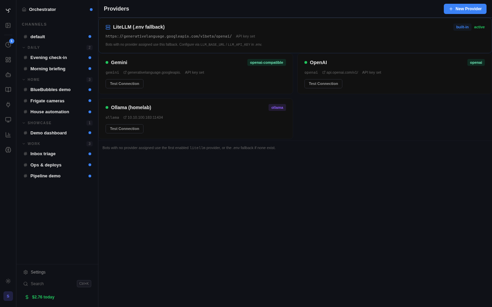

# Spindrel Setup Guide

## Quick Start

One command to get started:

```bash
# Clone and run the interactive setup wizard
git clone https://github.com/mtotho/spindrel.git
cd spindrel
bash setup.sh
```

Or as a one-liner (clones the repo for you):

```bash
curl -fsSL https://raw.githubusercontent.com/mtotho/spindrel/master/setup.sh | bash
```

### What the wizard does

The setup wizard generates two files and optionally starts the server:

1. **`.env`** — runtime configuration (database URL, API key, web search mode)
2. **`provider-seed.yaml`** — LLM provider config, consumed on first server boot and then deleted

It does **not** create bot YAML files or modify any code. Two system bots (`default` and `orchestrator`) are auto-seeded on first boot from `app/data/system_bots/`. The Orchestrator handles the rest of the onboarding conversationally.

### Prerequisites

- **Python 3.12+** with `pip` or `ensurepip` (on Debian/Ubuntu: `apt install python3-pip python3-venv`)
- **Docker** with the Compose v2 plugin
- **git**

The setup wizard is an interactive TUI that checks these prerequisites, then walks you through:

1. **Deployment mode** — Docker (recommended) or local dev
2. **LLM provider** — Pick from presets (Ollama, OpenAI, ChatGPT Subscription, Anthropic, Google Gemini, OpenRouter, LiteLLM proxy) or enter a custom OpenAI-compatible endpoint
3. **Default model** — Provider-specific model list with option for custom model names
4. **Web search backend** — SearXNG (built-in or external), DuckDuckGo, or disabled
5. **API authentication** — Auto-generate a random key or enter your own

The wizard generates `.env` and a `provider-seed.yaml` file. On first server boot, the seed file is consumed to create a typed provider in the database — giving you full driver features (model management, connection testing, model pull/delete for Ollama). The whole process takes about 60 seconds.

### After setup

Open `http://localhost:8000` and the **Orchestrator** bot will greet you in the Home channel. It walks you through creating your first bot, enabling integrations, and configuring workspaces — all conversationally.

> **Tip:** You can add more LLM providers later via **Admin UI > Providers**. The wizard just configures the first one.

## Manual Setup

If you prefer to configure everything manually:

### 1. Create .env

```bash
cp .env.example .env
```

Edit `.env` with your settings. Required fields:

| Variable | Description |
|----------|-------------|
| `API_KEY` | Bearer token for API authentication |
| `DATABASE_URL` | PostgreSQL connection string |
| `DEFAULT_MODEL` | Default LLM model (e.g. `gemma4:e4b` for Ollama) |

Then configure your LLM provider via **Admin UI > Providers**, or create a `provider-seed.yaml` for first-boot seeding:

```yaml
id: openai
provider_type: openai
display_name: OpenAI
base_url: https://api.openai.com/v1
api_key: sk-...
```

The setup wizard writes this file for you. The server consumes it once on first boot and then deletes it.

You can also set `LLM_BASE_URL` and `LLM_API_KEY` in `.env` for a typeless OpenAI-compatible fallback — but a proper DB provider (created by the setup wizard or Admin UI) is recommended for full features.

> **Note:** `LITELLM_BASE_URL` and `LITELLM_API_KEY` are accepted as aliases for backward compatibility.

> **Tip:** These `.env` values and all other configured secrets (provider keys, integration tokens, etc.) are automatically redacted from tool results and LLM output. You can also store additional secrets via **Admin > Security > Secrets** — see the [Secrets & Redaction guide](guides/secrets.md).

### 2. Start Services

```bash
docker compose up -d
```

> **Tip:** The Docker image can build optional integration/dashboard assets during image build. To skip that step and save build time:
> ```bash
> docker compose build --build-arg BUILD_DASHBOARDS=false
> ```
> Dashboards are optional — all core features work without them.

## Updating

### With the Spindrel CLI

```bash
spindrel pull    # git pull + rebuild + restart
```

Install the CLI if you haven't:

```bash
sudo ln -sf /path/to/spindrel/scripts/spindrel /usr/local/bin/spindrel
```

The setup wizard offers to do this automatically.

### Manually (Docker)

```bash
git pull
docker compose up -d --build
```

`--build` is required — `docker compose restart` only restarts the old image without picking up code changes.

### Manually (host / systemd)

```bash
git pull
spindrel restart
```

Or without the CLI: `sudo systemctl restart spindrel`

## Web Search

Web search is provided by the `web_search` integration. Configure it via **Admin UI > Integrations > Web Search**, or with env vars:

| Mode | `WEB_SEARCH_MODE` | `WEB_SEARCH_CONTAINERS` | Description |
|---|---|---|---|
| Managed SearXNG | `searxng` | `true` | Integration starts SearXNG + Playwright containers |
| External SearXNG | `searxng` | (unset) | User provides `SEARXNG_URL` |
| DuckDuckGo | `ddgs` | (unset) | Lightweight, no containers needed |
| Disabled | `disabled` | (unset) | Bring your own search tool in `tools/` |

### SearXNG mode (default)

**Built-in containers** (simplest):

```bash
WEB_SEARCH_MODE=searxng
WEB_SEARCH_CONTAINERS=true
```

The integration automatically starts SearXNG and Playwright containers and connects them to Spindrel's network. Managed containers appear in **Admin UI > Docker Stacks** where you can monitor status, view service health, read logs, and start/stop them.

**External instances** (bring your own SearXNG/Playwright):

```bash
WEB_SEARCH_MODE=searxng
SEARXNG_URL=http://my-searxng:8080
PLAYWRIGHT_WS_URL=ws://my-playwright:3000   # optional — fetch_url falls back to httpx
```

All settings are configurable at runtime in **Admin UI > Integrations > Web Search**. Private — queries never leave your network.

### DuckDuckGo mode

```bash
WEB_SEARCH_MODE=ddgs
```

Uses `ddgs` to search DuckDuckGo, Google, Brave, and other public engines. No containers, no API keys. Good for occasional searches.

### Disabled

```bash
WEB_SEARCH_MODE=disabled
```

The `web_search` tool returns an error directing bots to enable it. Add custom search tools in `tools/`.

You can switch modes at any time via the Integrations UI — no restart required. The `fetch_url` tool always works regardless of mode (falls back to httpx when Playwright is unavailable).

> **Upgrading from COMPOSE_PROFILES?** Replace `COMPOSE_PROFILES=web-search` with `WEB_SEARCH_CONTAINERS=true` in your `.env`.

## LLM Provider Configuration

### Default provider (`.env`)

The `.env` variables `LLM_BASE_URL` and `LLM_API_KEY` configure the default provider.
This uses an OpenAI-compatible client, so any endpoint that speaks the OpenAI chat completions
format works:

| Provider | LLM_BASE_URL | Notes |
|----------|-------------|-------|
| **Ollama** (default) | `http://localhost:11434/v1` | Local models, no API key needed |
| LiteLLM proxy | `http://litellm:4000/v1` | Self-hosted, supports 100+ models |
| OpenAI | `https://api.openai.com/v1` | Direct OpenAI API |
| Google Gemini | `https://generativelanguage.googleapis.com/v1beta/openai/` | OpenAI-compatible endpoint |
| OpenRouter | `https://openrouter.ai/api/v1` | Multi-provider (Anthropic, Google, Meta, etc.) |

### Additional providers (Admin UI)

You can configure multiple LLM providers simultaneously via **Admin UI > Providers**.
Each provider has its own API key, base URL, and rate limits.


*Admin > Providers — manage multiple LLM providers with connection testing.*

Supported provider types:

| Type | Description |
|------|-------------|
| `openai` | Direct OpenAI API (API key) |
| `openai-subscription` | ChatGPT subscription via OAuth (no API key, plan billing — see below) |
| `openai-compatible` | Any OpenAI-compatible endpoint (Gemini, vLLM, OpenRouter, etc.) |
| `anthropic` | Direct Anthropic API (native support, no proxy needed) |
| `anthropic-compatible` | Anthropic-compatible proxies (Bedrock, etc.) |
| `ollama` | Ollama (local model runner) |
| `litellm` | LiteLLM proxy (100+ providers via a unified API) |

Assign providers to individual bots via the `model_provider_id` field. Bots without a
provider ID fall back to the `.env` default.

**Anthropic (Claude) models**: Use OpenRouter as your default provider for the simplest
setup, or add a dedicated Anthropic provider in Admin UI > Providers for direct API access.

For cost tracking, budget limits, and spend forecasting, see the [Usage & Billing guide](guides/usage-and-billing.md).

### ChatGPT Subscription (OAuth, no API key)

The `openai-subscription` provider authenticates against OpenAI's Codex Responses API
using your existing ChatGPT paid-subscription login — no API key, no per-call billing.
Requests are metered against your ChatGPT plan quota instead. Useful when you already pay
for ChatGPT and want the same quota available to Spindrel bots.

**Model allowlist.** The OAuth flow only authorizes a subset of OpenAI's public catalog.
The live list is refreshed from Codex's `/models` endpoint on boot, with a shipped fallback
list for offline cases. Expect this to evolve as GPT-5 point releases move.

**Connecting:**

1. **Admin UI > Providers > New provider**, pick type `openai-subscription`.
2. The provider edit page shows a **Connect ChatGPT** panel with a device-code flow.
3. Click **Start** — a short user code plus a verification URL appears.
4. Open the verification URL in a browser, sign in with your ChatGPT account, and paste
   the user code. The panel polls until approval lands.
5. On success, the panel shows the connected email + plan. Tokens are stored encrypted on
   the provider row and refreshed automatically with a 10-minute leeway.

**Setup wizard path.** If you choose **ChatGPT Subscription (OpenAI OAuth, no API key)**
in `bash setup.sh` and let the wizard start Docker, the terminal prints the verification
URL and user code after the server becomes healthy, then polls until you approve the
login in a browser. In headless mode or if you start Docker later, connect from
**Admin UI > Providers** after opening `http://localhost:8000`.

**Billing config.** When you create an `openai-subscription` provider, `billing_type=plan`
and `plan_cost=20` / `plan_period=monthly` are pre-filled so the plan-billing path reports
`$0` per call (the cost is your flat monthly subscription, not per-token). Override in the
UI if your plan pricing differs.

**Caveats.**

- This is a user-authenticated path — OpenAI's terms of service for ChatGPT subscriptions
  apply to requests made through it. The Connect panel surfaces this in an amber
  disclaimer. Use at your discretion.
- Codex Responses API only. Tokens obtained this way do **not** work against
  `/v1/chat/completions`; an `OpenAIResponsesAdapter` translates `chat.completions` ↔
  `/responses` so the rest of the agent loop is unaware.
- Client ID is the public Codex CLI app ID. There is no third-party OAuth app program
  here; everyone reuses the same client_id (stored as a module constant for easy audit).

**Disconnecting.** The same provider page has a **Disconnect** action — this clears the
OAuth token block; the provider row itself is kept so you can reconnect without recreating
it.

## MCP Servers

MCP (Model Context Protocol) servers give bots access to remote tool endpoints — Home Assistant, databases, custom APIs, etc.

**Configure via Admin UI** (recommended): Go to **Admin > MCP Servers**, click **New Server**, enter the URL and optional API key, and test the connection. Discovered tools are available immediately.

**First-boot seed from YAML** (optional): If you have a `mcp.yaml` file when the server starts for the first time (empty DB), it will be imported automatically. After that, manage everything through the UI.

```yaml
# mcp.yaml (see mcp.example.yaml)
homeassistant:
  url: http://your-ha-host:4000/homeassistant/mcp
  api_key: ${HA_MCP_KEY}
```

> **Note:** The YAML seed is one-time only — once servers exist in the database, `mcp.yaml` is ignored. For Docker, uncomment the `mcp.yaml` volume mount in `docker-compose.yml` if you want to use this.

**Assign to bots**: In your bot YAML, list the MCP servers by name:

```yaml
# bots/assistant.yaml
mcp_servers: [homeassistant]
```

For a full walkthrough including capabilities, workspace templates, and a Home Assistant worked example, see the [MCP Servers guide](guides/mcp-servers.md).

## Workspaces

Spindrel uses a single workspace root on disk, with per-channel and shared subdirectories
inside it. Bots operate against that shared filesystem model; they are not provisioned with
their own long-lived per-bot containers.

```bash
# .env
WORKSPACE_BASE_DIR=~/.spindrel-workspaces

# For Docker deployment (sibling container pattern):
WORKSPACE_HOST_DIR=/home/you/.spindrel-workspaces  # host path
WORKSPACE_LOCAL_DIR=/workspace-data                  # container mount
```

### Memory System

The recommended memory system is `workspace-files`:

```yaml
# bots/assistant.yaml
memory_scheme: workspace-files
workspace:
  enabled: true
```

This creates:
- `MEMORY.md` — curated knowledge base (stable facts, preferences)
- `logs/YYYY-MM-DD.md` — daily session logs
- `reference/` — longer guides and documentation

### Command execution

By default, tools such as `exec_tool` run commands as subprocesses on the server host against
the workspace filesystem. This is the current primary execution model.

If you want a more isolated execution environment, Spindrel also supports Docker-backed
sandboxes for command execution. See the [Command Execution guide](guides/command-execution.md)
for the current model, tradeoffs, and when to use host execution vs Docker.

## Integrations

Integrations are discovered from `integrations/*/` directories. Each can provide:
- **Router** — API endpoints
- **Dispatcher** — message delivery
- **Hooks** — event handlers
- **Process** — background service (e.g., Slack bot, MQTT listener)
- **Tools** — bot-callable functions
- **Skills** — reusable markdown knowledge, including foldered skill packs
- **Templates** — workspace schema templates

### Enabling an Integration

1. Set required env vars (via `.env` or Admin UI > Integrations)
2. Restart the server

Integration processes (Slack bot, Frigate listener, etc.) auto-start when their required env vars are set. Toggle auto-start in Admin UI > Integrations.

### Activating on a Channel

Once an integration is enabled, you can **activate** it on individual channels to expose its tools to the bot on that channel:

1. Open a channel and go to the **Integrations** tab
2. Click **Activate** on the integration
3. The integration's tools become available on that channel; integration-shipped skills remain in the normal skill RAG pool

There is no separate "capability bundle" — activation flips a per-channel flag and the integration's declared tools are exposed. Any related guidance lives in normal skills or prompt templates and is retrieved via the regular skill system.

For example, activating Home Assistant gives the bot device-control tools and widget templates on that channel only; the HA skill pack teaches it the entity-targeting grammar via RAG whenever it's a likely match.

### Workspace Schema Templates

Workspace schema templates define file structures (`tasks.md`, `status.md`, …) for a channel's workspace. They are optional and independent of integration activation.

1. Go to the channel's **Workspace** tab
2. Expand **Advanced Workspace Settings** and link a template under **Organization Template**
3. The bot uses that structure when creating workspace files

See the [Templates & Activation guide](guides/templates-and-activation.md) for the full walkthrough.

### Workspace Integrations

The shared workspace includes an `integrations/` directory that is automatically added to the integration discovery path at startup. Bots can scaffold integrations directly at `/workspace/integrations/` — they're discovered on the next server restart, just like any other integration directory.

This is the easiest way to add custom integrations: ask a bot (or use Claude Code) to write the integration code, then restart the server.

### Custom Tools

Drop a `.py` file in `tools/` with a `@register` decorator and restart — the tool is available to any bot:

```python
# tools/my_tool.py
from app.tools.registry import register

@register({
    "type": "function",
    "function": {
        "name": "my_tool",
        "description": "Does something useful.",
        "parameters": {"type": "object", "properties": {}},
    },
})
async def my_tool() -> str:
    return '{"result": "ok"}'
```

Additional tool directories can be loaded via `TOOL_DIRS`:

```bash
# .env
TOOL_DIRS=/path/to/more/tools
```

### Personal Extensions Repo

Keep your own tools and skills in a separate repo and load everything via `INTEGRATION_DIRS`. Structure your repo with a subdirectory that contains `tools/` and/or `skills/`:

```
my-extensions/              # your repo
└── personal/               # becomes a discoverable extension
    ├── tools/
    │   └── weather.py      # auto-discovered tool
    └── skills/
        └── my-skill.md
```

```bash
# .env
INTEGRATION_DIRS=/path/to/my-extensions
```

Colon-separated for multiple directories (e.g. `/path/one:/path/two`). Tilde (`~`) is expanded to your home directory. This also makes `TOOL_DIRS` unnecessary — tools inside any `INTEGRATION_DIRS` subdirectory are auto-discovered.

No `setup.py` or boilerplate needed — the server auto-discovers tools and skills from any subdirectory.

For Docker, mount the directory into the container:

```yaml
# docker-compose.override.yml
services:
  agent-server:
    volumes:
      - /home/you/my-extensions:/app/ext:ro
    environment:
      - INTEGRATION_DIRS=/app/ext
```

See the [Custom Tools & Extensions guide](guides/custom-tools.md) for a full walkthrough with examples.

### External Integrations

For full integrations with webhooks, dispatchers, and background processes:

```bash
# .env
INTEGRATION_DIRS=/path/to/my-integrations:/another/path
```

See [Creating Integrations](integrations/index.md) for the complete guide.

## Directory Structure

```
spindrel/
├── app/                    # Core server code
├── bots/                   # Bot YAML configs (gitignored, user-created)
├── skills/                 # Skill markdown files (gitignored, user-created)
├── tools/                  # Custom tool scripts (gitignored, user-created)
├── integrations/           # Integration packages
│   ├── slack/             # Slack integration
│   ├── github/            # GitHub webhooks
│   ├── discord/           # Discord integration
│   ├── frigate/           # Frigate NVR
│   ├── browser_live/      # Real-browser automation via paired Chrome extension
│   ├── local_companion/   # Paired local-machine shell control via session leases
│   ├── arr/               # Sonarr/Radarr media management
│   ├── claude_code/       # Claude Code CLI integration
│   ├── bluebubbles/       # iMessage via BlueBubbles
│   ├── ingestion/         # Document ingestion pipeline
│   ├── web_search/        # Web search (SearXNG, DuckDuckGo)
│   └── example/           # Template for new integrations
├── migrations/             # Alembic database migrations
├── scripts/                # Dev and setup scripts
├── ui/                     # Web UI (React + Vite)
├── docker-compose.yaml
├── .env                    # Runtime configuration (gitignored)
└── .env.example            # Template
```

> **Screenshot placeholder:** replace the older setup/admin images in this guide with the new
> web-native UI captures as they become available.

## Local Companion

`local_companion` is the first machine-control provider. Core machine control lives under **Admin > Machines**; integration pages expose provider-wide settings/status, but target lifecycle lives in the machine center.

Current setup flow:

1. Enroll the target from **Admin > Machines** under the `Local Companion` provider.
2. Run the returned companion launch command on the target machine.
3. Open the chat session you want to use.
4. Grant that session a machine lease.
5. Use `machine_status`, `machine_inspect_command`, and `machine_exec_command` from that session.

For the architecture and safety model, read [Local Machine Control](guides/local-machine-control.md). For the integration-specific operator notes, read [`integrations/local_companion/README.md`](../integrations/local_companion/README.md).

## Remote Access & Networking

By default, Spindrel assumes the UI and server are on the same host (`localhost`). If you're deploying to a LAN server or accessing from another machine, a few things need adjusting.

### How the UI finds the server

The web UI auto-detects the server URL from the browser's address bar — it takes the hostname and assumes port 8000. For example:

| You open | UI connects to |
|----------|---------------|
| `http://localhost:8000` | `http://localhost:8000` |
| `http://10.0.0.5:8000` | `http://10.0.0.5:8000` |
| `http://myserver.local:8000` | `http://myserver.local:8000` |

You can also override the server URL manually on the login screen.

### CORS (Cross-Origin Resource Sharing)

When the UI and server are on different origins (different hostnames or ports), browsers block requests unless the server explicitly allows them via CORS headers.

The Docker image serves the built UI from the same FastAPI origin on port 8000, so no CORS setting is needed for the default Docker install. Local Vite development still uses a separate origin and is allowed from `http://localhost:5173`.

**For LAN or remote access**, add your origins to `CORS_ORIGINS`:

```bash
# .env
CORS_ORIGINS=http://10.0.0.5:5173,http://myserver.local:5173
```

Add every origin (scheme + hostname + port) you'll access the UI from. Comma-separated, no trailing slashes.

### Docker Compose port binding

By default, Docker binds port 8000 to `0.0.0.0` (all interfaces), so the server and built UI are already accessible from other machines on your network. If you want to restrict to localhost only:

```yaml
# docker-compose.override.yml
services:
  agent-server:
    ports:
      - "127.0.0.1:8000:8000"
```

### Reverse proxy / tunnel

For public access behind a reverse proxy or Cloudflare Tunnel, set `BASE_URL` so the server knows its public address (used for webhook URLs):

```bash
# .env
BASE_URL=https://agent.yourdomain.com
CORS_ORIGINS=https://ui.yourdomain.com
```

## Troubleshooting

### Server won't start

1. Check PostgreSQL is running: `docker compose ps postgres`
2. Check `.env` has required fields: `API_KEY`, `DATABASE_URL`
3. Check logs: `docker compose logs agent-server`

### LLM calls failing

1. Check admin/logs for trace information

### Integration process not starting

1. Check Admin UI > Integrations for status
2. Verify all required env vars are set (green pills)
3. Check server logs for the integration name
4. Try manual start via Admin UI process controls

### Migrations failing

Migrations run automatically on startup. If they fail:
1. Check database connectivity
2. Check `docker compose logs agent-server` for the specific error
3. Try `alembic upgrade head` manually inside the container
