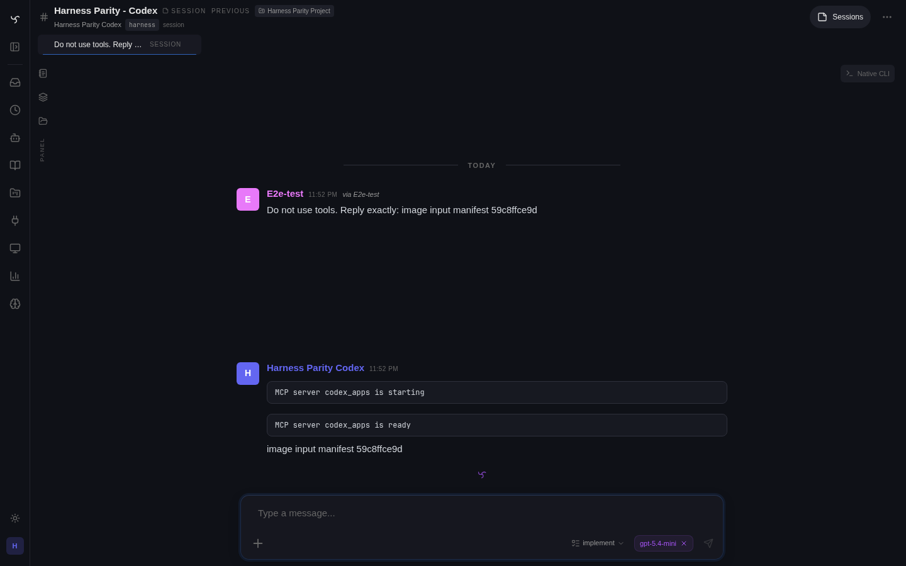
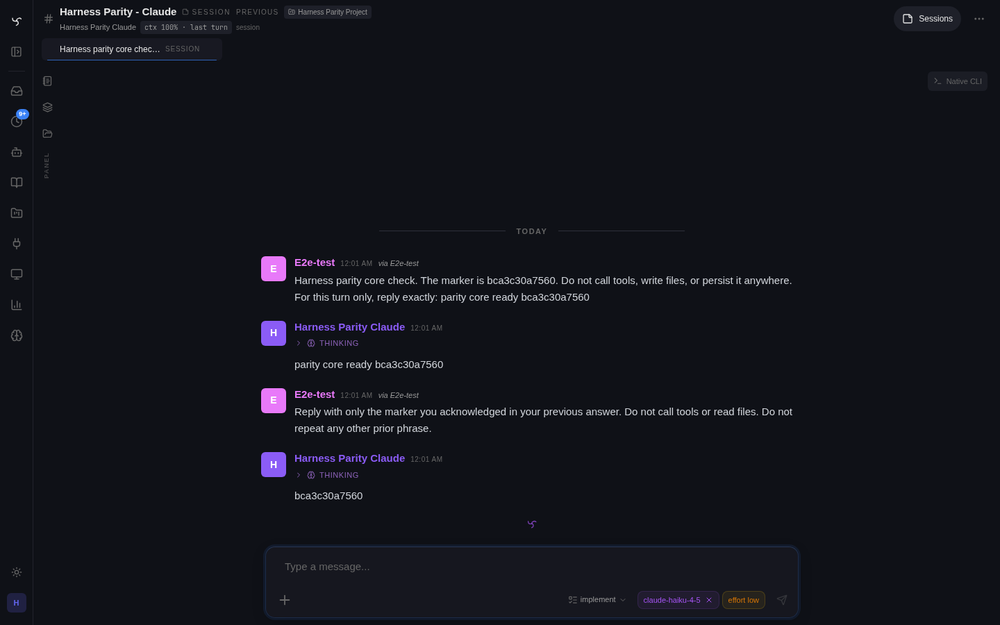

# Track - Harness SDK

## North Star

Make external agent harnesses feel like first-class Spindrel sessions without pretending they are normal Spindrel bots. A harness owns the coding-agent loop, native tools, file edits, and native session id; Spindrel owns the browser UI, channel transcript, workspace path, session persistence, approvals, and any explicitly bridged Spindrel tools/skills.

This track covers the stable host contract used by Claude Code and Codex today, and by future runtimes later: approvals, per-session runtime controls, slash-command filtering, and optional bridges from harness runtimes back into Spindrel's tool and skill systems.

## Current State

- Claude Code and Codex are both implemented harness runtimes. They live in `integrations/claude_code/harness.py` and `integrations/codex/harness.py`.
- Harness discovery/registration lives under `app/services/agent_harnesses`; active integration harness modules register runtime instances on import.
- Harness bots reuse standard Spindrel bot workspaces. The bot workspace directory is the harness cwd.
- A harness turn bypasses normal Spindrel context assembly, prompt injection, skills, knowledge bases, memory, and fanout. Host hints, manual compact continuity summaries, selected Spindrel tools, and per-run model/effort overrides now have narrow bridge paths back into the runtime.
- Spindrel currently streams assistant text and live tool breadcrumbs into the channel, persists the final assistant message with tool breadcrumbs, and stores harness resume/cost metadata on assistant-message metadata for the Spindrel session.
- Phase 2 shipped the in-app terminal and per-session resume keying, plus a broad auto-approve `can_use_tool` shim so Claude Code does not stall on SDK permission prompts.
- Known-secret and common-pattern redaction now applies at the host boundary for harness streams and persisted final assistant text. Native harness tools still execute outside Spindrel's tool dispatcher, so a token printed by the harness should be treated as compromised even if the UI/transcript redacts it afterward.
- Per-session approval modes, session-scoped model/effort/runtime settings, durable harness question cards, `/compact` / `/context` / `/new` / `/clear`, host hints, and the first Spindrel tool/skill bridge lane are all real.
- Native Spindrel plan mode now has live parity diagnostics beside the Codex/Claude harness checks: start/exit, question card, publish, approve, answer handoff, execution progress outcome, replan, planning-mode mutation guard, persisted transcript replay, behavior-pressure checks for ambiguous planning, stale plans, missing outcomes, and stale revision rejection, plus professional-plan quality gates for key changes, interfaces, assumptions/defaults, test plan, and non-vague steps against the dedicated live Spindrel channel.
- The integration import boundary matters here: harness runtime modules should import host contracts through `integrations.sdk`, not directly from `app.*`, so the boundary test can stay meaningful.

## Invariants

- Runtime implementations live in `integrations/<id>/`; shared host contracts live in `app/services/agent_harnesses` and are re-exported through `integrations.sdk`.
- No Claude-only tool names or permission assumptions belong in core `app/` abstractions. Runtime adapters own tool classification and SDK-specific translation.
- Harness settings are session-scoped first. Multi-pane, scratch-session, and concurrent-session views must not accidentally mutate the channel primary. `channel.active_session_id` means primary/mirrored integration session only; web UI commands and harness controls must target the current component/querystring session id when one is present, falling back to `active_session_id` only when no explicit session is supplied.
- Scheduled harness runs inherit the target session's model/effort settings unless the heartbeat/task explicitly supplies per-run overrides. Per-run overrides must not mutate `Session.metadata_['harness_settings']`.
- Normal bot/channel tool pickers remain visible for harness bots. For harnesses they define the Spindrel bridge tool set, not normal-loop context injection.
- Existing Spindrel model/provider controls are not automatically valid for harnesses. Each runtime exposes its own supported controls and value hints.
- Harness model settings are session-scoped and mode-aware: normal/chat execution and native planning keep independent model selections so entering/exiting plan mode does not reset the composer to a generic default.
- Harness-native tools remain native. If Spindrel tools are later exposed to a harness, they must execute through the existing Spindrel dispatch, policy, approval, trace, and widget-result paths.
- Harness host events must pass through Spindrel's secret redactor before publication or persistence. This covers accidental display/logging; it does not make printed credentials safe to keep using.
- Approval mode and model/effort controls should be usable from both UI controls and slash commands, with one backend settings contract.

## Phases

| Phase | Title | Status | Notes |
|---|---|---|---|
| 1 | Claude Code web harness baseline | shipped | Remote Claude Code sessions from the web UI, workspace reuse, auth-status surface, terminal login, resume/cost persistence. |
| 2 | Resume + broad auto-approval cleanup | shipped | Per-session resume keying and auto-approve `can_use_tool` shim to avoid SDK permission stalls. |
| 3 | Harness approvals | shipped | Per-session approval modes: `bypassPermissions`, `acceptEdits`, `default`, `plan`; approval cards for ask paths; stop-turn cancellation; boundary re-exports. Phase 3a (backend) and Phase 3b (UI) both shipped 2026-04-26. |
| 4 | Harness control surface | shipped | `RuntimeCapabilities` Protocol; per-session `harness_settings` (model/effort/runtime_settings); `GET /runtimes/{name}/capabilities`; `GET/POST /sessions/{id}/harness-settings`; header model + effort pills (per-session, alongside Phase 3 approval-mode pill); harness-aware `/model` and `/effort`; `?bot_id=` filter on `/api/v1/slash-commands` and `/help`. Follow-up fixed channel-surface slash requests to carry `current_session_id` so scratch/split/thread panes target their own session, with `active_session_id` only as the default primary fallback. Shipped 2026-04-26. |
| 5 | Native-feel foundation | shipped (follow-up verification open) | Session-bound harness context hints, harness-aware `/compact` / `/context` / `/new` / `/clear`, heartbeat/workspace-files hints, channel/admin settings cleanup, normal tool pickers as bridge source, first Spindrel tool bridge, durable harness question cards, persisted harness tool breadcrumbs, and model-scoped effort controls all landed on 2026-04-26. Remaining work is runtime smoke-testing and polish, not missing core plumbing. |
| 6 | Codex runtime | shipped 2026-04-27 (v1 + finish-line pass) | Codex via the official `codex app-server` JSON-RPC protocol over stdio (no third-party Python SDK). Spawns the user-installed `codex` binary; same `TurnContext`/approval/settings/capabilities/tool-bridge contracts as Claude. Includes Phase A host-seam cleanup (single `build_turn_context`, shared `apply_tool_bridge`, public `resolve_approval_verdict`, `format_question_answer_for_runtime`, `HarnessToolSpec`/`HarnessBridgeInventory` on `base.py`). Follow-up wired Spindrel session plan mode into Codex `collaborationMode: plan`, per-turn `sandboxPolicy`, live model/effort options, and Codex token-window telemetry. Plan: `~/.claude/plans/partitioned-conjuring-finch.md`. See [[#Phase 6 - Codex App-Server Harness V1]]. Remaining live checks: dynamicTools call path, approval routing under a mutating command, native compaction on a non-empty thread. |
| 7 | Skill bridge | planned | Export simple skills to harness-native skill folders and/or expose searchable Spindrel skills as bridged tools/resources. |
| 8 | Usage + observability | planned | Aggregate harness usage/cost into admin usage, expose runtime version/auth/health, and improve post-refresh tool-call rehydration. |

## Phase 3 - Approval Contract — shipped 2026-04-26

Phase 3a (backend) and Phase 3b (UI) shipped same day. Shared approval helper in `app/services/agent_harnesses/approvals.py`. Each runtime translates Spindrel's `AllowDeny` result into its SDK-native permission shape (Claude → `PermissionResultAllow`/`PermissionResultDeny`).

UI surface: per-session mode pill in `ChannelHeader` (cycles `bypass → edits → ask → plan`), live + orphan harness approval cards with tool-specific arg previews (Bash command, Edit diff, Write file/content, ExitPlanMode plan), `Approve all this turn` button that sends `bypass_rest_of_turn` and grants the in-memory turn bypass, `expired` decision wired through the chat reducer.

Planned shape:

- `TurnContext` carries Spindrel session id, channel id, bot id, turn id, workspace, harness resume id, permission mode, and a DB session factory.
- Runtime classification methods answer which tools are readonly, which prompt in `acceptEdits`, and which auto-approve in plan mode.
- Native harness approval requests create `ToolApproval` rows with `tool_type="harness"` and no linked `ToolCall`.
- `ApprovalRequestedPayload` carries `tool_type` so live and orphan cards can render a harness-specific approval card.
- `ApprovalResolvedPayload` gains `expired` so timeout/stop-turn cards do not remain pending.
- `Approve all this turn` is an in-memory turn bypass keyed by turn id, granted before resolving the first approval and revoked in `_run_harness_turn` finally cleanup.
- Stop-turn cancellation must cover both the slash-command path and the visible `/chat/cancel` path.

Open implementation checks:

- `/approval-mode` slash command cannot bypass `approvals:write` expectations just because slash commands currently lack request auth context.
- Session approval-mode endpoints must reuse normal session visibility/ownership checks, not only scope checks.
- Bypass-mode audit events should use a transcript shape the UI reducer actually keeps.
- Any background event publish should use primitive snapshots, not ORM objects crossing awaits.

## Phase 4 - Controls + Slash Commands — shipped 2026-04-26

What landed:

- `RuntimeCapabilities` + `HarnessSlashCommandPolicy` dataclasses on `app/services/agent_harnesses/base.py`; new `HarnessRuntime.capabilities()` Protocol method; both re-exported through `integrations.sdk`.
- Per-session `harness_settings` storage in `app/services/agent_harnesses/settings.py` — `load_session_settings`, `patch_session_settings` (PATCH semantics: missing key = no change, JSON `null` = clear, value = set; 256-char `model` guard).
- `TurnContext` extended with `model`, `effort`, `runtime_settings`. Claude adapter threads `ctx.model` → `ClaudeAgentOptions(model=...)`; Phase 5 changes Claude effort from "unsupported" to a runtime-owned model-scoped option mapped by the adapter after inspecting the installed SDK shape.
- REST endpoints `GET/POST /api/v1/sessions/{id}/harness-settings` (`approvals:read` / `approvals:write` scopes — same tier as approval-mode; explicitly noted as v1 expedience that may move to a dedicated `harness:write` later) + `GET /api/v1/runtimes/{name}/capabilities` (user auth).
- Header chrome: `HarnessHeaderChrome` now renders model pill (freeform popover when `model_is_freeform`, dropdown cycle when `model_options`/`supported_models` are set) + effort pill (model-scoped where available) + Phase 3 approval-mode pill. All target the surface's own `sessionId`.
- Slash commands: `/model` server-handled (drop `local_only=True`); channel-surface slash POSTs now carry `current_session_id` for the UI-current pane/session, validated against the channel, with `channel.active_session_id` only as the primary fallback. Harness `/model`, future harness `/effort`, `/stop`, `/compact`, `/plan`, `/context`, and default `/find` resolve through that current-session helper. `/effort` harness branch returns a friendly no-op when runtime declares no effort knob and **never** writes `channel.config['effort_override']`; `/help` and the catalog endpoint share one bot-id-aware filter via `useSlashCommandList(botId)` plumbed through 5 callers.
- Claude allowlist (conservative): `help, rename, stop, style, theme, clear, sessions, scratch, split, focus, model`; Phase 5 adds harness-aware `compact`, `context`, and `plan`. Excluded: `find, skills` (Spindrel-loop or runtime-conflicting semantics).

Tests:

- `tests/unit/test_harness_settings.py` — load/patch round-trip, null-clears, oversized-model guard, partial patches.
- `tests/unit/test_runtime_capabilities.py` — Claude capabilities shape, slash-policy intersection helper.
- `tests/unit/test_slash_commands_harness.py` — harness `/effort low` does NOT mutate `channel.config`, harness `/model` writes `harness_settings`, channel-surface explicit `current_session_id` wins over `active_session_id`, fallback to `active_session_id` still works, non-harness `/model` writes `channel.model_override`, harness-filtered `/help`, catalog endpoint intersection.
- `tests/integration/test_harness_settings_endpoints.py` — auth scopes, `_authorize_session_read` boundary, length guard, capabilities endpoint shape.

Known follow-ups (not blocking shipped):

- `tests/integration/test_turn_worker_harness_branch.py` — two persistence tests (`test_when_harness_succeeds_then_assistant_message_persisted_*`) fail on the committed baseline pre-Phase 4. Pre-existing; unrelated to this work.
- Per-runtime SDK kwarg shape (`ClaudeAgentOptions(model=...)`) is verified by smoke run only — if the SDK renames the kwarg, fix is local to `integrations/claude_code/harness.py`.

## Phase 5 - Native-Feel Foundation — in progress 2026-04-26

What is landing:

- `TurnContext.context_hints` plus `HarnessContextHint` for one-shot host context injection into runtime adapters.
- `app/services/agent_harnesses/session_state.py` owns per-session hint queue, compact reset timestamp, latest harness metadata lookup, and compact continuity summary generation.
- Harness `/compact` now means native runtime compaction only. For Claude Code it dispatches SDK `/compact`, records native compact status/metadata, and does not queue a Spindrel continuity summary or fake a new native session.
- `/new` and `/clear` open a fresh Spindrel session without deleting the old one. They are generic chat-session commands, not harness-only commands, and they do not mutate the channel primary/default pointer.
- Harness `/context` reports native harness state: runtime, selected model, approval mode, resume id, pending host hints, last turn, compact reset, and usage metadata.
- Bare harness `/model` and `/effort` render interactive picker cards; direct `/model <id>` and `/effort <level>` still mutate session settings.
- Heartbeats now have a `ChannelHeartbeat.runner_mode` switch. Harness channels default to harness-runner mode, which executes a real harness turn in the channel's primary session; opting into the Spindrel-agent runner exposes the normal heartbeat workflow/dispatch controls and requires an explicit heartbeat model. Harness heartbeat model/effort are per-run overrides and blank means inherit session/runtime defaults.
- Channel settings now hide normal-loop prompt/model/RAG/memory/context surfaces for harness bots and show runtime-oriented controls instead. Tool enrollment stays visible and is labeled as the Spindrel bridge source.
- Harness composer plan control is the canonical visible plan affordance; header duplicate state stays out of the harness chrome.
- Pending durable `core/harness_question` cards now get a sticky lane immediately above the composer in default and terminal chat modes, and freeform send is blocked until the pending interaction is answered.
- Workspace-files memory on a harness bot injects a host hint pointing the runtime at durable memory files; reads/writes still require native filesystem access or selected bridged tools.
- Claude Code gets a best-effort Spindrel tool bridge through SDK in-process MCP helpers. Tool definitions are resolved dynamically from the same effective channel/bot tool configuration as the normal loop, and invocation routes through `dispatch_tool_call` so policy, approval, trace rows, redaction, and result summarization stay centralized.
- Bridge/context visibility is no longer count-only: harness status and `/context` expose pending hint previews, bridge health, exported tools, ignored client tools, explicit one-turn tools, tagged skills, last bridge error, native compact status, and estimated native context remaining when usage/window telemetry exists. The existing ctx header status opens these details instead of adding another chip.
- Live harness smoke automation now exists at `tests/e2e/scenarios/test_harness_live_smoke.py`. It targets configured deployed Claude/Codex channels, creates a fresh detached session per case, checks native `/runtime` probes, basic turn persistence, plan-mode round trip, safe workspace write/cleanup, and Spindrel bridge invocation persistence in both runtimes.
- Bridge inventory degrades visibly: local tool resolution and each MCP server list are isolated, inventory errors are recorded on bridge status, and harness `/context` caps live inventory at 3s before showing the last recorded bridge state. Broken MCP discovery should not make `/context` feel dead or collapse the whole bridge to an opaque generic error.
- Slash-command UX has an immediate pending path: remote commands toast as soon as submitted, harness `/compact` inserts a pending transcript card, and native compaction result cards summarize usage with raw JSON hidden behind a details disclosure. Harness status also marks latest native compaction as the context-remaining source when it is newer than the last harness turn.
- Harness channel settings include native auto-compaction prompts: default on, prompt below 60% remaining context, auto-run native compact below 10% remaining context when telemetry is available.
- Composer `+ -> Tools` can insert `@tool:<name>` for one-turn bridge exposure. Harness bridge execution is constrained to the exported tool set through `dispatch_tool_call(allowed_tool_names=...)`.
- Harness session panes now keep CLI-like controls wired to the visible session: `/style` works from session-scoped composers by mutating the parent channel's chat style, and harness `/effort` works from session surfaces without falling back to normal channel `effort_override`.
- Harness native auto-compaction settings are now enforced after successful harness turns. The worker evaluates normalized usage telemetry, records `harness_auto_compaction` trace events, prompts once below the soft threshold, and runs native `/compact` once below the hard threshold until context pressure recovers.
- Live harness smoke automation now also covers session controls and diagnostics: session-scoped `/style`, `/model`, `/effort`, approval-mode setting, turn trace detail, and context-budget endpoint shape.
- Claude Code bridge tools return SDK-native MCP result dicts, not raw strings, and bridge inventory includes pinned plus fetched/enrolled local tools. After a harness discovers a local tool through `get_tool_info` or one-turn `@tool:` exposure, subsequent turns should see it through the same persistent working set normal chat uses.
- Native compaction has first-class diagnostics: start/completion trace events, before/after context estimates, source, native session id, usage, error payloads, and a ctx-popover trace link. This is the fallback source of truth when the visible compact transcript card is absent or hidden by a rendering bug.
- Composer `+ -> Skills` / explicit `@skill:<id>` adds a tagged-skill index hint for the turn. Skill bodies remain progressive via bridged `get_skill` / `get_skill_list`; no native `.claude/skills` sync in Phase 5.
- Harness `/compact` renders an inspectable transcript card with continuity summary preview while still queuing the summary as a one-shot host hint.
- Claude Code `AskUserQuestion` now routes through a durable Spindrel native card (`core/harness_question`) instead of the SDK's transient prompt surface. The card is a persisted assistant message scoped to the current Spindrel session and renders in both default and terminal chat modes. Answering it writes a suppress-outbox user answer message, resolves the live SDK callback when present, or starts a fresh harness task in the same session if the callback disappeared after restart.
- 2026-04-27 follow-up: harness question answer rows are now hidden transport/audit rows, not transcript messages. The original question card is the durable read-only answer record, and Codex user-input expiry/cancel now ends the active turn instead of leaving the app-server notification wait stuck.
- 2026-04-27 follow-up: Stop now targets the visible harness session (`channel_id` + `session_id`) and `_run_harness_turn` cancels the runtime task when the shared session lock is cancelled. Cancelled harness turns persist a `turn_cancelled` assistant row with any partial tool transcript so refresh does not resurrect stale `(thinking...)` turns.
- Harness live tool breadcrumbs are now persisted on the synthetic assistant message as canonical `tool_calls` plus `assistant_turn_body`, so refresh keeps the native tool transcript instead of collapsing to final text only.
- 2026-04-27 follow-up: scheduled tasks targeting harness bots now run through `_run_harness_turn` instead of the normal Spindrel LLM loop. Task `model_override` and `harness_effort` live in `execution_config` as per-run overrides, with channel-targeted tasks resolving the channel's current primary session before execution.

Open verification:

- Smoke test the Claude SDK MCP helper names on the deployed harness image. The code degrades by disabling the bridge if the installed SDK lacks `create_sdk_mcp_server` / `tool`, but the exact helper signature needs runtime verification.
- Exercise a mutating bridged tool in ask mode and verify the existing Spindrel approval card flow resolves back into the harness tool result.
- Decide whether scheduled harness turns should target only the primary session forever or fan out to recently active scratch/split sessions when a channel has no obvious primary human context.
- Keep improving native context telemetry. Claude Code now has a best-effort context-window estimate and native compact event visibility, but runtime-provided pressure data would be better than deriving remaining percent from the latest usage payload.
- Smoke test Claude `AskUserQuestion` with the installed SDK and confirm `PermissionResultAllow(updated_input=...)` is accepted by the runtime version in the harness image.
- SDK parity debugging rule: inspect the installed runtime SDK objects/options from the repo venv or live app container before changing adapter behavior. For Claude Code, `agent-server/.venv/bin/python` exposes the actual `claude_agent_sdk` dataclasses/options; do not infer message fields only from memory or stale docs.

Native compaction cleanup handoff (2026-04-28):

- Ownership lives in this Harness SDK track, not the ambient Code Quality track. The known issue is also listed in `Loose Ends.md` as "Codex harness native compact cards repeat and context budget can show 0%".
- Cleanup scope: make persisted native-compaction result messages the display source of truth, prevent duplicate optimistic transcript cards, and centralize context-remaining derivation from latest turn usage plus latest native compact metadata in `app/services/agent_harnesses/session_state.py`.
- Another active session is handling this harness-specific cleanup. Architecture/code-quality scans should skip it as a next target unless the harness session hands it back.

## Phase 6 - Codex App-Server Harness V1 — shipped 2026-04-27

Plan file: `~/.claude/plans/partitioned-conjuring-finch.md`. Implemented the same day; see session log `vault/Sessions/spindrel/2026-04-27-N-codex-harness-integration.md` for the execution record.

### Locked decisions

- **No third-party Python SDK.** Talk to the official `codex app-server` JSON-RPC protocol over stdio (`${CODEX_BIN:-codex} app-server`). The third-party `codex-app-server-sdk` PyPI package is unofficial + AGPL and is rejected as a runtime dep.
- **Cleanup scope** = blockers only (the 6 smells below). Other smells filed for separate cleanup.
- **Approval contract** = thread-level Codex `approvalPolicy` + sandbox profile + Codex server-initiated approval requests routed into existing harness approval cards via `request_harness_approval`. Spindrel `dynamicTools` calls flow through `execute_harness_spindrel_tool` only — that already runs Spindrel policy/approval via `dispatch_tool_call`, so no second prompt.
- **Schema discipline** = all method names + enum values + envelope shapes live in `integrations/codex/schema.py`, sourced from the installed `codex` binary. No protocol literals in `harness.py` / `events.py` / `approvals.py`.
- **Capabilities** = sync, static fallback only. Live `model/list` is async and routes through `list_models()`.
- **Deployment** = `codex` binary is a server-side prerequisite. `auth_status()` distinguishes binary-missing from not-logged-in. Baking the binary into the harness image is a follow-up Loose End.

### Blocker smells to fix BEFORE adding Codex (Phase A)

1. UI hardcoded `claude-code` / `claude_code` literals: `ui/src/components/shared/BotPicker.tsx:17-18`, `ui/src/components/shared/ToolSelector.tsx:15`, `ui/src/utils/format.ts:10`. Capabilities endpoint already returns `display_name`; UI consumes it via new `useRuntimeCapabilities(runtime_id)` hook.
2. `_maybe_attach_spindrel_tool_bridge` in `integrations/claude_code/harness.py:530-649` mixes host-side bookkeeping with Claude-MCP wrapping. Lift host concerns into `app/services/agent_harnesses/tools.py::apply_tool_bridge(ctx, runtime, *, attach)`; runtime adapter passes a closure that wraps its own SDK shape.
3. `_build_ask_user_question_updated_input` (Claude `harness.py:474-510`) is generic. Move to `app/services/agent_harnesses/interactions.py::format_question_answer_for_runtime`.
4. `TurnContext` constructed in 3 drift-prone places (`turn_worker.py::_run_harness_turn:241-256`, `session_state.py::run_native_harness_compact:469-481`, `api_v1_sessions.py:986+`). Add `app/services/agent_harnesses/context.py::build_turn_context(...)` and wire all three callers.
5. `_apply_effort_option` host-side `inspect.signature` sniffer is brittle and incompatible with Codex. **Fix is NOT a `translate_options` Protocol** — keep all option construction inside each runtime's `start_turn`. Drop the host sniffer.
6. `app/services/agent_harnesses/tools.py:24` imports private `_resolve_approval_verdict` from `loop_dispatch`. Promote to public `resolve_approval_verdict`.

Also: move `HarnessToolSpec` + `HarnessBridgeInventory` from `tools.py` to `base.py` to avoid circular imports when the Protocol grows.

### New Codex integration files (Phase B)

```
integrations/codex/
  integration.yaml        # id: codex, provides: [harness], no settings
  __init__.py
  README.md
  app_server.py           # stdio JSON-RPC client (no third-party deps)
  schema.py               # constants from installed codex binary
  harness.py              # CodexRuntime — implements HarnessRuntime; self-registers
  events.py               # notification → ChannelEventEmitter
  approvals.py            # mode → (approvalPolicy, sandbox); server-request → Spindrel cards
```

Approval mapping intent (final values from schema):

| Spindrel mode | Codex `approvalPolicy` | Sandbox profile |
|---|---|---|
| `bypassPermissions` | most-permissive ("never"-equivalent) | most-permissive write |
| `acceptEdits` | on-request equivalent | workspace-write equivalent |
| `default` | on-request equivalent | workspace-write equivalent |
| `plan` | most-restrictive | read-only equivalent (+ host instruction) |

### Tests (Phase C)

`test_codex_app_server_client.py`, `test_codex_runtime_capabilities.py`, `test_codex_runtime_events.py`, `test_codex_runtime_bridge.py` (incl. dynamic-tools-unsupported path + no-double-prompt assertion), `test_codex_runtime_approvals.py`, plus updates to `test_runtime_capabilities.py` and the integration import boundary test.

### Open verification questions (resolve from installed binary, not docs)

- Confirm real `dynamicTools` tool-call path against the deployed runtime. `initialize` on local `codex-cli 0.125.0` does not advertise a capability map, so the adapter remains optimistic and records unsupported only when attach fails.
- Confirm Codex approval routing under a native mutating command in `default` mode.
- Confirm native compaction on a non-empty Codex thread.
- Confirm whether `turn/diff/updated` should become a user-visible breadcrumb/state update.

### Automation parity pass — 2026-04-29

- Scheduled/manual task runs for harness bots now merge configured task `tools` / `skills` with prompt `@tool:` / `@skill:` tags before building `TurnContext`, so Codex and Claude Code automation sees the same selected Spindrel bridge affordances as live chat.
- Task and heartbeat auto-approval maps to a run-scoped harness `bypassPermissions` override, enabling unattended automation without mutating the interactive session's stored approval mode.
- Task create/update/detail APIs and shared task forms surface `skip_tool_approval`; heartbeat forms show run target and tool policies for harness runner mode instead of hiding them behind the normal-agent path.
- Added live automation parity coverage: `HARNESS_PARITY_TIER=automation` creates a disposable scheduled task against a fresh existing session, selects `list_channels`, runs it manually, and verifies the bridge tool call plus renderable persisted tool-result envelope.
- Browser runtime parity: startup now reconciles runtime-service providers for already-enabled consumers before dependency/tool loading, so existing `web_search` installs auto-enable `browser_automation` and its stack/tools on upgrade.
- Screenshot/runtime tooling now shares one Playwright launcher: `PLAYWRIGHT_WS_URL`, then the `browser_automation` runtime-service endpoint, then explicit `PLAYWRIGHT_CHROMIUM_EXECUTABLE`, then Playwright-managed Chromium with an install hint.
- Live harness parity bridge tier now verifies the `browser_automation` Docker stack, agent-container DNS for `playwright-local`, registered `headless_browser_*` tools, and a real Codex/Claude harness call through `headless_browser_open`.
- Spindrel live verification passed after the manifest-default follow-up: `browser_automation` enabled/running, `playwright-local` resolved from the app container, Codex/Claude browser-tool parity passed, and harness docs screenshots regenerated through the shared runtime.
- Ops docs now pin the instance-detection rule for this path: channel hints and memory are advisory only; agents must verify repo path, port, app container, browser runtime container, health, and runtime DNS before running live browser parity or screenshot capture.
- Project-build parity coverage now has a live-verified `HARNESS_PARITY_TIER=project` lane: it sets/verifies channel Project Directory `common/projects`, drives Codex and Claude through plan-then-build for `./e2e-testing/<runtime>-<run_id>`, verifies workspace files through the shared workspace API, captures screenshots through the shared Playwright runtime, and preserves the harness memory policy as hint-only rather than auto-injecting `MEMORY.md`. Deployed verification passed for both runtimes after the host-side runner exported the browser runtime endpoint.
- Follow-up parity coverage now has `memory`, `skills`, and `replay` tiers staged locally: explicit `get_memory_file` after hint-only memory, `@skill:<id>` plus bridged `get_skill`, and persisted bridge tool replay after message refetch. The live runner now prefers the running app container API key, waits on health, uses `default` for generic readiness, and auto-resolves the browser runtime endpoint. Local verification passed; live execution was blocked in this workspace because port 8000 is not the harness E2E channel instance (only default/orchestrator channels were present).
- 2026-05-01 Codex MCP startup status parity: Codex app-server `mcpServer/startupStatus/updated` notifications now persist/render as rich MCP server status rows with error state and structured metadata, so startup readiness/failure no longer disappears from the Spindrel transcript. Unit coverage guards the protocol constant and event translation.
- 2026-05-01 Codex account/model notification parity: Codex app-server `account/rateLimits/updated` updates now persist the latest native quota snapshot and emit visible account status rows for high-usage/reached limits. `model/rerouted` emits a native model status row and structured metadata, so the transcript explains when Codex ran a different model than the session setting.
- 2026-05-01 Codex auth lifecycle notification parity: Codex app-server `account/updated`, `account/login/completed`, and `mcpServer/oauthLogin/completed` notifications now persist structured metadata and render concise runtime-origin status rows, including error rows for failed native login/OAuth flows.
- 2026-05-01 Codex terminal interaction parity: Codex app-server `item/commandExecution/terminalInteraction` notifications now persist/render as Bash process status rows, so stdin interactions with running native commands are visible in the transcript instead of disappearing between command output chunks.


- 2026-05-01 local Claude parity refresh: the owned native E2E API prepared a fresh Claude Code parity bot/channel, verified first-party Claude Code auth, and passed the focused native slash direct-command suite locally. A persisted detached session screenshot confirms the two-turn runtime resume path renders in the Spindrel transcript with the Claude runtime model/effort chips intact.


- 2026-05-01 Claude SDK deep-surface refresh: local owned-port E2E passed Claude TodoWrite, ToolSearch, and native Task/Agent subagent persistence scenarios. Refreshed the existing docs screenshots for those SDK surfaces. The run also found and fixed a local E2E iteration issue where focused harness pytest teardown could remove the prepared parity channels before the next slice; local native-app harness runs now preserve those fixture channels.
- 2026-05-01 native terminal-output polish: shared harness text tool-result envelopes now strip ANSI/OSC terminal escape sequences before persistence, so Claude/Codex native command output does not render raw color codes in the chat feed.
- Codex app-server parity now has a supported-version guard and dependency floor. The live deployment was updated to `codex-cli 0.128.0` in the persisted `/home/spindrel` Docker volume, `/apps`, `/hooks`, `/approvals`, and `/fs` were smoke-tested through the app-server, Spindrel blocks older Codex CLIs at auth-status time, and the Codex integration manifest declares `minimum_version: 0.128.0` so startup/enable dependency checks upgrade an existing but stale persisted binary instead of treating it as installed forever.

### Live parity follow-up — 2026-04-30

- Live core parity exposed a Claude native slash edge: `claude doctor` can run longer than the chat-side subprocess timeout, and the adapter was surfacing that timeout as `status="error"`. Native CLI parity should route long-running or interactive management flows to terminal handoff instead.
- Claude native management subprocess timeouts now return the same terminal-handoff envelope as other TTY/mutating native commands, with the original suggested command preserved.
- Verification after rebuilding the local compose app service from the current repo: focused runtime capabilities tests passed (`8 passed, 6 skipped`), harness unit slice passed (`48 passed, 6 skipped`), targeted native slash live parity passed (`2 passed, 39 deselected`), full core live parity passed (`10 passed, 31 skipped`), and Codex/Claude native image input manifest parity passed (`2 passed, 39 deselected`).
- Terminal/default visual parity is now a first-class live terminal-tier check: fresh Codex/Claude turns capture terminal and default screenshots at desktop/mobile sizes, verify terminal rows stay sequential and in viewport, verify default mode still uses the trace strip, and guard mobile header/context-menu behavior. Mobile harness headers keep bot labels inert and harness channel titles off the bot-info click path to avoid rough top-bar taps opening context chrome. Terminal Write/Edit/create-style output renders as line-numbered, lightly syntax-colored code instead of a plain blob, `/style` updates the live channel cache without refresh, and context-tier coverage now requires pressure/compact telemetry to move in the expected direction when comparable fields are reported. The terminal transcript/approval rendering path is split out of `ToolBadges.tsx` so diff/code preview improvements live in dedicated modules and reuse `DiffRenderer`.
- Follow-up terminal parity now keeps `rich_result` envelopes inside terminal transcript rows instead of sending them through generic tool-badge/card chrome. Claude Code native `Write` emits the supplied file content as a text envelope, so terminal mode can show code/diff-style previews with the same renderer path used by persisted results. Harness screenshot specs now include mobile context access and composer plan/implement mode controls for durable docs artifacts.
- Codex app-server parity now pins generated-schema method drift for the native management surface and updates the local snapshot to current method names (`app/list`, `configRequirements/read`, `fs/readFile`, `fs/readDirectory`, `fs/getMetadata`, `command/exec`). Native slash routing exposes `/hooks`, `/apps`/`/app`, cwd-confined `/fs list|read|info`, `/config requirements`, and `/approvals` requirement reads; optional newer app-server methods such as `hooks/list` keep terminal handoff when the installed binary does not expose them.

### Finish-line pass — 2026-04-27

- Fixed Spindrel planning not reaching Codex: `TurnContext` now carries the Spindrel session plan mode, and Codex sends `turn/start.collaborationMode = plan` plus read-only `sandboxPolicy` while the Spindrel session is `planning`, including resumed native threads.
- Updated Codex runtime controls to parse live `model/list` from `codex-cli 0.125.0`; model pickers now get `gpt-5.5`/`gpt-5.4`/`gpt-5.4-mini` with per-model effort values and defaults.
- Normalized Codex `thread/tokenUsage/updated` inside the Codex adapter, mapping `modelContextWindow` to Spindrel's generic `context_window_tokens`, so the ctx pill and `/context` can show estimated native context remaining instead of "unknown" once usage telemetry exists.
- Rechecked provider boundaries after review: core harness state reads normalized usage only and has no Codex raw-token branch.
- Treated Codex native plan items as plan text, not fake tool results, preserving the plan fallback without polluting the tool transcript.
- Local binary checks confirmed `account/read` and `model/list` shapes; focused Codex unit tests pass. DB-backed turn-worker harness tests skip under the local Python 3.14 harness as expected.
- Stabilized the Codex/Claude finish-line review findings: Codex user-input now uses the app-server response schema; app-server EOF wakes consumers instead of hanging turns; Codex dynamic-tool inventory changes force a fresh native thread; compact usage reuses normalized token telemetry; generated-schema drift checks cover the fields Spindrel depends on; Claude gets the documented streaming `PreToolUse` continue hook when supported.
- Fixed the shared harness turn worker regression where `build_turn_context(..., harness_metadata=harness_meta)` referenced an undefined local. The worker now loads latest persisted harness metadata before constructing `TurnContext`, so Claude Code turns no longer crash and Codex can still compare prior dynamic-tool signatures.
- Fixed Codex native-compact context status: Codex compact telemetry can report cumulative thread totals, so latest completed compacts now prefer post-compact `last_total_tokens` when present and otherwise treat oversized totals as historical reset telemetry instead of showing `0% left`.
- Fixed the related auto-compact loop: generic harness context pressure now prefers explicit current/context totals (`context_tokens`, `context_total_tokens`, `last_total_tokens`) before cumulative `total_tokens`, so Codex no longer retriggers native compaction after every response simply because the native thread's historical token counter exceeds the model window.
- 2026-04-28 hardening pass: Codex dynamic tools are explicitly namespaced as `spindrel`, dynamic-tool additions/removals/schema drift force a fresh native thread, exported history/memory bridge tools inject a short host-tool guidance block, and bridge status now records required/missing baseline tools so `/context` can explain why Codex cannot see expected Spindrel affordances.
- 2026-04-28 plan-mode pass: harness sessions expose the normal composer plan control again; `/plan` is allowed for Claude Code and Codex harness sessions; Spindrel planning maps to Claude native `permission_mode="plan"` and Codex `collaborationMode=plan`; Codex native plan metadata is mirrored back into Spindrel session plan state. Claude `ExitPlanMode` is treated as native plan submission only, not as a durable instruction to leave Spindrel plan mode; `/plan` controls remain the source of truth for Spindrel workflow state.
- 2026-04-28 harness-question live-update fix: durable harness question publish/update events now use the best available session bus key (`channel_id`, then `parent_channel_id`, then `session.id`) so parent-channel sub-sessions and channel-less harness sessions update live instead of requiring refresh.
- 2026-04-28 UI visual parity pass: live screenshots confirmed harness usage rows and refreshed bridge tool-result rows render correctly, and fixed terminal transcript prefixes so user-role harness/e2e messages no longer appear as `assistant:<source>`.
- 2026-04-28 documentation/regression pass: harness parity screenshots now live in `docs/images/harness-*.png`, are referenced from `docs/guides/agent-harnesses.md`, and can be regenerated with `python -m scripts.screenshots.harness_live`.
- 2026-04-28 live parity runner: added `scripts/run_harness_parity_live.sh` and `tests/e2e/scenarios/test_harness_live_parity.py` for deployed Codex/Claude checks across core controls, bridge invocation persistence, safe workspace writes, context telemetry, and native compact. Live results on the deployed server before the final local fix: core/bridge/writes passed for both harnesses, Codex context passed with the low-fill prompt, and the suite exposed a Claude Code bridge naming bug where `get_tool_info` loaded a schema but Claude tried `mcp__bennie_loggins_health_summary` instead of `mcp__spindrel__bennie_loggins_health_summary`.
- 2026-04-28 Claude bridge naming fix: Claude Code now rewrites `get_tool_info` schema output inside its MCP bridge to the exact Claude MCP callable name (`mcp__spindrel__<tool>`). This is local-code verified by regression tests and needs one deployed rerun of the bridge tier to confirm live parity.
- 2026-04-28 bridge parity hardening: after a live restart, `bennie_loggins_health_summary` was absent from live MCP config, local tool registry, and `ToolEmbedding`, so the generic bridge smoke now defaults to always-available `list_channels`. Set `HARNESS_PARITY_BRIDGE_TOOL=bennie_loggins_health_summary` and `HARNESS_PARITY_BRIDGE_TOOL_ARGS='{"recent_count":2}'` only when the Bennie integration is loaded and intentionally under test.
- 2026-04-28 live rerun: deployed bridge parity with `list_channels` passed for fresh Codex and Claude sessions (2 passed / 6 deselected), and the cheap Codex context-pressure/native-compact check passed (1 passed / 7 deselected).
- 2026-04-28 native command bridge pass: `RuntimeCapabilities` now advertises whitelisted `native_commands`, `/runtime <command>` dispatches through the selected harness with a session-scoped `TurnContext`, and result cards render inspectable runtime payloads. Codex v1 probes map to app-server `config/read`, `mcpServerStatus/list`, `plugin/list`, `skills/list`, and `experimentalFeature/list`; Claude Code exposes lightweight `auth` and `version` probes. This is the first parity lane for native CLI diagnostics without making arbitrary shell commands available.
- 2026-04-28 trace bug fix from live Codex bridge testing: tool-result JSON serialization now tolerates `Decimal` values in both memory search formatting and the generic local-tool registry fallback, so bridged `search_memory` calls cannot fail before the runtime sees the result.
- 2026-04-28 live Codex bridge UI fix: `item/tool/call` server requests now emit a canonical harness tool transcript pair around `execute_harness_spindrel_tool`, so Spindrel dynamic tool calls persist as visible `tool_calls` / `assistant_turn_body` rows after refresh. Repeated tool ids are treated as idempotent to avoid duplicate rows if the Codex app-server also reports an item notification, and fixed/ephemeral session composers now use the parent channel id for tool/skill discovery menus.
- 2026-04-28 core CLI parity fixture pass: live parity defaults now use first-party Spindrel bridge tools (`get_tool_info`, `list_channels`, `read_conversation_history`, `list_sub_sessions`, `read_sub_session`) instead of deployment-specific external integrations. Codex native runtime probes cover `config`, `mcp-status`, `plugins`, `skills`, and `features`; Claude Code keeps `version` and `auth`.
- 2026-04-28 live parity rerun: deployed `core` passed for fresh Codex and Claude sessions (2 passed / 8 skipped) and deployed `bridge` with `list_channels` passed for both harnesses (2 passed / 8 deselected). The new `plan` tier exposed a status-contract gap: `/plan` correctly starts Spindrel session plan mode while approval `permission_mode` remains `bypassPermissions`, but `/harness-status` did not expose `session_plan_mode`. Local patch adds that field and updates the live plan assertion to verify `planning` without conflating it with approval/sandbox mode; deploy and rerun `HARNESS_PARITY_TIER=plan -k plan_mode`.
- 2026-04-28 deployed parity rerun after the plan-state patch: `HARNESS_PARITY_TIER=plan -k plan_mode` passed for Codex and Claude (2 passed / 8 deselected), and full `HARNESS_PARITY_TIER=context` passed all current live scenarios (10 passed). Follow-up coverage now asserts bridged Spindrel tool calls persist `metadata.tool_results` envelopes, not just `tool_calls` / `assistant_turn_body`, so bridge outputs stay renderable through the normal UI renderer path after refresh.
- 2026-04-28 Codex live parity hardening: the stronger live bridge assertion exposed an intermittent Codex `get_tool_info` miss where Codex tried fake MCP/shell probes instead of the dynamic tool, while direct `list_channels` still worked. The Codex adapter now injects exact dynamic-tool guidance for every exported Spindrel bridge tool, including `get_tool_info`, and the live bridge fixture asserts the discovery turn persists a callable schema envelope before the direct invocation turn.
- 2026-04-28 Codex command-output rendering fix: live safe-write sessions showed Codex native `commandExecution` rows persisted without a `ToolResultEnvelope`, so stdout disappeared after refresh even though the CLI showed it. The Codex event adapter now buffers `item/commandExecution/outputDelta` when the binary emits it and, for the observed Codex CLI 0.125 path where no output delta arrives, narrowly falls back to the final reported text for single-command turns so refresh keeps an inline `text/plain` envelope. Diff envelopes from `fileChange` remain unchanged. The live write fixture now asserts the persisted text envelope, not only live tool breadcrumbs.
- 2026-04-28 Claude native-output follow-up: the strengthened live write fixture then exposed the same refresh/rendering gap for Claude Code when it used native `Write` + `Read` instead of the Spindrel `file` bridge. Claude `Read`, `Bash`, `Glob`, and `Grep` tool results now emit inline `text/plain` envelopes from SDK `ToolResultBlock` content while existing `Edit` diff envelopes and Spindrel MCP rich-result envelopes keep their specialized paths.
- 2026-04-28 quota guard: live parity now prefers Codex `gpt-5.4-mini` before `gpt-5.3-codex-spark` when `HARNESS_PARITY_CODEX_MODEL` is not explicitly set.
- 2026-04-28 batched file-read rendering fix: the next deployed full-context live run exposed a Spindrel bridge result bug, not a Claude-native output bug. Claude batched `mkdir`/`create`/`read` through the host `file` tool; `file(operation="batch")` kept per-op JSON compact but summarized the embedded `read` as only `ok`, so refreshed chat had no file content to render. The batch envelope now appends bounded read-preview sections while keeping sub-results compact, and the live write fixture accepts readable persisted content from either native `text/plain` or bridged `text/markdown` envelopes.
- 2026-04-28 tool-result attachment fix: screenshot inspection of fresh Codex/Claude write sessions showed rich `metadata.tool_results` existed in traces but did not attach to inline tool-call rows because dispatcher envelopes kept generated `harness-spindrel:*` ids while persisted tool calls used native runtime ids (`call_*` / `toolu_*`). Codex dynamic-tool and Claude MCP bridge emitters now rewrite envelopes to the native tool-call id before persistence, and the live write fixture only accepts persisted result envelopes that attach to visible tool calls.
- 2026-04-28 live verification after deploy: strict `plan` and `writes` tiers passed for Codex and Claude after the native-id envelope patch reached the server. A full `context` rerun then exposed a Claude plan-mode edge: the runtime may ask a structured `AskUserQuestion` instead of directly emitting a plan. The live E2E client now answers harness-native question cards through the same `/sessions/{session}/harness-interactions/{interaction}/answer` API used by the UI, and the full `HARNESS_PARITY_TIER=context` suite passes all 10 checks with that question-card path covered.
- 2026-04-28 bridge approval parity fix: a live Claude default-mode write test showed Claude used `mcp__spindrel__file` instead of native `Write`, so mutating Spindrel bridge tools bypassed harness approval mode and executed under normal chat policy. The shared bridge executor now applies harness approval semantics before dispatch: readonly tools stay silent, `bypassPermissions` remains autonomous, `default` asks for mutating/control/exec bridge calls, and `acceptEdits` only auto-approves Spindrel file edit-style operations while still prompting for deletes/control/exec. The live E2E client can now auto-decide approval cards for parity smoke tests. After deploy, the targeted default-mode bridge approval test passed for both Codex and Claude, and the full `HARNESS_PARITY_TIER=writes` live suite passed with 10 active checks / 2 context skips.
- 2026-04-28 harness usage telemetry bridge: successful harness turns now persist normal `token_usage` trace events with synthetic non-billable providers (`harness:codex-sdk`, `harness:claude-code-sdk`), `billing_source="harness_sdk"`, normalized per-turn/context fields, and the effective channel id. Admin usage treats these rows as priced-at-zero instead of missing pricing, provider-health/logs get readable SDK provider names, and the spatial usage-density path can glow harness channels because `group_by=channel` sees the harness channel id and token totals. Live parity core coverage now asserts both usage logs and usage breakdown include the harness channel after a real Codex/Claude turn.
- 2026-04-28 deployed verification follow-up: live core initially exposed a fixture problem, not a product regression. The old marker prompt said "store", so Claude legitimately used the Spindrel `file` bridge under `acceptEdits`; a no-tools hidden-marker version then let Codex repeat the previous fixed phrase. The fixture now asks the harness to acknowledge the marker in its first response and retrieve it from conversation history on turn two, avoiding file-tool side effects while still testing native resume. Live results against the deployed server with Codex `gpt-5.4-mini`: core 2 passed, bridge 2 passed, plan 2 passed, writes/default-approval 4 passed, context/native-compact 2 passed. Direct usage API checks show Codex and Claude SDK rows with `billing_source=harness_sdk`, zero cost, named SDK providers, E2E channel ids, and positive channel-breakdown tokens.
- 2026-04-28 slash/UI visual parity follow-up: the durable harness screenshot set now also captures the `/style` command picker in default and terminal modes. The fixture caught an async catalog hydration race where typing `/style` immediately after route load produced no menu; `TiptapChatInput` now re-runs slash detection when the server command catalog hydrates. Regenerated and inspected the style fixtures against a local patched UI backed by the live API; `python -m scripts.screenshots check` passes with 66 doc image references.
- 2026-04-30 Codex cwd-resume hardening: screenshot review showed a severe Codex failure mode where a normal repo task did not orient from the Project cwd/`AGENTS.md` chain and instead drifted into Spindrel bridge-tool discovery. The docs-backed root cause is stale native-thread resume: Codex discovers project instructions from the thread/run cwd when the native session starts, while Spindrel can later resolve the same browser session to a different Project cwd. Codex now refuses to resume a prior native thread when the persisted harness `effective_cwd` is missing or differs from the current resolved `ctx.workdir`, forcing `thread/start` with the new cwd so Codex performs its own AGENTS.md discovery again. Dynamic-tool schema drift still forces the same fresh-thread path. Codex dynamic tools are exported with `deferLoading: true`, and bridge guidance stays after the user request so host tools remain supplemental. Native Codex `commandExecution` results that look like sandbox/namespace infrastructure failures still mark the turn as an execution-surface error while ordinary command failures remain model-visible. Shared tool-not-found fallbacks discourage alias probing and tell agents to use exact listed tools or report the missing capability. Focused regressions cover the cwd resume gate, Codex prompt ordering, deferred dynamic tools, namespace-failure abort classification, ordinary command errors, tool-error fallbacks, and the oversized Codex app-server JSON-RPC line reader.
- 2026-04-30 Codex feed visibility follow-up: the browser can lose native harness activity after refresh because live `turn_stream_thinking` deltas were not persisted by the harness host, and result-only native tool events could publish live without a persisted tool row or UI attachment point. `ChannelEventEmitter` now accumulates redacted thinking text for `_thinking_content` persistence on success, failure, and cancellation, and synthesizes a missing harness `tool_start` when a result arrives without one so live/default/terminal render paths and refreshed transcripts see the same tool event.
- 2026-04-29 live parity roundup: deployed `f92fd7c5` passed project plan/build/screenshot and direct native slash parity for Codex and Claude. Broad parallel tier sweeps exposed test-harness hardening work: native runtime probes may return `terminal_handoff`, mobile headers may use the regular context chip when no mobile-only chip is present, and simultaneous full-tier sweeps can trigger shared-channel replay lag. Local focused reruns against the deployed server passed core controls/trace/context, terminal transcript sequencing, and shared browser bridge invocation after the fixture patches.
- 2026-04-29 skills/replay parity follow-up: focused server-side checks passed Claude project-local native skill invocation, Codex native input manifest skill/image, Codex tagged `get_skill`, memory explicit-read, and replay/refetch paths, with one transient Claude tagged-skill failure and one Codex replay failure under parallel channel pressure. Isolated reruns passed both. The local E2E client now retries replay-lapsed resumes up to 8 times, and patched local-to-deployed reruns passed Claude tagged `get_skill` plus Codex replay/refetch in parallel.
- 2026-04-29 plugin/app-server follow-up: the original Codex app-server large-line crash class is covered by the current client (`limit=32MiB` plus over-limit JSON-RPC line reassembly), with local Codex app-server/native command unit coverage passing. Deployed mutating native plugin checks for Codex and Claude passed by producing terminal handoff cards for `/plugin install spindrel-fixture-nonexistent`.
- 2026-04-29 parity fixture hardening: deployed terminal-tier verification now passes for Codex and Claude after fixing test-side assumptions. Remote external E2E runs no longer try to inspect local Docker for the app container's `playwright-local` DNS; terminal chrome assertions inspect the transcript instead of the entire page; mobile context-chip waits tolerate slower post-restart hydration; context-pressure checks no longer require monotonic growth for runtime fields that report latest-turn token footprint. The E2E client now reports stale harness channel ids explicitly instead of calling them missing route deploys.
- 2026-04-29 deeper live sweep: targeted deployed lanes passed for plan mode, automation heartbeats/tasks, memory hinting, skill fetch, replay, and terminal UI. The project plan/build/screenshot lane passed for Claude and proved Codex created the required Project files; Codex only failed the screenshot marker assertion because the generated app uppercased the visible marker, so the fixture now compares screenshot text case-insensitively. Local-to-remote project screenshot runs are skipped unless they run on the target host, because the HTTP server and Playwright browser must share the target Docker network.
- 2026-04-29 Codex native slash parity expansion: Codex now advertises the documented CLI-native slash surfaces `/status`, `/diff`, `/undo`, `/branch`, `/resume`, `/review`, `/cloud`, `/prompts`, `/approvals`, `/editor`, and `/init` alongside the existing plugin/skills/MCP/config/features commands. Safe read paths use installed-compatible app-server methods where the protocol has a known method (`account/read`, `thread/list`, `account/rateLimits/read` plus existing plugin/skills/MCP/config/features calls); interactive, TTY-owned, or unavailable app-server flows such as `/diff` and `/approvals` return terminal handoff instead of invalid Spindrel command errors. App-server reader crashes now propagate the original stream error to pending native command requests for diagnostics.
- 2026-04-29 native slash parity hardening batch: runtime capability projection now derives compatibility effort values from live model options, native command specs distinguish readonly/mutating/argument-sensitive groups, Claude/Codex management commands keep per-argument approval semantics, slash catalog requests can include `session_id` to merge runtime-reported native inventory, integration discovery counts `harness.py` as `provides: harness`, and live parity coverage now checks Codex native `skill` + inline `image` input manifest metadata.
- 2026-04-29 deployed native slash verification: targeted live parity passed Codex/Claude native slash direct commands, mutating terminal handoff, Claude project-local native skill invocation, and Codex skill+image input-manifest coverage after replacing the invalid 1x1 gray+alpha image fixture with a small RGB PNG. Refreshed the checked-in native slash screenshots for picker, Codex `/plugins`, Codex plugin-install handoff, Claude `/skills`, and Claude custom skill invocation.
- 2026-04-29 native slash parity pass: harness runtime capabilities now include alias/fallback metadata for native commands, the slash catalog/help append runtime-native entries as their real names, and direct commands such as `/plugins`, `/plugin list`, `/skills`, `/mcp`, `/features`, `/status`, and `/doctor` dispatch through the same session-scoped native command executor as `/runtime`. Codex aliases `/mcp` -> `mcp-status`, `/plugin` -> `plugins`, and `/feature` -> `features`; Claude exposes native management commands through best-effort CLI fallback. The Codex app-server reader now reassembles over-limit JSON-RPC lines so large `/plugins` responses do not crash the stream with `LimitOverrunError`.
- 2026-04-29 native slash finish-line pass: mutating Claude Code plugin/MCP management commands now return terminal handoff cards, and Codex unsupported mutating native args suggest canonical CLI subcommands such as `codex plugin install ...` instead of the old plural fallback. The live skills tier now creates a project-local Claude skill at `.claude/skills/<name>/SKILL.md`, invokes it as `/<name>`, and verifies the result persists in chat. Docs now state that native installs/config stay runtime-owned while Spindrel routes, renders, approves, and opens terminal handoffs.
- 2026-04-29 redeploy verification: native direct commands, mutating handoff, and project-local Claude skill invocation passed together after redeploy. Terminal handoff result cards now show the suggested command inline, and the docs screenshot set includes the Codex `/plugins install ...` handoff card as the visual proof that installs are routed to terminal instead of executed in chat.
- 2026-04-29 harness plan/native slash expansion: native slash execution now carries raw argument text into approval metadata and lets runtimes classify approval per invocation. Codex native commands now map supported app-server management methods beyond read-only probes: plugin read/install/uninstall, marketplace add/remove/upgrade, skills enable/disable, config value writes, feature enablement, and MCP status/resource reads; unsupported interactive/thread-bound flows remain terminal handoff. Harness bridge inventory now auto-exports Spindrel plan tools by session state (`ask_plan_questions`/`publish_plan` while planning, `record_plan_progress`/`request_plan_replan` while executing/blocked) and injects guidance so Claude/Codex can create and execute canonical Spindrel plans rather than only drafting prose. Focused local unit verification passed for slash/runtime/codex/bridge slices.
- 2026-04-28 heartbeat/channel prompt parity pass: harness channel prompts now enter every turn as priority host instructions before ordinary context hints, and harness heartbeat turns pass `is_heartbeat=True` through persistence so assistant rows use the same heartbeat metadata contract as normal Spindrel runs. Added a live `heartbeat` parity tier that switches a fresh session to the channel primary, configures a manual harness heartbeat, verifies the completed run marker, and asserts the persisted assistant row plus `last_hints_sent` channel-prompt instruction. Pre-deploy live run against both E2E channels reproduced the missing `metadata.is_heartbeat` bug; post-deploy rerun passed for Codex and Claude. The broader deployed `plan` subset and `writes` subset also passed with Codex `gpt-5.4-mini`.
- 2026-04-30 terminal-tier redeploy verification: full deployed `terminal` tier on `0805103d`, `7711da48`, and `a6a27158` passed the runtime/tool transcript work but failed both runtimes on mobile UI positioning; the harness context panel opened offscreen when the desktop chip/panel remained mounted at a 390px viewport. The local fix now makes the non-compact context popover viewport-safe on its first render with `left-2 right-2 top-14`, then clamps the measured desktop popover position to the viewport after the trigger button is known. This avoids reliance on arbitrary/responsive Tailwind variants and avoids a first-frame unpositioned render. Local UI typecheck, header/render architecture tests (`26 passed`), scoped diff check, and a Tailwind base-utility generation check passed; the architecture test now guards against reintroducing `max-[600px]` and against dropping the first-render safe classes. Deployed focused writes/default-approval (`4 passed`), context/native-compact (`2 passed`), and plan/heartbeat/automation (`6 passed`) passed while awaiting UI redeploy.
- 2026-04-30 Codex transcript/latency parity pass: Codex app-server item translation now treats native tool-like items as first-class transcript events beyond command/file changes: `collabToolCall` renders as a Codex subagent/collaboration row with session/thread ids and prompt preview, web/image view items get readable summaries, `commandExecution` starts as `Bash` with structured `command`/`cwd`/`display_command`, and `fileChange` extracts paths from `changes[]` so diff rows do not collapse to pathless "Changed file changes" labels. Terminal/default transcript rendering now normalizes legacy persisted shell-command tool names into useful `Bash (cwd) command` rows and collapses long adjacent tool bursts behind the same trace strip in terminal mode. Codex turns persist coarse `codex_latency_ms` milestones for app-server init, bridge attach, thread start/resume, turn start, first notification/text/tool, completion, and failure. SSE route setup now closes its one-shot DB session before returning `StreamingResponse`, addressing the idle-in-transaction sessions seen during live slow-turn triage. Focused local verification passed for Codex runtime events/app-server client/SSE lifecycle, UI typecheck, terminal transcript model tests, redirected py-compile, and targeted diff checks.
- 2026-04-30 live parity follow-up: deployed core parity passed after the model/stream/replay batch, but terminal/replay slices exposed remaining gaps. Codex now eager-loads explicitly tagged/selected `@tool:` dynamic tools while keeping unselected supplemental bridge tools deferred, live e2e covers Codex `/agents` plus chat-vs-plan mode model memory, and the harness context popover has viewport-safe inline fixed positioning for compact and desktop-fallback chips. Local verification passed for Codex bridge units, redirected py-compile, live parity collection, and UI typecheck; deploy rerun should focus `terminal` and `replay`.
- 2026-04-30 terminal follow-up after deploy: `core` and `replay` passed, and terminal now confirms selected Codex/Claude bridge tools execute and persist before screenshot validation. Remaining failure was the non-compact context popover using layout viewport width in the 390px mobile screenshot. The local UI patch clamps against `window.visualViewport`/document/window minimum bounds and uses the mobile-safe width branch for any effective viewport `<= 600px`; render architecture source test and UI typecheck passed. Next deploy rerun should be only `HARNESS_PARITY_TIER=terminal -k terminal_tool_output_is_sequential`.
- 2026-04-30 Claude-first parity scrutiny batch: live direct native coverage now includes Claude `/agents`, `/hooks`, `/status`, and `/doctor` alongside `/skills`, `/plugin list`, and `/mcp list`, while still accepting terminal handoff for installed CLIs that expose those flows only as native/interactive commands. Harness status now returns a compact run-inspector payload for the last persisted turn: runtime/native session id, cwd, model/effort, approval/plan modes, input-manifest counts, bridge inventory counts, native inventory counts, error/interruption state, and observed latency milestones. The ctx popover renders this so slow turns can be split into runtime startup, first notification/text/tool latency, bridge inventory, and replay/rendering concerns. Focused regressions cover the inspector payload, Claude safe-list management command mapping, Codex stderr-like output deltas, and Codex web/image native summaries.
- 2026-04-30 image input parity follow-up: Codex already sent inline/workspace image attachments as native app-server input items; Claude Code now maps inline and cwd-local workspace images into SDK streaming image content blocks, with redacted manifest runtime counts and warnings for unreadable/out-of-cwd files. Live parity gained a runtime-agnostic image attachment manifest check so both Codex and Claude must persist `runtime_item_counts.image == 1` without base64 leakage.
- 2026-04-30 live preflight hardening: focused image parity reruns exposed a stale local deployment, not a harness image bug. The running `spindrel-spindrel-1` image was built from `/home/mtoth/personal/spindrel-test-install/spindrel` at `3898c5a` and still selected dropped `channels.*_override` columns, while the current repo has the simplified channel model and later migrations. The live runner now checks admin-channel listing before parity scenarios and prints local compose/image diagnostics on schema-drift failures.
- 2026-04-30 redeploy verification: after rebuilding the current compose service and confirming `browser_automation` indexed all nine `headless_browser_*` tools, focused replay parity passed for Codex and Claude terminal sequencing plus persisted refetch (`4 passed`). The prior five-minute replay stall was traced to bridge calls receiving harness approval and then entering normal tool policy again; the bridge dispatch path now skips the second policy prompt after harness approval. The mobile context popover now clamps to the visual viewport for both compact and desktop-fallback chips. Targeted skills/image parity also passed (`4 passed, 2 runtime-specific skips`), covering Codex native skill+image input manifests and generic native image manifest persistence.
- 2026-04-30 terminal-tier finish: full terminal parity passed for Codex and Claude (`17 passed, 24 skipped`) after hardening the bridge-discovery fixture to explicitly select `@tool:get_tool_info`. That fixture change matches the current Codex bridge contract: selected/tagged Spindrel bridge tools are eager-loaded, while unselected supplemental tools stay deferred so normal native coding turns are not dominated by Spindrel tool inventory.
- 2026-04-30 native transcript replay follow-up: added focused coverage for result-only native structured rows such as Codex subagent/collaboration, web search, and image view items. The backend emitter now has a regression asserting structured summaries persist into canonical `tool_calls` plus `assistant_turn_body` even when no rich envelope exists. The UI transcript model now preserves `summary.path` for file/read and diff summaries, so native image-view rows render with their path after refresh instead of collapsing to a pathless "Viewed image" row. Verification passed for the compiled transcript model test (`21 passed`), UI typecheck, and focused harness/Codex event tests (`32 passed`).
- 2026-04-30 replay redeploy verification: after one run overlapped a container recreate and produced HTTP disconnects, the stable rerun passed the focused replay selector (`6 passed, 35 deselected`) for terminal sequencing, persisted refetch, and native image manifests. The shared transcript model now normalizes Claude MCP bridge names such as `mcp__spindrel__list_channels` to clean labels like `list channels` in default/replay surfaces while keeping the raw native tool name in persisted metadata. Compiled transcript tests passed (`22 passed`) and UI typecheck stayed green.
- 2026-04-30 harness transcript visual/link follow-up: refreshed checked-in harness bridge/terminal screenshots through the repo visual feedback loop after validating the current checkout against the live API. Screenshot review exposed that persisted Claude MCP summary labels still rendered as `MCP SPINDREL ...`; the transcript model now normalizes those labels in the summary path too. Tool transcript file targets now use the existing channel file navigation contract: normal click opens the file panel, Alt-click opens split, and Ctrl/Cmd-click follows the `open_file` href for a browser tab. The resolver only links relative file-like targets so shell commands and absolute container paths stay plain text. Verification passed for the compiled UI slices (`62 passed`), full UI typecheck, docs screenshot reference check (`101` OK), and DOM inspection of terminal file links.
- 2026-04-30 Claude question-card parity hardening: added adapter-level coverage proving Claude Code native `AskUserQuestion` goes through Spindrel's durable harness question-card service and returns structured `updated_input` answers to the SDK instead of falling through generic approval handling. Live deployed verification on `spindrel-bot` passed Claude core controls/trace/model-memory, skills/image, replay refetch, and plan-mode round-trip selectors; focused local question/approval/runtime bridge coverage passed (`17 passed, 19 skipped`).
- 2026-04-30 local parity pipeline handoff: remaining parity scrutiny is now tracked as Claude native approval matrix, Project cwd/`AGENTS.md` orientation for both runtimes, mid-stream reconnect/replay, semantic image reasoning beyond input-manifest plumbing, and Codex app-server method drift. The next implementation lane is local-first: `agent_e2e_dev.py prepare-harness-parity` should prepare durable local Codex/Claude harness bots/channels on `localhost:18000` using mounted host `~/.codex` / `~/.claude`, and `run_harness_parity_local.sh` should reuse the existing live parity scenarios plus optional local/docs screenshot capture so these gaps can be tested without waiting for the deployed server.
- 2026-04-30 local parity pipeline implementation: `prepare-harness-parity` now enables Codex/Claude integrations, installs runtime deps, restarts the local app so harness modules reload, verifies `/admin/harnesses`, and creates stable local parity bots/channels rooted at `common/projects` with the baseline bridge tools expected by live scenarios. `run_harness_parity_local.sh` reuses the deployed parity scenarios against `localhost:18000` with feedback/docs screenshot modes. The local e2e helper now persists `ENCRYPTION_KEY`/`JWT_SECRET` in `.env.agent-e2e`; this fixed the durable-DB boot failure where provider OAuth ciphertext survived but the generated container key did not. Local validation rebuilt the e2e image, prepared both runtimes, passed Codex/Claude direct native slash smokes, and passed an actual Codex core turn/resume/trace check.
- 2026-04-30 local iteration-rate bump: added `run_harness_parity_local_batch.sh` with `smoke`, `slash`, `bridge`, `ui`, `fast`, and `deep` presets, bounded `--jobs`, per-slice logs under `scratch/agent-e2e/harness-parity-runs/`, and `--list`/`--dry-run` modes. The initial local smoke batch with `--jobs 2 --skip-prepare` passed Codex slash, Claude slash, and Codex core turn/resume/trace slices.
- 2026-04-30 Claude `/skills` local parity fix: local Claude CLI read commands can report `Not logged in` even while SDK auth is valid through `/home/spindrel/.claude/.credentials.json`. The Claude native `/skills` command now falls back to enumerating runtime-owned skill directories (`$CLAUDE_CONFIG_DIR/skills` and project `.claude/skills`) instead of forcing a terminal handoff, preserving first-class read behavior for the chat surface.
- 2026-04-30 local Claude readiness hardening: local fast parity exposed two separate Claude failure modes. The SDK bundled Claude/Bun executable segfaulted before init, while the installed `claude` binary returned structured `401 authentication_failed` for the mounted OAuth state. The Claude adapter now passes a container-visible installed `claude` path into `ClaudeAgentOptions` when available, keeping the bundled binary as fallback only. `prepare-harness-parity` now runs a tiny Claude live-auth smoke and fails with the exact refresh command instead of reporting false readiness from `claude auth status`. Preparing one runtime no longer drops the other runtime's saved channel id from `scratch/agent-e2e/harness-parity.env`.
- 2026-04-30 native local parity workflow: `prepare-harness-parity` is now native-app-first. It starts only Docker-backed dependencies, launches/reuses a host `uvicorn` API from the checkout on an available local port, writes `scratch/agent-e2e/native-api.env`, restarts that native process after integration dependency installs, and writes `HARNESS_PARITY_NATIVE_APP=1` so local parity runners avoid app-container assumptions. The legacy app-container flow remains available behind `--docker-app`. Claude local auth refresh guidance now uses host `claude auth login`; container-mounted auth override docs are scoped to the legacy Docker app path.
- 2026-04-30 local parity full-suite gate: `run_harness_parity_local_batch.sh --preset all` now runs the replay tier sequentially without a `-k` selector, writes JUnit XML beside the run log, and enables strict unexpected-skip failure so missing provider auth, browser-runtime setup, or SDK-surface coverage cannot pass quietly while intentional runtime-specific skips remain allowlisted. Focused batch slices can opt into the same gate with `--fail-on-skips`. Native local project screenshot diagnostics no longer require an app container: the test serves generated apps with the current Python interpreter and treats app-container DNS probing as optional when the local API is host-native.
- 2026-04-30 Claude SDK deep-parity batch: reviewed the current Claude Agent SDK docs for the message loop, project `CLAUDE.md` loading, skills, `TodoWrite`, and `Agent`/subagent surfaces, then added parity scenarios for mid-stream text deltas, semantic image reasoning beyond manifest counts, Project cwd instruction discovery (`AGENTS.md` for Codex and `CLAUDE.md` for Claude), Claude `TodoWrite` progress persistence, and Claude `Agent`/`Task` subagent result persistence. The Claude adapter now classifies `TodoWrite` tool results as renderable progress summaries and `Agent`/`Task` results as renderable subagent summaries so refresh/default/terminal modes keep the native work, not just the final prose.

## Later - Skill Bridge

### 2026-05-01 Local SDK Coverage + Screenshots

- Added a focused local `sdk` batch preset for documented Codex/Claude harness
  parity gaps: streaming deltas, semantic image reasoning, Project instruction
  discovery, Claude `TodoWrite`, and Claude native subagents. The preset is
  intended to run with `--screenshots docs` so the visual proof loop stays tied
  to the same scenario set instead of depending on a full replay sweep.
- Extended the harness live screenshot runner with durable specs for the same
  SDK-deep transcript surfaces: `harness-<runtime>-streaming-deltas`,
  `harness-<runtime>-image-semantic-reasoning`,
  `harness-<runtime>-project-instruction-discovery`,
  `harness-claude-todowrite-progress`, and
  `harness-claude-native-subagent`.
- Codex namespace/bwrap shell failures are now classified from all observed
  app-server shapes, including command output deltas with generic summaries,
  turn-completed errors, notification errors, and stream-consumer exceptions.
  These fail the turn as a native execution-surface problem instead of letting
  Codex drift into Spindrel bridge-tool discovery or read-only planning.
- Local provider-backed verification exposed two local workflow gaps and one
  Claude streaming parity bug. `prepare-harness-parity --skip-setup` now
  preserves the previous native API dependency URLs and starts/reuses the API
  before admin calls, so alternate compose projects remain usable after a
  wedged default stack. Claude Code turns now enable the documented
  `include_partial_messages` SDK option and bridge `StreamEvent`
  `content_block_delta` text/thinking deltas before the final
  `AssistantMessage`, avoiding the previous single late text chunk.
- Verification passed locally against host Codex/Claude auth: `prepare-harness-parity`
  reported Codex CLI 0.128.0 and Claude first-party `max` auth, then
  `run_harness_parity_local_batch.sh --preset sdk --screenshots docs --jobs 1
  --skip-prepare` passed all five SDK slices. New durable proof images live in
  `docs/images/harness-*-streaming-deltas.png`,
  `docs/images/harness-*-image-semantic-reasoning.png`,
  `docs/images/harness-*-project-instruction-discovery.png`,
  `docs/images/harness-claude-todowrite-progress.png`, and
  `docs/images/harness-claude-native-subagent.png`, referenced from the local
  e2e guide.
- 2026-05-01 follow-up: fresh channel sessions now inherit only the source
  session's `harness_settings` blob, so harness model/effort controls carry
  forward like native CLI preferences without copying approvals, compaction,
  plans, or turn metadata. UI session surfaces pass the visible
  `source_session_id`; the backend falls back to `channel.active_session_id`.
  The existing `mode_models.default` / `mode_models.plan` split is preserved,
  so plan-mode model choice and normal execution model choice remain separate.
  Focused unit coverage pins source-session inheritance, active-session
  fallback, and cross-channel non-copy behavior.
- 2026-05-01 Claude SDK docs follow-up: the Agent SDK documents native
  orchestration/discovery tools (`Agent`, `Skill`, `TodoWrite`, `ToolSearch`)
  and notes that `Skill` must be explicitly allowed when using an allowlist.
  Claude bypass-mode harness sessions now include those native tools while
  keeping `AskUserQuestion` out of the allowlist so the durable Spindrel
  question-card bridge still owns user prompts. Static unit coverage guards
  the allowlist even when `claude_agent_sdk` is not installed locally.
- 2026-05-01 Claude ToolSearch parity follow-up: added a live SDK scenario for
  Claude-native `ToolSearch` and fixed the Claude adapter to persist ToolSearch
  results as renderable discovery envelopes instead of losing the result body on
  refresh. The scenario uses Sonnet because the Claude Agent SDK ToolSearch
  docs require Sonnet 4+ / Opus 4+ for that surface, captures
  `docs/images/harness-claude-toolsearch-discovery.png`, and is now part of the
  local `sdk`/`deep` presets.
- 2026-05-01 screenshot follow-up: local harness parity now runs from an
  agent-owned native API on `E2E_PORT` and the shell runners resolve
  `SPINDREL_AGENT_E2E_STATE_DIR` before loading `native-api.env` and
  `harness-parity.env`, avoiding stale shared scratch envs from other agents.
  Verified on port `18102`: focused native slash parity passed and refreshed
  `docs/images/harness-claude-native-skills-result-dark.png`, showing the
  Claude `/skills` result rendered in chat rather than a terminal handoff.
- 2026-05-01 local SDK batch follow-up: the SDK preset passed all five local
  live slices against the agent-owned native API on port `18102`:
  streaming deltas, image semantic reasoning, project instruction discovery,
  Claude TodoWrite progress persistence, and Claude subagent persistence. The
  rerun refreshed the eight durable proof images under `docs/images/` and the
  runner now verifies only the harness guide's `harness-*.png` references after
  `--screenshots docs`; it no longer reports a harness batch failure because of
  unrelated global docs-image debt. Cross-project blocker to fix separately:
  `python -m scripts.screenshots check` still fails on the pre-existing
  `docs/tracks/quickstart-video.md -> ...png` placeholder.
- 2026-05-01 native slash batch follow-up: the local slash preset now targets
  the current `native_slash_mutating_commands_handoff` test name and maps each
  slice to its matching screenshot spec instead of accidentally capturing the
  whole harness screenshot suite. The harness screenshot helper treats
  post-capture channel-config restore as best-effort cleanup, so a captured
  proof image does not fail the batch if the local native API briefly restarts
  during teardown. Verified on port `18102`: `/plugins`, `/skills`, terminal
  handoff, and Claude project-local native skill invocation all passed with
  refreshed docs screenshots.
- 2026-05-01 bridge/UI preset follow-up: bridge and UI local batch presets now
  run current pytest-backed selectors without falling into the whole screenshot
  suite. Bridge slices capture the matching bridge/default and terminal-write
  docs screenshots; safe-write, explicit-memory, terminal-order, and persisted
  replay slices run as live parity checks without stale screenshot lookups.
  Verified on port `18102`: bridge tool persistence, default-mode bridge write
  approval/resume, safe workspace write/read/delete, explicit memory read,
  terminal sequential tool output, and persisted tool replay after refetch all
  passed.
- 2026-05-01 Codex app-server surface follow-up: generated schema inspection
  against installed `codex-cli 0.128.0` exposed additional v2 surfaces. The
  adapter now preserves Codex warnings, fs-watch changes, MCP progress,
  approval auto-review notifications, and generic MCP/dynamic/native tool
  items as renderable harness transcript rows. Native command routing also
  covers supported thread history operations (`loaded`, `archive`, `unarchive`,
  `rename`, `rollback`) and app-server review start forms, with mutating thread
  and review commands staying approval-gated. Focused unit coverage passed
  (`78 passed`) and `verify_schema_against_binary("codex")` passed locally.
- 2026-05-01 Codex native slash screenshot follow-up: the local screenshot
  helper now applies `HARNESS_PARITY_SCREENSHOT_ONLY` before provisioning
  runtime-specific scratch sessions/config reads, so Codex-only captures do not
  require a Claude fixture channel. The slash preset now includes a durable
  `/resume` proof image alongside `/plugins`; focused live parity passed on the
  agent-owned native API at port `18102`, captured
  `docs/images/harness-codex-native-resume-result-dark.png`, and verified the
  harness guide's screenshot references.
- 2026-05-01 native `/agents` proof follow-up: added durable docs screenshots
  for Codex and Claude Code `/agents`. Codex routes `/agents` through the
  app-server thread/history surface and renders a summarized payload card;
  Claude runs the native `claude agents list` path and renders active built-in
  and plugin agents when the installed CLI supports it, with terminal handoff
  still accepted for other non-interactive management reads. Focused local
  parity passed on port `18102`, and the captured images were visually
  inspected:
  `docs/images/harness-codex-native-agents-result-dark.png` and
  `docs/images/harness-claude-native-agents-result-dark.png`.
- 2026-05-01 Claude native management proof follow-up: added durable docs
  screenshots for `/hooks`, `/status`, and `/doctor`. On the current installed
  Claude Code CLI these commands do not finish inside the chat command timeout,
  so the correct first-class behavior is a terminal handoff card with the exact
  native command (`claude hooks list`, `claude status`, `claude doctor`) rather
  than fake success. Focused local parity passed on port `18102`, the guide refs
  validated, and all three images were visually inspected.
- 2026-05-01 Codex management proof follow-up: added durable docs screenshots
  for `/cloud`, `/approvals`, and `/apps`. `/cloud` renders the app-server
  account/rate-limit payload, `/approvals` renders config requirements, and
  `/apps` renders the app-server app inventory summary. Focused local parity
  passed on the agent-owned native API at port `18102`; the captured images were
  visually inspected and guide refs validated:
  `docs/images/harness-codex-native-cloud-result-dark.png`,
  `docs/images/harness-codex-native-approvals-result-dark.png`, and
  `docs/images/harness-codex-native-apps-result-dark.png`. Local harness setup
  gotcha: `start-api` only guarantees the native API is running; after an API
  restart or DB churn, run `prepare-harness-parity --runtime codex` before a
  focused slice so the deterministic Codex channel/session fixtures exist.
- 2026-05-01 Codex native result presentation follow-up: the first `/cloud`
  proof exposed a first-class UX gap, not a runtime gap. The app-server returned
  real quota data, but Spindrel summarized unknown dict payloads as “returned N
  top-level field(s)” and hid the useful JSON behind a collapsed details block.
  Codex summaries now format `/cloud` quota fields and `/approvals`
  requirements, while the chat card renders compact visible payload chips for
  quota/list-style native results before the raw JSON details.
- 2026-05-01 Codex management screenshot cleanup: extended the same presentation
  rule to `/apps` and no-requirement `/approvals`. `/apps` now summarizes app
  directory count plus enabled/accessibility counts; `/approvals` says “no
  config requirements” when the app-server returns `requirements: null`. The
  checked-in screenshots for `/apps` and `/approvals` were recaptured and
  visually inspected with those visible chips.
- 2026-05-01 Codex native inventory cleanup: audited `/plugins`, `/skills`,
  `/mcp`, `/features`, `/resume`, and `/agents` for the same fake-proof risk.
  Runtime summaries now expose marketplace/plugin counts, skill counts by cwd,
  MCP server/tool/resource counts, feature enabled/default counts, and native
  thread counts/cursor presence. The chat card renders those as visible chips
  before raw payload details. Added durable Codex `/skills`, `/mcp`, and
  `/features` guide screenshots and recaptured the existing `/plugins`,
  `/resume`, and `/agents` screenshots; all were visually inspected.
- 2026-05-01 Codex list-preview cleanup: count chips are not sufficient native
  list parity. List-like Codex native commands now render representative item
  names/previews inline under `Showing` before the collapsed raw payload:
  plugin names, skill names, MCP server names, feature names, app names, and
  resume/agent thread previews. The Codex native management screenshots were
  recaptured and visually inspected with the item rows visible.
- 2026-05-01 Claude native management latency cleanup: bare Claude `/skills`
  now lists runtime-owned user/project skill directories directly instead of
  spawning a CLI command that can hang in non-interactive chat. Claude
  `/hooks`, `/status`, and `/doctor` are treated as known TTY-only management
  surfaces and return terminal handoff immediately instead of waiting for the
  chat-side subprocess timeout. Recaptured the Claude native management
  screenshots; `/skills` now shows skill count/source chips plus inline item
  previews.
- 2026-05-01 persisted harness transcript ordering: Codex/Claude persisted
  assistant turn bodies now preserve the runtime event sequence for streamed
  text and tool breadcrumbs instead of reconstructing text/tools in a fixed
  order at persistence time. If a runtime only supplies final text and no text
  deltas, Spindrel appends that final text as a fallback. The replay parity
  scenario now asserts the tool-before-final-text order for the prompt that
  explicitly asks the runtime to call a tool and then answer.
- 2026-05-01 native `/context` parity correction: harness `/context` is now
  native-first instead of a Spindrel host diagnostics card wearing the native
  command name. Claude Code dispatches `/context` through the SDK when a native
  session exists; Codex reports an explicit terminal handoff because the
  current app-server JSON-RPC surface does not expose a read-only context
  command. Spindrel host diagnostics remain nested under a labeled
  `host_context` payload for debugging, and context cards now format nested
  usage values as field/item counts instead of `[object Object]`.
- 2026-05-01 `/context` verification hardening: the live core parity scenario
  now checks `/context` again after a native harness session id exists, so
  Claude proves SDK-dispatched native `/context` instead of only the pre-turn
  handoff path. The local harness screenshot runner can now create bootstrap
  sessions and capture Codex/Claude native `/context` result cards into
  `docs/images/harness-*-native-context-result-dark.png`.
- 2026-05-02 parity ledger: added `docs/guides/harness-parity.md` as the
  feature-by-feature audit table for Claude Code and Codex. The ledger ties
  official runtime docs to Spindrel support state, existing tests/screenshots,
  Spindrel-added benefits, and the next gaps to deepen, so future parity work
  starts from an explicit matrix instead of re-discovering already-covered
  surfaces.
- 2026-05-02 native CLI round-trip hardening: the local CLI parity lane now
  proves Codex native terminal input, transcript mirroring, model/effort sync,
  and a normal Spindrel chat turn resuming the same native thread after a CLI
  turn. The same pass exposed a real Claude gap: Claude Code CLI rows mirror
  into Spindrel, but the following Claude SDK chat turn resumes the session id
  without seeing the CLI-mutated leaf. Added a `cli` local parity batch preset
  covering Codex mirror, Codex model/effort sync, and Claude mirror screenshots
  so this surface can be rerun without the full replay tier.
- 2026-05-02 native CLI session promotion: mirrored native CLI assistant rows
  now promote the discovered runtime session id back into Spindrel harness
  metadata. Claude discovers it from the transcript filename; Codex discovers
  it from the transcript `session_meta` record. This closes the CLI-first and
  native-session-drift gap where the transcript appeared in Spindrel but the
  next chat turn had no reliable native resume id. It does not claim to solve
  Claude's live-process leaf visibility boundary documented above.
- 2026-05-02 Codex CLI-first resume finding: after refreshing the local native
  API on an agent-owned port, the new live Codex CLI-first scenario proved
  session-id promotion works. The stricter chat follow-up did not recall the
  CLI-first marker through the app-server path, even though app-server-created
  Codex threads still round-trip through native CLI and back to chat. Track
  this separately as a Codex app-server/CLI session compatibility gap.
- 2026-05-02 Claude native filesystem-source hardening: reviewed the current
  Claude Agent SDK feature docs and made the adapter pass
  `setting_sources=["user", "project", "local"]` whenever the installed Python
  SDK exposes that option. This keeps `CLAUDE.md`, `.claude/rules`, project/user
  skills, hooks, agents, and local settings explicitly loaded through Claude's
  native filesystem settings path instead of relying on an implicit SDK default.
  Unit coverage pins the option-shape behavior and preserves explicit overrides.
- 2026-05-02 Claude native slash passthrough hardening: project-local
  `/skill-name` invocation failed locally when Spindrel attached its MCP bridge
  and host context wrappers to a native slash prompt. Direct CLI verification in
  the same cwd proved `setting_sources` was not the blocker. The Claude adapter
  now sends native slash prompts as the exact user slash line, without Spindrel
  bridge MCP tools or host hint/system-prompt injection. Unit coverage pins both
  the bridge skip and the hint suppression, and the local Claude skill lane
  passed against the owned native API.
- 2026-05-02 Claude restricted-mode skill parity: the Agent SDK docs state that
  filesystem skills are enabled by adding `Skill` to `allowed_tools`. The
  adapter now keeps non-mutating native `Skill`, `TodoWrite`, and `ToolSearch`
  available in default/accept-edits/plan modes while still routing mutating and
  orchestration tools such as Bash/Edit/Write/Agent/Task through native
  permissions or Spindrel approval. Unit coverage now guards that split.
- 2026-05-02 Claude SDK plugin option parity: the Agent SDK supports loading
  local plugins through the `plugins` option. The adapter now maps explicit
  per-session runtime settings (`claude_plugins`, or `plugins` within the
  Claude adapter) into SDK local plugin configs, resolving relative paths
  against the harness cwd. This remains runtime-owned plugin loading, not
  Spindrel plugin registry sync. Unit coverage guards relative/absolute path
  mapping, explicit override preservation, and unsupported plugin-entry skips.
- 2026-05-02 Claude SDK programmatic-agent parity: the Agent SDK exposes
  `agents` as an option-level mapping of names to `AgentDefinition` objects.
  The adapter now maps explicit per-session runtime settings (`claude_agents`,
  or `agents` within the Claude adapter) into those native SDK definitions,
  preserving explicit overrides and adding only the configured agent names to
  restricted-mode `Agent(...)` allowance. This is not Spindrel subagent
  scheduling; Claude still owns invocation, execution, and result shape.
  Unit coverage guards definition validation, generic-key mapping, override
  preservation, and restricted/bypass permission behavior. The local SDK
  parity preset includes a live programmatic-agent invocation slice with
  screenshots disabled because it is backend SDK parity, not a new UI surface.
- 2026-05-02 Claude SDK programmatic-MCP parity: the Agent SDK exposes
  `mcp_servers` as an option-level mapping or config-file path and recommends
  explicit MCP tool allow rules such as `mcp__server__*`. The adapter now maps
  explicit per-session runtime settings (`claude_mcp_servers`, `mcp_servers`,
  or `mcpServers` within the Claude adapter) into native SDK MCP server
  configuration. Relative config-file paths resolve against the harness cwd,
  and configured server names add focused `mcp__<server>__*` allow entries
  outside bypass mode. This complements project `.mcp.json` loading through
  `setting_sources`; it does not create a Spindrel MCP registry.
- 2026-05-02 Claude SDK hook observability: the Agent SDK documents callback
  hooks for `PreToolUse`, `PostToolUse`, `PostToolUseFailure`, `Notification`,
  `SubagentStart`, `SubagentStop`, `PreCompact`, and `Stop`. The adapter now
  registers SDK `HookMatcher` callbacks for those events and records sanitized
  lifecycle facts in `claude_hook_events` harness metadata while returning the
  documented `{"decision": "continue"}` result so Claude still owns execution.
  The existing streaming permission hook was moved to the same `HookMatcher`
  shape. Unit coverage guards hook registration and sanitization, and a local
  live Claude slice proves native `Read` emits persisted Pre/Post tool hook
  metadata.
- 2026-05-02 Claude advanced SDK option passthrough: remaining option-level
  Claude SDK knobs are now available through explicit per-session
  `runtime_settings.claude_options` / `claude_sdk_options` when the installed
  SDK supports the named option. The allowlist covers `skills`, `add_dirs`,
  `fallback_model`, `max_budget_usd`, `max_turns`, `betas`, `settings`,
  `extra_args`, `max_buffer_size`, `max_thinking_tokens`, `thinking`,
  `output_format`, `enable_file_checkpointing`, `load_timeout_ms`,
  `task_budget`, `sandbox`, and `fork_session`. Adapter-owned values such as
  cwd/resume/model/effort/hooks/plugins/agents/MCP still win over passthrough
  settings. Relative `add_dirs` resolve against the harness cwd, and invalid
  shapes are ignored instead of being sent to the SDK.
- 2026-05-02 Harness queued follow-up parity: Spindrel owns the busy-session
  queue, but queued messages must resume as ordinary runtime turns after the
  active Claude/Codex turn releases the session lock. Queued chat tasks now
  persist the visible user message immediately, carry `pre_user_msg_id` in
  `Task.execution_config`, and pass that id into harness persistence so the
  dequeued runtime turn does not duplicate or detach the user row.

The tool bridge is now the base adapter for Spindrel-owned behavior. Phase 5 includes a first progressive lookup lane (`@skill` index hint + bridged `get_skill` / `get_skill_list`). Remaining skill work should build on it:

- simple Markdown skills can be exported/synced into harness-native skill directories;
- dynamic Spindrel skills should remain in Spindrel and be exposed through bridged `list/search/get skill` tools/resources;
- tool-backed skills should advertise which Spindrel bridge tools they require before export.

Two lanes are likely needed:

- **Export/sync lane:** simple Markdown skills can be copied or generated into harness-native skill folders such as `.claude/skills/`.
- **Lookup lane:** dynamic Spindrel skills remain in Spindrel and are exposed through bridge tools/resources such as `spindrel_list_skills`, `spindrel_search_skills`, and `spindrel_get_skill`.

Do not assume every Spindrel skill can be exported. Some skills reference Spindrel-only tools, policies, memories, or context that a native harness will not have unless the tool bridge is enabled.

## Docs To Keep In Sync

- `spindrel/docs/guides/agent-harnesses.md` remains the public operational guide and should be updated as Phase 3/4 land.
- `vault/Projects/spindrel/Architecture Decisions.md` should get short entries for load-bearing contract decisions, especially ToolApproval-without-ToolCall and runtime-owned tool classification.
- `vault/Projects/spindrel/Roadmap.md` should only carry the short current-state pointer to this track.

## Open Questions

- Should harness model/effort values be free-form, enumerated by runtime, or both?
- Should harness-native slash commands be cataloged for completion, passed through as raw text, or left entirely to the harness prompt?
- Should channel-level harness defaults exist, or should everything remain per-session until real duplication appears?
- Should the Spindrel tool bridge use MCP only, or keep a generic `HarnessToolAdapter` contract with MCP as Claude's transport?
- What is the minimal post-refresh transcript rehydration needed for native harness tool calls?

## Verification Gates

- `tests/unit/test_integration_import_boundary.py` stays green.
- Claude harness behavior remains unchanged in bypass/default sessions.
- Two concurrent sessions for one harness bot can hold different model, effort, and approval settings.
- Approval-deny, approval-timeout, stop-turn, and approve-rest-of-turn behavior are covered by tests.
- Bridged Spindrel tool calls, once implemented, produce the same policy/approval/trace behavior as normal Spindrel tool calls.
