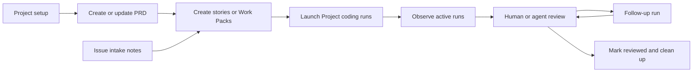

# Project Lifecycle

Use this skill when the user asks what to do next for a Project, wants an
end-to-end software-factory flow, or is unsure whether they should initialize,
plan, create stories, launch runs, review work, or clean up.

The `workspace/` prefix is the runtime skill namespace for Project/file/work
surface skills. It is not a user-facing product concept. In chat, the user may
load this with the normal skill mechanism, such as a skill mention or
`get_skill("workspace/project_lifecycle")`.

## Flow

## Choose the Next Skill

- Project is not ready or the user asks “is this set up?”:
  load `workspace/project_init`.
- User wants a product requirement, project brief, feature design, or larger
  track plan:
  load `workspace/project_prd`.
- User wants to break a PRD/track/planning chat into discrete implementation
  units:
  load `workspace/project_stories`.
- User is dumping rough bugs, ideas, or notes for later:
  load `workspace/issue_intake`.
- User is starting, continuing, reviewing, merging, or finalizing Project coding
  runs:
  load `workspace/project_coding_runs`.

## Operating Rules

1. Prefer explicit skill loading over hidden automation. Tell the user which
   skill you are using and why.
2. Stay conversational while planning. Ask for missing product intent before
   creating implementation units.
3. Keep PRDs and stories in the Project repo when the repo has a clear planning
   convention. Use Spindrel Issue Intake and Work Packs for coordination,
   launch, receipts, and review.
4. Do not launch coding runs while writing a PRD or stories unless the user
   explicitly asks to launch.
5. When switching stages, summarize the current artifact and the proposed next
   step.

## Stage Checklist

- Setup: Project has an applied Blueprint, runtime env, dependency stack if
  needed, dev targets, and a Project Runbook.
- PRD: problem, users, goals, non-goals, decisions, open questions, acceptance
  criteria, and likely story areas are clear.
- Stories: each unit is independently reviewable, has a launch prompt, expected
  tests/screenshots, and handoff expectations.
- Launch: each coding run is tied to one story or Work Pack and has a fresh
  Project instance when formal run isolation is required.
- Observe: active runs are visible from Project Runs and each run detail page.
- Review: human or review-agent decisions are finalized through the normal
  Project coding-run review tools.
- Follow-up: rejected, blocked, or changes-requested work continues through the
  existing continuation path.
- Close: accepted runs are marked reviewed, merged when requested, and eligible
  task-owned instances are cleaned up.

## Boundaries

- Do not create a separate PRD/story tracker in Spindrel just because planning
  exists. Use repo files and existing Work Packs first.
- Do not treat raw Issue Intake as launch approval.
- Do not hide review or triage work in background tasks. If an agent is doing
  planning or review, it should be visible as a normal session/task.
- Do not copy repo-local `.agents` skills into runtime skill storage.
